# Release Pipelines (CD)

## Overview

A **Release Pipeline** is the Continuous Delivery (CD) component of Azure DevOps that automates the deployment of build artifacts to one or more environments such as Development, QA, Staging, and Production.

Its primary objective is to deliver applications safely, consistently, and reliably.

> **Interview Point**
>
> Azure DevOps originally used **Classic Release Pipelines** for deployments. Today, **Multi-stage YAML Pipelines** are the recommended approach for most new projects, although many enterprises still use Classic Release Pipelines in existing environments.

---

## Why It Is Used

Release Pipelines help organizations:

- Automate deployments
- Eliminate manual deployment errors
- Deploy consistently across environments
- Support approvals and validations
- Improve release frequency
- Enable rollback strategies

---

## Architecture / Working


---

## Key Components

| Component | Purpose |
|------------|----------|
| Build Artifact | Deployable package |
| Release Pipeline | Deployment workflow |
| Environment | Deployment target |
| Deployment Job | Executes deployment |
| Approval | Controls promotion |
| Service Connection | Authenticates to target platform |

---

## Types

### Classic Release Pipeline

- UI-based configuration
- Uses graphical interface
- Common in legacy Azure DevOps projects

---

### Multi-stage YAML Pipeline

- Pipeline as Code
- Stored in repository
- Version controlled
- Recommended for modern projects

---

## Lifecycle / Workflow

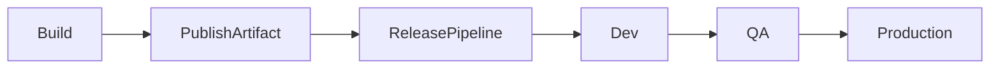

Deployment Flow:

1. Build Pipeline creates artifacts.
2. Release Pipeline downloads artifacts.
3. Deploy to Development.
4. Validate deployment.
5. Deploy to QA.
6. Deploy to Production after approvals.

---

## Configuration / Syntax

Basic YAML Deployment Stage

```yaml
stages:

- stage: Deploy

  jobs:

  - deployment: DeployWeb

    environment: Production

    strategy:

      runOnce:

        deploy:

          steps:

          - script: echo "Deploying Application"
```

---

## Important Commands

Deployment commands depend on the application.

Examples:

```bash
az webapp deploy

kubectl apply

helm upgrade

terraform apply
```

---

## Important Files

| File | Purpose |
|------|---------|
| azure-pipelines.yml | Deployment pipeline |
| deployment.yaml | Kubernetes deployment |
| Dockerfile | Container image |
| appsettings.json | Application configuration |

---

## Real-World Use Cases

- Web application deployment
- Kubernetes deployment
- Azure App Service deployment
- Virtual Machine deployment
- Microservices deployment

---

## Advantages

- Automated deployments
- Multi-environment support
- Approval workflows
- Consistent releases
- Reduced downtime

---

## Limitations

- Complex deployment workflows require planning
- Classic Release Pipelines are legacy

---

## Common Interview Questions (Concept Only)

- What is a Release Pipeline?
- Difference between CI and CD?
- Difference between Build Pipeline and Release Pipeline?
- Why are Multi-stage YAML Pipelines preferred?

---

## Common Mistakes

- Deploying directly to Production
- No rollback strategy
- Mixing build and deployment logic

---

## Troubleshooting

| Problem | Solution |
|----------|----------|
| Deployment failed | Review deployment logs |
| Artifact not found | Verify Build Pipeline completed successfully |
| Authentication failed | Verify Service Connection |

---

## Summary

Release Pipelines automate software deployment across multiple environments while ensuring consistency, approvals, and deployment reliability.

---

# Deployment Pipelines

## Overview

A Deployment Pipeline is a sequence of automated deployment stages that move a validated build artifact through different environments until it reaches Production.

Unlike Build Pipelines, Deployment Pipelines focus only on deploying existing artifacts.

> **Interview Point**
>
> The recommended practice is **Build Once, Deploy Many**, meaning the same artifact should be deployed to every environment without rebuilding.

---

## Why It Is Used

Deployment Pipelines help:

- Automate releases
- Reduce deployment risks
- Ensure environment consistency
- Support controlled software promotion

---

## Architecture / Working

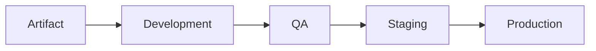

---

## Key Components

| Component | Purpose |
|------------|----------|
| Artifact | Deployment package |
| Environment | Deployment target |
| Deployment Job | Executes deployment |
| Approval | Manual validation |
| Strategy | Deployment approach |

---

## Lifecycle / Workflow


---

## Configuration / Syntax

```yaml
jobs:

- deployment: DeployApplication

  environment: Production

  strategy:

    runOnce:

      deploy:

        steps:

        - script: echo "Deploy"
```

---

## Important Commands

```bash
az webapp deploy

kubectl apply

helm upgrade

terraform apply
```

---

## Real-World Use Cases

- Azure App Service deployment
- AKS deployment
- IIS deployment
- VM deployment

---

## Advantages

- Consistent deployments
- Automated releases
- Supports approvals

---

## Limitations

- Deployment failures affect release schedules

---

## Common Interview Questions (Concept Only)

- What is a Deployment Pipeline?
- Why deploy the same artifact to all environments?
- What is an Environment in Azure DevOps?

---

## Common Mistakes

- Rebuilding artifacts for each environment
- Deploying untested builds

---

## Troubleshooting

| Problem | Solution |
|----------|----------|
| Deployment skipped | Verify stage conditions |
| Artifact unavailable | Check Build Pipeline output |

---

## Summary

Deployment Pipelines automate the movement of validated artifacts through development, testing, and production environments.

---

# Deployment Stages

## Overview

Deployment Stages divide a Release Pipeline into logical environments.

Each stage typically represents a deployment target.

Examples:

- Development
- QA
- UAT
- Staging
- Production

---

## Why It Is Used

Stages provide:

- Controlled deployments
- Environment isolation
- Sequential promotion
- Approval checkpoints

---

## Architecture / Working

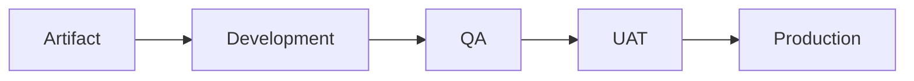

---

## Key Components

| Component | Purpose |
|------------|----------|
| Stage | Deployment phase |
| Environment | Deployment destination |
| Approval | Manual validation |
| Conditions | Deployment rules |

---

## Lifecycle / Workflow

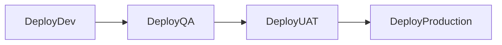

---

## Configuration / Syntax

```yaml
stages:

- stage: Development

- stage: QA

- stage: Production
```

---

## Real-World Use Cases

- Multi-environment deployments
- Enterprise software releases
- Cloud-native applications

---

## Advantages

- Better deployment control
- Environment isolation
- Approval support

---

## Limitations

- Large numbers of stages increase complexity

---

## Common Interview Questions (Concept Only)

- What is a Deployment Stage?
- Why separate environments?
- Can stages run in parallel?

---

## Common Mistakes

- Deploying directly to Production
- Skipping QA

---

## Troubleshooting

| Problem | Solution |
|----------|----------|
| Stage failed | Review deployment logs |
| Stage skipped | Verify dependencies and conditions |

---

## Summary

Deployment Stages organize releases into logical environments, ensuring controlled and reliable application promotion.

---

# Deployment Jobs

## Overview

A Deployment Job is a specialized job type designed specifically for deploying applications to Azure DevOps Environments.

Unlike a standard job, Deployment Jobs provide:

- Environment tracking
- Deployment history
- Approval integration
- Deployment strategies

---

## Why It Is Used

Deployment Jobs help:

- Track deployments
- Manage environments
- Execute deployment strategies
- Improve release visibility

---

## Architecture / Working

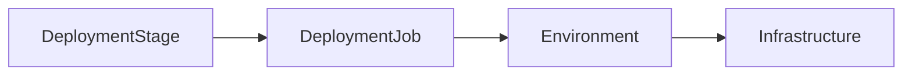

---

## Key Components

| Component | Purpose |
|------------|----------|
| Deployment Job | Executes deployment |
| Environment | Deployment target |
| Strategy | Deployment method |
| Steps | Deployment tasks |

---

## Types

### RunOnce Deployment

Deploy application one time.

Most commonly used.

---

### Rolling Deployment

Deploy gradually across multiple targets.

Common for Virtual Machine deployments.

---

### Canary Deployment

Deploy to a small percentage of users before a full rollout.

Often used with Kubernetes and modern cloud platforms.

---

## Lifecycle / Workflow

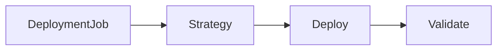

---

## Configuration / Syntax

```yaml
jobs:

- deployment: DeployApp

  environment: Production

  strategy:

    runOnce:

      deploy:

        steps:

        - script: echo Deploy
```

---

## Real-World Use Cases

- AKS deployment
- Azure App Service deployment
- Virtual Machine deployment

---

## Advantages

- Deployment history
- Environment management
- Approval support

---

## Limitations

- Requires environment configuration

---

## Common Interview Questions (Concept Only)

- What is a Deployment Job?
- Difference between Job and Deployment Job?
- What deployment strategies are supported?

---

## Common Mistakes

- Using a normal job for deployments when environment tracking is required
- Forgetting to configure environments

---

## Troubleshooting

| Problem | Solution |
|----------|----------|
| Deployment Job failed | Review deployment logs |
| Environment unavailable | Verify environment configuration |

---

## Summary

Deployment Jobs provide specialized deployment capabilities, including environment management, deployment history, and deployment strategies.

---

# Environment Approvals

## Overview

Environment Approvals are manual validation checkpoints that must be completed before deployment proceeds to a protected environment.

They provide governance and reduce deployment risk.

---

## Why It Is Used

Approvals help:

- Protect Production
- Enforce governance
- Prevent accidental deployments
- Ensure release validation

---

## Architecture / Working

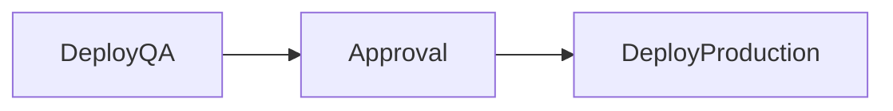

---

## Key Components

| Component | Purpose |
|------------|----------|
| Approver | Reviews deployment |
| Environment | Protected deployment target |
| Check | Validation before deployment |

---

## Types

### Pre-deployment Approval

Required before deployment begins.

---

### Post-deployment Approval

Required after deployment completes.

---

### Environment Checks

Examples include:

- Manual approval
- Business hours
- Azure Monitor alerts
- REST API checks

> **Interview Point**
>
> Modern Azure DevOps uses **Environment Approvals and Checks** for YAML pipelines instead of classic release approvals.

---

## Lifecycle / Workflow

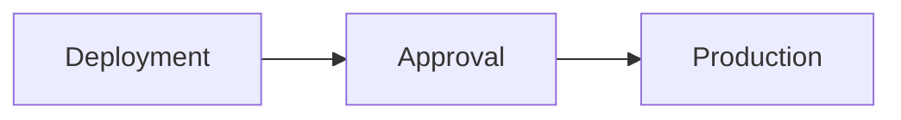

---

## Real-World Use Cases

- Production approval
- CAB (Change Advisory Board) approval
- Security approval
- Management approval

---

## Advantages

- Better governance
- Reduced production risk
- Compliance support

---

## Limitations

- Manual approvals can delay releases

---

## Common Interview Questions (Concept Only)

- What are Environment Approvals?
- Why are approvals required?
- Difference between pre- and post-deployment approvals?
- What are Environment Checks?

---

## Common Mistakes

- Deploying Production without approvals
- Assigning too many approvers, causing delays

---

## Troubleshooting

| Problem | Solution |
|----------|----------|
| Approval pending | Notify assigned approver |
| Deployment blocked | Verify approval rules and checks |

---

## Summary

Environment Approvals provide manual governance and validation before deployments proceed to protected environments.

---

# Deployment Strategies

## Overview

Deployment Strategies define **how** a new application version is released to target infrastructure.

Choosing the right strategy minimizes downtime and deployment risk.

---

## Why It Is Used

Deployment strategies help:

- Reduce outages
- Minimize deployment risk
- Support gradual rollouts
- Enable easier rollback

---

## Types

### RunOnce

Deploy application once.

Most common strategy.

---

### Rolling Deployment

Deploy to a subset of servers at a time until all servers are updated.

Suitable for Virtual Machine Scale Sets or multiple servers.

---

### Canary Deployment

Deploy to a small percentage of users or instances first.

Expand deployment after successful validation.

---

## Architecture / Working

### RunOnce


---

### Rolling

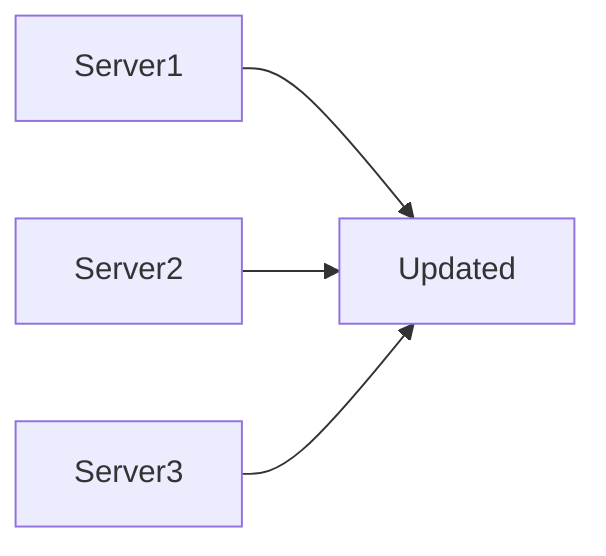

---

### Canary


---

## Lifecycle / Workflow

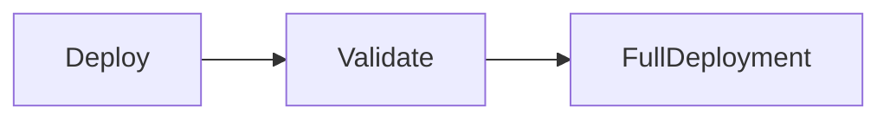

---

## Configuration / Syntax

RunOnce

```yaml
strategy:

  runOnce:

    deploy:

      steps:
```

Rolling

```yaml
strategy:

  rolling:

    maxParallel: 2
```

Canary

```yaml
strategy:

  canary:

    increments:
    - 10
    - 50
```

---

## Real-World Use Cases

- Production deployments
- Kubernetes applications
- Virtual Machine deployments
- Enterprise software releases

---

## Advantages

- Reduced downtime
- Safer deployments
- Easier rollback
- Improved availability

---

## Limitations

- Rolling and Canary strategies require more planning and infrastructure support

---

## Common Interview Questions (Concept Only)

- What are deployment strategies?
- Difference between RunOnce and Rolling?
- What is Canary Deployment?
- Which strategy is safest for Production?

---

## Common Mistakes

- Using RunOnce for large-scale production systems without considering availability
- No rollback plan

---

## Troubleshooting

| Problem | Solution |
|----------|----------|
| Deployment interrupted | Resume or redeploy affected targets |
| Partial deployment failure | Roll back or continue after investigation |

---

## Summary

Deployment Strategies determine how applications are released, balancing deployment speed, availability, and operational risk.

---

# Deployment History

## Overview

Deployment History is the record of every deployment executed against an Azure DevOps Environment.

It provides visibility into:

- Deployment time
- Deployment status
- Build version
- Artifact version
- Deployment logs
- Deployment owner

---

## Why It Is Used

Deployment History helps teams:

- Track releases
- Troubleshoot failures
- Audit deployments
- Verify production changes
- Support compliance

---

## Architecture / Working

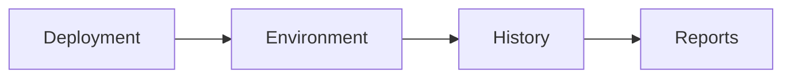

---

## Key Components

| Component | Purpose |
|------------|----------|
| Deployment Record | Tracks release |
| Build Number | Associated build |
| Environment | Deployment target |
| Logs | Deployment details |
| Status | Success or failure |

---

## Lifecycle / Workflow

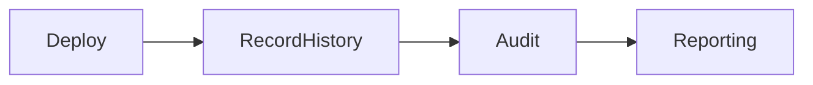

---

## Important Files

Deployment history is stored and viewed within Azure DevOps Environments rather than as local files.

---

## Real-World Use Cases

- Release auditing
- Compliance reporting
- Root cause analysis
- Rollback decisions
- Change management

---

## Advantages

- Complete deployment tracking
- Easier troubleshooting
- Audit support
- Improved visibility

---

## Limitations

- History alone does not provide application performance metrics; integrate with monitoring tools for end-to-end visibility

---

## Common Interview Questions (Concept Only)

- What is Deployment History?
- Why is deployment tracking important?
- What information does Deployment History contain?
- Where can Deployment History be viewed in Azure DevOps?

---

## Common Mistakes

- Ignoring deployment logs after failures
- Not reviewing deployment history before troubleshooting
- Deploying without proper environment tracking

---

## Troubleshooting

| Problem | Solution |
|----------|----------|
| Missing deployment record | Verify deployment targeted an Azure DevOps Environment |
| Deployment log unavailable | Check pipeline retention policies and permissions |
| Difficult to identify deployed version | Ensure build numbers and artifact versions are published consistently |

---

## Summary

Deployment History provides a complete audit trail of application releases, making it easier to monitor deployments, investigate failures, verify deployed versions, and support operational governance.
