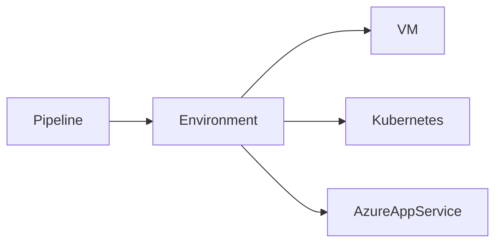

# Environments

## Overview

An **Environment** in Azure DevOps is a logical collection of deployment targets that represents a stage in the software delivery lifecycle.

Environments provide a centralized way to:

- Deploy applications
- Track deployment history
- Manage deployment targets
- Configure approvals
- Apply security checks
- Monitor deployment status

Typical environments include:

- Development (Dev)
- Testing (QA)
- User Acceptance Testing (UAT)
- Staging
- Production

> **Interview Point**
>
> An Environment is **not a virtual machine or server**. It is a logical resource in Azure DevOps that represents one or more deployment targets.

---

## Why It Is Used

Environments help organizations:

- Organize deployments
- Track deployment history
- Protect production deployments
- Support approvals
- Enable deployment strategies
- Improve release visibility

---

## Architecture / Working


---

## Key Components

| Component | Purpose |
|------------|----------|
| Environment | Logical deployment container |
| Deployment Target | Infrastructure where application is deployed |
| Deployment Job | Executes deployment |
| Approval | Manual validation |
| Checks | Automated validations |
| Deployment History | Tracks releases |

---

## Types

| Environment | Purpose |
|-------------|----------|
| Development | Initial deployment |
| QA | Functional testing |
| UAT | Business validation |
| Staging | Production-like testing |
| Production | Live application |

---

## Lifecycle / Workflow


---

## Configuration / Syntax

Deployment Job

```yaml
jobs:

- deployment: DeployWeb

  environment: Production

  strategy:

    runOnce:

      deploy:

        steps:

        - script: echo "Deploying"
```

---

## Important Commands

Azure DevOps manages environments through the portal and YAML.

Azure CLI example:

```bash
az account show
```

---

## Important Files

| File | Purpose |
|------|---------|
| azure-pipelines.yml | Deployment pipeline |
| deployment.yaml | Kubernetes deployment |
| Dockerfile | Container deployment |

---

## Real-World Use Cases

- Web application deployment
- Kubernetes deployment
- VM deployment
- Azure App Service deployment
- Production release management

---

## Advantages

- Deployment tracking
- Approval workflows
- Better governance
- Environment security
- Deployment history

---

## Limitations

- Requires proper environment configuration
- More administration for large enterprises

---

## Common Interview Questions (Concept Only)

- What is an Azure DevOps Environment?
- Why are Environments used?
- What is stored inside an Environment?
- Difference between Environment and Deployment Target?

---

## Common Mistakes

- Creating separate pipelines instead of separate environments
- Deploying directly to Production
- Ignoring environment security

---

## Troubleshooting

| Problem | Solution |
|----------|----------|
| Environment not found | Verify environment name |
| Deployment blocked | Check approvals and permissions |
| Deployment history missing | Verify Deployment Job uses an Environment |

---

## Summary

Azure DevOps Environments provide a centralized way to manage deployments, deployment history, approvals, and security across multiple deployment stages.

---

# Create Environments

## Overview

Creating an Environment allows Azure DevOps to organize deployment targets and apply governance features such as approvals, checks, and deployment history.

Environments are typically created before configuring deployment pipelines.

---

## Why It Is Used

Creating environments helps:

- Separate deployment stages
- Manage deployment targets
- Enable approvals
- Track deployments
- Improve deployment governance

---

## Architecture / Working


---

## Key Components

| Component | Purpose |
|------------|----------|
| Environment Name | Logical identifier |
| Resources | Deployment targets |
| Security | Access control |
| Approvals | Deployment validation |

---

## Lifecycle / Workflow


---

## Configuration / Syntax

Reference an Environment

```yaml
jobs:

- deployment: Deploy

  environment: Production
```

---

## Important Files

```text
azure-pipelines.yml
```

---

## Real-World Use Cases

- Dev environment
- QA environment
- Production environment
- AKS deployments
- VM deployments

---

## Advantages

- Central management
- Better visibility
- Easier deployment tracking

---

## Limitations

- Requires planning for large organizations

---

## Common Interview Questions (Concept Only)

- How do you create an Environment?
- Why create separate environments?
- Can multiple pipelines use the same Environment?

---

## Common Mistakes

- Using inconsistent environment names
- Creating duplicate environments
- Assigning excessive permissions

---

## Troubleshooting

| Problem | Solution |
|----------|----------|
| Environment missing | Verify creation and permissions |
| Deployment cannot find environment | Ensure YAML uses the correct environment name |

---

## Summary

Creating Environments provides the foundation for secure, organized, and traceable application deployments.

---

# Deployment Targets

## Overview

Deployment Targets are the actual infrastructure resources where applications are deployed.

Azure DevOps Environments act as logical containers, while Deployment Targets represent the real infrastructure.

Examples:

- Virtual Machines
- Kubernetes Clusters
- Azure App Service
- Azure Container Apps
- On-premises Servers

> **Interview Point**
>
> Environment = Logical container  
> Deployment Target = Actual infrastructure

---

## Why It Is Used

Deployment Targets enable:

- Infrastructure management
- Deployment tracking
- Environment monitoring
- Controlled releases

---

## Architecture / Working



---

## Key Components

| Component | Purpose |
|------------|----------|
| Environment | Logical grouping |
| Target Resource | Infrastructure |
| Deployment Job | Executes deployment |
| Agent | Runs deployment |

---

## Types

### Virtual Machine

Deploy applications directly to VMs.

---

### Kubernetes

Deploy workloads to AKS or any Kubernetes cluster.

---

### Azure App Service

Deploy web applications.

---

### Other Targets

- Azure Container Apps
- On-premises servers
- Hybrid cloud resources

---

## Lifecycle / Workflow


---

## Configuration / Syntax

```yaml
jobs:

- deployment: Deploy

  environment: Production
```

---

## Real-World Use Cases

- Deploy web applications
- Deploy microservices
- Deploy APIs
- Deploy containers

---

## Advantages

- Deployment tracking
- Infrastructure visibility
- Supports multiple target types

---

## Limitations

- Target resources require proper connectivity and authentication

---

## Common Interview Questions (Concept Only)

- What is a Deployment Target?
- Difference between Environment and Deployment Target?
- Which resources can be deployment targets?

---

## Common Mistakes

- Confusing environments with infrastructure
- Incorrect agent registration for VM resources
- Missing service connection permissions

---

## Troubleshooting

| Problem | Solution |
|----------|----------|
| Deployment target offline | Verify target connectivity |
| Deployment failed | Review deployment logs |
| Agent unavailable | Check agent registration and status |

---

## Summary

Deployment Targets represent the infrastructure where applications are deployed and are managed through Azure DevOps Environments.

---

# Approvals & Checks

## Overview

Approvals & Checks are governance mechanisms that control whether a deployment can proceed to an Environment.

They ensure that deployments meet organizational, operational, and security requirements before execution.

> **Interview Point**
>
> Approvals & Checks are configured on the **Environment**, **not inside the YAML pipeline**. This prevents developers from bypassing governance by modifying pipeline code.

---

## Why It Is Used

Approvals & Checks help:

- Protect production environments
- Prevent accidental deployments
- Enforce organizational policies
- Support compliance
- Reduce deployment risk

---

## Architecture / Working


---

## Key Components

| Component | Purpose |
|------------|----------|
| Environment | Protected deployment target |
| Approval | Manual authorization |
| Check | Automated validation |
| Deployment Job | Executes deployment |

---

## Types

### Manual Approval

Requires one or more users to approve deployment.

---

### Business Hours Check

Allows deployments only during predefined business hours.

---

### Azure Monitor Check

Verifies Azure Monitor alerts before deployment.

---

### Invoke REST API Check

Calls an external REST API to validate deployment requirements.

---

### Azure Function Check

Executes an Azure Function for custom validation logic.

---

### Required Template Check

Ensures pipelines use approved YAML templates.

---

### Exclusive Lock Check

Prevents concurrent deployments to the same environment.

---

## Lifecycle / Workflow


---

## Configuration / Syntax

Deployment Job

```yaml
jobs:

- deployment: DeployProduction

  environment: Production

  strategy:

    runOnce:

      deploy:

        steps:

        - script: echo "Deploying..."
```

> Approvals and Checks are configured through the Azure DevOps portal on the Environment and are **not** defined in YAML.

---

## Important Commands

Approvals & Checks are managed through the Azure DevOps portal.

Azure CLI can be used to verify Azure resources involved in checks, for example:

```bash
az monitor alert list

az functionapp list
```

---

## Important Files

```text
azure-pipelines.yml
```

---

## Real-World Use Cases

- Production deployment approval
- CAB (Change Advisory Board) approval
- Restrict deployments to business hours
- Validate infrastructure health before deployment
- Prevent simultaneous production deployments

---

## Advantages

- Improved governance
- Enhanced security
- Reduced deployment risk
- Compliance support
- Centralized deployment control

---

## Limitations

- Manual approvals can slow release cycles
- Misconfigured checks may block valid deployments

---

## Common Interview Questions (Concept Only)

- What are Approvals & Checks?
- Where are Approvals configured?
- What is the difference between an Approval and a Check?
- What types of Checks are available?
- Why shouldn't approvals be configured in YAML?

---

## Common Mistakes

- Configuring approvals inside pipeline logic instead of the Environment
- Granting approval permissions to too many users
- Ignoring failed checks and bypassing governance
- Not testing approval workflows before production use

---

## Troubleshooting

| Problem | Solution |
|----------|----------|
| Deployment waiting for approval | Notify or verify assigned approvers |
| Check failed | Review the specific check configuration and logs |
| Deployment blocked | Confirm all required approvals and checks are satisfied |
| Environment inaccessible | Verify user permissions and environment security settings |

---

## Summary

Approvals & Checks provide centralized governance for Azure DevOps Environments by ensuring deployments meet manual and automated validation requirements before reaching critical environments such as Production.
