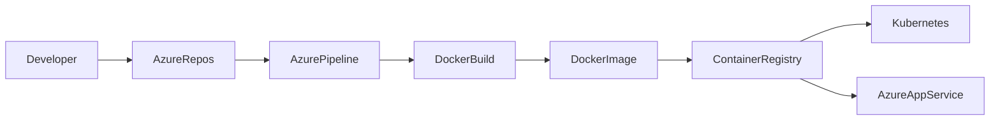
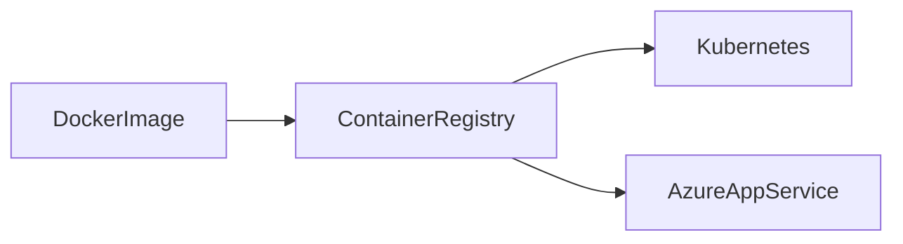
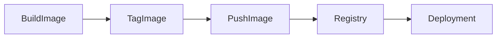
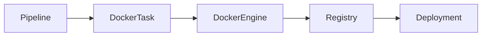

# Docker Integration

## Overview

Docker Integration in Azure DevOps enables CI/CD pipelines to build, test, package, and deploy containerized applications automatically.

Instead of deploying application source code directly, Azure DevOps packages the application into a Docker image, stores it in a container registry, and deploys that image to the target environment.

Common container registries include:

- Azure Container Registry (ACR)
- Docker Hub
- Amazon Elastic Container Registry (ECR)
- Google Artifact Registry
- GitHub Container Registry (GHCR)

> **Interview Point**
>
> Azure DevOps **does not build containers itself**. It orchestrates Docker commands or Docker tasks that execute on the build agent.

---

## Why It Is Used

Docker Integration helps organizations:

- Standardize deployments
- Eliminate environment inconsistencies
- Simplify application packaging
- Enable Kubernetes deployments
- Improve portability
- Support microservices architecture

---

## Architecture / Working



---

## Key Components

| Component | Purpose |
|------------|----------|
| Azure DevOps Pipeline | Automates container workflow |
| Docker Engine | Builds container images |
| Dockerfile | Defines image instructions |
| Container Registry | Stores images |
| Deployment Platform | Runs containers |

---

## Types

| Integration | Purpose |
|------------|----------|
| Docker Build | Create container images |
| Docker Push | Upload images |
| Docker Run | Test containers |
| Docker Compose | Multi-container applications |

---

## Lifecycle / Workflow


---

## Configuration / Syntax

Docker Task

```yaml
steps:

- task: Docker@2

  inputs:

    command: buildAndPush

    repository: demoapp

    Dockerfile: Dockerfile

    containerRegistry: ACR-ServiceConnection

    tags: |

      $(Build.BuildId)
```

---

## Important Commands

```bash
docker build

docker tag

docker push

docker pull

docker images

docker login
```

---

## Important Files

| File | Purpose |
|------|---------|
| Dockerfile | Build instructions |
| .dockerignore | Ignore unnecessary files |
| azure-pipelines.yml | Pipeline definition |
| docker-compose.yml | Multi-container applications |

---

## Real-World Use Cases

- Microservices
- Azure Kubernetes Service (AKS)
- Azure Container Apps
- Azure App Service Containers
- Containerized APIs

---

## Advantages

- Consistent deployments
- Environment portability
- Easy integration with Kubernetes
- Faster deployments
- Supports immutable infrastructure

---

## Limitations

- Requires Docker support on the build agent
- Container image management and security must be maintained
- Large images increase build and deployment time

---

## Common Interview Questions (Concept Only)

- How does Azure DevOps integrate with Docker?
- Why use Docker in CI/CD?
- What is required to build Docker images?
- Which registries are supported?

---

## Common Mistakes

- Hardcoding registry credentials
- Building unnecessarily large images
- Forgetting `.dockerignore`
- Using the `latest` tag for production deployments

---

## Troubleshooting

| Problem | Solution |
|----------|----------|
| Docker build failed | Review Dockerfile and build logs |
| Login failed | Verify Service Connection or registry credentials |
| Push failed | Verify registry permissions |
| Docker command not found | Ensure Docker is installed on the agent |

---

## Summary

Docker Integration enables Azure DevOps pipelines to automate container image creation, storage, and deployment, providing consistent and portable application delivery.

---

# Build Docker Images

## Overview

Building a Docker image packages an application along with its runtime, dependencies, libraries, and configuration into a portable container image.

The image is created using instructions defined in a **Dockerfile**.

> **Interview Point**
>
> A **Dockerfile** creates a **Docker Image**, and a **Docker Image** creates one or more **Docker Containers**.

---

## Why It Is Used

Building images helps:

- Package applications consistently
- Eliminate environment differences
- Prepare applications for deployment
- Enable immutable deployments

---

## Architecture / Working


---

## Key Components

| Component | Purpose |
|------------|----------|
| Dockerfile | Build instructions |
| Docker Engine | Builds image |
| Build Context | Files used during build |
| Image | Deployable container package |

---

## Lifecycle / Workflow


---

## Configuration / Syntax

Docker Task

```yaml
steps:

- task: Docker@2

  inputs:

    command: build

    Dockerfile: Dockerfile

    repository: demoapp

    tags: |

      $(Build.BuildId)
```

CLI

```bash
docker build -t demoapp:v1 .
```

---

## Important Commands

```bash
docker build

docker images

docker inspect

docker history
```

---

## Important Files

| File | Purpose |
|------|---------|
| Dockerfile | Image instructions |
| .dockerignore | Ignore files during build |

---

## Real-World Use Cases

- Web applications
- APIs
- Microservices
- Background workers

---

## Advantages

- Portable
- Reproducible
- Consistent runtime
- Simplified deployments

---

## Limitations

- Poor Dockerfile design increases image size
- Build time depends on dependency downloads and caching

---

## Common Interview Questions (Concept Only)

- What is a Docker Image?
- What is a Dockerfile?
- How is an image built?
- Why should image tags be versioned?

---

## Common Mistakes

- Using large base images
- Copying unnecessary files
- Running containers as the root user
- Ignoring Docker layer caching best practices

---

## Troubleshooting

| Problem | Solution |
|----------|----------|
| Build failed | Review Dockerfile syntax |
| Image too large | Use smaller base images and multi-stage builds |
| Build context too large | Configure `.dockerignore` |

---

## Summary

Building Docker images packages applications into portable, immutable artifacts that can be deployed consistently across environments.

---

# Push Images to Registry

## Overview

After a Docker image is built, it is pushed to a container registry where it can be stored, versioned, and later pulled by deployment platforms.

Common registries include:

- Azure Container Registry (ACR)
- Docker Hub
- Amazon ECR
- Google Artifact Registry
- GitHub Container Registry

> **Interview Point**
>
> Build pipelines **push** images to a registry, while deployment pipelines **pull** images from the registry.

---

## Why It Is Used

Pushing images enables:

- Central image storage
- Image versioning
- Deployment automation
- Rollback support
- Team collaboration

---

## Architecture / Working



---

## Key Components

| Component | Purpose |
|------------|----------|
| Docker Image | Application package |
| Registry | Image repository |
| Repository | Image collection |
| Tag | Image version |

---

## Lifecycle / Workflow



---

## Configuration / Syntax

Docker Task

```yaml
steps:

- task: Docker@2

  inputs:

    command: push

    repository: demoapp

    containerRegistry: ACR-ServiceConnection

    tags: |

      $(Build.BuildId)
```

CLI

```bash
docker push myregistry.azurecr.io/demoapp:v1
```

---

## Important Commands

```bash
docker login

docker push

docker tag

docker logout
```

---

## Important Files

| File | Purpose |
|------|---------|
| Dockerfile | Image definition |
| azure-pipelines.yml | Pipeline |

---

## Real-World Use Cases

- Kubernetes deployments
- Azure Container Apps
- Azure App Service Containers
- Microservices

---

## Advantages

- Central storage
- Version management
- Easy deployment
- Rollback capability

---

## Limitations

- Registry authentication required
- Storage costs for large image repositories
- Network latency affects upload time

---

## Common Interview Questions (Concept Only)

- Why push images to a registry?
- Difference between Docker Hub and Azure Container Registry?
- Why avoid the `latest` tag in production?
- What is image tagging?

---

## Common Mistakes

- Pushing images without version tags
- Reusing `latest` for every deployment
- Storing credentials in repositories
- Not scanning images for vulnerabilities

---

## Troubleshooting

| Problem | Solution |
|----------|----------|
| Push denied | Verify registry authentication |
| Authentication failed | Check Service Connection or registry credentials |
| Repository not found | Verify registry repository name |
| Image not found | Confirm image was built successfully before pushing |

---

## Summary

Pushing Docker images to a registry enables centralized storage, version control, and reliable deployments across development, testing, and production environments.

---

# Use Docker Tasks in Pipelines

## Overview

Azure DevOps provides the built-in **Docker@2** task to simplify Docker operations inside pipelines.

Instead of manually executing Docker CLI commands, the Docker task performs common container operations through YAML configuration.

Supported operations include:

- Build
- Push
- Build and Push
- Login
- Logout

> **Interview Point**
>
> `Docker@2` is the recommended Azure DevOps task for Docker operations because it integrates directly with Service Connections and container registries.

---

## Why It Is Used

Docker Tasks help:

- Simplify pipeline configuration
- Secure registry authentication
- Standardize Docker operations
- Reduce manual scripting

---

## Architecture / Working



---

## Key Components

| Component | Purpose |
|------------|----------|
| Docker Task | Azure DevOps built-in task |
| Docker Engine | Executes Docker operations |
| Service Connection | Registry authentication |
| Registry | Stores images |

---

## Types

| Command | Purpose |
|----------|----------|
| build | Build image |
| push | Push image |
| buildAndPush | Build and upload image |
| login | Authenticate to registry |
| logout | End registry session |

---

## Lifecycle / Workflow


---

## Configuration / Syntax

Build

```yaml
- task: Docker@2

  inputs:

    command: build

    repository: demoapp

    Dockerfile: Dockerfile
```

Build and Push

```yaml
- task: Docker@2

  inputs:

    command: buildAndPush

    repository: demoapp

    containerRegistry: ACR-ServiceConnection

    Dockerfile: Dockerfile

    tags: |

      $(Build.BuildId)
```

Login

```yaml
- task: Docker@2

  inputs:

    command: login

    containerRegistry: ACR-ServiceConnection
```

---

## Important Commands

Equivalent Docker CLI commands

```bash
docker build

docker login

docker push

docker pull

docker logout
```

---

## Important Files

| File | Purpose |
|------|---------|
| Dockerfile | Image build instructions |
| azure-pipelines.yml | Pipeline configuration |
| .dockerignore | Excludes unnecessary files from build context |

---

## Real-World Use Cases

- CI/CD container builds
- Azure Kubernetes Service (AKS)
- Azure Container Apps
- Azure App Service Containers
- Microservices deployments

---

## Advantages

- Built-in Azure DevOps integration
- Secure authentication using Service Connections
- Less scripting
- Easy maintenance
- Consistent Docker workflows

---

## Limitations

- Requires Docker on the build agent
- Limited to supported Docker task operations; advanced workflows may still require custom CLI commands

---

## Common Interview Questions (Concept Only)

- What is the Docker@2 task?
- Difference between Docker CLI and Docker Task?
- What is the `buildAndPush` command?
- Why does Docker Task require a Service Connection?
- When would you use Docker CLI instead of Docker@2?

---

## Common Mistakes

- Using incorrect Service Connection
- Forgetting to version image tags
- Not authenticating before push
- Building images without a `.dockerignore` file
- Running build and deployment from different image versions

---

## Troubleshooting

| Problem | Solution |
|----------|----------|
| Docker task failed | Review task logs and Docker daemon status |
| Registry authentication failed | Verify Service Connection and registry permissions |
| Build succeeded but push failed | Confirm repository exists and credentials are valid |
| Docker daemon unavailable | Ensure Docker is installed and running on the agent |

---

## Summary

The Docker@2 task provides a secure and standardized way to build, tag, authenticate, and push Docker images within Azure DevOps pipelines, making it the preferred approach for container-based CI/CD workflows.
