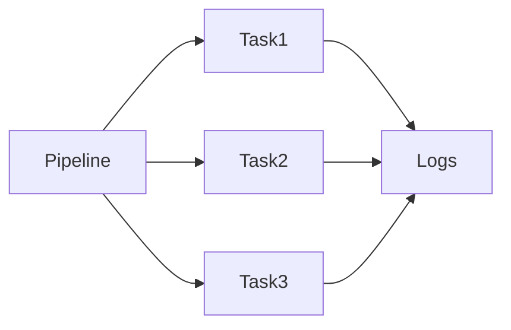
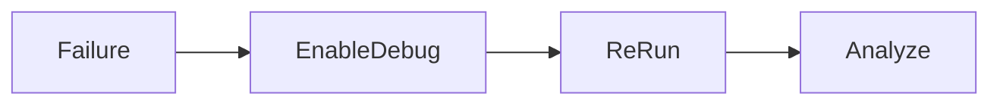
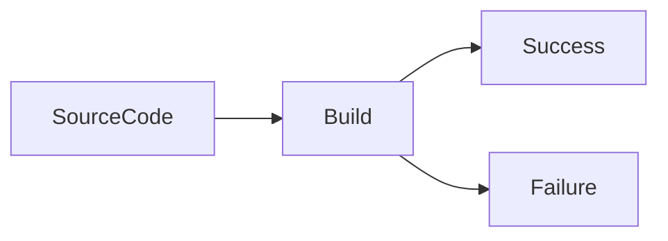
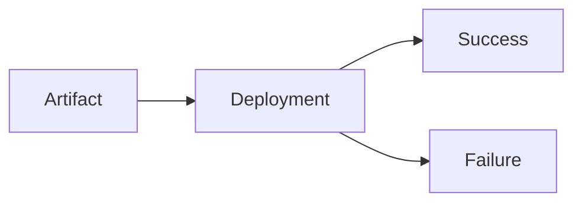
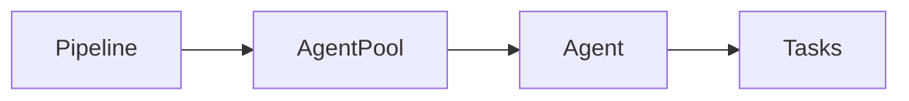

# Monitoring & Troubleshooting

## Overview

Monitoring & Troubleshooting in Azure DevOps involves tracking pipeline execution, identifying failures, analyzing logs, and resolving issues in Build and Release pipelines.

A DevOps Engineer spends a significant amount of time monitoring pipeline health and diagnosing problems such as:

- Build failures
- Deployment failures
- Agent issues
- Authentication errors
- Infrastructure deployment errors
- Test failures
- Permission issues

Azure DevOps provides detailed logs, execution timelines, diagnostics, and task-level output to simplify troubleshooting.

> **Interview Point**
>
> The first step in troubleshooting any Azure DevOps pipeline issue is to **identify the exact task that failed and review its logs**.

---

## Why It Is Used

Monitoring & Troubleshooting helps organizations:

- Detect failures quickly
- Reduce downtime
- Improve deployment reliability
- Identify root causes
- Improve CI/CD stability
- Maintain production quality

---

## Architecture / Working


---

## Key Components

| Component | Purpose |
|------------|----------|
| Pipeline Logs | Task execution details |
| Timeline | Pipeline execution sequence |
| Agent Logs | Agent diagnostics |
| Debug Logs | Detailed execution output |
| Deployment History | Deployment tracking |

---

## Types

Common troubleshooting categories:

- Build Issues
- Deployment Issues
- Agent Issues
- Authentication Issues
- YAML Errors
- Permission Errors

---

## Lifecycle / Workflow


---

## Configuration / Syntax

Enable detailed pipeline logging

```yaml
variables:

- name: system.debug

  value: true
```

---

## Important Commands

Agent diagnostics

```bash
./run.sh

./config.sh
```

Azure CLI verification

```bash
az account show

az group list
```

Kubernetes

```bash
kubectl get pods

kubectl logs
```

Docker

```bash
docker logs
```

---

## Important Files

| File | Purpose |
|------|---------|
| azure-pipelines.yml | Pipeline configuration |
| deployment.yaml | Kubernetes deployment |
| Dockerfile | Container build |
| Terraform files | Infrastructure deployment |

---

## Real-World Use Cases

- Failed production deployment
- Docker build failures
- AKS deployment troubleshooting
- Infrastructure deployment failures
- Azure authentication issues

---

## Advantages

- Detailed diagnostics
- Task-level logging
- Timeline visualization
- Easier root cause analysis
- Supports faster incident resolution

---

## Limitations

- Large logs can be difficult to analyze
- Generic error messages may require deeper investigation
- External service failures may not be fully visible from Azure DevOps logs

---

## Common Interview Questions (Concept Only)

- How do you troubleshoot Azure DevOps pipelines?
- Where do you start when a pipeline fails?
- How do you enable debug logging?
- Which logs should be reviewed first?

---

## Common Mistakes

- Ignoring the first error in the logs
- Looking only at the final failure message
- Re-running the pipeline without understanding the root cause
- Disabling debug logs during investigation

---

## Troubleshooting

| Problem | Solution |
|----------|----------|
| Pipeline failed | Identify failed task and review logs |
| Authentication failed | Verify Service Connection and credentials |
| Build timeout | Review build duration and optimize tasks |
| Deployment failed | Review deployment logs and target environment |

---

## Summary

Monitoring and Troubleshooting are essential DevOps skills that focus on identifying failures, analyzing logs, determining root causes, and restoring successful pipeline execution.

---

# Pipeline Logs

## Overview

Pipeline Logs contain detailed information about every step executed during a pipeline run.

Each task generates its own logs showing:

- Commands executed
- Output
- Errors
- Warnings
- Execution time
- Exit codes

> **Interview Point**
>
> Azure DevOps stores logs **per task**, making it easier to identify the exact step that failed.

---

## Why It Is Used

Pipeline Logs help:

- Diagnose failures
- Monitor execution
- Verify deployments
- Investigate errors
- Measure execution time

---

## Architecture / Working



---

## Key Components

| Component | Purpose |
|------------|----------|
| Task Log | Individual task output |
| Timeline | Execution order |
| Exit Code | Success or failure |
| Warning | Non-critical issue |
| Error | Failure information |

---

## Lifecycle / Workflow


---

## Configuration / Syntax

Pipeline logs are automatically generated.

Example script

```yaml
steps:

- script: echo "Build Started"
```

---

## Important Commands

Common outputs

```bash
echo

Write-Host

kubectl logs

docker logs
```

---

## Real-World Use Cases

- Build troubleshooting
- Deployment troubleshooting
- Infrastructure validation

---

## Advantages

- Detailed execution information
- Task isolation
- Easy diagnostics

---

## Limitations

- Very large pipelines produce extensive logs
- Sensitive information should never be printed

---

## Common Interview Questions (Concept Only)

- What information do Pipeline Logs contain?
- How do you identify a failed task?
- What is an exit code?

---

## Common Mistakes

- Ignoring warnings
- Printing secrets to logs
- Looking only at the last error instead of the first failure

---

## Troubleshooting

| Problem | Solution |
|----------|----------|
| Missing logs | Verify pipeline completed execution |
| Log too large | Focus on failed task section |

---

## Summary

Pipeline Logs provide complete visibility into every pipeline task and are the primary resource for troubleshooting Azure DevOps pipelines.

---

# Debug Logs

## Overview

Debug Logs provide detailed diagnostic information beyond normal pipeline logs.

They display:

- Variable evaluation
- Task inputs
- Environment information
- Command execution
- Internal Azure DevOps operations

Debug logging is typically enabled only while investigating issues.

> **Interview Point**
>
> Debug logging is enabled by setting:

```yaml
system.debug = true
```

---

## Why It Is Used

Debug Logs help:

- Diagnose complex issues
- Troubleshoot variables
- Verify task execution
- Analyze pipeline behavior

---

## Architecture / Working


---

## Lifecycle / Workflow



---

## Configuration / Syntax

```yaml
variables:

- name: system.debug

  value: true
```

---

## Real-World Use Cases

- Variable troubleshooting
- Authentication failures
- YAML troubleshooting
- Task debugging

---

## Advantages

- Very detailed diagnostics
- Easier root cause analysis

---

## Limitations

- Produces large log files
- May reveal implementation details (Azure DevOps still masks secret variables)

---

## Common Interview Questions (Concept Only)

- How do you enable Debug Logs?
- When should Debug Logs be used?

---

## Common Mistakes

- Leaving debug enabled permanently
- Confusing debug information with actual errors

---

## Troubleshooting

| Problem | Solution |
|----------|----------|
| Debug not enabled | Set `system.debug=true` |
| Too much output | Focus on failing task |

---

## Summary

Debug Logs provide additional diagnostic information for troubleshooting complex Azure DevOps pipeline problems.

---

# Failed Builds

## Overview

A Failed Build occurs when one or more Build Pipeline tasks do not complete successfully.

Common failure categories include:

- Compilation errors
- Dependency issues
- Missing SDKs
- Unit test failures
- YAML syntax errors
- Authentication problems

---

## Why It Is Used

Analyzing failed builds helps:

- Detect coding errors
- Improve software quality
- Prevent broken deployments

---

## Architecture / Working



---

## Common Causes

| Cause | Example |
|---------|----------|
| Compilation error | Syntax error |
| Missing dependency | Package restore failed |
| Missing SDK | .NET SDK missing |
| YAML error | Invalid pipeline syntax |
| Unit test failure | Failed automated tests |

---

## Lifecycle / Workflow


---

## Real-World Use Cases

- CI build failure
- Docker image build failure
- Maven build failure

---

## Advantages

- Detects issues early
- Prevents broken deployments

---

## Limitations

- Large projects may require significant log analysis

---

## Common Interview Questions (Concept Only)

- What causes Build failures?
- How do you investigate a failed build?
- What is the first log you review?

---

## Common Mistakes

- Ignoring compiler warnings
- Skipping dependency restore
- Running builds on inconsistent agent environments

---

## Troubleshooting

| Problem | Solution |
|----------|----------|
| Build failed | Review compiler errors |
| SDK missing | Install correct SDK |
| Dependency failed | Verify package feeds |

---

## Summary

Failed Builds identify application or configuration problems before deployment, improving software quality.

---

# Failed Deployments

## Overview

A Failed Deployment occurs when a Release or Deployment Pipeline cannot successfully deploy an application or infrastructure.

Common causes include:

- Authentication failures
- Kubernetes deployment issues
- Infrastructure errors
- Missing artifacts
- Permission problems

---

## Why It Is Used

Investigating deployment failures helps:

- Protect production
- Improve deployment reliability
- Reduce downtime

---

## Architecture / Working



---

## Common Causes

| Cause | Example |
|---------|----------|
| Missing artifact | Artifact not found |
| Kubernetes failure | Pod startup failure |
| Authentication | Invalid Service Connection |
| Permission | Azure RBAC denied |
| Infrastructure | ARM/Bicep/Terraform error |

---

## Lifecycle / Workflow


---

## Real-World Use Cases

- AKS deployment failure
- Azure App Service deployment
- Terraform deployment failure

---

## Advantages

- Prevents production incidents
- Improves deployment quality

---

## Limitations

- Failures may originate from external services

---

## Common Interview Questions (Concept Only)

- How do you troubleshoot deployment failures?
- Why do deployments fail?
- What logs should be reviewed?

---

## Common Mistakes

- Deploying incorrect artifact versions
- Ignoring rollout status
- Not validating infrastructure before deployment

---

## Troubleshooting

| Problem | Solution |
|----------|----------|
| Deployment failed | Review deployment task logs |
| Rollout timeout | Check Kubernetes events |
| Resource not found | Verify deployment configuration |

---

## Summary

Failed Deployments require investigation of deployment logs, infrastructure state, and target environments to determine the root cause.

---

# Agent Issues

## Overview

Azure DevOps Agents execute Build and Deployment Pipelines.

If an agent is unavailable or misconfigured, pipelines cannot run successfully.

Agent issues are common in Self-hosted environments.

---

## Why It Is Used

Monitoring Agents ensures:

- Reliable builds
- Continuous deployments
- Stable CI/CD

---

## Architecture / Working



---

## Common Causes

| Cause | Example |
|---------|----------|
| Agent offline | Service stopped |
| Missing software | Docker not installed |
| Authentication | Agent token expired |
| Resource exhaustion | CPU or memory full |

---

## Lifecycle / Workflow


---

## Important Commands

Linux

```bash
./config.sh

./run.sh

sudo ./svc.sh status

sudo ./svc.sh restart
```

Windows (PowerShell)

```powershell
Get-Service vstsagent*

Restart-Service vstsagent*
```

---

## Real-World Use Cases

- Self-hosted Linux agents
- Windows build servers
- Dedicated deployment agents

---

## Advantages

- Full execution control
- Custom software support
- Persistent build cache

---

## Limitations

- Requires maintenance
- Requires monitoring
- Requires OS updates

---

## Common Interview Questions (Concept Only)

- What happens if an agent goes offline?
- Difference between Microsoft-hosted and Self-hosted agents?
- How do you troubleshoot an offline agent?

---

## Common Mistakes

- Not updating Self-hosted agents
- Running out of disk space
- Ignoring agent service failures

---

## Troubleshooting

| Problem | Solution |
|----------|----------|
| Agent offline | Restart agent service |
| Docker missing | Install Docker |
| Permission denied | Verify agent account permissions |
| Jobs queued | Ensure an available online agent exists in the pool |

---

## Summary

Healthy agents are critical for reliable Azure DevOps pipelines, especially in Self-hosted environments where organizations manage the infrastructure.

---

# Common Pipeline Errors

## Overview

Pipeline errors are recurring problems encountered during Build and Deployment pipelines.

Understanding these errors and their causes enables faster troubleshooting and improves CI/CD reliability.

> **Interview Point**
>
> Most Azure DevOps pipeline failures fall into one of five categories:
>
> - Authentication
> - Permissions
> - Configuration
> - Infrastructure
> - Application code

---

## Why It Is Used

Studying common pipeline errors helps:

- Reduce downtime
- Speed up troubleshooting
- Improve deployment success rates

---

## Architecture / Working


---

## Types

| Error Type | Typical Cause |
|------------|---------------|
| Authentication | Invalid Service Connection, expired credentials |
| Permission | Azure RBAC or repository permissions |
| YAML | Syntax or indentation errors |
| Docker | Missing Docker daemon or incorrect image reference |
| Kubernetes | Invalid manifest or pod failures |
| Terraform | State lock, provider issues |
| Artifact | Missing or incorrect artifact |
| Network | Connectivity or DNS issues |
| Agent | Offline or missing required software |

---

## Lifecycle / Workflow


---

## Configuration / Syntax

Enable debug logging during investigation

```yaml
variables:

- name: system.debug

  value: true
```

---

## Important Commands

Docker

```bash
docker logs
```

Kubernetes

```bash
kubectl describe pod

kubectl logs
```

Azure

```bash
az account show
```

Terraform

```bash
terraform validate

terraform plan
```

---

## Real-World Use Cases

- CI pipeline failures
- CD deployment failures
- Infrastructure provisioning errors
- Container deployment issues

---

## Advantages

- Builds troubleshooting experience
- Improves pipeline reliability
- Reduces Mean Time to Resolution (MTTR)

---

## Limitations

- Some failures require investigation across multiple systems (Azure, Kubernetes, networking, source control)
- Root cause may not always be visible in the first failing task

---

## Common Interview Questions (Concept Only)

- What are the most common Azure DevOps pipeline failures?
- How do you troubleshoot a failed pipeline?
- How do you identify the root cause of a pipeline failure?
- Why is the first error usually more important than later errors?
- How do you reduce recurring pipeline failures?

---

## Common Mistakes

- Restarting pipelines without investigating the failure
- Ignoring warnings that later become failures
- Focusing on symptoms instead of the root cause
- Not validating infrastructure or manifests before deployment

---

## Troubleshooting

| Error | Possible Solution |
|--------|-------------------|
| Authentication failed | Verify Service Connection and credentials |
| Permission denied | Review Azure RBAC and Azure DevOps permissions |
| YAML parsing error | Validate YAML syntax and indentation |
| Docker build failed | Review Dockerfile and build context |
| ImagePullBackOff | Verify image exists and registry authentication |
| Artifact not found | Ensure artifact was published correctly |
| Agent offline | Restart the agent and verify connectivity |
| Deployment timeout | Check rollout status, target resource health, and application logs |

---

## Summary

Common Pipeline Errors typically stem from authentication, permissions, configuration, infrastructure, or application code. Effective troubleshooting involves identifying the first failing task, analyzing logs, determining the root cause, applying the fix, and validating the pipeline with a successful re-run.
