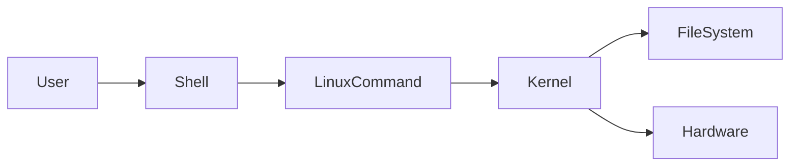
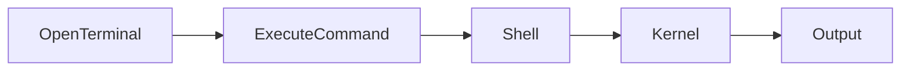

# Essential Linux Commands

## Overview

Linux commands are command-line utilities used to interact with the operating system. They enable users to navigate the filesystem, manage files and directories, view content, administer systems, and automate tasks.

For DevOps Engineers, Linux commands are used daily for:

- Managing servers
- Deploying applications
- Troubleshooting systems
- Writing shell scripts
- Working with Docker and Kubernetes
- Running CI/CD pipelines

> **Interview Point**
>
> Linux commands generally follow the syntax:
>
> ```bash
> command [options] [arguments]
> ```

---

## Why It Is Used

Linux commands help:

- Perform administrative tasks
- Manage files and directories
- Troubleshoot servers
- Automate repetitive tasks
- Access remote systems

---

## Architecture / Working



---

## Key Components

| Component | Purpose |
|------------|----------|
| Command | Performs an action |
| Option | Modifies command behavior |
| Argument | Specifies the target |

Example:

```bash
ls -l /home
```

- `ls` → Command
- `-l` → Option
- `/home` → Argument

---

## Types

Common categories:

| Category | Examples |
|----------|-----------|
| Navigation | pwd, ls, cd |
| File Management | cp, mv, rm |
| Directory Management | mkdir, rmdir |
| File Viewing | cat, less, head, tail |
| Utilities | echo, history, man, clear |

---

## Lifecycle / Workflow



---

## Configuration / Syntax

General syntax

```bash
command [options] [arguments]
```

---

## Important Commands

Covered in the following sections.

---

## Important Files

| File | Purpose |
|------|---------|
| ~/.bash_history | Command history |
| ~/.bashrc | Bash configuration |
| /etc/profile | System-wide shell configuration |

---

## Real-World Use Cases

- SSH into servers
- Navigate project directories
- View logs
- Deploy applications
- Troubleshoot production issues

---

## Advantages

- Fast
- Scriptable
- Lightweight
- Remote-friendly

---

## Limitations

- Requires familiarity with CLI
- Incorrect commands may delete data

---

## Common Interview Questions (Concept Only)

- Why are Linux commands important in DevOps?
- What is the general Linux command syntax?
- What are options and arguments?

---

## Common Mistakes

- Running destructive commands without verification
- Forgetting command options
- Executing commands in the wrong directory

---

## Troubleshooting

| Problem | Solution |
|----------|----------|
| Command not found | Verify installation or PATH |
| Permission denied | Check permissions or use appropriate privileges |
| Incorrect output | Review command syntax |

---

## Summary

Linux commands are the foundation of Linux administration and DevOps automation, enabling efficient management of systems and infrastructure.

---

# pwd

## Overview

`pwd` (Print Working Directory) displays the absolute path of the current working directory.

> **Interview Point**
>
> `pwd` always returns the **absolute path** of the current directory.

---

## Why It Is Used

- Verify current location
- Avoid executing commands in the wrong directory
- Used in shell scripts

---

## Configuration / Syntax

```bash
pwd
```

---

## Important Commands

```bash
pwd
pwd -P
```

---

## Real-World Use Cases

- Verify deployment directory
- Confirm script execution path

---

## Advantages

- Simple
- Fast
- Essential for navigation

---

## Limitations

- Displays only the current directory

---

## Common Interview Questions (Concept Only)

- What does `pwd` do?
- Does `pwd` return an absolute or relative path?

---

## Common Mistakes

- Assuming the current directory without checking

---

## Troubleshooting

| Problem | Solution |
|----------|----------|
| Unexpected path | Verify previous `cd` command |

---

## Summary

`pwd` displays the current working directory and is frequently used before performing filesystem operations.

---

# ls

## Overview

`ls` lists files and directories.

> **Interview Point**
>
> `ls -la` is one of the most frequently used Linux commands because it displays hidden files along with detailed file information.

---

## Why It Is Used

- View directory contents
- Verify files
- Display permissions

---

## Configuration / Syntax

```bash
ls

ls -l

ls -la

ls -lh
```

---

## Important Commands

```bash
ls

ls -l

ls -la

ls -lh

ls -R
```

---

## Real-World Use Cases

- View deployment files
- Verify configuration files
- Inspect permissions

---

## Advantages

- Flexible
- Multiple display options

---

## Limitations

- Large directories may produce extensive output

---

## Common Interview Questions (Concept Only)

- Difference between `ls`, `ls -l`, and `ls -la`?
- What does `-h` do?

---

## Common Mistakes

- Forgetting hidden files

---

## Troubleshooting

| Problem | Solution |
|----------|----------|
| Missing file | Use `ls -a` |

---

## Summary

`ls` is the primary command for viewing files and directories in Linux.

---

# cd

## Overview

`cd` changes the current working directory.

---

## Why It Is Used

- Navigate the filesystem
- Move between project directories

---

## Configuration / Syntax

```bash
cd directory

cd ..

cd ~

cd -

cd /
```

---

## Important Commands

```bash
cd

cd ..

cd ~

cd -

cd /
```

---

## Real-World Use Cases

- Navigate application folders
- Access log directories

---

## Advantages

- Fast navigation

---

## Limitations

- Invalid paths generate errors

---

## Common Interview Questions (Concept Only)

- Difference between `cd ..` and `cd ~`?
- What does `cd -` do?

---

## Common Mistakes

- Forgetting current location

---

## Troubleshooting

| Problem | Solution |
|----------|----------|
| Directory not found | Verify path |

---

## Summary

`cd` changes the current working directory and is one of the most frequently used Linux commands.

---

# mkdir

## Overview

`mkdir` creates new directories.

---

## Why It Is Used

- Organize files
- Create project folders

---

## Configuration / Syntax

```bash
mkdir demo

mkdir -p parent/child
```

---

## Important Commands

```bash
mkdir

mkdir -p
```

---

## Real-World Use Cases

- Create application directories
- Build project structures

---

## Advantages

- Simple
- Supports nested directories

---

## Limitations

- Existing directory causes an error (without appropriate options)

---

## Common Interview Questions (Concept Only)

- What does `mkdir -p` do?

---

## Common Mistakes

- Forgetting `-p` for nested directories

---

## Troubleshooting

| Problem | Solution |
|----------|----------|
| Directory exists | Verify directory name |

---

## Summary

`mkdir` creates directories for organizing files and projects.

---

# rmdir

## Overview

`rmdir` removes **empty** directories.

> **Interview Point**
>
> `rmdir` works **only on empty directories**.

---

## Why It Is Used

- Remove unused directories

---

## Configuration / Syntax

```bash
rmdir demo
```

---

## Important Commands

```bash
rmdir
```

---

## Real-World Use Cases

- Clean project folders

---

## Advantages

- Safe removal of empty directories

---

## Limitations

- Cannot remove non-empty directories

---

## Common Interview Questions (Concept Only)

- Difference between `rmdir` and `rm -r`?

---

## Common Mistakes

- Using `rmdir` on non-empty directories

---

## Troubleshooting

| Problem | Solution |
|----------|----------|
| Directory not empty | Remove contents or use `rm -r` carefully |

---

## Summary

`rmdir` removes empty directories safely.

---

# touch

## Overview

`touch` creates empty files or updates file timestamps.

---

## Why It Is Used

- Create files
- Update modification time

---

## Configuration / Syntax

```bash
touch file.txt
```

---

## Important Commands

```bash
touch
```

---

## Real-World Use Cases

- Create configuration files
- Create script files

---

## Advantages

- Fast file creation

---

## Limitations

- Does not add content

---

## Common Interview Questions (Concept Only)

- What does `touch` do?

---

## Common Mistakes

- Expecting it to write content

---

## Troubleshooting

| Problem | Solution |
|----------|----------|
| Permission denied | Verify directory permissions |

---

## Summary

`touch` creates empty files or updates timestamps.

---

# cp

## Overview

`cp` copies files and directories.

---

## Why It Is Used

- Backup files
- Duplicate configurations

---

## Configuration / Syntax

```bash
cp source destination

cp -r folder backup
```

---

## Important Commands

```bash
cp

cp -r

cp -i
```

---

## Real-World Use Cases

- Backup configuration files
- Duplicate deployment files

---

## Advantages

- Preserves original data

---

## Limitations

- Recursive option required for directories

---

## Common Interview Questions (Concept Only)

- What does `cp -r` do?

---

## Common Mistakes

- Forgetting `-r`

---

## Troubleshooting

| Problem | Solution |
|----------|----------|
| Omitted directory | Use `-r` |

---

## Summary

`cp` copies files and directories.

---

# mv

## Overview

`mv` moves or renames files and directories.

---

## Why It Is Used

- Rename files
- Organize directories

---

## Configuration / Syntax

```bash
mv old new

mv file directory/
```

---

## Important Commands

```bash
mv

mv -i
```

---

## Real-World Use Cases

- Rename log files
- Organize deployments

---

## Advantages

- Fast
- Supports renaming

---

## Limitations

- Overwrites files unless prompted with `-i`

---

## Common Interview Questions (Concept Only)

- Can `mv` rename files?

---

## Common Mistakes

- Accidentally overwriting files

---

## Troubleshooting

| Problem | Solution |
|----------|----------|
| File missing | Verify destination |

---

## Summary

`mv` moves or renames files and directories.

---

# rm

## Overview

`rm` deletes files and directories.

> **Interview Point**
>
> `rm` permanently removes files. There is **no Recycle Bin**.

---

## Why It Is Used

- Remove files
- Clean directories

---

## Configuration / Syntax

```bash
rm file

rm -r directory

rm -rf directory
```

---

## Important Commands

```bash
rm

rm -r

rm -rf

rm -i
```

---

## Real-World Use Cases

- Cleanup scripts
- Remove temporary files

---

## Advantages

- Powerful
- Fast

---

## Limitations

- Irreversible deletion

---

## Common Interview Questions (Concept Only)

- Difference between `rm -r` and `rm -rf`?

---

## Common Mistakes

- Running `rm -rf` in the wrong directory
- Using wildcard deletions (`*`) without verifying the current path

---

## Troubleshooting

| Problem | Solution |
|----------|----------|
| File not deleted | Verify permissions |

---

## Summary

`rm` removes files and directories and should be used carefully because deletion is permanent.

---

# cat

## Overview

`cat` displays or concatenates file contents.

---

## Why It Is Used

- View small files
- Combine files

---

## Configuration / Syntax

```bash
cat file.txt
```

---

## Important Commands

```bash
cat

cat -n
```

---

## Real-World Use Cases

- View configuration files

---

## Advantages

- Fast
- Simple

---

## Limitations

- Not suitable for large files

---

## Common Interview Questions (Concept Only)

- When should `cat` be avoided?

---

## Common Mistakes

- Opening very large files with `cat`

---

## Troubleshooting

| Problem | Solution |
|----------|----------|
| Output too long | Use `less` |

---

## Summary

`cat` displays file contents and is best suited for small files.

---

# less

## Overview

`less` views large files one page at a time.

---

## Why It Is Used

- View logs
- Read configuration files

---

## Configuration / Syntax

```bash
less file.log
```

---

## Important Commands

```bash
less
```

Navigation:

- `Space` → Next page
- `b` → Previous page
- `/text` → Search
- `q` → Quit

---

## Real-World Use Cases

- Log analysis

---

## Advantages

- Efficient for large files

---

## Limitations

- Read-only viewer

---

## Common Interview Questions (Concept Only)

- Difference between `cat` and `less`?

---

## Common Mistakes

- Forgetting navigation shortcuts

---

## Troubleshooting

| Problem | Solution |
|----------|----------|
| Exit viewer | Press `q` |

---

## Summary

`less` is the preferred command for viewing large files interactively.

---

# head

## Overview

`head` displays the first lines of a file.

---

## Why It Is Used

- Preview files
- Verify headers

---

## Configuration / Syntax

```bash
head file

head -20 file
```

---

## Important Commands

```bash
head

head -n
```

---

## Real-World Use Cases

- Preview log files

---

## Summary

`head` quickly displays the beginning of a file.

---

# tail

## Overview

`tail` displays the last lines of a file.

---

## Why It Is Used

- Monitor logs
- View recent entries

---

## Configuration / Syntax

```bash
tail file

tail -f file.log
```

---

## Important Commands

```bash
tail

tail -f
```

---

## Real-World Use Cases

- Monitor application logs
- Troubleshoot production servers

---

## Common Interview Questions (Concept Only)

- What does `tail -f` do?

---

## Summary

`tail` displays the end of a file and is widely used for real-time log monitoring.

---

# echo

## Overview

`echo` prints text or variable values to the terminal.

---

## Why It Is Used

- Display messages
- Debug scripts
- Print environment variables

---

## Configuration / Syntax

```bash
echo "Hello"

echo $HOME
```

---

## Important Commands

```bash
echo
```

---

## Real-World Use Cases

- Shell scripting
- Pipeline logging

---

## Summary

`echo` outputs text and variable values to the terminal.

---

# clear

## Overview

`clear` clears the terminal screen.

---

## Why It Is Used

- Improve readability
- Remove clutter

---

## Configuration / Syntax

```bash
clear
```

---

## Important Commands

```bash
clear
```

Shortcut:

```text
Ctrl + L
```

---

## Real-World Use Cases

- Interactive administration
- Long troubleshooting sessions

---

## Summary

`clear` removes visible terminal output without affecting command history.

---

# history

## Overview

`history` displays previously executed commands.

---

## Why It Is Used

- Reuse commands
- Troubleshoot
- Audit previous work

---

## Configuration / Syntax

```bash
history
```

Execute a previous command:

```bash
!25
```

Search history:

```bash
Ctrl + R
```

---

## Important Commands

```bash
history
```

---

## Important Files

| File | Purpose |
|------|---------|
| ~/.bash_history | Stores Bash command history |

---

## Real-World Use Cases

- Recover previous commands
- Repeat deployment steps

---

## Common Interview Questions (Concept Only)

- Where is Bash history stored?
- How do you search command history?

---

## Summary

`history` provides access to previously executed commands, improving productivity and troubleshooting.

---

# man

## Overview

`man` (manual) displays the official documentation for Linux commands.

It provides detailed information about:

- Command syntax
- Options
- Arguments
- Examples
- Description

> **Interview Point**
>
> When unsure about a command or its options, `man` is the primary reference.

---

## Why It Is Used

- Learn new commands
- Check command options
- Understand syntax

---

## Configuration / Syntax

```bash
man ls

man cp

man grep
```

---

## Important Commands

```bash
man

man ls

man bash
```

Navigation:

- `Space` → Next page
- `b` → Previous page
- `/text` → Search
- `q` → Quit

---

## Real-World Use Cases

- Learn unfamiliar commands
- Verify command options during troubleshooting

---

## Advantages

- Comprehensive documentation
- Available offline on most Linux systems

---

## Limitations

- Some manual pages are extensive and can be overwhelming for beginners

---

## Common Interview Questions (Concept Only)

- What is the purpose of the `man` command?
- How do you search within a manual page?
- How do you exit a manual page?

---

## Common Mistakes

- Relying on memory instead of checking command options
- Ignoring the command synopsis section

---

## Troubleshooting

| Problem | Solution |
|----------|----------|
| No manual entry | Verify the package providing the command is installed |

---

## Summary

`man` is the built-in Linux documentation system and an essential resource for understanding command usage, options, and best practices.
