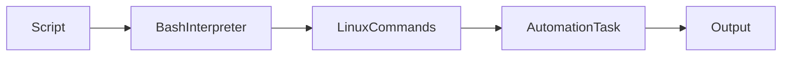
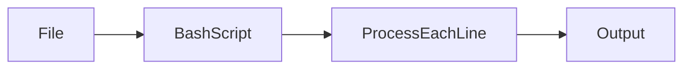
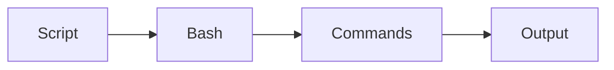
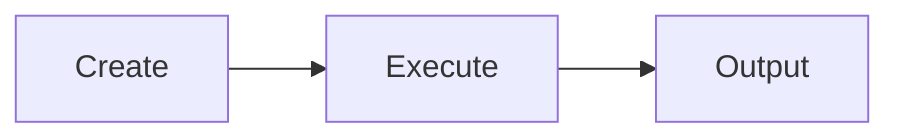

# Bash Automation

## Overview

Bash Automation is the process of using Bash scripts to perform repetitive system administration and operational tasks automatically.

It is a fundamental skill for:

- DevOps Engineers
- Cloud Engineers
- Platform Engineers
- Site Reliability Engineers (SRE)
- Linux Administrators

Typical automation tasks include:

- Backups
- Log cleanup
- Monitoring
- Deployments
- Package installation
- User management
- Infrastructure provisioning

> **Interview Point**
>
> Bash automation is one of the most commonly used methods for automating Linux servers, CI/CD pipelines, and cloud administration.

---

## Why It Is Used

Bash automation helps to:

- Reduce manual work
- Improve consistency
- Eliminate repetitive tasks
- Increase reliability
- Minimize human errors
- Save operational time

---

## Architecture / Working



---

## Key Components

| Component | Purpose |
|------------|----------|
| Script | Automation logic |
| Bash | Executes the script |
| Cron | Scheduling |
| Variables | Store data |
| Loops | Repeated execution |
| Conditions | Decision making |

---

## Types

### Manual Automation

Executed by the administrator.

### Scheduled Automation

Executed automatically using cron.

---

## Lifecycle / Workflow


---

## Configuration / Syntax

Typical workflow

```bash
nano backup.sh

chmod +x backup.sh

./backup.sh
```

---

## Important Commands

```bash
chmod +x

cron

crontab

bash

./script.sh
```

---

## Important Files

| File | Purpose |
|------|---------|
| script.sh | Bash automation script |
| /etc/crontab | System cron configuration |
| /var/spool/cron/ | User cron jobs (distribution-dependent) |

---

## Real-World Use Cases

- Automated backups
- Log rotation
- Health monitoring
- Docker cleanup
- Kubernetes maintenance
- Deployment automation
- CI/CD pipelines

---

## Advantages

- Simple
- Lightweight
- Built into Linux
- Easy integration
- Highly flexible

---

## Limitations

- Less suitable for highly complex applications
- Debugging very large scripts can be challenging

---

## Common Interview Questions (Concept Only)

- What is Bash automation?
- How do you automate Linux tasks?
- How are Bash scripts scheduled?
- How do you make a script executable?
- How do you execute a script?

---

## Common Mistakes

- Forgetting execute permission
- Not testing scripts before scheduling
- Hardcoding paths
- Ignoring exit codes
- Not handling errors

---

## Troubleshooting

| Problem | Solution |
|----------|----------|
| Script not executing | Verify execute permission and shebang |
| Cron job not running | Check cron service, schedule, and logs |
| Permission denied | Run `chmod +x` |
| Wrong output | Test the script manually before automation |

---

## Summary

Bash Automation enables Linux administrators and DevOps engineers to automate repetitive operational tasks efficiently and reliably.

---

# Reading Files

## Overview

Reading files is one of the most common Bash scripting tasks.

Scripts frequently process:

- Configuration files
- Log files
- CSV files
- Text files
- User lists

> **Interview Point**
>
> The most common production approach for reading a file line by line is:
>
> ```bash
> while IFS= read -r line
> do
>     ...
> done < file.txt
> ```

---

## Why It Is Used

- Process logs
- Read configuration
- Import user data
- Process deployment lists
- Read server inventories

---

## Architecture / Working



---

## Key Components

| Component | Purpose |
|------------|----------|
| read | Read one line |
| while | Iterate through file |
| IFS | Input Field Separator |
| -r | Preserve backslashes |

---

## Types

### Read Entire File

### Read Line by Line

### Read Specific Fields

---

## Lifecycle / Workflow


---

## Configuration / Syntax

Read line by line

```bash
while IFS= read -r line
do
    echo "$line"
done < file.txt
```

Read entire file

```bash
cat file.txt
```

---

## Important Commands

```bash
read

cat

while
```

---

## Important Files

Not applicable.

---

## Real-World Use Cases

- Read server lists
- Process backup lists
- Parse configuration files
- Analyze logs

---

## Advantages

- Memory efficient
- Easy automation
- Handles large files effectively when read line by line

---

## Limitations

- Incorrect `IFS` settings may split fields unexpectedly

---

## Common Interview Questions (Concept Only)

- How do you read a file line by line?
- What does `IFS` do?
- Why use `read -r`?

---

## Common Mistakes

- Using `for` loops to process file contents line by line
- Forgetting `-r`, causing backslashes to be interpreted
- Not quoting variables

---

## Troubleshooting

| Problem | Solution |
|----------|----------|
| Missing lines | Verify loop structure and input redirection |
| Broken text | Use `IFS=` and `read -r` |

---

## Summary

Reading files line by line using `while IFS= read -r` is the preferred approach for production Bash scripts.

---

# Command Substitution

## Overview

Command substitution stores the output of one command inside a variable or uses it as part of another command.

Modern syntax:

```bash
$(command)
```

Legacy syntax:

```bash
`command`
```

> **Interview Point**
>
> `$( )` is preferred because it is easier to read, nest, and maintain than backticks.

---

## Why It Is Used

- Capture command output
- Build dynamic scripts
- Store calculated values
- Automate system information

---

## Architecture / Working


---

## Key Components

| Syntax | Description |
|---------|-------------|
| $( ) | Modern command substitution |
| `` | Legacy command substitution |

---

## Lifecycle / Workflow


---

## Configuration / Syntax

Store hostname

```bash
HOST=$(hostname)
```

Store current directory

```bash
DIR=$(pwd)
```

Store file count

```bash
COUNT=$(ls | wc -l)
```

---

## Important Commands

```bash
$( )

hostname

pwd

date
```

---

## Important Files

Not applicable.

---

## Real-World Use Cases

- Store IP addresses
- Capture timestamps
- Count files
- Retrieve cloud metadata
- Generate deployment names

---

## Advantages

- Dynamic
- Easy to read
- Supports nested commands

---

## Limitations

- Commands returning large output may consume additional memory

---

## Common Interview Questions (Concept Only)

- What is command substitution?
- Difference between `$( )` and backticks?
- Why is `$( )` preferred?

---

## Common Mistakes

- Using backticks in complex scripts
- Forgetting to quote substituted values when appropriate

---

## Troubleshooting

| Problem | Solution |
|----------|----------|
| Empty variable | Verify command output and exit status |
| Unexpected word splitting | Quote variable expansions |

---

## Summary

Command substitution captures command output dynamically and is essential for writing flexible Bash scripts.

---

# Basic Scheduling with cron

## Overview

`cron` is the Linux job scheduler used to execute commands or scripts automatically at specified times.

Typical scheduled tasks include:

- Backups
- Monitoring
- Log cleanup
- Security scans
- Report generation
- Maintenance

> **Interview Point**
>
> `cron` runs jobs automatically based on time schedules defined in a **crontab** file.

---

## Why It Is Used

- Schedule repetitive tasks
- Automate maintenance
- Run scripts overnight
- Reduce manual intervention

---

## Architecture / Working


---

## Key Components

| Component | Purpose |
|------------|----------|
| cron | Scheduler daemon |
| crontab | Schedule configuration |
| Script | Task to execute |

---

## Types

### User Cron

Managed using:

```bash
crontab -e
```

### System Cron

Configured in:

```text
/etc/crontab
```

---

## Lifecycle / Workflow


---

## Configuration / Syntax

Cron format

```text
* * * * * command
│ │ │ │ │
│ │ │ │ └── Day of week (0–7, where 0 or 7 is Sunday)
│ │ │ └──── Month (1–12)
│ │ └────── Day of month (1–31)
│ └──────── Hour (0–23)
└────────── Minute (0–59)
```

Edit crontab

```bash
crontab -e
```

List cron jobs

```bash
crontab -l
```

Remove cron jobs

```bash
crontab -r
```

Example: Run every day at 2:00 AM

```text
0 2 * * * /home/user/backup.sh
```

---

## Important Commands

```bash
crontab -e

crontab -l

crontab -r
```

---

## Important Files

| File | Purpose |
|------|---------|
| /etc/crontab | System cron configuration |
| /etc/cron.daily/ | Daily jobs |
| /etc/cron.hourly/ | Hourly jobs |
| /etc/cron.weekly/ | Weekly jobs |
| /etc/cron.monthly/ | Monthly jobs |
| /var/spool/cron/ | User cron jobs (distribution-dependent) |

---

## Real-World Use Cases

- Nightly backups
- Cleanup scripts
- Health monitoring
- Log rotation
- Database maintenance

---

## Advantages

- Automatic execution
- Lightweight
- Reliable
- Easy scheduling

---

## Limitations

- Jobs run in a minimal environment, so absolute paths and environment variables should be configured explicitly
- Missed jobs generally do not run automatically if the system is powered off (unless alternative schedulers are used)

---

## Common Interview Questions (Concept Only)

- What is cron?
- What is crontab?
- Explain cron timing fields.
- Where are cron jobs stored?
- How do you list scheduled jobs?

---

## Common Mistakes

- Using relative paths in cron jobs
- Assuming user environment variables are available
- Forgetting execute permission
- Not redirecting output for troubleshooting

---

## Troubleshooting

| Problem | Solution |
|----------|----------|
| Job not running | Verify cron service, schedule, permissions, and paths |
| Script works manually but not in cron | Use absolute paths and define required environment variables |
| No output | Redirect stdout and stderr to a log file |

---

## Summary

`cron` automates recurring tasks and is one of the most important Linux scheduling tools used in production.

---

# chmod +x

## Overview

`chmod +x` grants execute permission to a file, allowing it to be run as a program or script.

Without execute permission, a script cannot normally be executed directly.

> **Interview Point**
>
> `chmod +x` changes the file's **permissions**, not its ownership.

---

## Why It Is Used

- Make scripts executable
- Enable automation
- Run deployment scripts

---

## Architecture / Working


---

## Key Components

| Command | Purpose |
|----------|----------|
| chmod | Change permissions |
| +x | Add execute permission |

---

## Lifecycle / Workflow


---

## Configuration / Syntax

```bash
chmod +x script.sh
```

View permissions

```bash
ls -l script.sh
```

---

## Important Commands

```bash
chmod +x

ls -l
```

---

## Important Files

Not applicable.

---

## Real-World Use Cases

- Deployment scripts
- Backup scripts
- Automation tools
- Monitoring scripts

---

## Advantages

- Simple
- Required for direct execution
- Easy permission management

---

## Limitations

- Execute permission alone does not guarantee the script will run correctly if ownership, filesystem mount options, or interpreter issues exist

---

## Common Interview Questions (Concept Only)

- What does `chmod +x` do?
- Why is execute permission required?

---

## Common Mistakes

- Forgetting execute permission
- Executing the wrong file
- Assuming `chmod +x` changes ownership

---

## Troubleshooting

| Problem | Solution |
|----------|----------|
| Permission denied | Verify execute permission and ownership |
| Script won't execute | Check shebang and interpreter path |

---

## Summary

`chmod +x` enables direct execution of Bash scripts by adding execute permission.

---

# Running Scripts

## Overview

A Bash script can be executed in several ways depending on the requirement.

Common execution methods:

- Bash interpreter
- Execute permission
- Source command

> **Interview Point**
>
> Executing a script normally starts a **new shell process**, while `source` runs it in the **current shell**, allowing environment changes to persist.

---

## Why It Is Used

- Execute automation
- Deploy applications
- Configure systems
- Run maintenance scripts

---

## Architecture / Working



---

## Types

### Execute Directly

```bash
./script.sh
```

### Run with Bash

```bash
bash script.sh
```

### Run in Current Shell

```bash
source script.sh
```

or

```bash
. script.sh
```

---

## Lifecycle / Workflow



---

## Configuration / Syntax

Direct execution

```bash
./script.sh
```

Run with Bash

```bash
bash script.sh
```

Run using source

```bash
source script.sh
```

---

## Important Commands

```bash
./script.sh

bash script.sh

source script.sh

.
```

---

## Important Files

| File | Purpose |
|------|---------|
| script.sh | Bash script |

---

## Real-World Use Cases

- CI/CD pipelines
- Server provisioning
- Monitoring
- Docker deployment
- Cloud automation

---

## Advantages

- Flexible execution methods
- Easy automation
- Supports interactive and non-interactive workflows

---

## Limitations

- Direct execution requires execute permission and a valid shebang
- `source` affects the current shell session, which may not always be desirable

---

## Common Interview Questions (Concept Only)

- Difference between `bash script.sh` and `./script.sh`?
- Difference between `source script.sh` and `./script.sh`?
- Why use `source`?

---

## Common Mistakes

- Forgetting the shebang when using direct execution
- Running a script without execute permission
- Using `source` when process isolation is preferred

---

## Troubleshooting

| Problem | Solution |
|----------|----------|
| Permission denied | Run `chmod +x` or execute with `bash script.sh` |
| Command not found | Verify script path and shebang |
| Environment changes not retained | Use `source` if changes must affect the current shell |

---

## Summary

Running Bash scripts is a core Linux skill. The three most common execution methods are direct execution (`./script.sh`), using the Bash interpreter (`bash script.sh`), and executing in the current shell (`source script.sh`).
