# Version Control Fundamentals

## Overview

Version Control is a system that tracks changes to files over time, allowing developers to collaborate, manage different versions of code, and restore previous versions when needed.

Version control is one of the **most important concepts** in DevOps, Cloud, and Software Development because almost every CI/CD pipeline begins with source code stored in a version control system.

The most widely used version control system today is **Git**.

> **Interview Point**
>
> Git is a **Distributed Version Control System (DVCS)**, meaning every developer has a complete copy of the repository and its history.

---

## Why It Is Used

Version Control helps to:

- Track code changes
- Collaborate with multiple developers
- Maintain complete change history
- Roll back to previous versions
- Create isolated feature branches
- Merge code safely
- Integrate with CI/CD pipelines

Without Version Control:

- Files get overwritten
- Collaboration becomes difficult
- Code history is lost
- Rollbacks become challenging

---

## Architecture / Working

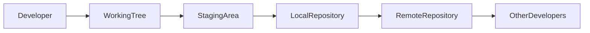

---

## Key Components

| Component | Purpose |
|------------|----------|
| Working Tree | Where files are modified |
| Staging Area | Temporary area before commit |
| Local Repository | Stores commits on local machine |
| Remote Repository | Shared repository on GitHub, Azure Repos, GitLab, etc. |
| Commit | Snapshot of changes |
| Branch | Independent line of development |

---

## Types

### Centralized Version Control System (CVCS)

Examples:

- Subversion (SVN)
- Perforce (centralized mode)

### Distributed Version Control System (DVCS)

Examples:

- Git
- Mercurial

---

## Lifecycle / Workflow

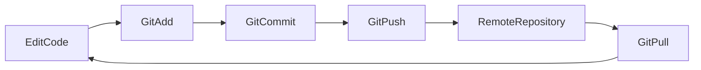

---

## Configuration / Syntax

Typical Git workflow

```bash
git status

git add .

git commit -m "Initial commit"

git push origin main
```

---

## Important Commands

```bash
git init

git clone

git status

git add

git commit

git push

git pull

git log
```

---

## Important Files

| File | Purpose |
|------|---------|
| .git/ | Git metadata and repository database |
| .gitignore | Specifies files and folders Git should ignore |
| .git/config | Repository-specific Git configuration |

---

## Real-World Use Cases

- Software development
- Infrastructure as Code (Terraform, Bicep)
- Kubernetes manifests
- Dockerfiles
- CI/CD pipeline definitions
- Configuration management
- Documentation versioning

---

## Advantages

- Complete change history
- Easy collaboration
- Safe experimentation with branches
- Rollback capability
- Distributed architecture
- Fast operations

---

## Limitations

- Learning curve for beginners
- Merge conflicts require manual resolution
- Large binary files are not handled efficiently without additional tools (e.g., Git LFS)

---

## Common Interview Questions (Concept Only)

- What is Version Control?
- Why is Version Control important?
- What problems does Version Control solve?
- What is Git?
- Why is Git widely used?
- What is the difference between Git and GitHub?

---

## Common Mistakes

- Committing directly to the main branch
- Forgetting to commit changes before switching tasks
- Not pulling the latest changes before pushing
- Committing sensitive files such as passwords or API keys
- Ignoring `.gitignore`

---

## Troubleshooting

| Problem | Solution |
|----------|----------|
| Changes missing | Check `git status` and ensure files are staged and committed |
| Commit not pushed | Verify remote configuration and use `git push` |
| Merge conflicts | Resolve conflicts manually and commit the resolution |
| Wrong file committed | Use `git restore`, `git reset`, or `git revert` as appropriate |

---

## Summary

Version Control is essential for tracking changes, collaborating with teams, and maintaining code history. Git is the industry-standard distributed version control system used in nearly every DevOps workflow.

---

# What is Version Control

## Overview

Version Control is the practice of recording changes to files so that different versions can be retrieved later.

It enables teams to collaborate on the same codebase without overwriting each other's work.

> **Interview Point**
>
> Version Control is not just for source code—it can also manage configuration files, Infrastructure as Code, documentation, and automation scripts.

---

## Why It Is Used

- Preserve change history
- Recover deleted or modified code
- Support teamwork
- Enable parallel development
- Improve code quality through reviews

---

## Architecture / Working

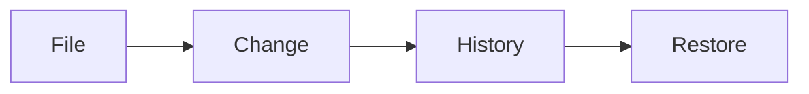

---

## Key Components

| Component | Purpose |
|-----------|----------|
| Repository | Stores files and history |
| Commit | Snapshot of changes |
| Branch | Independent development path |
| Merge | Combine changes |

---

## Real-World Use Cases

- Source code management
- Terraform configurations
- Kubernetes YAML files
- Azure DevOps Pipelines
- Dockerfiles

---

## Advantages

- Easy rollback
- Collaboration
- Audit trail
- Safe experimentation

---

## Limitations

- Requires disciplined workflows
- Merge conflicts can occur

---

## Common Interview Questions (Concept Only)

- What is Version Control?
- Why is Version Control necessary?
- What is a repository?

---

## Common Mistakes

- Using shared folders instead of Version Control
- Manual file versioning (e.g., `project_v2_final_final.zip`)

---

## Troubleshooting

| Problem | Solution |
|----------|----------|
| Lost changes | Recover using Git history if committed |

---

## Summary

Version Control records every change made to files, enabling collaboration, recovery, and reliable software development.

---

# Centralized vs Distributed Version Control

## Overview

Version Control Systems are classified into two main types:

- Centralized Version Control System (CVCS)
- Distributed Version Control System (DVCS)

Git uses the Distributed model.

---

## Why It Is Used

Understanding the differences helps explain why Git has become the industry standard.

---

## Architecture / Working

### Centralized Version Control

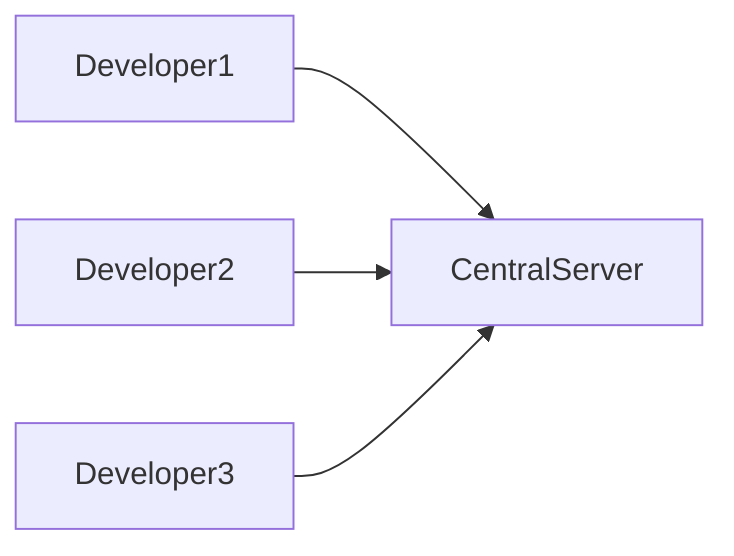

### Distributed Version Control

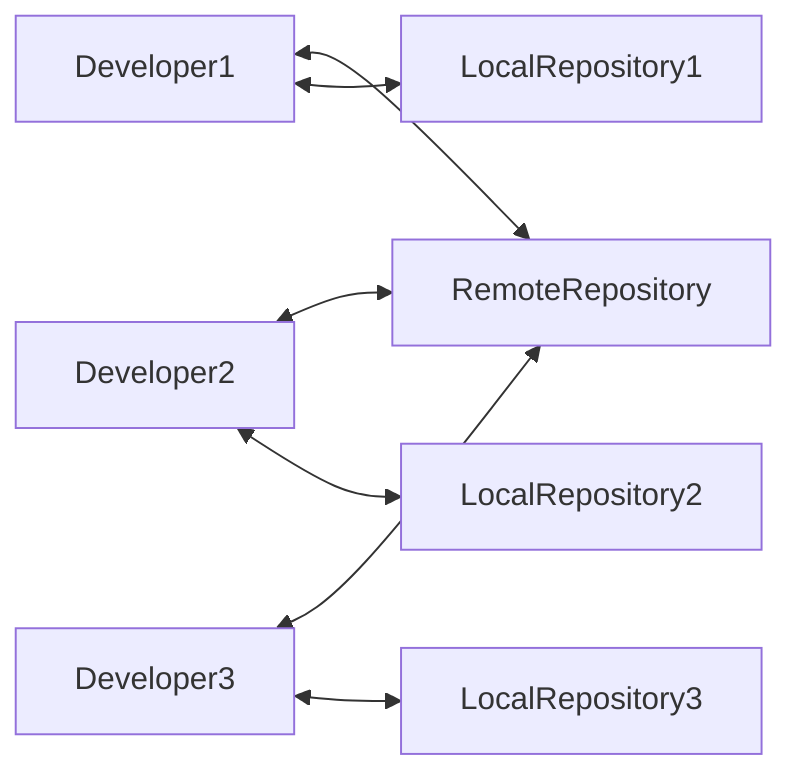

---

## Key Components

| Centralized (CVCS) | Distributed (DVCS) |
|--------------------|--------------------|
| Single central server | Every developer has a full repository |
| Requires network for most operations | Most operations work offline |
| Single point of failure | No single point of failure |
| Limited offline work | Full offline capabilities |

---

## Types

### Centralized Version Control (CVCS)

Examples:

- SVN
- CVS

### Distributed Version Control (DVCS)

Examples:

- Git
- Mercurial

---

## Real-World Use Cases

| CVCS | DVCS |
|------|------|
| Legacy enterprise environments | Modern DevOps workflows |
| Older software projects | Cloud-native development |
| Traditional teams | CI/CD pipelines |

---

## Advantages

### CVCS

- Simple architecture
- Centralized administration

### DVCS

- Faster
- Offline support
- Better collaboration
- High availability
- Complete history on every machine

---

## Limitations

### CVCS

- Single point of failure
- Requires network connectivity

### DVCS

- Slightly larger local storage requirements
- More concepts for beginners to learn

---

## Common Interview Questions (Concept Only)

- Difference between Centralized and Distributed Version Control?
- Why is Git considered distributed?
- Why is Git faster than SVN?

---

## Common Mistakes

- Assuming Git requires constant internet connectivity
- Confusing local and remote repositories

---

## Troubleshooting

| Problem | Solution |
|----------|----------|
| Offline work | Use local Git repository and push changes later |

---

## Summary

Git's distributed architecture provides better performance, offline capability, resilience, and collaboration compared to centralized systems.

---

# Git Architecture

## Overview

Git stores data in multiple layers, each representing a different stage of development.

The four primary areas are:

1. Working Tree
2. Staging Area (Index)
3. Local Repository
4. Remote Repository

> **Interview Point**
>
> Understanding the Git architecture is one of the most frequently asked Git interview topics.

---

## Why It Is Used

Git separates changes into multiple stages to provide greater control before sharing code.

---

## Architecture / Working

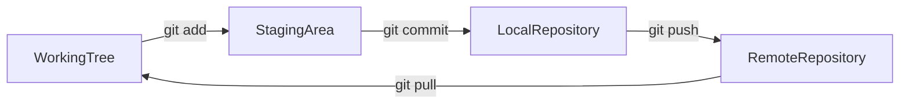

---

## Key Components

| Component | Purpose |
|------------|----------|
| Working Tree | Modify files |
| Staging Area | Prepare commit |
| Local Repository | Store commits |
| Remote Repository | Share commits |

---

## Lifecycle / Workflow

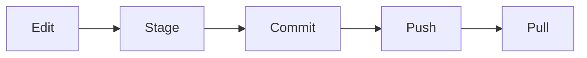

---

## Configuration / Syntax

```bash
git add

git commit

git push

git pull
```

---

## Real-World Use Cases

- Code development
- Infrastructure management
- CI/CD integration

---

## Advantages

- Flexible workflow
- Safe commits
- Clear separation of stages

---

## Limitations

- New users may confuse the staging area with the local repository

---

## Common Interview Questions (Concept Only)

- Explain Git architecture.
- What is the staging area?
- What is the difference between the local and remote repository?

---

## Common Mistakes

- Forgetting to stage files before committing
- Assuming `git commit` uploads changes to GitHub

---

## Troubleshooting

| Problem | Solution |
|----------|----------|
| Commit missing files | Verify staged files using `git status` |

---

## Summary

Git architecture divides code changes into working, staging, local, and remote areas, providing a controlled and reliable workflow.

---

# Working Tree

## Overview

The Working Tree (Working Directory) contains the actual project files that a developer edits.

It reflects the current checkout of a branch.

---

## Why It Is Used

- Write code
- Modify files
- Create new files
- Delete files

---

## Architecture / Working

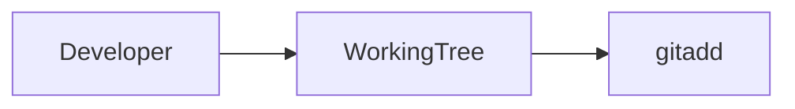

---

## Key Components

| Component | Purpose |
|------------|----------|
| Modified files | Existing files with changes |
| New files | Untracked files |
| Deleted files | Removed from the working directory |

---

## Configuration / Syntax

```bash
git status
```

---

## Real-World Use Cases

- Feature development
- Bug fixes
- Documentation updates

---

## Advantages

- Immediate editing
- Easy experimentation

---

## Limitations

- Changes are not protected until committed

---

## Common Interview Questions (Concept Only)

- What is the Working Tree?
- What happens after editing a file?

---

## Common Mistakes

- Forgetting to stage changes
- Assuming edited files are automatically saved in Git

---

## Troubleshooting

| Problem | Solution |
|----------|----------|
| Changes not committed | Stage and commit the files |

---

## Summary

The Working Tree is where developers make changes before staging and committing them.

---

# Staging Area (Index)

## Overview

The Staging Area (Index) is an intermediate area where changes are prepared before being committed.

It allows developers to choose exactly which changes will be included in the next commit.

> **Interview Point**
>
> The staging area is one of Git's unique features and a common interview topic.

---

## Why It Is Used

- Prepare commits
- Review changes
- Create meaningful commits

---

## Architecture / Working

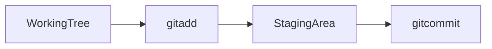

---

## Key Components

| Command | Purpose |
|----------|----------|
| git add | Stage files |
| git restore --staged | Unstage files |

---

## Configuration / Syntax

```bash
git add file.txt

git add .

git restore --staged file.txt
```

---

## Real-World Use Cases

- Partial commits
- Group related changes
- Review code before committing

---

## Advantages

- Greater control
- Cleaner commit history

---

## Limitations

- Beginners often forget the staging step

---

## Common Interview Questions (Concept Only)

- What is the staging area?
- Why not commit directly?

---

## Common Mistakes

- Forgetting `git add`
- Staging unintended files

---

## Troubleshooting

| Problem | Solution |
|----------|----------|
| File not committed | Ensure it has been staged before committing |

---

## Summary

The staging area acts as a preparation area for creating accurate and organized commits.

---

# Local Repository

## Overview

The Local Repository stores all commits on the developer's machine.

Every Git repository contains its own complete history.

---

## Why It Is Used

- Store commits
- Enable offline work
- Maintain project history

---

## Architecture / Working

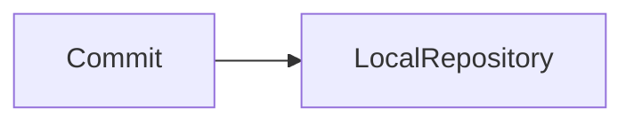

---

## Key Components

| Component | Purpose |
|------------|----------|
| Commit history | Stores all versions |
| Branches | Independent development |
| Tags | Version markers |

---

## Configuration / Syntax

```bash
git commit

git log
```

---

## Real-World Use Cases

- Offline development
- Feature branches
- Local testing

---

## Advantages

- Offline support
- Complete history
- Fast operations

---

## Limitations

- Changes remain private until pushed to a remote repository

---

## Common Interview Questions (Concept Only)

- What is a local repository?
- Where are commits stored?

---

## Common Mistakes

- Assuming commits are automatically shared with others

---

## Troubleshooting

| Problem | Solution |
|----------|----------|
| Team cannot see commits | Push commits to the remote repository |

---

## Summary

The Local Repository stores all commits and enables developers to work independently without network connectivity.

---

# Remote Repository

## Overview

A Remote Repository is a shared repository hosted on platforms such as GitHub, Azure Repos, GitLab, or Bitbucket.

It allows teams to collaborate by sharing commits.

---

## Why It Is Used

- Team collaboration
- Backup
- CI/CD integration
- Code reviews

---

## Architecture / Working

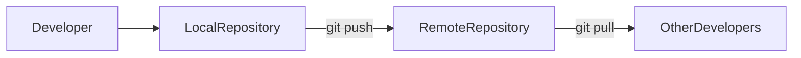

---

## Key Components

| Component | Purpose |
|------------|----------|
| origin | Default remote name |
| Push | Upload commits |
| Pull | Download changes |
| Fetch | Retrieve remote updates without merging |

---

## Configuration / Syntax

```bash
git remote -v

git push origin main

git pull origin main

git fetch origin
```

---

## Important Commands

```bash
git remote

git push

git pull

git fetch
```

---

## Important Files

Remote configuration is stored in:

```text
.git/config
```

---

## Real-World Use Cases

- Team collaboration
- GitHub repositories
- Azure DevOps Repos
- CI/CD pipelines

---

## Advantages

- Central collaboration
- Backup
- Easy code sharing
- Integration with DevOps tools

---

## Limitations

- Network connectivity is required for synchronization
- Pushes may be rejected if the remote has newer commits

---

## Common Interview Questions (Concept Only)

- What is a remote repository?
- What is `origin`?
- Difference between `fetch`, `pull`, and `push`?
- Why is a remote repository required?

---

## Common Mistakes

- Pushing without pulling recent changes
- Working on the wrong remote repository
- Assuming `git fetch` updates the working tree

---

## Troubleshooting

| Problem | Solution |
|----------|----------|
| Push rejected | Pull or rebase the latest changes, resolve conflicts if necessary, then push again |
| Remote not found | Verify the remote configuration using `git remote -v` |

---

## Summary

The Remote Repository is the shared location where teams collaborate, synchronize changes, and integrate with CI/CD systems. It serves as the central point for sharing code while each developer continues to work in their own local repository.
