# Branching

## Overview

Branching is one of Git's most powerful features. A branch is an independent line of development that allows developers to work on new features, bug fixes, or experiments without affecting the main codebase.

By default, a Git repository starts with a primary branch (commonly **main** or **master**). Developers create additional branches to isolate their work and later merge those changes back into the main branch.

> **Interview Point**
>
> A branch in Git is simply a **lightweight movable pointer to a commit**, making branch creation and switching very fast.

---

## Why It Is Used

Branching helps developers:

- Develop features independently
- Fix bugs without affecting production code
- Work on multiple tasks simultaneously
- Collaborate safely in teams
- Support CI/CD workflows
- Test experimental changes

Without branching:

- Developers would work directly on the main branch.
- Code instability would increase.
- Collaboration would become difficult.

---

## Architecture / Working

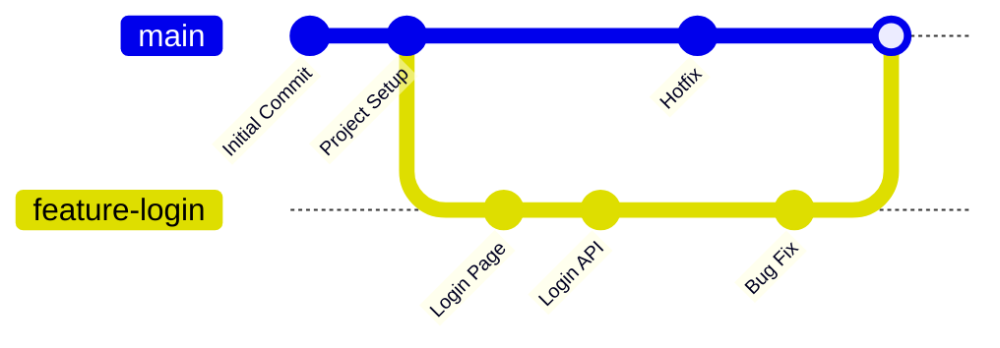

---

## Key Components

| Component | Purpose |
|------------|----------|
| Main Branch | Stable production-ready code |
| Feature Branch | Develop new features |
| Bug Fix Branch | Resolve defects |
| Hotfix Branch | Emergency production fixes |
| Branch Pointer | Points to the latest commit |

---

## Types

### Main Branch

- Production-ready code
- Protected in most organizations

### Feature Branch

- New functionality
- Most common branch type

### Bug Fix Branch

- Fix application issues

### Hotfix Branch

- Critical production fixes

### Release Branch

- Prepare application releases

> **Interview Point**
>
> Although Git supports any branch naming convention, most organizations use:
>
> - `main`
> - `feature/*`
> - `bugfix/*`
> - `hotfix/*`
> - `release/*`

---

## Lifecycle / Workflow

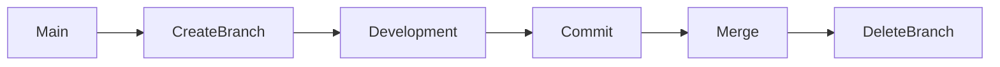

---

## Configuration / Syntax

Typical workflow

```bash
git branch feature-login

git switch feature-login

git add .

git commit -m "Added login page"

git switch main

git merge feature-login
```

---

## Important Commands

```bash
git branch

git switch

git checkout

git merge

git branch -d

git branch -m
```

---

## Important Files

| File | Purpose |
|------|---------|
| `.git/HEAD` | Points to the current branch |
| `.git/refs/heads/` | Stores branch references |

---

## Real-World Use Cases

- Feature development
- Production hotfixes
- Sprint-based development
- CI/CD deployments
- Parallel team development

---

## Advantages

- Isolated development
- Easy collaboration
- Safe experimentation
- Lightweight and fast
- Supports multiple workflows

---

## Limitations

- Poor branch management can create stale branches
- Long-lived branches may increase merge conflicts

---

## Common Interview Questions (Concept Only)

- What is a Git branch?
- Why do we use branches?
- What is the default branch?
- What is the difference between feature and hotfix branches?
- Why is branching important in DevOps?

---

## Common Mistakes

- Working directly on the main branch
- Forgetting to switch branches before making changes
- Keeping feature branches alive for too long
- Using unclear branch names
- Deleting branches before merging

---

## Troubleshooting

| Problem | Solution |
|----------|----------|
| Branch not found | Verify branch names using `git branch` |
| Cannot delete branch | Ensure it is merged or use `-D` only if deletion is intentional |
| Wrong branch checked out | Verify the current branch with `git branch --show-current` |
| Merge conflicts | Resolve conflicts manually before completing the merge |

---

## Summary

Branching enables isolated development, parallel collaboration, and safe code integration. It is a core Git feature and an essential concept for every DevOps engineer.

---

# What is a Branch

## Overview

A branch is an independent line of development in a Git repository.

Internally, a branch is simply a pointer to the latest commit in that branch.

Every new commit moves the branch pointer forward.

> **Interview Point**
>
> Branches do **not** duplicate the repository. They only create a new pointer, making branch creation extremely fast and storage-efficient.

---

## Why It Is Used

Branches allow developers to:

- Work independently
- Avoid breaking production code
- Develop multiple features simultaneously
- Test experimental changes

---

## Architecture / Working

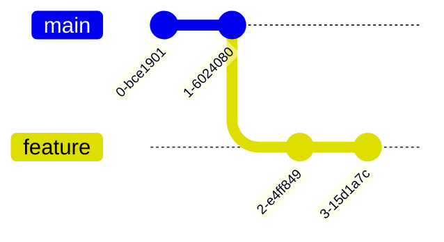

---

## Key Components

| Component | Description |
|------------|-------------|
| Branch Name | Human-readable identifier |
| Branch Pointer | References the latest commit |
| HEAD | Points to the current branch |

---

## Types

- Main Branch
- Feature Branch
- Release Branch
- Hotfix Branch
- Bug Fix Branch

---

## Real-World Use Cases

- New application features
- Production patches
- Sprint development
- Experimental implementations

---

## Advantages

- Isolated development
- Safe coding
- Easy rollback

---

## Limitations

- Excessive branching can complicate repository management

---

## Common Interview Questions (Concept Only)

- What is a branch?
- Is a branch a copy of the repository?
- What does a branch point to?

---

## Common Mistakes

- Assuming branches duplicate all files
- Confusing branches with repositories

---

## Troubleshooting

| Problem | Solution |
|----------|----------|
| Unsure of current branch | Use `git branch --show-current` |

---

## Summary

A Git branch is a lightweight pointer to a sequence of commits, allowing independent development without affecting other branches.

---

# Create Branches

## Overview

Creating a branch establishes a new line of development without modifying the existing branch.

Initially, the new branch points to the same commit as the current branch.

---

## Why It Is Used

Developers create branches for:

- Features
- Bug fixes
- Releases
- Hotfixes

---

## Architecture / Working

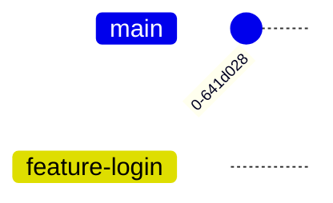

---

## Key Components

| Component | Purpose |
|------------|----------|
| Current Commit | Starting point |
| New Branch | Independent development path |

---

## Lifecycle / Workflow

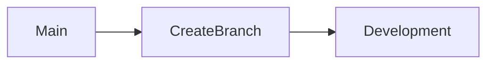

---

## Configuration / Syntax

Create a branch

```bash
git branch feature-login
```

Create and switch immediately

```bash
git switch -c feature-login
```

Legacy equivalent

```bash
git checkout -b feature-login
```

---

## Important Commands

```bash
git branch

git switch -c

git checkout -b
```

---

## Real-World Use Cases

- Sprint feature development
- Customer-specific enhancements
- Infrastructure changes

---

## Advantages

- Fast creation
- Lightweight
- Safe isolation

---

## Limitations

- Branch is not shared until pushed to a remote repository

---

## Common Interview Questions (Concept Only)

- How do you create a branch?
- Difference between `git branch` and `git switch -c`?

---

## Common Mistakes

- Creating a branch from the wrong base branch
- Forgetting to switch after creation when using `git branch`

---

## Troubleshooting

| Problem | Solution |
|----------|----------|
| Branch already exists | Choose a different name or switch to the existing branch |

---

## Summary

Creating branches allows developers to isolate work while keeping the main branch stable.

---

# Switch Branches

## Overview

Switching branches changes the current working branch, updating the Working Tree to match that branch's latest commit.

> **Interview Point**
>
> `git switch` is the modern command for switching branches. `git checkout` is older and also performs additional functions.

---

## Why It Is Used

Developers switch branches to:

- Work on different features
- Review code
- Apply bug fixes
- Test releases

---

## Architecture / Working

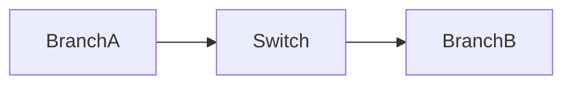

---

## Key Components

| Component | Purpose |
|------------|----------|
| HEAD | Moves to the selected branch |
| Working Tree | Updates to selected branch |

---

## Lifecycle / Workflow

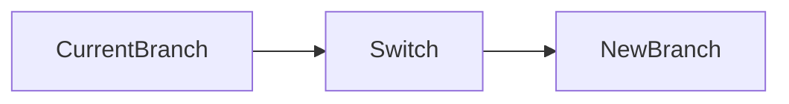

---

## Configuration / Syntax

Switch branch

```bash
git switch feature-login
```

Legacy command

```bash
git checkout feature-login
```

Return to main

```bash
git switch main
```

---

## Important Commands

```bash
git switch

git checkout
```

---

## Real-World Use Cases

- Feature development
- Code review
- Hotfix deployment

---

## Advantages

- Fast
- Simple
- Preserves branch isolation

---

## Limitations

- Uncommitted changes may prevent switching if they would be overwritten

---

## Common Interview Questions (Concept Only)

- Difference between `git switch` and `git checkout`?
- What happens when switching branches?

---

## Common Mistakes

- Switching branches with conflicting uncommitted changes
- Forgetting the active branch before committing

---

## Troubleshooting

| Problem | Solution |
|----------|----------|
| Checkout blocked | Commit, stash, or discard conflicting changes before switching |

---

## Summary

Branch switching changes the active development branch and updates the Working Tree to match that branch.

---

# Rename Branches

## Overview

Branch renaming changes the name of an existing branch without affecting its commit history.

This is useful when improving naming conventions or correcting mistakes.

---

## Why It Is Used

- Correct spelling
- Follow organizational naming standards
- Improve readability

---

## Architecture / Working

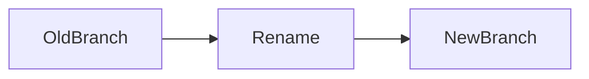

---

## Key Components

| Component | Purpose |
|------------|----------|
| Old Name | Existing branch |
| New Name | Updated branch |

---

## Lifecycle / Workflow

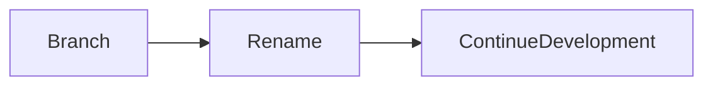

---

## Configuration / Syntax

Rename current branch

```bash
git branch -m new-name
```

Rename another branch

```bash
git branch -m old-name new-name
```

---

## Important Commands

```bash
git branch -m
```

---

## Real-World Use Cases

- Standardize feature names
- Correct naming mistakes
- Adopt team naming conventions

---

## Advantages

- Keeps commit history intact
- Improves repository organization

---

## Limitations

- If the branch has already been pushed, the remote branch and references may also need to be updated

---

## Common Interview Questions (Concept Only)

- How do you rename a Git branch?
- Does renaming affect commit history?

---

## Common Mistakes

- Forgetting to update the remote branch after renaming
- Assuming collaborators automatically receive the new branch name

---

## Troubleshooting

| Problem | Solution |
|----------|----------|
| Remote still uses the old name | Push the renamed branch and delete the old remote branch if appropriate |

---

## Summary

Branch renaming improves readability without modifying the underlying commit history.

---

# Delete Branches

## Overview

Deleting a branch removes its reference after the work is complete.

Deleting a branch does **not** immediately remove the commits if they are still reachable from another branch.

> **Interview Point**
>
> Prefer `git branch -d` over `git branch -D`.
>
> `-d` checks whether the branch has been merged.
>
> `-D` forcefully deletes it.

---

## Why It Is Used

- Clean up completed feature branches
- Reduce repository clutter
- Maintain an organized workflow

---

## Architecture / Working

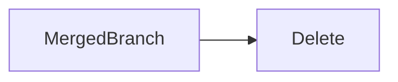

---

## Key Components

| Command | Purpose |
|----------|----------|
| `-d` | Safe delete |
| `-D` | Force delete |

---

## Lifecycle / Workflow

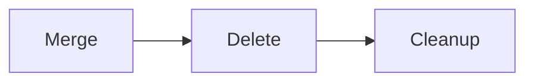

---

## Configuration / Syntax

Delete merged branch

```bash
git branch -d feature-login
```

Force delete

```bash
git branch -D feature-login
```

---

## Important Commands

```bash
git branch -d

git branch -D
```

---

## Real-World Use Cases

- Sprint cleanup
- Completed feature removal
- Repository maintenance

---

## Advantages

- Cleaner repositories
- Easier branch management

---

## Limitations

- Force deletion may remove references to unmerged work

---

## Common Interview Questions (Concept Only)

- Difference between `git branch -d` and `git branch -D`?
- When should a branch be deleted?

---

## Common Mistakes

- Force deleting an unmerged branch
- Deleting the wrong branch

---

## Troubleshooting

| Problem | Solution |
|----------|----------|
| Branch cannot be deleted | Ensure you are not currently on that branch and that it has been merged, or use `-D` only when appropriate |

---

## Summary

Delete branches after their work has been merged to keep repositories organized. Use force deletion only when you understand the consequences.

---

# Branch Listing

## Overview

Branch listing displays all branches available in a repository.

It helps developers identify:

- Current branch
- Local branches
- Remote branches
- Tracking relationships

---

## Why It Is Used

Developers use branch listing to:

- Switch branches
- Review repository structure
- Verify remote branches
- Manage development

---

## Architecture / Working

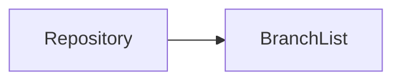

---

## Key Components

| Branch Type | Description |
|-------------|-------------|
| Local | Exists on the local machine |
| Remote | Exists on the remote repository |
| Tracking | Local branch associated with a remote branch |

---

## Lifecycle / Workflow

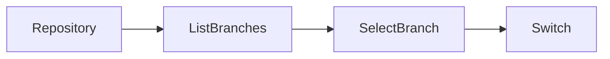

---

## Configuration / Syntax

List local branches

```bash
git branch
```

List remote branches

```bash
git branch -r
```

List all branches

```bash
git branch -a
```

Show the current branch

```bash
git branch --show-current
```

---

## Important Commands

```bash
git branch

git branch -a

git branch -r

git branch --show-current
```

---

## Real-World Use Cases

- Daily development
- Code reviews
- Remote branch management
- Release planning

---

## Advantages

- Simple branch visibility
- Helps navigate repositories
- Displays the active branch clearly

---

## Limitations

- Stale remote-tracking branches may remain until they are pruned

---

## Common Interview Questions (Concept Only)

- How do you list all branches?
- How do you identify the current branch?
- Difference between local and remote branches?

---

## Common Mistakes

- Confusing local branches with remote-tracking branches
- Forgetting to fetch updates before checking remote branches

---

## Troubleshooting

| Problem | Solution |
|----------|----------|
| Remote branch not visible | Run `git fetch` to update remote references |
| Too many obsolete remote branches | Use `git fetch --prune` to remove stale remote-tracking references |

---

## Summary

Branch listing provides visibility into local and remote branches, making it easier to navigate, manage, and collaborate in Git repositories.
