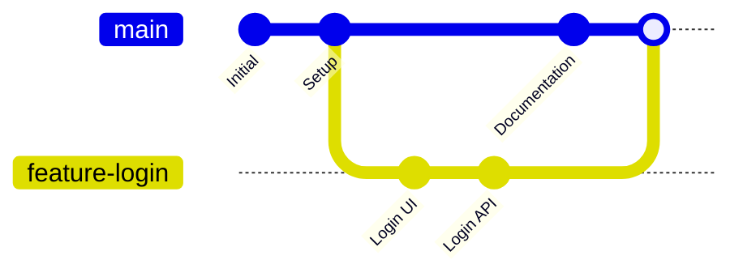
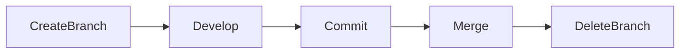
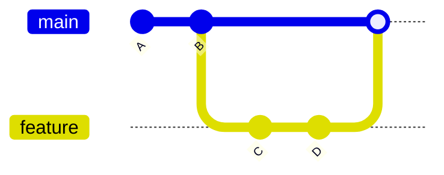
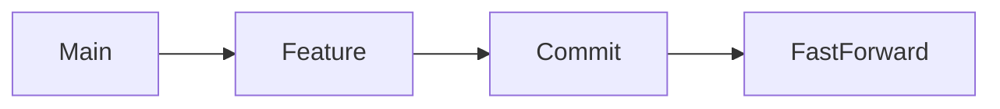
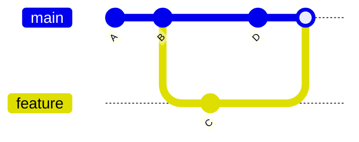
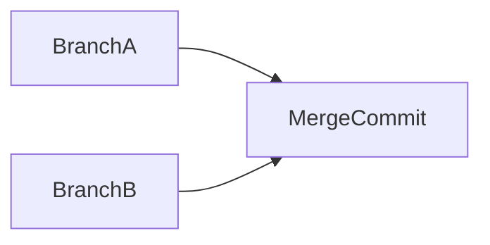
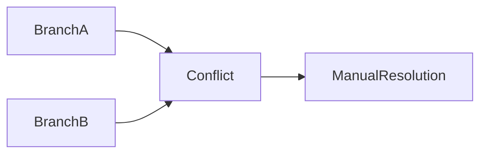
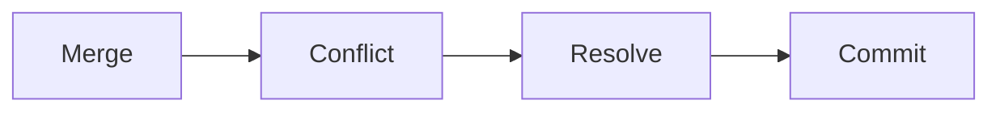
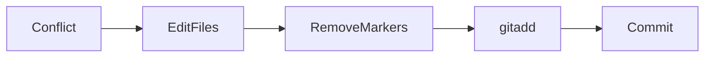
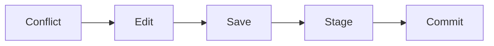

# Merging

## Overview

Merging is the process of combining changes from one Git branch into another. It is one of the most important Git operations because it integrates work completed in feature, bug-fix, or release branches into the main development branch.

In a typical workflow:

- Developers create feature branches.
- Changes are committed independently.
- The feature branch is merged back into the main branch after review.

> **Interview Point**
>
> Git supports two primary merge strategies commonly discussed in interviews:
>
> - **Fast-Forward Merge**
> - **Three-Way Merge**
>
> Git automatically chooses the appropriate strategy based on the commit history.

---

## Why It Is Used

Merging enables teams to:

- Combine completed work
- Integrate new features
- Apply bug fixes
- Maintain a single source of truth
- Support collaborative development
- Enable CI/CD deployment workflows

---

## Architecture / Working



---

## Key Components

| Component | Purpose |
|------------|----------|
| Source Branch | Branch being merged |
| Target Branch | Branch receiving changes |
| Merge Commit | Commit created after merge (when required) |
| Common Ancestor | Shared commit used in three-way merges |
| Merge Conflict | Conflicting modifications requiring manual resolution |

---

## Types

- Fast-Forward Merge
- Three-Way Merge

---

## Lifecycle / Workflow



---

## Configuration / Syntax

Merge a feature branch

```bash
git switch main

git merge feature-login
```

---

## Important Commands

```bash
git merge

git merge --abort

git status

git log

git diff
```

---

## Important Files

| File | Purpose |
|------|---------|
| `.git/MERGE_HEAD` | Stores merge information during an active merge |
| `.git/HEAD` | Current branch reference |

---

## Real-World Use Cases

- Merge completed features
- Integrate bug fixes
- Combine release branches
- Merge infrastructure changes
- Complete Pull Requests

---

## Advantages

- Combines multiple development efforts
- Preserves project history
- Supports parallel development
- Essential for collaborative workflows

---

## Limitations

- Merge conflicts may require manual resolution
- Large, long-lived branches increase merge complexity

---

## Common Interview Questions (Concept Only)

- What is Git merge?
- What happens during a merge?
- What is a merge commit?
- Why do merge conflicts occur?
- What are the types of Git merge?

---

## Common Mistakes

- Merging outdated branches
- Ignoring merge conflicts
- Merging directly into production without review
- Long-running feature branches

---

## Troubleshooting

| Problem | Solution |
|----------|----------|
| Merge conflict | Resolve conflicts manually, stage resolved files, then complete the merge |
| Merge aborted | Use `git merge --abort` to return to the pre-merge state |
| Unexpected merge result | Review commit history using `git log --graph` |

---

## Summary

Merging combines changes from different branches, enabling parallel development while maintaining a unified project history.

---

# Fast-Forward Merge

## Overview

A Fast-Forward Merge occurs when the target branch has **not changed** since the feature branch was created.

Instead of creating a new merge commit, Git simply moves the branch pointer forward.

> **Interview Point**
>
> **No merge commit is created** during a Fast-Forward Merge.

---

## Why It Is Used

Fast-forward merges provide:

- Cleaner history
- Fewer commits
- Simpler repository structure

---

## Architecture / Working



---

## Key Components

| Component | Description |
|------------|-------------|
| No Divergence | Main branch unchanged |
| Pointer Movement | Branch reference moves forward |
| No Merge Commit | History remains linear |

---

## Lifecycle / Workflow



---

## Configuration / Syntax

```bash
git switch main

git merge feature
```

Force no fast-forward

```bash
git merge --no-ff feature
```

---

## Important Commands

```bash
git merge

git merge --no-ff
```

---

## Real-World Use Cases

- Small features
- Personal repositories
- Linear development

---

## Advantages

- Clean history
- No unnecessary merge commit
- Easy to understand

---

## Limitations

- Branch history is less visible because no merge commit records the integration point

---

## Common Interview Questions (Concept Only)

- What is a Fast-Forward Merge?
- When does Git perform a Fast-Forward Merge?
- Is a merge commit created?

---

## Common Mistakes

- Assuming every merge creates a merge commit
- Confusing Fast-Forward Merge with rebase

---

## Troubleshooting

| Problem | Solution |
|----------|----------|
| Expected a merge commit | Use `git merge --no-ff` if a merge commit is required |

---

## Summary

A Fast-Forward Merge occurs when branches have not diverged, allowing Git to move the branch pointer without creating a merge commit.

---

# Three-Way Merge

## Overview

A Three-Way Merge occurs when both branches have new commits after they diverge.

Git compares:

- Common ancestor
- Source branch
- Target branch

If changes do not conflict, Git creates a new merge commit.

> **Interview Point**
>
> Three-Way Merge **creates a merge commit**.

---

## Why It Is Used

It combines independent development from multiple branches.

---

## Architecture / Working



---

## Key Components

| Component | Purpose |
|------------|----------|
| Common Ancestor | Shared starting point |
| Merge Commit | Combines both histories |
| Diverged Branches | Independent development |

---

## Lifecycle / Workflow



---

## Configuration / Syntax

```bash
git merge feature
```

---

## Important Commands

```bash
git merge

git log --graph
```

---

## Real-World Use Cases

- Team development
- Large features
- Sprint integration
- Enterprise repositories

---

## Advantages

- Preserves complete history
- Records merge events
- Suitable for collaborative development

---

## Limitations

- May produce merge conflicts
- Creates additional merge commits, which can make history more complex

---

## Common Interview Questions (Concept Only)

- What is a Three-Way Merge?
- Why is a merge commit created?
- What is the common ancestor?

---

## Common Mistakes

- Assuming Git always performs a Fast-Forward Merge
- Forgetting that both branches must have diverged for a Three-Way Merge

---

## Troubleshooting

| Problem | Solution |
|----------|----------|
| Unexpected merge commit | Review branch history using `git log --graph` to understand the divergence |

---

## Summary

A Three-Way Merge combines diverged branches by comparing a common ancestor and creating a new merge commit.

---

# Merge Conflicts

## Overview

A Merge Conflict occurs when Git cannot automatically determine how to combine changes from two branches.

This usually happens when:

- The same line of a file is modified in both branches.
- One branch deletes a file while the other modifies it.
- Renames and modifications overlap.

> **Interview Point**
>
> Git **never guesses** how to resolve conflicting changes. Manual resolution is required.

---

## Why It Is Used

Merge conflicts protect developers from accidentally overwriting someone else's work.

---

## Architecture / Working



---

## Key Components

| Component | Purpose |
|------------|----------|
| Conflict Marker | Indicates conflicting code |
| Manual Resolution | Developer chooses the final content |
| Merge Completion | Final commit after conflicts are resolved |

---

## Types

### Content Conflict

Same lines modified.

### Delete/Modify Conflict

One branch deletes a file while another modifies it.

### Rename Conflict

Conflicting file renames.

---

## Lifecycle / Workflow



---

## Configuration / Syntax

Check status

```bash
git status
```

Abort merge

```bash
git merge --abort
```

---

## Important Commands

```bash
git status

git diff

git merge --abort
```

---

## Real-World Use Cases

- Multiple developers editing the same file
- Large feature integrations
- Release merges

---

## Advantages

- Prevents accidental data loss
- Forces explicit conflict resolution
- Protects code quality

---

## Limitations

- Manual intervention is required
- Large conflicts can be time-consuming to resolve

---

## Common Interview Questions (Concept Only)

- What causes merge conflicts?
- How does Git identify conflicts?
- Can Git automatically resolve every conflict?

---

## Common Mistakes

- Deleting conflict markers without understanding the changes
- Choosing one version without reviewing both sets of modifications

---

## Troubleshooting

| Problem | Solution |
|----------|----------|
| Merge stopped | Resolve all conflicts, stage the resolved files, then complete the merge |
| Unsure what changed | Use `git diff` or a merge tool to inspect differences |

---

## Summary

Merge conflicts occur when Git cannot safely combine changes. They require manual review to preserve the correct code.

---

# Conflict Resolution

## Overview

Conflict Resolution is the process of manually resolving merge conflicts and completing the merge.

Git inserts conflict markers into affected files to show the competing changes.

Example:

```text
<<<<<<< HEAD
Current branch changes
=======
Incoming branch changes
>>>>>>> feature-login
```

The developer edits the file, removes the markers, and saves the desired final version.

> **Interview Point**
>
> After resolving conflicts, you must:
>
> 1. Stage the resolved files (`git add`)
> 2. Complete the merge (typically with `git commit` if Git has not already created the merge commit automatically)

---

## Why It Is Used

Conflict resolution ensures that:

- No work is lost
- The correct code is retained
- Project history remains accurate

---

## Architecture / Working



---

## Key Components

| Component | Purpose |
|------------|----------|
| Conflict Marker | Indicates conflicting sections |
| Manual Edit | Resolve differences |
| Staging | Mark conflicts as resolved |
| Merge Commit | Finalize merge |

---

## Lifecycle / Workflow



---

## Configuration / Syntax

View conflicts

```bash
git status
```

Stage resolved files

```bash
git add .
```

Complete the merge

```bash
git commit
```

Abort merge

```bash
git merge --abort
```

---

## Important Commands

```bash
git status

git add

git commit

git merge --abort

git diff
```

---

## Important Files

During a merge, Git may use:

| File | Purpose |
|------|---------|
| `.git/MERGE_HEAD` | Records merge state |
| `.git/HEAD` | Current branch reference |

---

## Real-World Use Cases

- Team feature integration
- Release preparation
- Production hotfixes
- Infrastructure repository merges

---

## Advantages

- Prevents accidental overwrites
- Ensures informed decisions during integration
- Maintains repository integrity

---

## Limitations

- Time-consuming for large conflicts
- Requires understanding of both code changes

---

## Common Interview Questions (Concept Only)

- How do you resolve a merge conflict?
- What are conflict markers?
- What commands are used after resolving conflicts?
- How do you cancel a merge in progress?

---

## Common Mistakes

- Leaving conflict markers in the code
- Forgetting to stage resolved files
- Committing without testing the merged code
- Forcefully overwriting changes without reviewing them

---

## Troubleshooting

| Problem | Solution |
|----------|----------|
| Conflict markers remain | Edit the file, remove all markers, and save it |
| Merge cannot continue | Ensure all conflicted files are resolved and staged |
| Want to cancel the merge | Use `git merge --abort` before completing the merge |
| Unsure which version to keep | Compare both changes using `git diff` or a merge tool before deciding |

---

## Summary

Conflict Resolution is a critical Git skill. Developers manually resolve conflicting changes, stage the resolved files, and complete the merge to produce a consistent and correct codebase. Understanding conflict resolution is essential for both technical interviews and real-world collaborative development.
