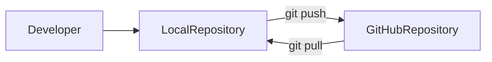
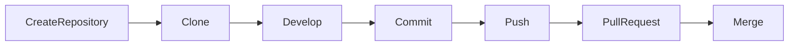
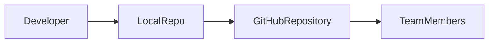
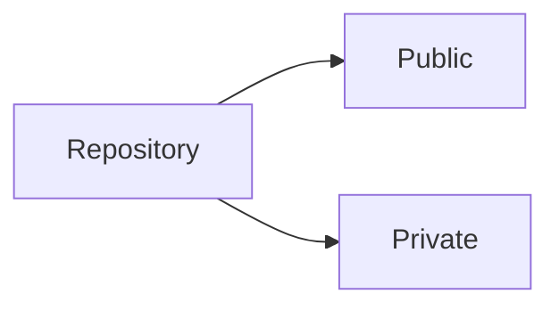
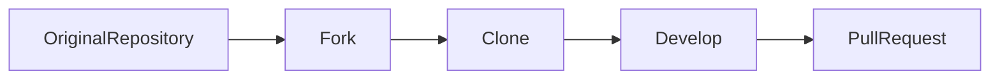
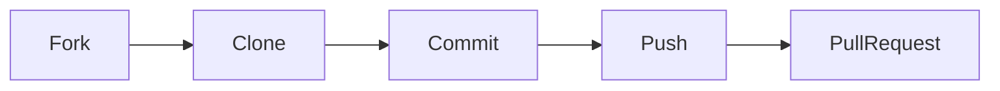
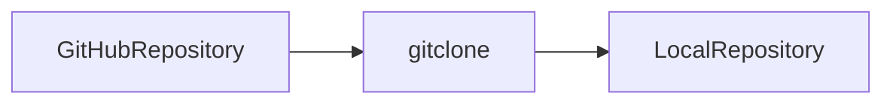
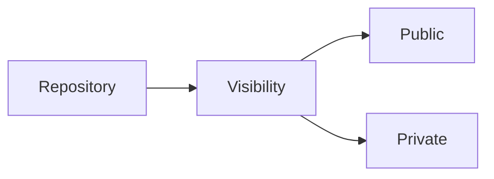
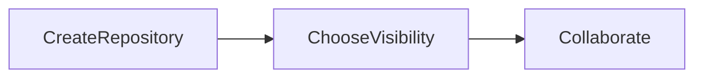

# GitHub Fundamentals

## Overview

GitHub is a cloud-based platform that hosts Git repositories and provides collaboration features such as Pull Requests, Issues, Actions, Projects, Code Reviews, and Security Scanning.

Git is the version control system, while GitHub is a platform built around Git that enables teams to collaborate efficiently.

> **Interview Point**
>
> **Git and GitHub are not the same.**
>
> - **Git** = Distributed Version Control System (DVCS)
> - **GitHub** = Cloud platform for hosting and collaborating on Git repositories

---

## Why It Is Used

GitHub is used to:

- Host Git repositories
- Collaborate with teams
- Perform code reviews
- Manage software projects
- Trigger CI/CD pipelines
- Track issues
- Share open-source projects
- Maintain project history

---

## Architecture / Working



---

## Key Components

| Component | Purpose |
|------------|----------|
| Repository | Stores project files and history |
| Branches | Parallel development |
| Pull Requests | Code review and merging |
| Issues | Bug and task tracking |
| Actions | CI/CD automation |
| Releases | Version management |
| Collaborators | Team access |

---

## Types

### Local Repository

Stored on the developer's machine.

### GitHub Repository

Hosted on GitHub servers.

---

## Lifecycle / Workflow



---

## Configuration / Syntax

Clone repository

```bash
git clone https://github.com/user/project.git
```

Push code

```bash
git push origin main
```

---

## Important Commands

```bash
git clone

git push

git pull

git fetch
```

---

## Important Files

| File | Purpose |
|------|---------|
| README.md | Project documentation |
| LICENSE | License information |
| .gitignore | Ignore unnecessary files |
| .github/ | GitHub workflows and templates |

---

## Real-World Use Cases

- Team collaboration
- DevOps automation
- Open-source development
- Infrastructure as Code
- CI/CD pipelines
- Portfolio hosting

---

## Advantages

- Cloud-hosted repositories
- Easy collaboration
- Integrated code review
- CI/CD support
- Security features
- Excellent version history

---

## Limitations

- Internet connection is required for synchronization
- Private repositories may require paid features for advanced capabilities
- Large binary files are not efficiently handled without Git LFS

---

## Common Interview Questions (Concept Only)

- What is GitHub?
- Difference between Git and GitHub?
- Why do organizations use GitHub?
- What features does GitHub provide?
- Can Git work without GitHub?

---

## Common Mistakes

- Confusing Git with GitHub
- Pushing sensitive files
- Ignoring `.gitignore`
- Working directly on the main branch

---

## Troubleshooting

| Problem | Solution |
|----------|----------|
| Authentication failed | Verify SSH keys or Personal Access Token (PAT) |
| Push rejected | Pull the latest changes or resolve conflicts before pushing |
| Repository not found | Verify the repository URL and your access permissions |

---

## Summary

GitHub is a collaboration platform built on Git. It provides repository hosting, code review, automation, and project management features essential for modern software development and DevOps.

---

# GitHub Repositories

## Overview

A GitHub Repository is a cloud-hosted Git repository that stores:

- Source code
- Commit history
- Branches
- Tags
- Releases
- Documentation
- Issues
- Pull Requests

Every repository has a unique URL.

---

## Why It Is Used

Repositories provide:

- Centralized collaboration
- Version history
- Code sharing
- Backup
- CI/CD integration

---

## Architecture / Working



---

## Key Components

| Component | Purpose |
|------------|----------|
| Repository Name | Project identifier |
| Branches | Parallel development |
| Commits | History |
| Pull Requests | Code review |
| Issues | Work tracking |
| Releases | Software versions |

---

## Types

### Personal Repository

Owned by an individual.

### Organization Repository

Owned by an organization.

---

## Lifecycle / Workflow


---

## Configuration / Syntax

Clone

```bash
git clone https://github.com/user/repository.git
```

Push

```bash
git push origin main
```

---

## Important Commands

```bash
git clone

git push

git pull
```

---

## Important Files

| File | Purpose |
|------|---------|
| README.md | Project overview |
| LICENSE | Software license |
| .gitignore | Ignore files |

---

## Real-World Use Cases

- Enterprise applications
- Infrastructure repositories
- DevOps projects
- Open-source software

---

## Advantages

- Easy collaboration
- Complete history
- Cloud backup

---

## Limitations

- Requires appropriate access permissions
- Very large repositories may impact clone and fetch performance

---

## Common Interview Questions (Concept Only)

- What is a GitHub repository?
- What does a repository contain?
- Difference between local and GitHub repositories?

---

## Common Mistakes

- Storing secrets in repositories
- Missing README documentation
- Poor repository organization

---

## Troubleshooting

| Problem | Solution |
|----------|----------|
| Cannot access repository | Verify permissions and repository URL |
| Clone fails | Check network connectivity and authentication |

---

## Summary

GitHub repositories are the primary storage unit for projects, providing collaboration, version control, and automation capabilities.

---

# Public vs Private Repositories

## Overview

GitHub repositories can be:

- Public
- Private

The visibility determines who can access the repository.

---

## Why It Is Used

Visibility settings help organizations:

- Protect source code
- Share open-source projects
- Control collaboration

---

## Architecture / Working



---

## Key Components

| Repository Type | Visibility |
|-----------------|------------|
| Public | Accessible to everyone |
| Private | Accessible only to authorized users |

---

## Types

### Public Repository

Anyone can:

- View
- Clone
- Fork (if allowed)

Typically used for:

- Open source
- Portfolios
- Learning

---

### Private Repository

Only authorized users can:

- View
- Clone
- Push
- Pull

Typically used for:

- Enterprise applications
- Internal tools
- Proprietary code

---

## Real-World Use Cases

Public

- Open-source libraries
- Documentation
- Personal portfolio

Private

- Banking software
- Company applications
- DevOps infrastructure
- Internal automation

---

## Advantages

| Public | Private |
|---------|----------|
| Community contributions | Better security |
| Visibility | Controlled access |
| Portfolio showcase | Protects intellectual property |

---

## Limitations

| Public | Private |
|---------|----------|
| Code is visible to everyone | Limited community visibility |
| Secrets must never be committed | External contributions require explicit access |

---

## Common Interview Questions (Concept Only)

- Difference between public and private repositories?
- When should a private repository be used?
- Can private repositories be shared with collaborators?

---

## Common Mistakes

- Accidentally publishing confidential repositories
- Committing sensitive information to public repositories
- Assuming private repositories cannot be cloned by authorized users

---

## Troubleshooting

| Problem | Solution |
|----------|----------|
| Repository unexpectedly visible | Review the repository visibility settings |
| Collaborator cannot access | Verify permissions and invitations |

---

## Summary

Choose public repositories for open collaboration and private repositories for confidential or enterprise projects.

---

# Fork

## Overview

A Fork creates a personal copy of another user's GitHub repository under your own GitHub account.

The fork remains linked to the original repository, allowing you to receive updates and submit Pull Requests.

> **Interview Point**
>
> **Fork ≠ Clone**
>
> - **Fork** creates a new GitHub repository under your account.
> - **Clone** copies an existing repository to your local machine.

---

## Why It Is Used

Forking allows developers to:

- Contribute to open-source projects
- Experiment safely
- Submit Pull Requests
- Maintain independent copies

---

## Architecture / Working



---

## Key Components

| Component | Purpose |
|------------|----------|
| Original Repository | Source project |
| Fork | Personal GitHub copy |
| Pull Request | Submit changes back |

---

## Lifecycle / Workflow



---

## Configuration / Syntax

Clone your fork

```bash
git clone https://github.com/yourname/project.git
```

---

## Important Commands

```bash
git clone

git remote

git push
```

---

## Real-World Use Cases

- Open-source contributions
- Learning projects
- Personal experiments
- Community development

---

## Advantages

- Safe experimentation
- Independent development
- Supports open-source workflows

---

## Limitations

- Forks do not automatically stay synchronized with the original repository
- Additional remote configuration is often required to keep the fork updated

---

## Common Interview Questions (Concept Only)

- What is a fork?
- Difference between fork and clone?
- Why are forks used in open-source development?

---

## Common Mistakes

- Assuming a fork automatically updates from the original repository
- Confusing a fork with a local clone

---

## Troubleshooting

| Problem | Solution |
|----------|----------|
| Fork is outdated | Fetch changes from the original repository and synchronize the fork |
| Pull Request shows conflicts | Update your fork before creating the Pull Request |

---

## Summary

Forking creates an independent GitHub repository linked to the original project, making it the standard workflow for open-source contributions.

---

# Clone

## Overview

Cloning creates a complete copy of a Git repository on the local machine.

A cloned repository contains:

- Source code
- Complete commit history
- Branches
- Tags
- Remote configuration

> **Interview Point**
>
> `git clone` downloads the **entire repository**, not just the latest files.

---

## Why It Is Used

Developers clone repositories to:

- Start development
- Review code
- Build applications
- Contribute to projects

---

## Architecture / Working



---

## Key Components

| Component | Purpose |
|------------|----------|
| Remote Repository | Source |
| Local Repository | Destination |

---

## Lifecycle / Workflow


---

## Configuration / Syntax

Clone repository

```bash
git clone https://github.com/user/project.git
```

Clone into a custom directory

```bash
git clone https://github.com/user/project.git my-project
```

---

## Important Commands

```bash
git clone
```

---

## Important Files

| File | Purpose |
|------|---------|
| `.git/config` | Stores remote configuration |

---

## Real-World Use Cases

- New developer onboarding
- CI/CD agents
- Infrastructure repositories
- Local development

---

## Advantages

- Complete project history
- Easy setup
- Full offline capabilities after cloning

---

## Limitations

- Large repositories can take longer to clone and consume more disk space

---

## Common Interview Questions (Concept Only)

- What does `git clone` do?
- What information is downloaded during a clone?
- Difference between clone and fork?

---

## Common Mistakes

- Cloning the wrong repository
- Assuming cloning creates a GitHub fork

---

## Troubleshooting

| Problem | Solution |
|----------|----------|
| Clone fails | Verify repository URL and authentication |
| Permission denied | Check SSH keys or Personal Access Token (PAT) configuration |

---

## Summary

Cloning downloads a complete Git repository to a local machine, allowing developers to work independently while maintaining synchronization with the remote repository.

---

# Repository Visibility

## Overview

Repository Visibility determines who can view and interact with a GitHub repository.

Visibility settings are fundamental for security and collaboration.

---

## Why It Is Used

Organizations use visibility controls to:

- Protect intellectual property
- Control collaboration
- Manage open-source contributions
- Meet compliance requirements

---

## Architecture / Working



---

## Key Components

| Component | Purpose |
|------------|----------|
| Public | Visible to everyone |
| Private | Visible only to authorized users |
| Collaborators | Users granted repository access |

---

## Types

### Public

Anyone can view and clone the repository.

### Private

Only authorized users can access the repository.

---

## Lifecycle / Workflow



---

## Real-World Use Cases

- Enterprise source code
- Open-source projects
- Internal DevOps repositories
- Public documentation

---

## Advantages

- Strong access control
- Flexible collaboration
- Improved security

---

## Limitations

- Changing visibility may affect existing workflows and external integrations
- Public repositories require careful handling of sensitive information

---

## Common Interview Questions (Concept Only)

- What is repository visibility?
- How do public and private repositories differ?
- When should repository visibility be changed?

---

## Common Mistakes

- Accidentally exposing confidential repositories
- Assuming public repositories protect sensitive data
- Forgetting to review repository access after changing visibility

---

## Troubleshooting

| Problem | Solution |
|----------|----------|
| Unexpected repository access | Review visibility settings and collaborator permissions |
| Sensitive code exposed | Change visibility if appropriate, rotate exposed secrets, and remove sensitive data from repository history if necessary |

---

## Summary

Repository visibility controls who can access a GitHub repository. Selecting the appropriate visibility level is a key part of secure software development and collaboration.
