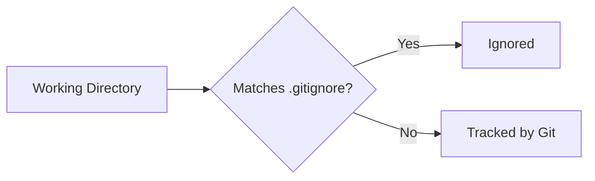
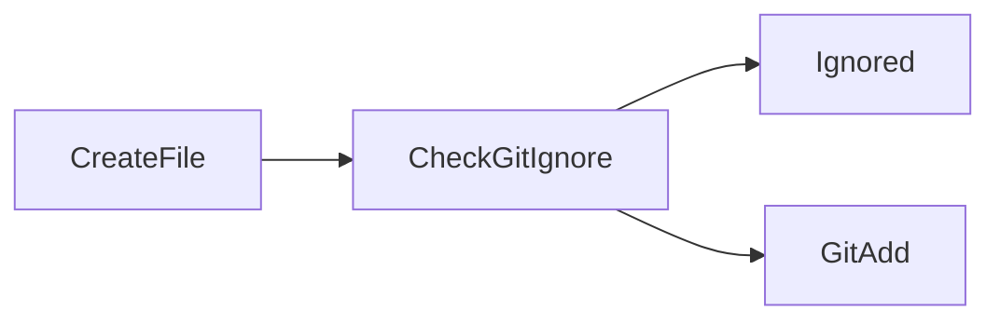
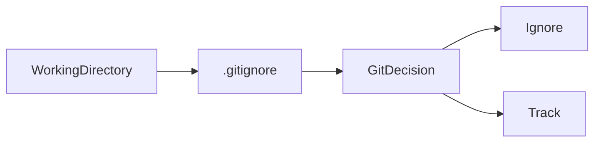

# Ignoring Files

## Overview

Git tracks files in a repository by default unless they are explicitly ignored. Ignoring files prevents unnecessary, temporary, generated, or sensitive files from being added to the repository.

Git uses the **`.gitignore`** file to determine which files and directories should not be tracked.

Ignoring files is an essential practice in professional software development because it keeps repositories clean, reduces repository size, and prevents accidental exposure of sensitive information.

> **Interview Point**
>
> **`.gitignore` only affects untracked files.**
>
> If a file is already tracked by Git, adding it to `.gitignore` **does not stop Git from tracking it**.

---

## Why It Is Used

Ignoring files helps developers:

- Prevent temporary files from being committed
- Exclude build artifacts
- Ignore IDE configuration files
- Exclude operating system files
- Prevent accidental commits of secrets
- Keep repositories clean
- Improve collaboration

---

## Architecture / Working



---

## Key Components

| Component | Purpose |
|------------|----------|
| `.gitignore` | Repository-specific ignore rules |
| Global Ignore File | Ignore rules for all repositories |
| Ignore Pattern | Defines ignored files or folders |
| Tracked File | Already managed by Git |
| Untracked File | Can be ignored |

---

## Types

### Repository Ignore

Rules stored inside:

```text
.gitignore
```

Applies only to the current repository.

---

### Global Ignore

Applies to every Git repository on the local machine.

---

## Lifecycle / Workflow



---

## Configuration / Syntax

Ignore a file

```text
secret.txt
```

Ignore all log files

```text
*.log
```

Ignore build directory

```text
build/
```

Ignore environment files

```text
.env
```

Ignore IDE files

```text
.vscode/
.idea/
```

---

## Important Commands

```bash
git status

git check-ignore

git rm --cached

git config
```

---

## Important Files

| File | Purpose |
|------|---------|
| `.gitignore` | Repository ignore rules |
| `~/.gitignore_global` | Global ignore rules |
| `.git/config` | Repository configuration |
| `~/.gitconfig` | Global Git configuration |

---

## Real-World Use Cases

- Ignore compiled binaries
- Ignore Docker build output
- Ignore Terraform state files
- Ignore Python virtual environments
- Ignore Node.js dependencies (when appropriate)
- Ignore IDE configuration files
- Ignore environment variable files
- Ignore application logs

---

## Advantages

- Cleaner repositories
- Smaller repository size
- Prevents accidental commits
- Better collaboration
- Improved security

---

## Limitations

- Does not affect files already tracked by Git
- Incorrect patterns may ignore required files
- Developers must maintain ignore rules

---

## Common Interview Questions (Concept Only)

- What is `.gitignore`?
- Why do we use `.gitignore`?
- Does `.gitignore` affect tracked files?
- How do you stop tracking an already tracked file?
- Difference between repository and global ignore files?

---

## Common Mistakes

- Adding `.env` after it has already been committed
- Ignoring important project files
- Forgetting to commit the `.gitignore` file
- Assuming ignored files are removed from Git history

---

## Troubleshooting

| Problem | Solution |
|----------|----------|
| Ignored file still appears | Check whether the file is already tracked |
| Wrong files ignored | Review the ignore patterns carefully |
| `.gitignore` not working | Verify the file location and syntax |
| Previously committed file still tracked | Remove it from the index using `git rm --cached` |

---

## Summary

Ignoring files is an essential Git practice that keeps repositories clean, secure, and efficient by preventing unnecessary files from being tracked.

---

# .gitignore

## Overview

`.gitignore` is a text file that defines patterns for files and directories Git should ignore.

Each Git repository typically contains one `.gitignore` file in its root directory.

> **Interview Point**
>
> `.gitignore` is **not mandatory**, but nearly every production repository includes one.

---

## Why It Is Used

Developers use `.gitignore` to exclude:

- Build artifacts
- Temporary files
- Cache files
- Logs
- Secrets
- IDE settings
- Operating system files

---

## Architecture / Working



---

## Key Components

| Pattern | Meaning |
|----------|----------|
| `*.log` | Ignore all log files |
| `build/` | Ignore directory |
| `.env` | Ignore environment file |
| `!README.md` | Do not ignore README |

---

## Types

### File Pattern

```text
*.log
```

---

### Directory Pattern

```text
node_modules/
```

---

### Specific File

```text
secret.txt
```

---

### Exception Pattern

```text
!important.txt
```

---

## Lifecycle / Workflow


---

## Configuration / Syntax

Ignore logs

```text
*.log
```

Ignore Python cache

```text
__pycache__/
```

Ignore virtual environment

```text
venv/
```

Ignore environment variables

```text
.env
```

Ignore VS Code settings

```text
.vscode/
```

Ignore IntelliJ files

```text
.idea/
```

---

## Important Commands

View ignored files

```bash
git status --ignored
```

Check ignore rule

```bash
git check-ignore filename
```

Remove tracked file while keeping it locally

```bash
git rm --cached filename
```

---

## Important Files

| File | Purpose |
|------|---------|
| `.gitignore` | Repository ignore rules |

---

## Real-World Use Cases

### Java

```text
target/
```

### Node.js

```text
node_modules/
```

### Python

```text
venv/
```

### Terraform

```text
*.tfstate
```

### Docker

```text
*.tar
```

---

## Advantages

- Easy configuration
- Pattern-based
- Repository-specific
- Prevents accidental commits

---

## Limitations

- Does not remove tracked files
- Poor patterns can hide important files

---

## Common Interview Questions (Concept Only)

- What is `.gitignore`?
- How do wildcard patterns work?
- How do you ignore an entire directory?
- Can ignored files be committed?

---

## Common Mistakes

- Incorrect wildcard usage
- Ignoring configuration required by the application
- Forgetting to remove tracked files before relying on `.gitignore`

---

## Troubleshooting

| Problem | Solution |
|----------|----------|
| Ignore rule not working | Verify pattern syntax and file location |
| Tracked file still visible | Remove it from the index with `git rm --cached` |
| Wrong file ignored | Use `git check-ignore` to determine which rule matched |

---

## Summary

`.gitignore` is the standard mechanism for excluding unnecessary or sensitive files from a Git repository.

---

# Global Ignore Files

## Overview

A Global Ignore File contains ignore rules that apply to **every Git repository** on the local machine.

Instead of repeating common ignore rules in every project, developers define them once.

Typical examples include:

- Operating system files
- Editor settings
- IDE metadata
- Temporary files

> **Interview Point**
>
> Repository-specific `.gitignore` files affect only one repository, while a Global Ignore File affects all repositories for the current user.

---

## Why It Is Used

Global ignore files eliminate repetitive ignore rules for files that should never be tracked regardless of the project.

Examples include:

- `.DS_Store`
- `Thumbs.db`
- `.swp`
- `.idea`
- `.vscode`

---

## Architecture / Working


---

## Key Components

| Component | Purpose |
|------------|----------|
| Global Ignore File | Shared ignore rules |
| Git Configuration | Points Git to the global ignore file |

---

## Types

### User Global Ignore

Applies to all repositories owned by the current user.

---

### Repository Ignore

Applies only to one repository.

---

## Lifecycle / Workflow


---

## Configuration / Syntax

Create the global ignore file

```bash
touch ~/.gitignore_global
```

Configure Git to use it

```bash
git config --global core.excludesfile ~/.gitignore_global
```

Example:

```text
.DS_Store

Thumbs.db

*.swp

.idea/

.vscode/
```

Verify the configuration

```bash
git config --global --get core.excludesfile
```

---

## Important Commands

```bash
git config --global core.excludesfile

git config --global --get core.excludesfile
```

---

## Important Files

| File | Purpose |
|------|---------|
| `~/.gitignore_global` | Global ignore rules |
| `~/.gitconfig` | Stores the global ignore configuration |

---

## Real-World Use Cases

- Ignore macOS files
- Ignore Windows files
- Ignore Vim swap files
- Ignore IDE metadata
- Ignore editor backups
- Standardize developer environments

---

## Advantages

- One-time configuration
- Reduces duplicated ignore rules
- Consistent behavior across repositories
- Cleaner project-specific `.gitignore` files

---

## Limitations

- Applies only to the local machine
- Other developers do not automatically receive the same global ignore rules
- Not suitable for project-specific ignore requirements

---

## Common Interview Questions (Concept Only)

- What is a Global Ignore File?
- How is it different from `.gitignore`?
- Where is the Global Ignore File configured?
- When should a Global Ignore File be used?

---

## Common Mistakes

- Placing project-specific rules in the Global Ignore File
- Forgetting to configure `core.excludesfile`
- Assuming the Global Ignore File is shared with teammates

---

## Troubleshooting

| Problem | Solution |
|----------|----------|
| Global ignore not working | Verify the configured path using `git config --global --get core.excludesfile` |
| Rule not applied | Ensure the file is untracked and the pattern is correct |
| Tracked file still appears | Remove it from the Git index using `git rm --cached` |

---

## Summary

Global Ignore Files simplify Git configuration by applying common ignore rules across all local repositories, while project-specific rules remain in `.gitignore`. Using both appropriately keeps repositories clean, secure, and easy to maintain.
