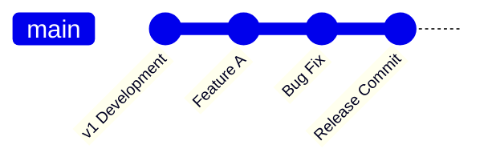
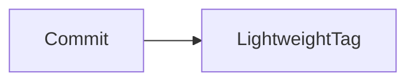
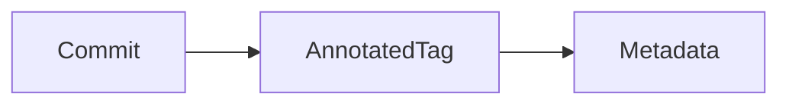
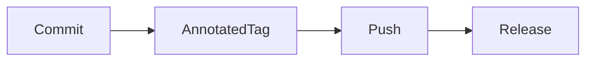
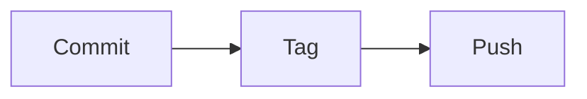
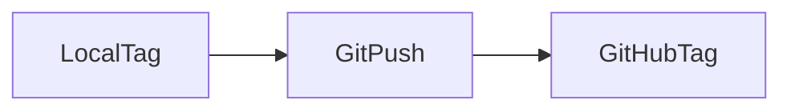
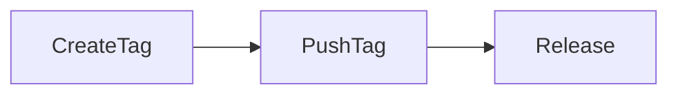

# Tags

## Overview

A **Git Tag** is a named reference that points to a specific commit in the repository. Tags are commonly used to mark important milestones such as software releases, production deployments, and version numbers.

Unlike branches, tags are **static** and do not move when new commits are added.

> **Interview Point**
>
> **Branches move; Tags do not.**
>
> - **Branch** → Moves to the latest commit.
> - **Tag** → Permanently points to a specific commit.

---

## Why It Is Used

Tags are used to:

- Mark software releases
- Version applications
- Identify production deployments
- Roll back to stable versions
- Simplify release management
- Integrate with CI/CD pipelines

---

## Architecture / Working



```text
                 v1.0.0 (Tag)
                    │
                    ▼
Commit1 ── Commit2 ── Commit3 ── Commit4
                              ▲
                           main branch
```

The **main branch** continues moving forward, while the **tag always points to Commit3**.

---

## Key Components

| Component | Purpose |
|------------|----------|
| Tag Name | Version identifier |
| Commit | Commit referenced by the tag |
| Lightweight Tag | Simple reference |
| Annotated Tag | Stores additional metadata |

---

## Types

### Lightweight Tag

Simple pointer to a commit.

No metadata is stored.

Example:

```text
v1.0
```

---

### Annotated Tag

Stores additional information such as:

- Author
- Email
- Date
- Message

Recommended for production releases.

---

## Lifecycle / Workflow


---

## Configuration / Syntax

Create lightweight tag

```bash
git tag v1.0
```

Create annotated tag

```bash
git tag -a v1.0 -m "First production release"
```

List tags

```bash
git tag
```

View tag details

```bash
git show v1.0
```

Delete local tag

```bash
git tag -d v1.0
```

Delete remote tag

```bash
git push origin --delete v1.0
```

---

## Important Commands

```bash
git tag

git show

git push origin <tag>

git push --tags

git tag -d

git push origin --delete
```

---

## Important Files

| File | Purpose |
|------|---------|
| `.git/refs/tags/` | Stores local tag references |
| `.git/packed-refs` | Stores packed tag references in optimized format |

---

## Real-World Use Cases

- Production releases
- Version management
- CI/CD deployments
- Hotfix releases
- Rollback points
- Software distribution

---

## Advantages

- Easy version identification
- Permanent reference to commits
- Supports release automation
- Simplifies deployments
- Works well with CI/CD

---

## Limitations

- Tags do not update automatically
- Renaming a tag requires deleting and recreating it
- Pushing tags is a separate step from pushing commits

---

## Common Interview Questions (Concept Only)

- What is a Git tag?
- Why are tags used?
- Difference between branches and tags?
- Difference between lightweight and annotated tags?
- Are tags automatically pushed?

---

## Common Mistakes

- Forgetting to push tags
- Using lightweight tags for production releases
- Assuming tags move like branches
- Deleting tags without updating remote repositories

---

## Troubleshooting

| Problem | Solution |
|----------|----------|
| Tag not visible on GitHub | Push the tag using `git push origin <tag>` or `git push --tags` |
| Wrong tag created | Delete the incorrect tag and recreate it |
| Tag points to wrong commit | Delete the tag and create it again at the correct commit |
| Remote tag still exists | Delete the remote tag separately using `git push origin --delete <tag>` |

---

## Summary

Git Tags provide permanent references to important commits and are widely used for release management, versioning, and production deployments.

---

# Lightweight Tags

## Overview

A **Lightweight Tag** is simply a named pointer to a commit.

It stores **no additional metadata**.

Internally, it behaves similarly to a branch reference that never moves.

> **Interview Point**
>
> Lightweight tags are best suited for **temporary or personal use**, not official releases.

---

## Why It Is Used

Developers use lightweight tags to:

- Mark temporary checkpoints
- Save testing versions
- Quickly identify commits
- Bookmark development milestones

---

## Architecture / Working



---

## Key Components

| Component | Purpose |
|------------|----------|
| Tag Name | Commit label |
| Commit | Referenced commit |

---

## Lifecycle / Workflow


---

## Configuration / Syntax

Create lightweight tag

```bash
git tag v1.0
```

List tags

```bash
git tag
```

View referenced commit

```bash
git show v1.0
```

---

## Important Commands

```bash
git tag

git show
```

---

## Real-World Use Cases

- Temporary checkpoints
- Local testing
- Quick commit references

---

## Advantages

- Simple
- Fast
- Minimal storage

---

## Limitations

- No author information
- No creation date
- No tag message
- Not recommended for production releases

---

## Common Interview Questions (Concept Only)

- What is a Lightweight Tag?
- When should Lightweight Tags be used?

---

## Common Mistakes

- Using Lightweight Tags for official software releases
- Assuming they store metadata

---

## Troubleshooting

| Problem | Solution |
|----------|----------|
| Missing release information | Use an Annotated Tag instead |

---

## Summary

Lightweight Tags are simple commit references suitable for temporary development checkpoints.

---

# Annotated Tags

## Overview

An **Annotated Tag** stores metadata in addition to the commit reference.

It includes:

- Tag name
- Author
- Email
- Date
- Tag message

This is the recommended tag type for production releases.

> **Interview Point**
>
> Most organizations use **Annotated Tags** for versioning because they provide complete release metadata.

---

## Why It Is Used

Annotated Tags support:

- Software releases
- Release notes
- CI/CD automation
- Version tracking
- Auditing

---

## Architecture / Working



---

## Key Components

| Component | Purpose |
|------------|----------|
| Tag Name | Version |
| Message | Release description |
| Author | Creator |
| Timestamp | Creation time |

---

## Lifecycle / Workflow



---

## Configuration / Syntax

Create annotated tag

```bash
git tag -a v2.0 -m "Production Release"
```

Display details

```bash
git show v2.0
```

---

## Important Commands

```bash
git tag -a

git show
```

---

## Real-World Use Cases

- Production releases
- Enterprise deployments
- Version management
- CI/CD pipelines

---

## Advantages

- Metadata support
- Better auditing
- Official release management
- Supports signed tags

---

## Limitations

- Slightly more verbose than Lightweight Tags
- Requires a tag message

---

## Common Interview Questions (Concept Only)

- What is an Annotated Tag?
- Why are Annotated Tags preferred?
- What metadata is stored?

---

## Common Mistakes

- Forgetting the `-a` option
- Using Lightweight Tags for production releases

---

## Troubleshooting

| Problem | Solution |
|----------|----------|
| Metadata missing | Recreate the tag as an Annotated Tag |

---

## Summary

Annotated Tags are the standard choice for production versioning because they preserve important release metadata.

---

# Create Tags

## Overview

Creating a tag assigns a permanent name to a specific commit.

Tags can be created:

- On the latest commit
- On any previous commit

---

## Why It Is Used

Developers create tags to:

- Mark releases
- Identify stable versions
- Support deployments
- Track milestones

---

## Architecture / Working


---

## Key Components

| Component | Purpose |
|------------|----------|
| Commit | Target commit |
| Tag | Permanent reference |

---

## Lifecycle / Workflow



---

## Configuration / Syntax

Tag latest commit

```bash
git tag v1.0
```

Tag specific commit

```bash
git tag v1.0 8b2f6c1
```

Annotated tag

```bash
git tag -a v1.0 -m "Release"
```

List tags

```bash
git tag
```

---

## Important Commands

```bash
git tag

git show
```

---

## Real-World Use Cases

- Application releases
- DevOps deployments
- Infrastructure versions

---

## Advantages

- Permanent reference
- Easy release tracking
- Supports automation

---

## Limitations

- Tags do not move automatically
- Incorrect tags require deletion and recreation

---

## Common Interview Questions (Concept Only)

- How do you create a tag?
- Can a tag point to an older commit?
- Can tags be edited?

---

## Common Mistakes

- Forgetting to push newly created tags
- Creating duplicate version names

---

## Troubleshooting

| Problem | Solution |
|----------|----------|
| Tag exists already | Delete it first or choose a different version name |

---

## Summary

Creating tags is a fundamental Git operation for versioning and release management.

---

# Push Tags

## Overview

Tags are **not automatically pushed** when running `git push`.

They must be pushed explicitly to the remote repository.

> **Interview Point**
>
> One of the most common interview questions:
>
> **Does `git push` push tags?**
>
> **Answer:** No. Tags must be pushed separately unless configured otherwise.

---

## Why It Is Used

Pushing tags ensures that:

- Team members can access releases
- CI/CD pipelines detect versions
- GitHub Releases can be created from tags
- Version history is shared

---

## Architecture / Working



---

## Key Components

| Component | Purpose |
|------------|----------|
| Local Tag | Exists only locally |
| Remote Tag | Shared on GitHub |

---

## Lifecycle / Workflow



---

## Configuration / Syntax

Push one tag

```bash
git push origin v1.0
```

Push all tags

```bash
git push origin --tags
```

Delete remote tag

```bash
git push origin --delete v1.0
```

---

## Important Commands

```bash
git push origin <tag>

git push --tags

git push origin --delete
```

---

## Real-World Use Cases

- Production deployments
- GitHub Releases
- CI/CD triggers
- Version publishing

---

## Advantages

- Shares version history
- Enables automated release workflows
- Supports collaborative development

---

## Limitations

- Tags must be pushed separately
- Remote tag deletion requires an explicit command

---

## Common Interview Questions (Concept Only)

- How do you push a tag?
- How do you push all tags?
- Are tags automatically pushed?
- How do you delete a remote tag?

---

## Common Mistakes

- Forgetting to push tags after creating them
- Assuming `git push` uploads tags
- Deleting only the local tag while leaving the remote tag intact

---

## Troubleshooting

| Problem | Solution |
|----------|----------|
| Tag missing on GitHub | Push it using `git push origin <tag>` or `git push origin --tags` |
| Wrong tag on remote | Delete the remote tag and push the corrected version |
| CI/CD not triggered | Verify that the tag exists on the remote repository and that the pipeline is configured to trigger on tags |

---

## Summary

Pushing tags is a separate operation from pushing commits. Sharing tags enables consistent versioning, release management, and CI/CD automation across the team.
