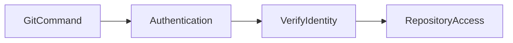
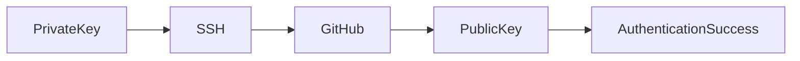
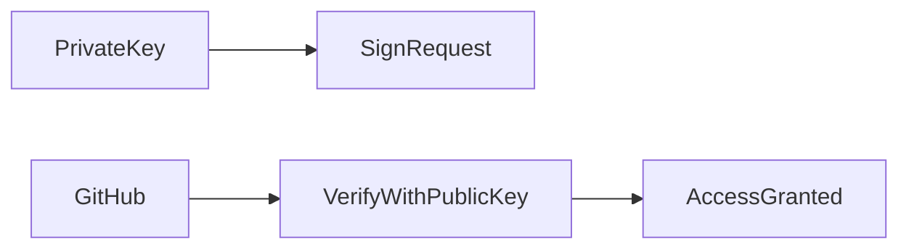
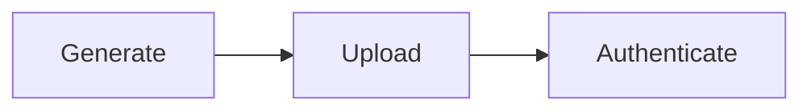

# Authentication

## Overview

Authentication is the process of verifying the identity of a user before allowing access to a Git repository.

When interacting with remote repositories (GitHub, Azure Repos, GitLab, Bitbucket, etc.), Git requires authentication for operations that modify the repository, such as:

- Push
- Pull (for private repositories)
- Clone (private repositories)
- Create tags
- Delete branches

Authentication ensures that only authorized users can access or modify repository contents.

> **Interview Point**
>
> Authentication verifies **who you are**, while Authorization determines **what you are allowed to do**.

> **Interview Point**
>
> Git itself does **not** authenticate users. Authentication is handled by the remote Git hosting service (GitHub, Azure Repos, GitLab, etc.).

---

## Why It Is Used

Authentication is used to:

- Secure repositories
- Prevent unauthorized access
- Protect source code
- Verify developer identity
- Enable secure collaboration
- Support CI/CD pipelines
- Protect enterprise repositories

---

## Architecture / Working


---

## Key Components

| Component | Purpose |
|------------|----------|
| Git Client | Sends authentication request |
| Authentication Method | HTTPS or SSH |
| Git Hosting Platform | Verifies identity |
| Credentials | PAT or SSH Key |
| Repository | Grants or denies access |

---

## Types

### HTTPS Authentication

Uses:

- Username
- Personal Access Token (PAT)

---

### SSH Authentication

Uses:

- Public Key
- Private Key

---

## Lifecycle / Workflow



---

## Configuration / Syntax

Clone using HTTPS

```bash
git clone https://github.com/user/project.git
```

Clone using SSH

```bash
git clone git@github.com:user/project.git
```

---

## Important Commands

```bash
git clone

git push

git pull

ssh

ssh-keygen
```

---

## Important Files

| File | Purpose |
|------|---------|
| `~/.gitconfig` | Git configuration |
| `~/.ssh/id_ed25519` | Private SSH key |
| `~/.ssh/id_ed25519.pub` | Public SSH key |
| `~/.ssh/config` | SSH client configuration |

---

## Real-World Use Cases

- Enterprise repositories
- Azure DevOps projects
- GitHub repositories
- CI/CD authentication
- Infrastructure as Code
- Automated deployments

---

## Advantages

- Secure access
- User verification
- Supports automation
- Multiple authentication methods

---

## Limitations

- Credentials must be managed securely
- Expired or revoked credentials can interrupt workflows
- Lost private SSH keys require regeneration

---

## Common Interview Questions (Concept Only)

- What is Git authentication?
- Difference between authentication and authorization?
- What authentication methods does GitHub support?
- Which authentication method is recommended?
- Can Git work without authentication?

---

## Common Mistakes

- Committing credentials to repositories
- Sharing Personal Access Tokens
- Sharing private SSH keys
- Using expired credentials
- Using HTTPS passwords instead of PATs

---

## Troubleshooting

| Problem | Solution |
|----------|----------|
| Authentication failed | Verify credentials or authentication method |
| Permission denied | Check repository permissions |
| Repository not found | Verify repository URL and access rights |
| Push rejected | Confirm authentication and authorization |

---

## Summary

Authentication secures Git operations by verifying user identity before granting repository access. The most common methods are HTTPS with Personal Access Tokens and SSH using key pairs.

---

# HTTPS Authentication

## Overview

HTTPS Authentication uses the HTTPS protocol to communicate with the remote repository.

Modern Git hosting platforms no longer accept account passwords for Git operations. Instead, they require a **Personal Access Token (PAT)**.

Typical workflow:

```text
Username + Personal Access Token
```

> **Interview Point**
>
> GitHub removed password authentication for Git operations in 2021. Use a Personal Access Token instead.

---

## Why It Is Used

HTTPS authentication is useful because:

- Easy to configure
- Works behind most firewalls
- No SSH configuration required
- Suitable for beginners
- Supported by all Git hosting platforms

---

## Architecture / Working


---

## Key Components

| Component | Purpose |
|------------|----------|
| HTTPS URL | Repository access |
| Username | Git hosting account |
| Personal Access Token | Authentication credential |

---

## Lifecycle / Workflow


---

## Configuration / Syntax

Clone repository

```bash
git clone https://github.com/user/project.git
```

Push changes

```bash
git push origin main
```

Git prompts for:

```text
Username

Personal Access Token
```

---

## Important Commands

```bash
git clone

git push

git pull
```

---

## Important Files

| File | Purpose |
|------|---------|
| `~/.gitconfig` | Git configuration |
| Git Credential Manager (optional) | Secure credential storage |

---

## Real-World Use Cases

- Enterprise development
- Azure DevOps
- GitHub
- GitLab
- CI/CD systems using PATs

---

## Advantages

- Simple setup
- Firewall-friendly
- Widely supported
- Easy to troubleshoot

---

## Limitations

- Requires secure storage of PATs
- Tokens expire or may need rotation
- Repeated prompts if credentials are not cached

---

## Common Interview Questions (Concept Only)

- What replaced GitHub passwords?
- Why is HTTPS authentication still widely used?
- Can HTTPS use passwords?

---

## Common Mistakes

- Using account passwords instead of PATs
- Hardcoding PATs into scripts
- Sharing PATs

---

## Troubleshooting

| Problem | Solution |
|----------|----------|
| Authentication failed | Verify PAT validity and permissions |
| Repeated credential prompts | Configure a credential manager or credential helper |
| Invalid token | Generate a new PAT with the required scopes |

---

## Summary

HTTPS Authentication uses Personal Access Tokens instead of passwords and remains a simple, widely supported method for accessing remote repositories.

---

# SSH Authentication

## Overview

SSH Authentication uses asymmetric cryptography instead of usernames and passwords.

A developer creates an SSH key pair:

- Public Key
- Private Key

The public key is uploaded to the Git hosting platform, while the private key remains on the developer's machine.

> **Interview Point**
>
> The **private key never leaves your computer**.

---

## Why It Is Used

SSH Authentication:

- Eliminates repeated password prompts
- Enables secure automation
- Provides strong cryptographic authentication
- Is widely used in enterprise environments

---

## Architecture / Working



---

## Key Components

| Component | Purpose |
|------------|----------|
| Private Key | Stored locally |
| Public Key | Uploaded to GitHub |
| SSH Agent | Manages loaded keys |

---

## Lifecycle / Workflow


---

## Configuration / Syntax

Clone repository

```bash
git clone git@github.com:user/project.git
```

Test authentication

```bash
ssh -T git@github.com
```

---

## Important Commands

```bash
ssh

ssh-keygen

ssh-add
```

---

## Important Files

| File | Purpose |
|------|---------|
| `~/.ssh/id_ed25519` | Private key |
| `~/.ssh/id_ed25519.pub` | Public key |
| `~/.ssh/config` | SSH configuration |

---

## Real-World Use Cases

- Enterprise development
- CI/CD agents
- Build servers
- Automation scripts
- Secure deployments

---

## Advantages

- Highly secure
- No password prompts
- Excellent for automation
- Industry standard

---

## Limitations

- Initial setup is more complex
- Private keys must be protected
- Lost private keys require generating a new key pair

---

## Common Interview Questions (Concept Only)

- What is SSH Authentication?
- Why is SSH preferred in enterprise environments?
- What is the difference between public and private keys?

---

## Common Mistakes

- Sharing private keys
- Uploading the private key instead of the public key
- Losing private keys without backups

---

## Troubleshooting

| Problem | Solution |
|----------|----------|
| Permission denied (publickey) | Verify that the correct public key is registered and the private key is loaded |
| SSH authentication fails | Test the connection with `ssh -T` and review SSH configuration |
| Wrong key used | Configure the correct identity in `~/.ssh/config` |

---

## Summary

SSH Authentication provides secure, password-free access using public/private key cryptography and is the preferred method for long-term development and automation.

---

# SSH Keys

## Overview

SSH Keys are a cryptographic key pair used for SSH Authentication.

Every key pair contains:

- Public Key
- Private Key

Authentication succeeds when the server verifies that the client possesses the matching private key.

---

## Why It Is Used

SSH Keys:

- Eliminate passwords
- Improve security
- Enable automation
- Support CI/CD pipelines
- Reduce credential management overhead

---

## Architecture / Working



---

## Key Components

| Component | Purpose |
|------------|----------|
| Public Key | Shared with Git hosting platform |
| Private Key | Secret key stored locally |
| SSH Agent | Loads and manages private keys |

---

## Types

### RSA

Older algorithm.

### ED25519

Modern, faster, and recommended for most use cases.

---

## Lifecycle / Workflow



---

## Configuration / Syntax

Generate key

```bash
ssh-keygen -t ed25519 -C "email@example.com"
```

Start SSH agent

```bash
eval "$(ssh-agent -s)"
```

Add private key

```bash
ssh-add ~/.ssh/id_ed25519
```

Display public key

```bash
cat ~/.ssh/id_ed25519.pub
```

---

## Important Commands

```bash
ssh-keygen

ssh-add

ssh-agent

cat
```

---

## Important Files

| File | Purpose |
|------|---------|
| `id_ed25519` | Private key |
| `id_ed25519.pub` | Public key |

---

## Real-World Use Cases

- GitHub
- Azure DevOps
- Linux servers
- CI/CD
- Infrastructure automation

---

## Advantages

- Secure authentication
- Password-free workflow
- Automation-friendly
- Industry standard

---

## Limitations

- Private keys must remain confidential
- Requires key management and rotation

---

## Common Interview Questions (Concept Only)

- What is an SSH Key?
- Difference between public and private keys?
- Where should the public key be uploaded?
- Which key type is recommended today?

---

## Common Mistakes

- Uploading the private key
- Sharing private keys
- Forgetting to add the key to the SSH agent

---

## Troubleshooting

| Problem | Solution |
|----------|----------|
| Key not recognized | Verify the public key is uploaded correctly |
| Agent not using key | Load the private key using `ssh-add` |
| Multiple keys present | Configure the desired key in `~/.ssh/config` |

---

## Summary

SSH Keys provide secure authentication using asymmetric cryptography and are the preferred authentication mechanism for professional Git workflows.

---

# Personal Access Tokens (PAT)

## Overview

A **Personal Access Token (PAT)** is a secure token used instead of an account password for HTTPS authentication.

PATs are generated from the Git hosting platform and can be limited to specific permissions (scopes) and expiration dates.

> **Interview Point**
>
> **PATs replace passwords** for HTTPS-based Git authentication.

---

## Why It Is Used

PATs provide:

- Secure authentication
- Granular permissions
- Token expiration
- Revocation capability
- Support for automation

---

## Architecture / Working


---

## Key Components

| Component | Purpose |
|------------|----------|
| Token | Authentication credential |
| Scope | Defines allowed operations |
| Expiration | Limits token lifetime |

---

## Types

### Fine-Grained PAT

- Repository-specific
- Least-privilege permissions
- Recommended for GitHub

### Classic PAT

- Broader permissions
- Used for compatibility with older workflows

---

## Lifecycle / Workflow


---

## Configuration / Syntax

Example HTTPS clone

```bash
git clone https://github.com/user/project.git
```

When prompted:

```text
Username: your_username

Password: <Personal Access Token>
```

---

## Important Commands

Git itself has no dedicated PAT command. PATs are generated and managed through the Git hosting platform and then used with standard Git commands:

```bash
git clone

git pull

git push
```

---

## Important Files

| File | Purpose |
|------|---------|
| Credential Manager storage (platform dependent) | Securely stores PATs |
| `~/.gitconfig` | Credential helper configuration |

---

## Real-World Use Cases

- GitHub HTTPS authentication
- Azure DevOps authentication
- CI/CD pipelines
- Automated deployments
- Scripts and integrations

---

## Advantages

- More secure than passwords
- Fine-grained permissions
- Easy to revoke
- Supports automation
- Expiration improves security

---

## Limitations

- Tokens expire
- Must be stored securely
- Compromised tokens should be revoked immediately

---

## Common Interview Questions (Concept Only)

- What is a Personal Access Token?
- Why did GitHub replace passwords with PATs?
- What are PAT scopes?
- When should PATs be rotated?
- Difference between Fine-Grained and Classic PATs?

---

## Common Mistakes

- Committing PATs to repositories
- Sharing PATs with teammates
- Creating tokens with excessive permissions
- Forgetting to rotate or revoke unused tokens

---

## Troubleshooting

| Problem | Solution |
|----------|----------|
| Authentication failed | Verify the PAT is valid and has the required scopes |
| Token expired | Generate a new PAT and update stored credentials |
| Permission denied | Ensure the PAT includes the necessary repository permissions |
| PAT exposed | Revoke it immediately and create a replacement token |

---

## Summary

Personal Access Tokens are the standard authentication mechanism for HTTPS Git operations. They provide secure, permission-based access and are widely used for both interactive development and automation.
