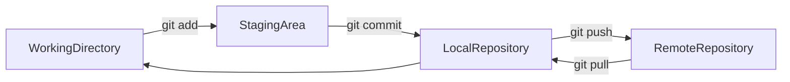
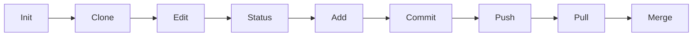

# Essential Git Commands

## Overview

Git provides a rich set of commands for managing source code, collaborating with teams, and maintaining project history.

These commands cover the complete Git workflow:

- Repository initialization
- Configuration
- Version control
- Branching
- Collaboration
- Undoing changes
- Remote repository management
- Release management

> **Interview Point**
>
> Nearly every Git interview revolves around these core commands. Understanding **when to use each command** is more important than memorizing the syntax.

---

## Why It Is Used

Essential Git commands help developers:

- Track source code changes
- Collaborate with teams
- Maintain version history
- Resolve conflicts
- Manage releases
- Support CI/CD pipelines

---

## Architecture / Working



---

## Key Components

| Component | Purpose |
|------------|----------|
| Working Directory | Current project files |
| Staging Area | Files prepared for commit |
| Local Repository | Commit history |
| Remote Repository | Shared repository |

---

## Types (if applicable)

Git commands are commonly grouped into:

| Category | Examples |
|----------|-----------|
| Configuration | `git config` |
| Repository | `git init`, `git clone` |
| Tracking Changes | `git status`, `git add`, `git commit` |
| History | `git log`, `git diff`, `git show` |
| Branching | `git branch`, `git switch`, `git checkout`, `git merge` |
| Remote | `git remote`, `git fetch`, `git pull`, `git push` |
| Undo | `git restore`, `git reset`, `git revert` |
| Release | `git tag` |

---

## Lifecycle / Workflow



---

## Configuration / Syntax (if applicable)

```bash
git <command> [options]
```

Example

```bash
git status

git add .

git commit -m "Added login feature"
```

---

## Important Commands (if applicable)

```bash
git config
git init
git clone
git status
git add
git commit
git log
git diff
git show
git branch
git switch
git checkout
git merge
git remote
git fetch
git pull
git push
git restore
git reset
git revert
git tag
```

---

## Important Files (if applicable)

| File | Purpose |
|------|---------|
| `.git/config` | Repository configuration |
| `.git/HEAD` | Current branch reference |
| `.git/index` | Staging Area |
| `.gitignore` | Ignore rules |

---

## Real-World Use Cases

- Team collaboration
- Version control
- Feature development
- CI/CD
- Infrastructure as Code
- Production releases

---

## Advantages

- Distributed version control
- Complete history
- Fast collaboration
- Easy rollback
- Supports automation

---

## Limitations

- Learning curve for beginners
- Incorrect use of history-rewriting commands can affect collaboration
- Merge conflicts require manual resolution

---

## Common Interview Questions (Concept Only)

- What are the most important Git commands?
- Describe the Git workflow.
- Which commands are used most frequently?
- Difference between `git fetch` and `git pull`?
- Difference between `git reset` and `git revert`?

---

## Common Mistakes

- Committing directly to `main`
- Forgetting to pull before pushing
- Using `git reset --hard` carelessly
- Ignoring merge conflicts
- Poor commit messages

---

## Troubleshooting

| Problem | Solution |
|----------|----------|
| Authentication failed | Verify SSH keys or Personal Access Token |
| Merge conflicts | Resolve conflicts before completing the merge |
| Push rejected | Pull or fetch the latest changes first |
| Detached HEAD | Switch back to a branch using `git switch` or `git checkout` |

---

## Summary

These essential Git commands form the foundation of modern software development, DevOps workflows, and enterprise collaboration.

---

# git config

## Overview

Configures Git settings such as username, email, editor, default branch, and credential helper.

---

## Why It Is Used

- Configure user identity
- Set Git preferences
- Configure authentication helpers

---

## Configuration / Syntax

Set username

```bash
git config --global user.name "John Doe"
```

Set email

```bash
git config --global user.email "john@example.com"
```

View configuration

```bash
git config --list
```

---

## Important Commands

```bash
git config --global user.name
git config --global user.email
git config --list
```

---

## Common Interview Questions (Concept Only)

- Difference between global and local configuration?
- Where are Git configurations stored?

---

## Summary

Configures Git behavior and user identity.

---

# git init

## Overview

Creates a new Git repository by initializing the `.git` directory.

---

## Why It Is Used

- Start version control
- Create new repositories

---

## Configuration / Syntax

```bash
git init
```

---

## Important Files

| File | Purpose |
|------|---------|
| `.git/` | Repository metadata |

---

## Common Interview Questions (Concept Only)

- What does `git init` do?

---

## Summary

Initializes a new Git repository.

---

# git clone

## Overview

Downloads a complete copy of a remote repository.

---

## Why It Is Used

- Begin development
- Copy repositories
- Join projects

---

## Configuration / Syntax

```bash
git clone https://github.com/user/project.git
```

---

## Common Interview Questions (Concept Only)

- Difference between clone and fork?

---

## Summary

Creates a local copy of a remote repository.

---

# git status

## Overview

Displays the current repository status.

---

## Why It Is Used

Shows:

- Modified files
- Staged files
- Untracked files
- Current branch

---

## Configuration / Syntax

```bash
git status
```

---

## Common Interview Questions (Concept Only)

- What information does `git status` display?

---

## Summary

Displays the current working state of the repository.

---

# git add

## Overview

Moves changes from the Working Directory to the Staging Area.

---

## Why It Is Used

Prepares files for commit.

---

## Configuration / Syntax

Stage one file

```bash
git add app.py
```

Stage everything

```bash
git add .
```

---

## Common Interview Questions (Concept Only)

- What is the staging area?
- What does `git add` do?

---

## Summary

Stages files before committing.

---

# git commit

## Overview

Creates a snapshot of staged changes.

---

## Why It Is Used

- Save work
- Track history
- Enable rollback

---

## Configuration / Syntax

```bash
git commit -m "Added login feature"
```

---

## Common Interview Questions (Concept Only)

- What is a commit?
- What makes a good commit message?

---

## Summary

Stores a permanent snapshot of staged changes.

---

# git log

## Overview

Displays commit history.

---

## Why It Is Used

- Review changes
- Find commit IDs
- Audit history

---

## Configuration / Syntax

```bash
git log

git log --oneline
```

---

## Common Interview Questions (Concept Only)

- How do you view commit history?

---

## Summary

Shows repository history.

---

# git diff

## Overview

Shows differences between files, commits, or branches.

---

## Why It Is Used

- Review modifications
- Debug changes

---

## Configuration /Syntax

```bash
git diff

git diff HEAD
```

---

## Common Interview Questions (Concept Only)

- What does `git diff` compare?

---

## Summary

Displays file differences.

---

# git show

## Overview

Displays detailed information about commits, tags, or objects.

---

## Why It Is Used

- Inspect commits
- Review releases

---

## Configuration / Syntax

```bash
git show

git show HEAD
```

---

## Common Interview Questions (Concept Only)

- Difference between `git log` and `git show`?

---

## Summary

Displays commit details.

---

# git branch

## Overview

Creates, lists, renames, and deletes branches.

---

## Why It Is Used

Supports parallel development.

---

## Configuration / Syntax

List branches

```bash
git branch
```

Create branch

```bash
git branch feature-login
```

Delete branch

```bash
git branch -d feature-login
```

---

## Common Interview Questions (Concept Only)

- Why are branches important?

---

## Summary

Manages Git branches.

---

# git switch

## Overview

Switches between existing branches or creates and switches to a new branch.

Introduced to simplify branch switching without overloading `git checkout`.

---

## Why It Is Used

- Change branches
- Create new branches

---

## Configuration / Syntax

Switch

```bash
git switch main
```

Create and switch

```bash
git switch -c feature-login
```

---

## Common Interview Questions (Concept Only)

- Difference between `git switch` and `git checkout`?

---

## Summary

Modern command for branch switching.

---

# git checkout

## Overview

Older command used for switching branches and restoring files.

---

## Why It Is Used

- Switch branches
- Restore files
- Check out commits

---

## Configuration / Syntax

Switch branch

```bash
git checkout main
```

Create branch

```bash
git checkout -b feature-login
```

---

## Common Interview Questions (Concept Only)

- Why was `git switch` introduced?

---

## Summary

Traditional command for switching branches and restoring files.

---

# git merge

## Overview

Combines changes from one branch into another.

---

## Why It Is Used

Integrates completed work.

---

## Configuration / Syntax

```bash
git merge feature-login
```

---

## Common Interview Questions (Concept Only)

- What is a merge conflict?

---

## Summary

Integrates branch changes.

---

# git remote

## Overview

Manages remote repository connections.

---

## Why It Is Used

- View remotes
- Add remotes
- Remove remotes

---

## Configuration / Syntax

List remotes

```bash
git remote -v
```

Add remote

```bash
git remote add origin https://github.com/user/project.git
```

---

## Common Interview Questions (Concept Only)

- What is `origin`?

---

## Summary

Manages remote repositories.

---

# git fetch

## Overview

Downloads remote changes without merging them.

---

## Why It Is Used

Safely inspect remote updates.

---

## Configuration / Syntax

```bash
git fetch
```

---

## Common Interview Questions (Concept Only)

- Difference between fetch and pull?

---

## Summary

Downloads remote updates only.

---

# git pull

## Overview

Fetches and integrates remote changes into the current branch.

---

## Why It Is Used

Keeps local repositories synchronized.

---

## Configuration / Syntax

```bash
git pull origin main
```

---

## Common Interview Questions (Concept Only)

- What happens internally during `git pull`?

---

## Summary

Updates the local branch with remote changes.

---

# git push

## Overview

Uploads local commits to the remote repository.

---

## Why It Is Used

Share work with teammates.

---

## Configuration / Syntax

```bash
git push origin main
```

---

## Common Interview Questions (Concept Only)

- What does `-u` do?

---

## Summary

Publishes local commits to the remote repository.

---

# git restore

## Overview

Restores files in the Working Directory or removes files from the Staging Area.

---

## Why It Is Used

Undo uncommitted changes.

---

## Configuration / Syntax

Restore file

```bash
git restore app.py
```

Restore staged file

```bash
git restore --staged app.py
```

---

## Common Interview Questions (Concept Only)

- What does `git restore` affect?

---

## Summary

Safely restores uncommitted changes.

---

# git reset

## Overview

Moves the current branch (HEAD) and optionally updates the Staging Area and Working Directory.

---

## Why It Is Used

- Undo commits
- Unstage files
- Rewrite local history

---

## Configuration / Syntax

Soft reset

```bash
git reset --soft HEAD~1
```

Mixed reset

```bash
git reset HEAD~1
```

Hard reset

```bash
git reset --hard HEAD~1
```

---

## Common Interview Questions (Concept Only)

- Difference between soft, mixed, and hard reset?

---

## Summary

Powerful command for undoing local history.

---

# git revert

## Overview

Creates a new commit that reverses the changes made by a previous commit.

---

## Why It Is Used

Safely undo shared commits.

---

## Configuration / Syntax

```bash
git revert <commit-id>
```

---

## Common Interview Questions (Concept Only)

- Difference between reset and revert?

---

## Summary

Safely reverses committed changes while preserving history.

---

# git tag

## Overview

Creates permanent references to specific commits.

Commonly used for software versioning.

---

## Why It Is Used

- Mark releases
- Support CI/CD
- Identify stable versions

---

## Configuration / Syntax

Create lightweight tag

```bash
git tag v1.0
```

Create annotated tag

```bash
git tag -a v1.0 -m "Production Release"
```

Push all tags

```bash
git push origin --tags
```

---

## Common Interview Questions (Concept Only)

- Difference between Lightweight and Annotated Tags?
- Are tags automatically pushed?

---

## Summary

Tags provide permanent version references for releases and deployments.

---

# Quick Command Reference

| Command | Purpose |
|----------|---------|
| `git config` | Configure Git |
| `git init` | Initialize repository |
| `git clone` | Copy remote repository |
| `git status` | Check repository status |
| `git add` | Stage changes |
| `git commit` | Save snapshot |
| `git log` | View commit history |
| `git diff` | Compare changes |
| `git show` | View commit details |
| `git branch` | Manage branches |
| `git switch` | Switch branches |
| `git checkout` | Switch branches or restore files |
| `git merge` | Merge branches |
| `git remote` | Manage remote repositories |
| `git fetch` | Download remote changes |
| `git pull` | Fetch and merge remote changes |
| `git push` | Upload commits |
| `git restore` | Restore uncommitted changes |
| `git reset` | Move HEAD and optionally reset staging/working tree |
| `git revert` | Reverse a commit with a new commit |
| `git tag` | Create and manage version tags |
