# Troubleshooting

## Overview

Git troubleshooting involves identifying, diagnosing, and resolving common issues encountered during day-to-day development and collaboration.

The majority of Git problems fall into a few common categories:

- Merge conflicts
- Detached HEAD state
- Authentication failures
- Push rejection errors
- Pull conflicts
- Recovering lost commits

Understanding these issues is essential for working in enterprise environments where multiple developers contribute to the same repository.

> **Interview Point**
>
> Most Git interview questions are scenario-based. Interviewers often ask **how you would resolve a specific Git problem**, not just what the command does.

---

## Why It Is Used

Troubleshooting skills help developers:

- Restore broken repositories
- Prevent code loss
- Resolve collaboration issues
- Maintain repository integrity
- Reduce deployment delays
- Improve team productivity

---

## Architecture / Working

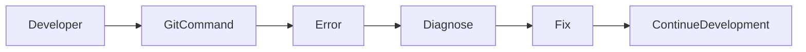

---

## Key Components

| Component | Purpose |
|------------|----------|
| Working Directory | Local project files |
| Staging Area | Prepared changes |
| Local Repository | Commit history |
| Remote Repository | Shared repository |
| Branches | Parallel development |
| HEAD | Current checkout reference |

---

## Types (if applicable)

Common Git issues include:

| Issue | Description |
|--------|-------------|
| Merge Conflict | Two branches modify the same content |
| Detached HEAD | HEAD points to a commit instead of a branch |
| Authentication Failure | Git cannot verify user identity |
| Push Rejected | Remote repository rejects the push |
| Pull Conflict | Local and remote changes conflict |
| Lost Commits | Commits appear missing after reset or branch deletion |

---

## Lifecycle / Workflow

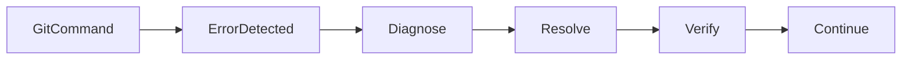

---

## Configuration / Syntax (if applicable)

Useful troubleshooting commands

```bash
git status

git log

git reflog

git diff

git branch

git remote -v

git fetch

git pull

git reset

git restore
```

---

## Important Commands (if applicable)

```bash
git status

git log

git reflog

git branch

git fetch

git pull

git push

git merge

git restore

git reset

git revert
```

---

## Important Files (if applicable)

| File | Purpose |
|------|---------|
| `.git/HEAD` | Current branch or commit |
| `.git/index` | Staging Area |
| `.git/config` | Repository configuration |
| `.git/FETCH_HEAD` | Last fetched references |
| `.git/ORIG_HEAD` | Previous HEAD before major operations |

---

## Real-World Use Cases

- Resolving merge conflicts during feature integration
- Recovering accidentally deleted commits
- Fixing authentication after PAT expiration
- Synchronizing outdated repositories
- Recovering after an incorrect reset

---

## Advantages

- Prevents code loss
- Improves collaboration
- Reduces downtime
- Speeds up development
- Builds confidence in Git operations

---

## Limitations

- Some destructive commands cannot be easily undone if history is permanently removed
- Incorrect troubleshooting steps can worsen repository state
- Requires understanding of Git internals

---

## Common Interview Questions (Concept Only)

- How do you resolve merge conflicts?
- What is a Detached HEAD state?
- Why is your push rejected?
- Difference between fetch and pull during troubleshooting?
- How do you recover a deleted commit?
- What is `git reflog`?
- How do you fix authentication failures?
- How do you recover after an accidental reset?

---

## Common Mistakes

- Using `git reset --hard` without understanding its impact
- Force pushing shared branches without coordination
- Ignoring merge conflicts
- Deleting branches before merging
- Forgetting to fetch or pull before pushing

---

## Troubleshooting

Always begin with:

```bash
git status
```

It usually provides the fastest explanation of the repository's current state.

---

## Summary

Understanding Git troubleshooting enables developers to safely resolve collaboration issues, recover from mistakes, and maintain repository integrity.

---

# Merge Conflicts

## Overview

A merge conflict occurs when Git cannot automatically combine changes from two branches.

This usually happens when:

- Two developers modify the same lines
- One developer deletes a file while another edits it
- Conflicting changes exist between branches

> **Interview Point**
>
> Git **does not lose code during a merge conflict**. It pauses the merge and asks the developer to choose the correct version.

---

## Why It Is Used

Conflict resolution ensures:

- Correct code integration
- Manual review of conflicting changes
- Preservation of intended functionality

---

## Architecture / Working

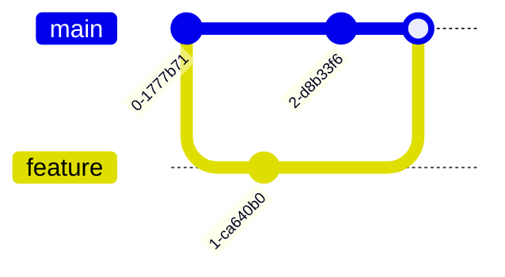

---

## Key Components

| Component | Purpose |
|------------|----------|
| Current Branch | Branch receiving changes |
| Incoming Branch | Branch being merged |
| Conflict Markers | Highlight conflicting sections |

---

## Lifecycle / Workflow

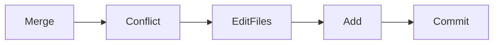

---

## Configuration / Syntax (if applicable)

Start merge

```bash
git merge feature-login
```

View conflicts

```bash
git status
```

After resolving conflicts

```bash
git add .

git commit
```

Abort merge if necessary

```bash
git merge --abort
```

---

## Important Commands (if applicable)

```bash
git merge

git status

git add

git commit

git merge --abort
```

---

## Important Files (if applicable)

None

---

## Real-World Use Cases

- Multiple developers editing the same file
- Long-lived feature branches
- Release integrations

---

## Advantages

- Prevents accidental overwrites
- Encourages manual review
- Protects code integrity

---

## Limitations

- Time-consuming for large conflicts
- Frequent conflicts indicate poor branch synchronization

---

## Common Interview Questions (Concept Only)

- What causes merge conflicts?
- How do you resolve merge conflicts?
- How do you abort a merge?

---

## Common Mistakes

- Editing conflict markers incorrectly
- Forgetting to stage resolved files
- Committing unresolved conflicts

---

## Troubleshooting

| Problem | Solution |
|----------|----------|
| Merge conflict | Resolve conflicting sections, stage the files, and commit the merge |
| Want to cancel merge | Use `git merge --abort` if the merge has not been completed |

---

## Summary

Merge conflicts require manual resolution when Git cannot automatically combine changes from different branches.

---

# Detached HEAD

## Overview

A Detached HEAD state occurs when `HEAD` points directly to a commit instead of a branch.

Example:

```bash
git checkout 2fd8a7b
```

Now:

```
HEAD -> Commit
```

instead of

```
HEAD -> main
```

> **Interview Point**
>
> Commits created in a Detached HEAD state can become difficult to find if you switch branches without saving them.

---

## Why It Is Used

Detached HEAD allows:

- Reviewing old commits
- Testing previous versions
- Temporary debugging

---

## Architecture / Working

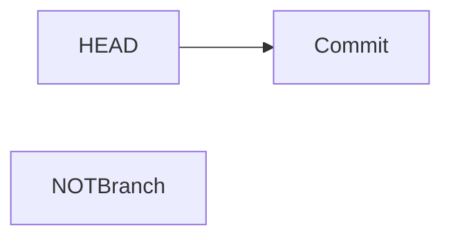

---

## Key Components

| Component | Purpose |
|------------|----------|
| HEAD | Points directly to a commit |
| Commit | Checked-out snapshot |

---

## Lifecycle / Workflow

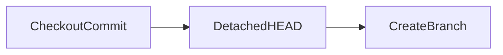

---

## Configuration / Syntax (if applicable)

Create a branch from Detached HEAD

```bash
git switch -c recovery-branch
```

Return to main

```bash
git switch main
```

---

## Important Commands (if applicable)

```bash
git switch

git checkout

git branch
```

---

## Important Files (if applicable)

| File | Purpose |
|------|---------|
| `.git/HEAD` | Stores the current HEAD reference |

---

## Real-World Use Cases

- Reviewing historical commits
- Debugging regressions
- Temporary testing

---

## Advantages

- Safe exploration of repository history
- No branch modifications

---

## Limitations

- New commits can become orphaned if not attached to a branch

---

## Common Interview Questions (Concept Only)

- What is a Detached HEAD?
- How do you recover from a Detached HEAD?

---

## Common Mistakes

- Continuing development without creating a branch
- Forgetting to save new commits

---

## Troubleshooting

| Problem | Solution |
|----------|----------|
| Detached HEAD | Create a new branch from the current commit or switch back to an existing branch |

---

## Summary

Detached HEAD is useful for temporary inspection but developers should create a branch before continuing work.

---

# Authentication Issues

## Overview

Authentication failures occur when Git cannot verify your identity with the remote repository.

Common causes:

- Expired Personal Access Token
- Incorrect SSH configuration
- Missing repository permissions
- Wrong remote URL

---

## Why It Is Used

Authentication protects repositories from unauthorized access.

---

## Architecture / Working

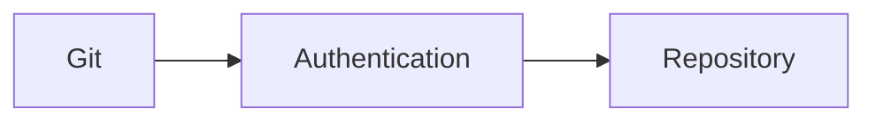

---

## Key Components

| Component | Purpose |
|------------|----------|
| SSH Key | Authentication |
| PAT | HTTPS authentication |
| Remote Repository | Access control |

---

## Lifecycle / Workflow

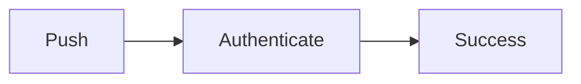

---

## Configuration / Syntax (if applicable)

Check remote

```bash
git remote -v
```

Test SSH

```bash
ssh -T git@github.com
```

---

## Important Commands (if applicable)

```bash
git remote -v

ssh -T
```

---

## Real-World Use Cases

- Expired PAT
- SSH key rotation
- New workstation setup

---

## Advantages

- Secure repository access
- Strong identity verification

---

## Limitations

- Requires credential management
- Expired credentials interrupt workflows

---

## Common Interview Questions (Concept Only)

- Why does authentication fail?
- Difference between PAT and SSH authentication?

---

## Common Mistakes

- Using account passwords instead of PATs
- Uploading the private SSH key instead of the public key
- Forgetting to load the SSH key into the SSH agent

---

## Troubleshooting

| Problem | Solution |
|----------|----------|
| Authentication failed | Verify PAT, SSH keys, and repository permissions |
| Permission denied (publickey) | Check that the correct public key is registered and the private key is loaded |
| Repository not found | Verify the repository URL and access rights |

---

## Summary

Authentication issues are typically resolved by verifying credentials, repository permissions, and remote configuration.

---

# Push Rejected Errors

## Overview

A push is rejected when Git refuses to update the remote repository.

Typical error:

```text
! [rejected]
```

---

## Why It Is Used

Git prevents overwriting newer commits on the remote repository.

---

## Architecture / Working

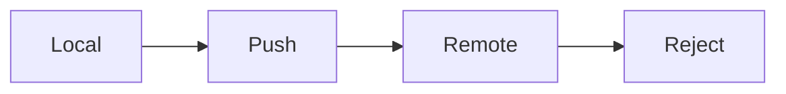

---

## Key Components

| Component | Purpose |
|------------|----------|
| Local Branch | Source |
| Remote Branch | Target |

---

## Lifecycle / Workflow

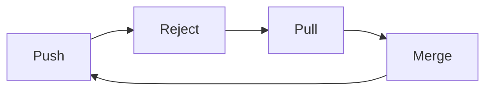

---

## Configuration / Syntax (if applicable)

Update before pushing

```bash
git pull origin main

git push origin main
```

---

## Important Commands (if applicable)

```bash
git pull

git push

git fetch
```

---

## Real-World Use Cases

- Another developer pushed changes first
- Outdated local branch

---

## Advantages

- Protects remote history
- Prevents accidental overwrites

---

## Limitations

- Requires synchronization before pushing

---

## Common Interview Questions (Concept Only)

- Why is a push rejected?
- How do you resolve push rejection errors?

---

## Common Mistakes

- Force pushing shared branches
- Ignoring remote changes

---

## Troubleshooting

| Problem | Solution |
|----------|----------|
| Push rejected | Pull or fetch the latest changes, resolve conflicts if necessary, then push again |
| Non-fast-forward error | Integrate the remote commits before pushing |

---

## Summary

Push rejection protects shared repositories from accidental overwrites and usually indicates that the remote branch contains newer commits.

---

# Pull Conflicts

## Overview

Pull conflicts occur when Git cannot automatically merge remote changes into local changes during a `git pull`.

---

## Why It Is Used

Git stops the operation to prevent accidental data loss.

---

## Architecture / Working

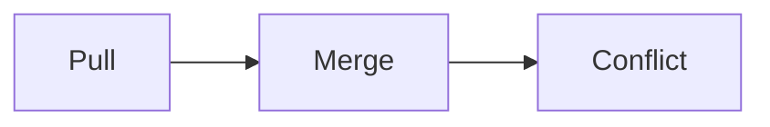

---

## Key Components

| Component | Purpose |
|------------|----------|
| Local Changes | Existing work |
| Remote Changes | Incoming updates |

---

## Lifecycle / Workflow

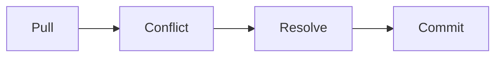

---

## Configuration / Syntax (if applicable)

```bash
git pull
```

Resolve conflicts

```bash
git add .

git commit
```

---

## Important Commands (if applicable)

```bash
git pull

git status

git add

git commit
```

---

## Real-World Use Cases

- Parallel feature development
- Simultaneous edits to the same files

---

## Advantages

- Protects both local and remote work
- Prevents silent overwrites

---

## Limitations

- Manual resolution may be required

---

## Common Interview Questions (Concept Only)

- What causes pull conflicts?
- How do you resolve them?

---

## Common Mistakes

- Pulling with uncommitted changes
- Ignoring conflict markers

---

## Troubleshooting

| Problem | Solution |
|----------|----------|
| Pull conflict | Resolve the conflicts, stage the files, and complete the merge commit |
| Uncommitted local changes | Commit or stash the changes before pulling |

---

## Summary

Pull conflicts occur when local and remote changes overlap and require manual resolution.

---

# Recovering Lost Commits

## Overview

Git rarely deletes commits immediately. Even after operations like `reset`, commits are often recoverable using the reference log (`reflog`).

> **Interview Point**
>
> `git reflog` is one of the most valuable recovery tools in Git and is frequently discussed in interviews.

---

## Why It Is Used

Recovery techniques help restore:

- Deleted commits
- Deleted branches
- Accidental resets
- Lost work

---

## Architecture / Working


---

## Key Components

| Component | Purpose |
|------------|----------|
| Reflog | Tracks recent HEAD movements |
| Commit Hash | Used to restore work |

---

## Lifecycle / Workflow

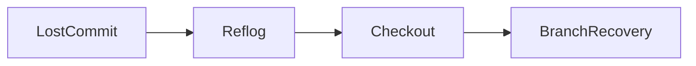

---

## Configuration / Syntax (if applicable)

View reflog

```bash
git reflog
```

Recover a commit

```bash
git checkout <commit-id>
```

Create a recovery branch

```bash
git switch -c recovered-work
```

---

## Important Commands (if applicable)

```bash
git reflog

git checkout

git switch

git branch
```

---

## Important Files (if applicable)

Git stores reflog information internally under the `.git/logs/` directory.

---

## Real-World Use Cases

- Accidental hard reset
- Deleted branches
- Lost commits after a rebase
- Recovering work after an incorrect checkout

---

## Advantages

- Helps recover seemingly lost work
- Reduces the risk of permanent data loss
- Supports disaster recovery during development

---

## Limitations

- Reflog entries expire over time
- Garbage collection can eventually remove unreachable commits

---

## Common Interview Questions (Concept Only)

- How do you recover deleted commits?
- What is `git reflog`?
- Can a hard reset be recovered?
- How do you recover a deleted branch?

---

## Common Mistakes

- Assuming commits are permanently deleted immediately
- Not checking `git reflog` before attempting recovery
- Running aggressive garbage collection before recovering lost commits

---

## Troubleshooting

| Problem | Solution |
|----------|----------|
| Lost commit after reset | Locate the commit using `git reflog` and create a new branch from it |
| Deleted branch | Recover its last commit from `git reflog` and recreate the branch |
| Wrong reset performed | Find the previous HEAD in `git reflog` and restore it appropriately |

---

## Summary

Most "lost" Git commits can be recovered using `git reflog`. Understanding reflog is an essential skill for both interviews and real-world development because it provides a safety net for many accidental Git operations.
