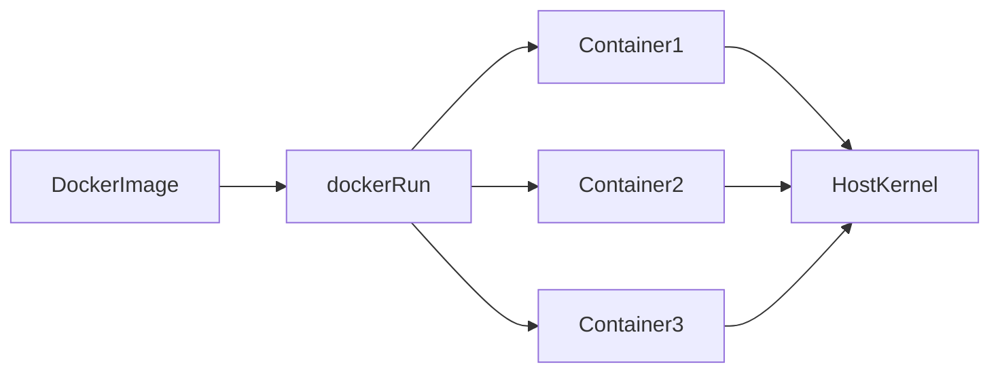
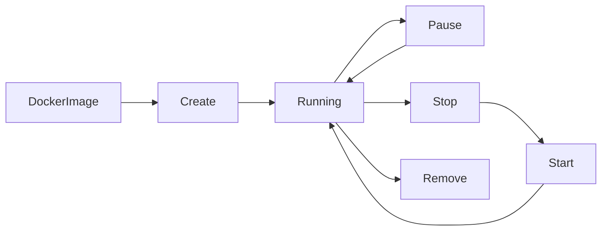
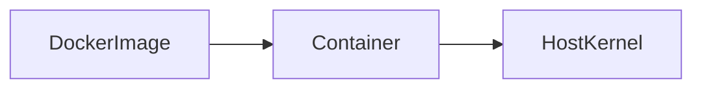
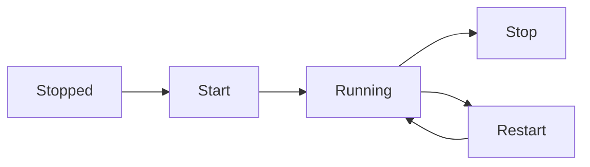

# Docker Containers

## Overview

A **Docker Container** is a **lightweight, isolated, executable instance of a Docker Image**.

A container packages:

- Application code
- Runtime
- Libraries
- Dependencies
- Configuration

Unlike a Docker Image (which is read-only), a container has a **writable layer** where runtime changes are stored.

> **Interview Point**
>
> - **Image = Blueprint**
> - **Container = Running Instance of an Image**
> - Multiple containers can be created from the same image.

---

## Why It Is Used

Docker Containers provide:

- Application isolation
- Fast startup
- Consistent execution across environments
- Efficient resource utilization
- Easy deployment and scaling
- Simplified CI/CD automation

---

## Architecture / Working



---

## Key Components

| Component | Purpose |
|-----------|----------|
| Docker Image | Template used to create containers |
| Container | Running instance of an image |
| Writable Layer | Stores runtime changes |
| Docker Engine | Runs containers |
| Docker Daemon | Manages container lifecycle |
| Container ID | Unique identifier |
| Container Name | Human-readable name |

---

## Types (if applicable)

### Interactive Containers

- Runs with a terminal attached
- Used for debugging
- Used for development

Example:

```bash
docker run -it ubuntu bash
```

---

### Detached Containers

- Runs in the background
- Used for production services

Example:

```bash
docker run -d nginx
```

---

### Ephemeral Containers

Automatically removed after stopping.

Example:

```bash
docker run --rm ubuntu
```

---

## Lifecycle / Workflow



---

## Configuration / Syntax (if applicable)

Run container

```bash
docker run nginx
```

Run in background

```bash
docker run -d nginx
```

Interactive shell

```bash
docker run -it ubuntu bash
```

Name a container

```bash
docker run --name web nginx
```

Map a port

```bash
docker run -p 8080:80 nginx
```

---

## Important Commands (if applicable)

```bash
docker run

docker ps

docker ps -a

docker start

docker stop

docker restart

docker pause

docker unpause

docker rm

docker inspect

docker logs

docker exec

docker attach
```

---

## Important Files (if applicable)

| File | Purpose |
|------|---------|
| `/var/lib/docker/containers/` | Stores container metadata and logs |
| `/etc/docker/daemon.json` | Docker daemon configuration |

---

## Real-World Use Cases

- Web servers
- REST APIs
- Databases
- CI/CD build agents
- Kubernetes workloads
- Microservices
- Background workers

---

## Advantages

- Lightweight
- Fast startup
- Portable
- Isolated
- Easy scaling
- Resource efficient

---

## Limitations

- Containers share the host kernel
- Runtime changes are lost if the container is removed (unless stored in a volume)
- Containers should remain stateless whenever possible

---

## Common Interview Questions (Concept Only)

- What is a Docker Container?
- Difference between Image and Container?
- Can multiple containers use one image?
- Where are container changes stored?
- What happens when a container is deleted?

---

## Common Mistakes

- Storing important data inside containers
- Running everything as the root user
- Forgetting to map required ports
- Using interactive mode for production workloads
- Leaving stopped containers unused

---

## Troubleshooting

| Problem | Solution |
|----------|----------|
| Container exits immediately | Check application entrypoint and logs |
| Cannot access application | Verify port mapping using `docker ps` |
| Container not starting | Inspect logs and container configuration |
| Permission issues | Verify mounted volume permissions |

---

## Summary

Docker Containers are lightweight, isolated runtime instances of Docker Images that enable consistent, portable, and efficient application deployment.

---

# What is a Container

## Overview

A Docker Container is a running instance of a Docker Image.

It contains:

- Application
- Dependencies
- Runtime
- Writable filesystem layer

Containers run as isolated processes on the host operating system.

---

## Why It Is Used

Containers solve:

- Environment inconsistency
- Dependency conflicts
- Deployment complexity

---

## Architecture / Working



---

## Key Components

| Component | Description |
|------------|-------------|
| Image | Blueprint |
| Writable Layer | Runtime modifications |
| Process | Running application |

---

## Real-World Use Cases

- NGINX server
- MySQL database
- Python API
- Jenkins agent

---

## Advantages

- Fast
- Portable
- Consistent

---

## Limitations

- Shares host kernel
- Ephemeral by default

---

## Common Interview Questions (Concept Only)

- What is a Docker Container?
- Is a container the same as an image?

---

## Summary

A Docker Container is a running, isolated instance of a Docker Image.

---

# Create Containers

## Overview

Containers are created from Docker Images using the `docker create` or `docker run` command.

- `docker create` creates the container but does **not** start it.
- `docker run` creates and starts the container.

> **Interview Point**
>
> `docker run` = `docker create` + `docker start`

---

## Why It Is Used

Container creation prepares an isolated runtime environment before application execution.

---

## Lifecycle / Workflow


---

## Configuration / Syntax (if applicable)

Create only

```bash
docker create nginx
```

Create with a name

```bash
docker create --name web nginx
```

---

## Important Commands (if applicable)

```bash
docker create

docker ps -a
```

---

## Real-World Use Cases

- Preparing containers before deployment
- Testing container configuration

---

## Advantages

- Allows inspection before starting

---

## Limitations

- Container is not running after creation

---

## Common Interview Questions (Concept Only)

- Difference between `docker create` and `docker run`?

---

## Summary

`docker create` creates a container without starting it.

---

# Run Containers

## Overview

`docker run` creates and starts a container from an image.

---

## Why It Is Used

Used to launch containerized applications.

---

## Architecture / Working


---

## Configuration / Syntax (if applicable)

Basic run

```bash
docker run nginx
```

Run with a name

```bash
docker run --name web nginx
```

Run with port mapping

```bash
docker run -p 8080:80 nginx
```

Run with environment variables

```bash
docker run -e ENV=prod nginx
```

---

## Important Commands (if applicable)

```bash
docker run
```

---

## Real-World Use Cases

- Running applications
- Development environments
- CI/CD

---

## Common Interview Questions (Concept Only)

- What does `docker run` do?

---

## Summary

`docker run` creates and immediately starts a container.

---

# Interactive Mode

## Overview

Interactive mode allows direct interaction with a container through a terminal.

Flags:

```text
-i

-t
```

Usually combined as:

```text
-it
```

---

## Why It Is Used

Used for:

- Debugging
- Learning
- Manual testing
- Administration

---

## Configuration / Syntax (if applicable)

```bash
docker run -it ubuntu bash
```

---

## Advantages

- Interactive shell
- Easy troubleshooting

---

## Limitations

- Not suitable for production services

---

## Common Interview Questions (Concept Only)

- What does `-it` mean?

---

## Summary

Interactive mode attaches a terminal to a running container.

---

# Detached Mode

## Overview

Detached mode runs containers in the background.

Flag:

```text
-d
```

---

## Why It Is Used

Production applications should typically run in detached mode.

---

## Configuration / Syntax (if applicable)

```bash
docker run -d nginx
```

---

## Advantages

- Background execution
- Suitable for servers

---

## Limitations

- Requires `docker logs` to view application output

---

## Common Interview Questions (Concept Only)

- Difference between interactive and detached mode?

---

## Summary

Detached mode runs containers in the background without attaching a terminal.

---

# Start, Stop, Restart Containers

## Overview

Docker provides commands to manage the container lifecycle.

---

## Why It Is Used

Allows administrators to control application availability.

---

## Lifecycle / Workflow



---

## Configuration / Syntax (if applicable)

Start

```bash
docker start web
```

Stop

```bash
docker stop web
```

Restart

```bash
docker restart web
```

---

## Important Commands (if applicable)

```bash
docker start

docker stop

docker restart
```

---

## Real-World Use Cases

- Maintenance
- Configuration updates
- Application recovery

---

## Common Interview Questions (Concept Only)

- Difference between stop and restart?

---

## Summary

These commands manage the operational state of Docker containers.

---

# Pause & Unpause

## Overview

Pause temporarily suspends all processes inside a container without stopping it.

---

## Why It Is Used

Useful for:

- Resource management
- Maintenance
- Temporary suspension

---

## Configuration / Syntax (if applicable)

Pause

```bash
docker pause web
```

Resume

```bash
docker unpause web
```

---

## Important Commands (if applicable)

```bash
docker pause

docker unpause
```

---

## Advantages

- Preserves container state
- Fast resume

---

## Limitations

- Container cannot process requests while paused

---

## Common Interview Questions (Concept Only)

- Difference between pause and stop?

---

## Summary

Pause suspends processes without terminating the container.

---

# Remove Containers

## Overview

Containers can be removed when no longer needed.

---

## Why It Is Used

- Free storage
- Remove unused resources
- Clean development environments

---

## Configuration / Syntax (if applicable)

Remove stopped container

```bash
docker rm web
```

Force remove running container

```bash
docker rm -f web
```

Remove all stopped containers

```bash
docker container prune
```

---

## Important Commands (if applicable)

```bash
docker rm

docker container prune
```

---

## Real-World Use Cases

- Cleanup after testing
- CI/CD pipeline cleanup

---

## Advantages

- Frees storage
- Keeps environment clean

---

## Limitations

- Writable layer is deleted
- Data is lost unless stored in a volume

---

## Common Interview Questions (Concept Only)

- Can you remove a running container?
- What happens to data after removal?

---

## Common Mistakes

- Removing containers with important local data
- Forgetting to use persistent volumes

---

## Troubleshooting

| Problem | Solution |
|----------|----------|
| Cannot remove running container | Stop the container first or use `docker rm -f` if appropriate |

---

## Summary

Removing containers deletes their writable layer and should be done carefully if persistent data is involved.

---

# Inspect Containers

## Overview

`docker inspect` displays detailed JSON metadata about Docker objects.

---

## Why It Is Used

Used to view:

- IP address
- Mounted volumes
- Network configuration
- Environment variables
- Entrypoint
- Labels

---

## Configuration / Syntax (if applicable)

```bash
docker inspect web
```

Inspect IP address

```bash
docker inspect -f '{{.NetworkSettings.IPAddress}}' web
```

---

## Important Commands (if applicable)

```bash
docker inspect
```

---

## Real-World Use Cases

- Debugging
- Networking
- Automation

---

## Advantages

- Detailed metadata
- Useful for scripting

---

## Limitations

- JSON output can be extensive

---

## Common Interview Questions (Concept Only)

- What information does `docker inspect` provide?

---

## Summary

`docker inspect` provides detailed metadata for containers and other Docker objects.

---

# Container Logs

## Overview

Docker captures the standard output (`stdout`) and standard error (`stderr`) of containers, making it easy to monitor application behavior.

---

## Why It Is Used

Used for:

- Troubleshooting
- Monitoring
- Debugging

---

## Configuration / Syntax (if applicable)

View logs

```bash
docker logs web
```

Follow logs

```bash
docker logs -f web
```

Show last 50 lines

```bash
docker logs --tail 50 web
```

Include timestamps

```bash
docker logs -t web
```

---

## Important Commands (if applicable)

```bash
docker logs

docker logs -f

docker logs --tail
```

---

## Real-World Use Cases

- Monitoring application startup
- Investigating crashes
- Debugging production issues

---

## Advantages

- Simple log access
- Supports streaming

---

## Limitations

- Logs may rotate or be lost depending on the logging driver and container lifecycle

---

## Common Interview Questions (Concept Only)

- How do you view container logs?
- What is the purpose of `docker logs -f`?

---

## Common Mistakes

- Assuming application logs are always stored inside the container filesystem
- Ignoring log rotation configuration

---

## Troubleshooting

| Problem | Solution |
|----------|----------|
| No logs displayed | Ensure the application writes to stdout/stderr and verify the logging driver |

---

## Summary

`docker logs` is the primary command for viewing and following container output for monitoring and troubleshooting.

---

# Execute Commands inside Containers

## Overview

`docker exec` runs commands inside an already running container without restarting it.

It is commonly used for:

- Troubleshooting
- Configuration checks
- Running administrative commands

---

## Why It Is Used

Allows administrators to inspect or manage a live container without affecting its main process.

---

## Architecture / Working


---

## Configuration / Syntax (if applicable)

Open a Bash shell

```bash
docker exec -it web bash
```

Run a command

```bash
docker exec web ls -l /app
```

Print environment variables

```bash
docker exec web env
```

---

## Important Commands (if applicable)

```bash
docker exec

docker exec -it

docker exec <container> <command>
```

---

## Real-World Use Cases

- Checking configuration files
- Viewing application directories
- Running diagnostic commands
- Verifying installed packages

---

## Advantages

- No container restart required
- Useful for live debugging
- Supports interactive shells

---

## Limitations

- Requires the container to be running
- Changes made interactively may be lost if not persisted in volumes or images

---

## Common Interview Questions (Concept Only)

- What is the difference between `docker exec` and `docker attach`?
- Can you execute commands inside a stopped container?

---

## Common Mistakes

- Using `docker attach` when `docker exec` is more appropriate
- Making manual configuration changes that are not reflected in the Docker image

---

## Troubleshooting

| Problem | Solution |
|----------|----------|
| Container not running | Start the container before using `docker exec` |
| `bash` not found | Use the available shell (for example, `sh`) if Bash is not installed |

---

## Summary

`docker exec` enables administrators to run commands or open an interactive shell inside a running container, making it an essential tool for debugging and operational tasks.
