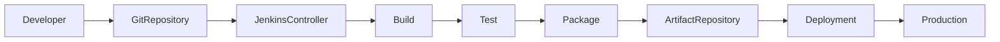
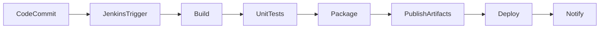
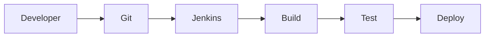
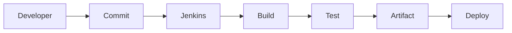
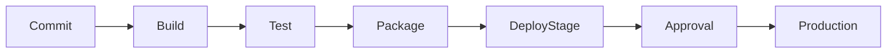
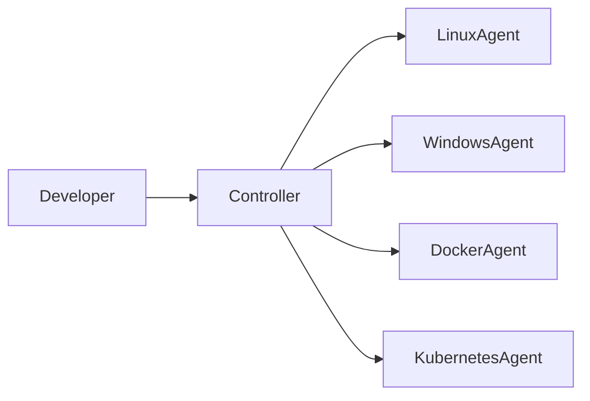
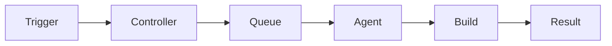
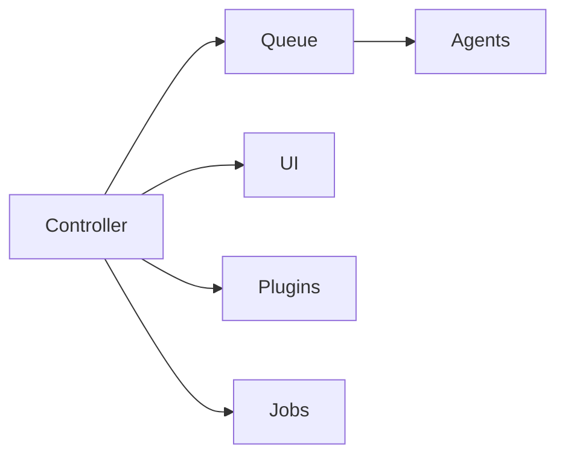
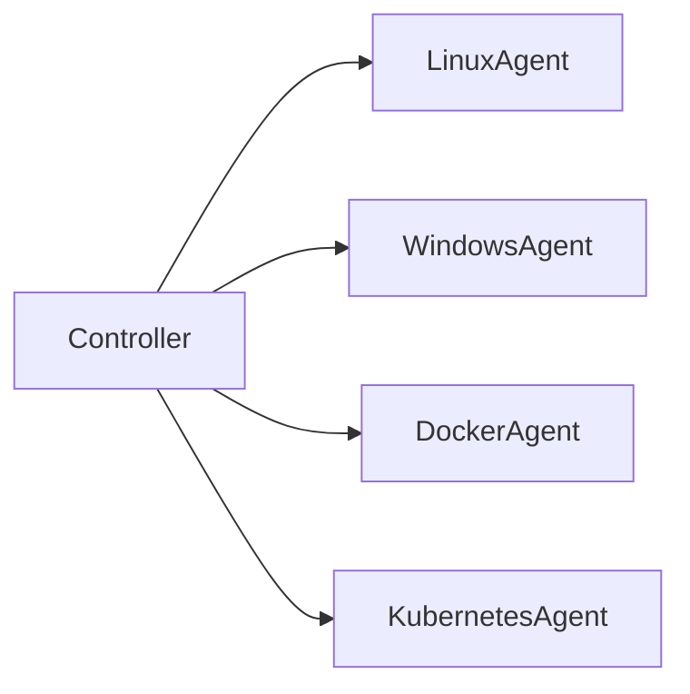
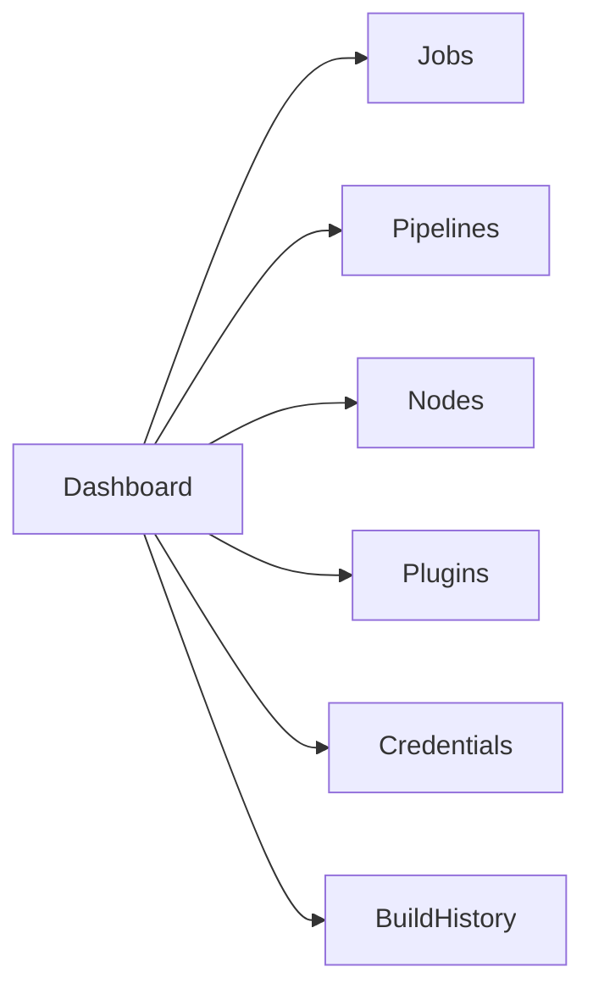

# Jenkins Fundamentals

## Overview

**Jenkins** is an open-source automation server used to automate the **Continuous Integration (CI)** and **Continuous Delivery/Deployment (CD)** lifecycle.

It helps automate repetitive tasks such as:

- Building applications
- Running automated tests
- Performing code quality checks
- Packaging applications
- Deploying applications
- Infrastructure automation

Jenkins supports hundreds of plugins, making it one of the most widely used DevOps automation tools.

> **Interview Point**
>
> Jenkins itself is **not a CI/CD tool only**. It is an **automation server** capable of automating almost any repetitive task.

---

## Why It Is Used

Jenkins helps organizations:

- Automate software builds
- Detect bugs early
- Reduce manual effort
- Improve software quality
- Deliver software faster
- Integrate with DevOps tools
- Enable Continuous Integration
- Enable Continuous Delivery/Deployment

---

## Architecture / Working



---

## Key Components

| Component | Purpose |
|------------|----------|
| Jenkins Controller | Central server that manages jobs and agents |
| Jenkins Agent | Executes build jobs |
| Jobs | Individual automation tasks |
| Pipelines | CI/CD workflow definitions |
| Plugins | Extend Jenkins functionality |
| Workspace | Directory where build executes |
| Build Queue | Stores waiting jobs |
| Executor | Thread that runs build jobs |

---

## Types (if applicable)

Jenkins can be used in two ways:

| Type | Description |
|--------|-------------|
| Freestyle Project | GUI-based job configuration |
| Pipeline Project | Pipeline defined using code (Jenkinsfile) |

> **Interview Point**
>
> Modern DevOps teams primarily use **Pipeline as Code** instead of Freestyle Projects.

---

## Lifecycle / Workflow



---

## Configuration / Syntax (if applicable)

Typical CI Workflow

```
Developer
      ↓
Git Push
      ↓
Jenkins Trigger
      ↓
Checkout Code
      ↓
Build
      ↓
Run Tests
      ↓
Create Artifact
      ↓
Publish Artifact
      ↓
Deploy
```

---

## Important Commands (if applicable)

Linux Service Management

Start Jenkins

```bash
sudo systemctl start jenkins
```

Stop Jenkins

```bash
sudo systemctl stop jenkins
```

Restart Jenkins

```bash
sudo systemctl restart jenkins
```

Check Status

```bash
sudo systemctl status jenkins
```

Enable Jenkins at Boot

```bash
sudo systemctl enable jenkins
```

View Logs

```bash
journalctl -u jenkins
```

---

## Important Files (if applicable)

| File | Purpose |
|------|----------|
| `/var/lib/jenkins/` | Jenkins Home Directory |
| `/var/lib/jenkins/workspace/` | Job Workspaces |
| `/var/lib/jenkins/jobs/` | Job Configuration |
| `/etc/default/jenkins` | Jenkins Service Configuration (Debian/Ubuntu) |
| `/etc/sysconfig/jenkins` | Jenkins Configuration (RHEL/CentOS) |
| `Jenkinsfile` | Pipeline as Code |
| `config.xml` | Jenkins Configuration |

---

## Real-World Use Cases

- Java application builds
- .NET application builds
- Docker image creation
- Kubernetes deployments
- Terraform automation
- Ansible automation
- Azure deployments
- AWS deployments
- Automated testing
- Scheduled jobs
- Nightly builds

---

## Advantages

- Open source
- Large plugin ecosystem
- Platform independent
- Pipeline as Code support
- Highly extensible
- Easy integration with DevOps tools
- Strong community support

---

## Limitations

- Plugin compatibility issues
- Controller can become a single point of failure if not made highly available
- UI is less modern compared to newer CI/CD platforms
- Plugin updates require testing
- Large Jenkins instances require ongoing maintenance

---

## Common Interview Questions (Concept Only)

- What is Jenkins?
- Why is Jenkins used?
- Is Jenkins a CI tool or a CD tool?
- What is Pipeline as Code?
- Difference between Freestyle Job and Pipeline?
- Why are plugins required?
- Where are Jenkins jobs stored?
- What is Jenkins Home Directory?

---

## Common Mistakes

- Installing unnecessary plugins
- Running all jobs on the controller
- Keeping secrets directly inside jobs
- Not backing up Jenkins Home
- Running builds as the root user
- Not cleaning workspaces after builds
- Using Freestyle Projects for complex pipelines
- Ignoring plugin version compatibility

---

## Troubleshooting

| Problem | Solution |
|----------|----------|
| Jenkins won't start | Check `systemctl status jenkins` and service logs |
| Jenkins UI not opening | Verify port 8080, firewall rules, and service status |
| Job stuck in queue | Verify agent availability and executor count |
| Build failing unexpectedly | Review Console Output and workspace |
| Plugin issues | Check plugin compatibility and restart Jenkins if required |
| Disk space increasing | Clean old workspaces, artifacts, and build history |

---

## Summary

Jenkins is one of the most widely used automation servers in DevOps. It automates software builds, testing, packaging, and deployments while integrating with hundreds of tools. In modern production environments, Jenkins is typically implemented using **Pipeline as Code** and distributed builds with agents.

---

# What is Jenkins

## Overview

Jenkins is an **open-source automation server** that automates software development workflows.

It continuously monitors source code repositories and automatically performs predefined tasks whenever changes occur.

Typical automated tasks include:

- Source code checkout
- Dependency installation
- Build
- Unit testing
- Static code analysis
- Docker image creation
- Artifact publishing
- Deployment

---

## Why It Is Used

Jenkins provides:

- Automation
- Faster releases
- Repeatable deployments
- Continuous Integration
- Continuous Delivery
- Integration with Git, Docker, Kubernetes, Azure, AWS, SonarQube, Maven, Gradle, Terraform, and many other tools

---

## Architecture / Working



---

## Key Components

- Controller
- Agents
- Jobs
- Plugins
- Pipelines
- Workspace

---

## Real-World Use Cases

- Java builds using Maven
- Docker image creation
- Kubernetes deployments
- Azure DevOps automation
- AWS infrastructure deployment

---

## Advantages

- Fully automated builds
- Easy integration
- Extensible through plugins

---

## Limitations

- Requires maintenance
- Plugin management can become complex

---

## Common Interview Questions (Concept Only)

- What is Jenkins?
- Why is Jenkins used?
- Is Jenkins free?

---

## Common Mistakes

- Treating Jenkins only as a build server instead of an automation platform

---

## Troubleshooting

- Verify Jenkins service
- Check logs
- Review console output

---

## Summary

Jenkins automates software delivery from source code to deployment.

---

# CI/CD Concepts

## Overview

Jenkins is primarily used to implement **Continuous Integration (CI)** and **Continuous Delivery/Deployment (CD)**.

---

## Why It Is Used

Automated CI/CD provides:

- Faster releases
- Better software quality
- Reduced manual effort
- Consistent deployments

---

## Architecture / Working



---

## Key Components

| Phase | Purpose |
|---------|----------|
| Continuous Integration | Automatically build and test code after each commit |
| Continuous Delivery | Automatically prepare releases for deployment |
| Continuous Deployment | Automatically deploy to production after successful validation |

---

## Types (if applicable)

### Continuous Integration (CI)

- Frequent code commits
- Automated build
- Automated testing
- Early bug detection

---

### Continuous Delivery (CD)

- Automated deployment to staging
- Manual approval before production

---

### Continuous Deployment

- Fully automated deployment
- No manual approval
- Every successful build can reach production

---

## Lifecycle / Workflow



---

## Real-World Use Cases

- Enterprise CI/CD
- Automated testing
- Cloud deployments

---

## Advantages

- Rapid releases
- Better collaboration
- Early issue detection

---

## Limitations

- Requires automated testing for best results
- Poor pipelines can delay releases

---

## Common Interview Questions (Concept Only)

- Difference between CI, Continuous Delivery, and Continuous Deployment?
- Why is CI important?
- Can Jenkins implement both CI and CD?

---

## Common Mistakes

- Confusing Continuous Delivery with Continuous Deployment
- Skipping automated tests

---

## Troubleshooting

- Validate pipeline stages
- Review build logs

---

## Summary

CI/CD automates the software delivery lifecycle, improving speed, consistency, and reliability.

---

# Jenkins Architecture

## Overview

Jenkins uses a **Controller-Agent Architecture** to distribute workloads.

Large organizations typically use multiple agents to execute builds in parallel.

---

## Why It Is Used

Distributed architecture provides:

- Scalability
- Parallel builds
- Platform flexibility
- Better resource utilization

---

## Architecture / Working



---

## Key Components

| Component | Purpose |
|-----------|----------|
| Controller | Manages Jenkins |
| Agent | Executes jobs |
| Executor | Runs builds |
| Workspace | Build directory |

---

## Lifecycle / Workflow



---

## Advantages

- Distributed builds
- Platform independent
- Better performance

---

## Limitations

- Network dependency
- Agent maintenance

---

## Common Interview Questions (Concept Only)

- Explain Jenkins architecture.
- Why use agents?
- What is a distributed build?

---

## Common Mistakes

- Running all builds on the controller
- Overloading a single agent

---

## Troubleshooting

- Verify agent connectivity
- Check executor availability

---

## Summary

Jenkins distributes builds across agents to improve scalability and performance.

---

# Jenkins Controller

## Overview

The **Jenkins Controller** is the central server responsible for managing the entire Jenkins environment.

It does **not necessarily execute builds**; instead, it schedules and coordinates them.

> **Interview Point**
>
> In production, avoid running builds directly on the controller. Use dedicated agents whenever possible.

---

## Why It Is Used

The controller:

- Schedules jobs
- Stores configurations
- Manages plugins
- Coordinates agents
- Maintains build history
- Provides the web interface

---

## Architecture / Working



---

## Key Components

- Build Queue
- Executors
- Plugin Manager
- Credential Store
- Jenkins Home
- Web UI

---

## Real-World Use Cases

- Enterprise Jenkins management
- Pipeline orchestration
- Build scheduling

---

## Advantages

- Centralized management
- Easy monitoring

---

## Limitations

- Can become a bottleneck if overloaded
- Needs backup and monitoring

---

## Common Interview Questions (Concept Only)

- What is the Jenkins Controller?
- Should builds run on the controller?

---

## Common Mistakes

- Running production builds on the controller
- Ignoring controller backups

---

## Troubleshooting

- Monitor CPU, memory, and disk usage
- Review controller logs
- Verify queue status

---

## Summary

The controller orchestrates Jenkins operations and should focus on management rather than build execution.

---

# Jenkins Agents (Nodes)

## Overview

A **Jenkins Agent (Node)** is a machine that executes jobs assigned by the controller.

Agents may be:

- Physical servers
- Virtual Machines
- Docker Containers
- Kubernetes Pods
- Cloud Instances

---

## Why It Is Used

Agents enable:

- Distributed builds
- Platform-specific builds
- Parallel execution
- Resource isolation

---

## Architecture / Working



---

## Types (if applicable)

| Agent Type | Purpose |
|-------------|----------|
| Permanent Agent | Always available |
| Dynamic Agent | Created on demand |
| Docker Agent | Runs inside Docker |
| Kubernetes Agent | Ephemeral build pod |
| Cloud Agent | Provisioned automatically |

---

## Configuration / Syntax (if applicable)

Example Pipeline

```groovy
agent any
```

Specific label

```groovy
agent {
    label 'linux'
}
```

---

## Real-World Use Cases

- Linux builds
- Windows builds
- Docker image creation
- Kubernetes CI

---

## Advantages

- Scalability
- Better performance
- Workload distribution

---

## Limitations

- Network dependency
- Agent management overhead

---

## Common Interview Questions (Concept Only)

- What is a Jenkins Agent?
- Why use multiple agents?
- What are agent labels?

---

## Common Mistakes

- Using one agent for all workloads
- Poor label management

---

## Troubleshooting

- Verify node connectivity
- Check agent logs
- Ensure required tools are installed

---

## Summary

Agents execute build workloads while the controller coordinates scheduling and management.

---

# Jenkins Dashboard

## Overview

The Jenkins Dashboard is the primary web interface used to manage Jenkins.

It provides visibility into:

- Jobs
- Pipelines
- Build history
- Nodes
- Plugins
- Credentials
- System status

---

## Why It Is Used

The dashboard simplifies:

- Job creation
- Pipeline management
- Monitoring builds
- Managing users
- Reviewing build history

---

## Architecture / Working



---

## Key Components

| Component | Purpose |
|-----------|----------|
| Dashboard | Main interface |
| New Item | Create jobs |
| Build History | View previous builds |
| Manage Jenkins | System administration |
| Manage Nodes | Agent management |
| Credentials | Secret management |

---

## Real-World Use Cases

- Monitoring CI/CD pipelines
- Managing Jenkins infrastructure
- Reviewing failed builds

---

## Advantages

- Centralized administration
- Easy navigation
- Build visibility

---

## Limitations

- Large installations can become cluttered without organization
- UI customization is limited compared to some newer platforms

---

## Common Interview Questions (Concept Only)

- What is available on the Jenkins Dashboard?
- Where do you manage plugins?
- Where do you manage agents?
- Where are credentials configured?

---

## Common Mistakes

- Giving all users administrator access
- Not organizing jobs into folders
- Ignoring build history cleanup

---

## Troubleshooting

| Problem | Solution |
|----------|----------|
| Dashboard inaccessible | Verify Jenkins service, port 8080, and firewall settings |
| Missing jobs | Confirm folder selection and user permissions |
| Slow dashboard | Review plugin usage, build history, and controller resources |

---

## Summary

The Jenkins Dashboard provides centralized management of jobs, pipelines, agents, plugins, credentials, and system administration, making it the primary interface for day-to-day Jenkins operations.
