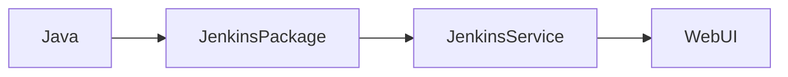
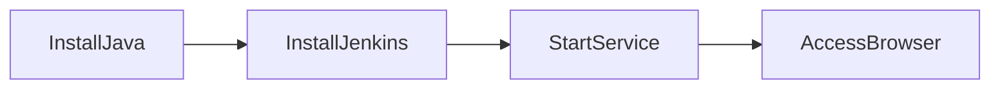
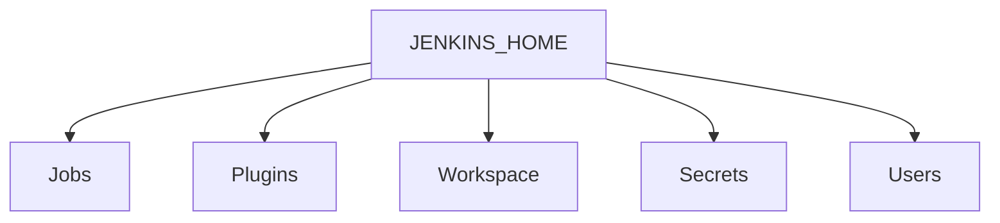
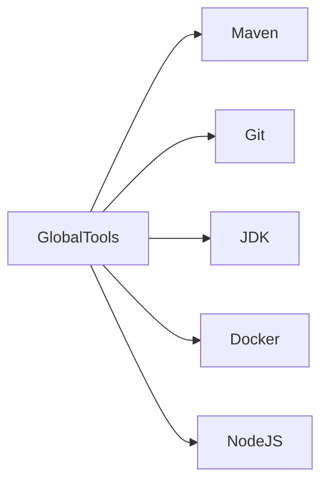
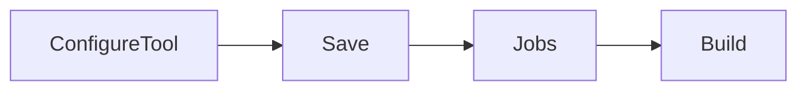
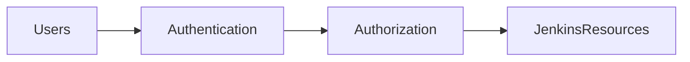

# Jenkins Installation & Configuration

## Overview

Jenkins Installation & Configuration is the process of setting up a Jenkins server, performing the initial configuration, installing required plugins, configuring build tools, and securing the Jenkins instance.

A properly configured Jenkins server provides a stable foundation for CI/CD pipelines.

> **Interview Point**
>
> After installing Jenkins, the first login requires an **initial administrator password**, followed by plugin installation and administrator account creation.

---

## Why It Is Used

Proper installation and configuration provide:

- Stable CI/CD environment
- Secure access
- Build tool integration
- Plugin management
- User authentication
- Pipeline execution

---

## Architecture / Working


---

## Key Components

| Component | Purpose |
|------------|----------|
| Jenkins Service | Runs Jenkins |
| Jenkins Home | Stores all Jenkins data |
| Plugins | Extend Jenkins functionality |
| Global Tool Configuration | Configure build tools |
| Global Security | Configure authentication & authorization |
| Credentials Store | Store secrets securely |

---

## Types (if applicable)

Typical installation methods:

| Method | Description |
|----------|-------------|
| Native Package | Install using apt, yum, or dnf |
| WAR File | Run Jenkins using Java |
| Docker | Run Jenkins inside a container |
| Kubernetes | Run Jenkins in a Kubernetes cluster |
| Cloud VM | Install on Azure, AWS, or GCP virtual machines |

> **Interview Point**
>
> Most production environments install Jenkins on a **Linux VM** or **Docker container**.

---

## Lifecycle / Workflow


---

## Configuration / Syntax (if applicable)

Typical Installation Workflow

```
Install Java
        ↓
Install Jenkins
        ↓
Start Jenkins Service
        ↓
Unlock Jenkins
        ↓
Install Plugins
        ↓
Create Admin User
        ↓
Configure Build Tools
        ↓
Configure Security
        ↓
Create Jobs
```

---

## Important Commands (if applicable)

Start Jenkins

```bash
sudo systemctl start jenkins
```

Stop Jenkins

```bash
sudo systemctl stop jenkins
```

Restart Jenkins

```bash
sudo systemctl restart jenkins
```

Status

```bash
sudo systemctl status jenkins
```

Enable on Boot

```bash
sudo systemctl enable jenkins
```

View Logs

```bash
journalctl -u jenkins
```

Check Jenkins Process

```bash
ps -ef | grep jenkins
```

Check Listening Port

```bash
ss -tulpn | grep 8080
```

---

## Important Files (if applicable)

| File | Purpose |
|------|----------|
| `/var/lib/jenkins/` | Jenkins Home Directory |
| `/var/lib/jenkins/jobs/` | Job configurations |
| `/var/lib/jenkins/workspace/` | Job workspaces |
| `/var/lib/jenkins/plugins/` | Installed plugins |
| `/var/lib/jenkins/secrets/` | Credentials and secret files |
| `/etc/default/jenkins` | Jenkins service configuration (Ubuntu/Debian) |
| `/etc/sysconfig/jenkins` | Jenkins service configuration (RHEL/CentOS) |
| `/var/log/jenkins/jenkins.log` | Jenkins log file (location may vary by distribution) |
| `config.xml` | Main Jenkins configuration |
| `Jenkinsfile` | Pipeline definition |

---

## Real-World Use Cases

- Enterprise CI/CD
- Automated testing
- Docker builds
- Kubernetes deployments
- Infrastructure automation
- Azure DevOps integration
- AWS deployments

---

## Advantages

- Easy installation
- Supports many platforms
- Large plugin ecosystem
- Highly customizable
- Supports Pipeline as Code

---

## Limitations

- Requires regular maintenance
- Plugin compatibility management
- Backup required
- Controller resource utilization increases with workload

---

## Common Interview Questions (Concept Only)

- How do you install Jenkins?
- Which Java version is required?
- What happens after the first login?
- Where is Jenkins Home located?
- Where are Jenkins jobs stored?
- How do you restart Jenkins?
- Which port does Jenkins use by default?
- How do you configure build tools?
- Where are plugins installed?
- How do you secure Jenkins?

---

## Common Mistakes

- Running Jenkins without Java installed
- Running builds on the controller
- Installing unnecessary plugins
- Ignoring plugin updates
- Not backing up Jenkins Home
- Using default administrator credentials
- Storing passwords directly inside jobs

---

## Troubleshooting

| Problem | Solution |
|----------|----------|
| Jenkins won't start | Check Java installation, service status, and logs |
| UI inaccessible | Verify port 8080 and firewall rules |
| Unlock password missing | Read the initial password file in the Jenkins Home directory |
| Plugin installation failed | Check internet connectivity and plugin compatibility |
| Build tools unavailable | Verify Global Tool Configuration |
| Permission issues | Check ownership of the Jenkins Home directory |

---

## Summary

Installing and configuring Jenkins correctly ensures a secure, stable, and scalable automation platform. After installation, the essential tasks include unlocking Jenkins, installing plugins, creating an administrator account, configuring build tools, and securing access.

---

# Install Jenkins

## Overview

Jenkins requires **Java** before installation because Jenkins runs on the Java Virtual Machine (JVM).

Most Linux installations use the operating system's package manager.

> **Interview Point**
>
> Jenkins requires Java. Without Java, the Jenkins service will not start.

---

## Why It Is Used

Installation prepares the Jenkins server to:

- Host CI/CD pipelines
- Execute build jobs
- Integrate with DevOps tools

---

## Architecture / Working



---

## Lifecycle / Workflow



---

## Configuration / Syntax (if applicable)

Ubuntu Example

Install Java

```bash
sudo apt update

sudo apt install openjdk-21-jdk
```

Verify Java

```bash
java -version
```

Install Jenkins Repository

```bash
curl -fsSL https://pkg.jenkins.io/debian-stable/jenkins.io-2023.key | sudo tee \
/usr/share/keyrings/jenkins-keyring.asc > /dev/null
```

```bash
echo "deb [signed-by=/usr/share/keyrings/jenkins-keyring.asc] \
https://pkg.jenkins.io/debian-stable binary/" | sudo tee \
/etc/apt/sources.list.d/jenkins.list > /dev/null
```

Install Jenkins

```bash
sudo apt update

sudo apt install jenkins
```

Start Jenkins

```bash
sudo systemctl start jenkins
```

Enable at Boot

```bash
sudo systemctl enable jenkins
```

Open Browser

```
http://SERVER-IP:8080
```

---

## Important Commands (if applicable)

```bash
java -version

systemctl start jenkins

systemctl enable jenkins

systemctl status jenkins
```

---

## Real-World Use Cases

- Linux CI servers
- Cloud virtual machines
- On-premises automation servers

---

## Advantages

- Simple installation
- Cross-platform support

---

## Limitations

- Java dependency
- Requires administrator privileges

---

## Common Interview Questions (Concept Only)

- What is required before installing Jenkins?
- Which port does Jenkins use?
- How do you verify the Jenkins service?

---

## Common Mistakes

- Installing an unsupported Java version
- Forgetting to enable the service after installation
- Blocking port 8080 with firewall rules

---

## Troubleshooting

| Problem | Solution |
|----------|----------|
| Service won't start | Verify Java installation and review service logs |
| Browser cannot connect | Check firewall rules and service status |
| Port already in use | Change the Jenkins port or stop the conflicting service |

---

## Summary

Jenkins installation consists of installing Java, adding the Jenkins repository, installing the package, starting the service, and accessing the web interface.

---

# Initial Setup

## Overview

The first Jenkins login performs the initial configuration.

During setup, Jenkins:

- Unlocks the installation
- Installs plugins
- Creates the first administrator account

---

## Why It Is Used

Initial setup prepares Jenkins for production use.

---

## Architecture / Working


---

## Lifecycle / Workflow


---

## Configuration / Syntax (if applicable)

Retrieve the initial administrator password:

```bash
sudo cat /var/lib/jenkins/secrets/initialAdminPassword
```

---

## Important Commands (if applicable)

```bash
cat /var/lib/jenkins/secrets/initialAdminPassword
```

---

## Real-World Use Cases

- New Jenkins installations
- Disaster recovery
- Migration

---

## Advantages

- Simple guided setup
- Automatic plugin installation

---

## Limitations

- Internet connectivity is recommended for downloading plugins

---

## Common Interview Questions (Concept Only)

- Where is the initial administrator password stored?
- What happens during the first login?

---

## Common Mistakes

- Losing the initial password
- Installing unnecessary plugins

---

## Troubleshooting

| Problem | Solution |
|----------|----------|
| Password not found | Verify the Jenkins Home directory and service status |
| Plugin installation fails | Check network connectivity or use offline plugin installation |

---

## Summary

The initial setup unlocks Jenkins, installs plugins, and creates the first administrator account.

---

# Jenkins Home Directory

## Overview

The **Jenkins Home Directory (JENKINS_HOME)** stores all Jenkins configuration and operational data.

It is the **most important directory** in a Jenkins installation.

> **Interview Point**
>
> Backing up the Jenkins Home directory is generally sufficient to restore a Jenkins instance.

---

## Why It Is Used

The home directory stores:

- Jobs
- Pipelines
- Plugins
- Credentials
- Build history
- Workspaces
- Logs
- User configuration

---

## Architecture / Working



---

## Key Components

| Folder | Purpose |
|----------|----------|
| jobs | Job configuration |
| workspace | Build workspace |
| plugins | Installed plugins |
| users | User accounts |
| secrets | Credentials and encryption data |
| nodes | Agent configuration |
| config.xml | Global Jenkins configuration |

---

## Configuration / Syntax (if applicable)

Default location

```
/var/lib/jenkins/
```

Display the environment variable

```bash
echo $JENKINS_HOME
```

---

## Real-World Use Cases

- Backup
- Migration
- Disaster recovery

---

## Advantages

- Centralized configuration
- Easy backup

---

## Limitations

- Can consume significant disk space if build history is not maintained

---

## Common Interview Questions (Concept Only)

- What is JENKINS_HOME?
- What does it store?
- Why is it important?

---

## Common Mistakes

- Deleting workspace contents unintentionally
- Not backing up the Jenkins Home directory

---

## Troubleshooting

| Problem | Solution |
|----------|----------|
| Missing jobs | Verify the jobs directory and configuration files |
| Plugin missing | Check the plugins directory |

---

## Summary

The Jenkins Home directory stores everything required for Jenkins operation and recovery.

---

# Global Tool Configuration

## Overview

Global Tool Configuration defines the software Jenkins uses during builds.

Typical tools include:

- JDK
- Git
- Maven
- Gradle
- Node.js
- Docker

---

## Why It Is Used

Centralized tool configuration:

- Standardizes builds
- Simplifies maintenance
- Reduces configuration duplication

---

## Architecture / Working



---

## Key Components

| Tool | Purpose |
|------|----------|
| Git | Source control |
| Maven | Java builds |
| JDK | Java runtime |
| Docker | Container builds |
| Node.js | JavaScript applications |
| Gradle | Build automation |

---

## Lifecycle / Workflow



---

## Configuration / Syntax (if applicable)

Location

```
Manage Jenkins

↓

Tools
```

---

## Real-World Use Cases

- Java applications
- Node.js builds
- Docker builds
- Maven projects

---

## Advantages

- Centralized management
- Consistent tool versions

---

## Limitations

- Tool versions should be updated carefully to avoid impacting existing jobs

---

## Common Interview Questions (Concept Only)

- What is Global Tool Configuration?
- Which tools can be configured?

---

## Common Mistakes

- Configuring incorrect installation paths
- Using inconsistent tool versions across agents

---

## Troubleshooting

| Problem | Solution |
|----------|----------|
| Tool not detected | Verify installation path and agent availability |
| Build fails | Confirm the configured tool version matches project requirements |

---

## Summary

Global Tool Configuration provides centralized management of build tools used by Jenkins jobs and pipelines.

---

# Global Security Configuration

## Overview

Global Security Configuration controls authentication, authorization, and access to Jenkins.

Proper security is essential in production environments.

---

## Why It Is Used

Security configuration protects:

- Source code
- Credentials
- Build pipelines
- Deployment automation
- Sensitive infrastructure

---

## Architecture / Working



---

## Key Components

| Component | Purpose |
|------------|----------|
| Authentication | Verify user identity |
| Authorization | Control permissions |
| Credentials | Secure secret storage |
| CSRF Protection | Prevent cross-site request forgery |
| Matrix Authorization | Fine-grained access control |

---

## Types (if applicable)

Authentication options

- Jenkins User Database
- LDAP
- Active Directory
- OAuth
- SAML

Authorization strategies

- Logged-in Users
- Matrix-based Security
- Project-based Matrix Authorization

---

## Lifecycle / Workflow


---

## Configuration / Syntax (if applicable)

Navigation

```
Manage Jenkins

↓

Security
```

---

## Real-World Use Cases

- Enterprise authentication
- Team-based permissions
- Secure CI/CD environments

---

## Advantages

- Strong access control
- Credential protection
- Enterprise authentication support

---

## Limitations

- Incorrect permission settings can block legitimate users
- Complex authorization models require careful planning

---

## Common Interview Questions (Concept Only)

- How do you secure Jenkins?
- What is Matrix-based Security?
- Where are credentials stored?
- Why should anonymous access be disabled?

---

## Common Mistakes

- Granting administrator rights to all users
- Storing passwords directly in pipelines
- Leaving anonymous access enabled
- Ignoring plugin security updates

---

## Troubleshooting

| Problem | Solution |
|----------|----------|
| User cannot log in | Verify authentication configuration |
| Permission denied | Review authorization settings and assigned roles |
| Credential unavailable | Confirm credential scope and permissions |

---

## Summary

Global Security Configuration protects Jenkins by controlling authentication, authorization, and secure credential management, making it a critical component of any production Jenkins environment.
