# Jenkins Jobs

## Overview

A **Jenkins Job** is a configurable task that Jenkins executes to automate part of the software development lifecycle.

A job can perform tasks such as:

- Pull source code from Git
- Build applications
- Run automated tests
- Perform code analysis
- Build Docker images
- Deploy applications
- Execute shell or PowerShell scripts

Every Jenkins pipeline starts with a job.

> **Interview Point**
>
> A **Job** defines *what* Jenkins should execute. A **Pipeline Job** defines the workflow using a **Jenkinsfile**, while a **Freestyle Job** is configured entirely through the Jenkins UI.

---

## Why It Is Used

Jenkins Jobs automate repetitive software development tasks.

Benefits include:

- Continuous Integration (CI)
- Continuous Delivery (CD)
- Automated testing
- Infrastructure automation
- Docker image creation
- Kubernetes deployments
- Scheduled maintenance tasks

---

## Architecture / Working

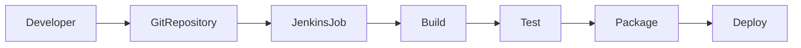

---

## Key Components

| Component | Purpose |
|------------|----------|
| Job Name | Unique job identifier |
| Source Code Management (SCM) | Retrieves source code |
| Build Triggers | Starts the job automatically or manually |
| Build Steps | Executes commands or scripts |
| Post-build Actions | Archives artifacts, sends notifications, deploys applications |
| Workspace | Directory where the build runs |
| Build History | Stores previous build results |

---

## Types (if applicable)

| Job Type | Description | Recommended |
|-----------|-------------|-------------|
| Freestyle Project | GUI-based job configuration | Small projects |
| Pipeline Project | CI/CD workflow defined as code | ✅ Most Common |
| Multibranch Pipeline | Automatically builds multiple Git branches | ✅ Enterprise Projects |

> **Interview Point**
>
> Modern organizations primarily use **Pipeline Projects** and **Multibranch Pipelines** because they support **Pipeline as Code** and version-controlled CI/CD workflows.

---

## Lifecycle / Workflow

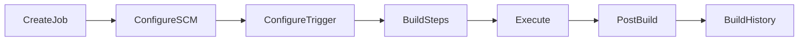

---

## Configuration / Syntax (if applicable)

General Job Configuration Flow

```
Create Job
      ↓
Choose Job Type
      ↓
Configure Git Repository
      ↓
Configure Build Trigger
      ↓
Configure Build Steps
      ↓
Save Job
      ↓
Run Build
```

---

## Important Commands (if applicable)

Although jobs are usually managed from the Jenkins UI, useful Linux commands include:

Restart Jenkins

```bash
sudo systemctl restart jenkins
```

View Jenkins Logs

```bash
journalctl -u jenkins
```

View Workspace

```bash
ls /var/lib/jenkins/workspace/
```

List Jobs

```bash
ls /var/lib/jenkins/jobs/
```

---

## Important Files (if applicable)

| File/Directory | Purpose |
|---------------|----------|
| `/var/lib/jenkins/jobs/` | Job configurations |
| `/var/lib/jenkins/workspace/` | Build workspace |
| `config.xml` | Job configuration |
| `Jenkinsfile` | Pipeline definition |
| `/var/lib/jenkins/builds/` | Build history |

---

## Real-World Use Cases

- Java application builds
- .NET builds
- Docker image creation
- Kubernetes deployment
- Terraform automation
- Azure deployment
- AWS deployment
- Nightly builds
- Security scanning
- Automated testing

---

## Advantages

- Automates repetitive tasks
- Reduces manual effort
- Supports Pipeline as Code
- Integrates with hundreds of DevOps tools
- Easy scheduling
- Supports distributed builds

---

## Limitations

- Freestyle jobs are difficult to version control
- Large numbers of jobs require organization
- Poorly designed jobs increase maintenance effort
- Complex workflows are difficult with Freestyle Projects

---

## Common Interview Questions (Concept Only)

- What is a Jenkins Job?
- What are the different types of Jenkins Jobs?
- Difference between Freestyle and Pipeline Jobs?
- Which job type is recommended for production?
- What is a Multibranch Pipeline?
- What is Job Configuration?
- What are Build Triggers?
- What is Workspace?
- Where are Jenkins Jobs stored?

---

## Common Mistakes

- Using Freestyle Projects for complex CI/CD workflows
- Hardcoding credentials
- Running builds on the controller
- Ignoring workspace cleanup
- Not using source control for pipeline definitions
- Not configuring build retention policies

---

## Troubleshooting

| Problem | Solution |
|----------|----------|
| Job not starting | Verify build trigger and Jenkins service |
| Git checkout failure | Check repository URL and credentials |
| Build step fails | Review Console Output |
| Job stuck in queue | Verify agent availability |
| Workspace issues | Clean workspace and rerun build |
| Permission denied | Verify Jenkins user permissions |

---

## Summary

Jenkins Jobs automate software development tasks. While **Freestyle Projects** are suitable for simple automation, **Pipeline Projects** and **Multibranch Pipelines** are the preferred approach in production because they support version-controlled, scalable, and maintainable CI/CD workflows.

---

# Freestyle Project

## Overview

A **Freestyle Project** is the simplest Jenkins job type.

Configuration is performed entirely through the Jenkins web interface without writing a Jenkinsfile.

> **Interview Point**
>
> Freestyle Projects are suitable for simple automation but are **not recommended for complex CI/CD pipelines** because they lack Pipeline as Code.

---

## Why It Is Used

Freestyle Projects are commonly used for:

- Small automation tasks
- Learning Jenkins
- Running scripts
- Scheduled jobs
- Utility tasks

---

## Architecture / Working

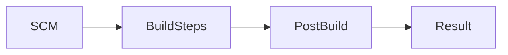

---

## Key Components

- Source Code Management
- Build Triggers
- Build Environment
- Build Steps
- Post-build Actions

---

## Types (if applicable)

Not applicable.

---

## Lifecycle / Workflow

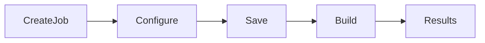

---

## Configuration / Syntax (if applicable)

Navigation

```
New Item

↓

Freestyle Project
```

Configure:

- Git Repository
- Build Trigger
- Build Step
- Post-build Actions

---

## Important Commands (if applicable)

Not applicable.

---

## Important Files (if applicable)

```
config.xml
```

---

## Real-World Use Cases

- Backup jobs
- Cleanup jobs
- Running shell scripts
- Scheduled reports

---

## Advantages

- Easy to create
- GUI-based
- Suitable for beginners

---

## Limitations

- No Pipeline as Code
- Difficult to version control
- Limited scalability
- Manual configuration

---

## Common Interview Questions (Concept Only)

- What is a Freestyle Project?
- Why are Freestyle Projects less common today?

---

## Common Mistakes

- Using Freestyle Projects for enterprise CI/CD
- Duplicating similar job configurations

---

## Troubleshooting

- Verify build steps
- Review Console Output
- Check SCM configuration

---

## Summary

Freestyle Projects are simple, GUI-driven jobs best suited for basic automation rather than complex production pipelines.

---

# Pipeline Project

## Overview

A **Pipeline Project** defines the complete CI/CD workflow using a **Jenkinsfile**.

This approach is known as **Pipeline as Code**.

> **Interview Point**
>
> Pipeline Projects are the industry standard because the pipeline definition is stored in version control alongside the application code.

---

## Why It Is Used

Pipeline Projects provide:

- Version-controlled pipelines
- Repeatable builds
- Scalable workflows
- Multi-stage deployments

---

## Architecture / Working

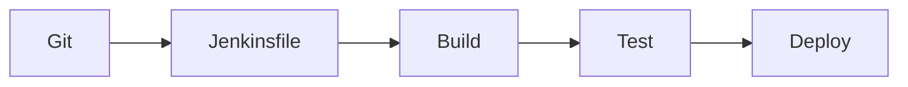

---

## Key Components

- Jenkinsfile
- Stages
- Steps
- Agent
- Environment Variables
- Post Actions

---

## Types (if applicable)

| Type | Description |
|------|-------------|
| Declarative Pipeline | Structured, recommended syntax |
| Scripted Pipeline | Groovy-based, more flexible |

---

## Lifecycle / Workflow

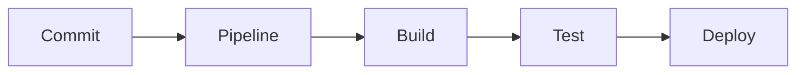

---

## Configuration / Syntax (if applicable)

Example

```groovy
pipeline {
    agent any

    stages {

        stage('Build') {
            steps {
                echo 'Building...'
            }
        }

        stage('Test') {
            steps {
                echo 'Testing...'
            }
        }
    }
}
```

---

## Important Commands (if applicable)

Pipeline execution is managed by Jenkins.

---

## Important Files (if applicable)

```
Jenkinsfile
```

---

## Real-World Use Cases

- CI/CD pipelines
- Docker builds
- Kubernetes deployments
- Azure deployments
- AWS deployments

---

## Advantages

- Pipeline as Code
- Version controlled
- Easy maintenance
- Supports complex workflows

---

## Limitations

- Requires learning Jenkins Pipeline syntax
- More complex than Freestyle Projects

---

## Common Interview Questions (Concept Only)

- What is a Pipeline Project?
- What is Pipeline as Code?
- Declarative vs Scripted Pipeline?

---

## Common Mistakes

- Hardcoding credentials
- Creating overly complex pipelines
- Not using shared libraries where appropriate

---

## Troubleshooting

- Validate Jenkinsfile syntax
- Review Pipeline Logs
- Check stage failures

---

## Summary

Pipeline Projects are the preferred approach for modern CI/CD because they provide scalable, version-controlled automation.

---

# Multibranch Pipeline

## Overview

A **Multibranch Pipeline** automatically discovers Git branches containing a **Jenkinsfile** and creates a separate pipeline for each branch.

This enables branch-specific CI/CD.

> **Interview Point**
>
> Every branch with a Jenkinsfile can have its own independent pipeline execution.

---

## Why It Is Used

Useful for:

- Feature branches
- Release branches
- Hotfix branches
- Pull Request validation

---

## Architecture / Working

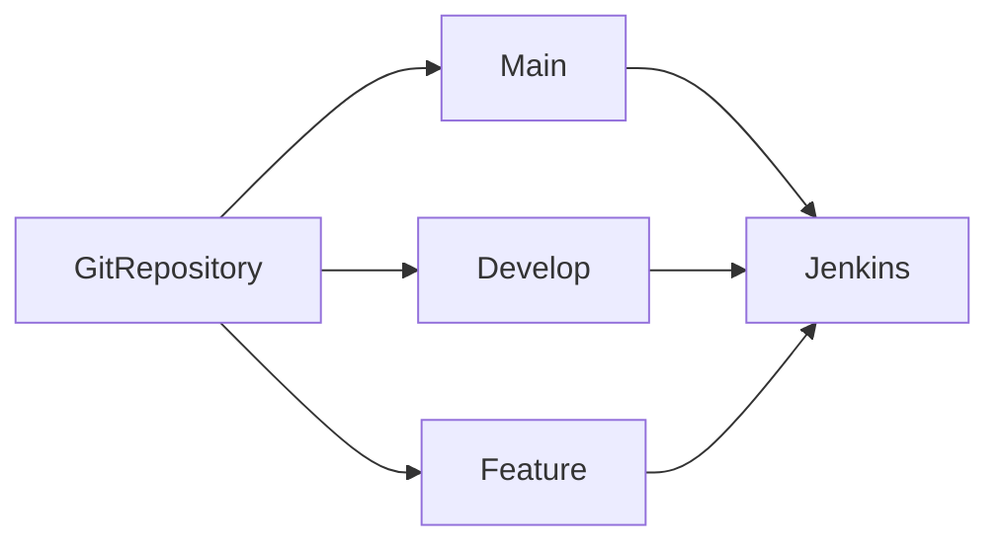

---

## Key Components

- Branch Scanner
- Jenkinsfile
- SCM Configuration
- Branch Discovery

---

## Types (if applicable)

Branch types:

- Main
- Develop
- Feature
- Release
- Hotfix

---

## Lifecycle / Workflow

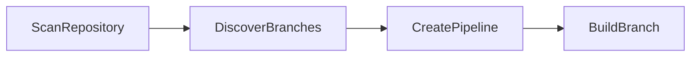

---

## Configuration / Syntax (if applicable)

```
New Item

↓

Multibranch Pipeline

↓

Configure Git Repository

↓

Branch Sources

↓

Save
```

---

## Important Commands (if applicable)

Not applicable.

---

## Important Files (if applicable)

```
Jenkinsfile
```

---

## Real-World Use Cases

- GitFlow
- Feature branch testing
- Pull Request validation
- Enterprise CI/CD

---

## Advantages

- Automatic branch discovery
- Independent pipelines
- Easy branch management

---

## Limitations

- More resource-intensive than a single pipeline
- Requires a Jenkinsfile in each branch

---

## Common Interview Questions (Concept Only)

- What is a Multibranch Pipeline?
- Why is it used?
- How are branches discovered?

---

## Common Mistakes

- Missing Jenkinsfile in feature branches
- Incorrect branch filters
- Not cleaning obsolete branch jobs

---

## Troubleshooting

| Problem | Solution |
|----------|----------|
| Branch not detected | Verify branch scanning and Jenkinsfile presence |
| Pipeline not created | Check SCM credentials and repository configuration |

---

## Summary

Multibranch Pipelines automatically create and manage pipelines for every branch containing a Jenkinsfile, making them ideal for Git-based team development.

---

# Job Configuration

## Overview

Job Configuration defines how Jenkins executes a job.

It includes:

- Source Code Management
- Build Triggers
- Build Environment
- Build Steps
- Post-build Actions

---

## Why It Is Used

Configuration determines:

- What to build
- When to build
- How to build
- What happens after the build

---

## Architecture / Working

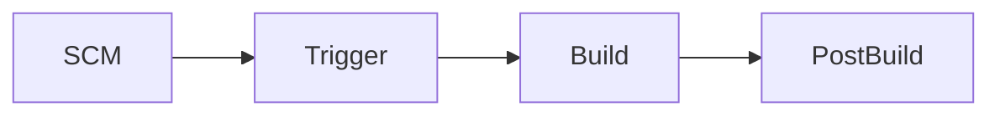

---

## Key Components

| Component | Purpose |
|-----------|----------|
| SCM | Source code |
| Trigger | Job execution |
| Environment | Build settings |
| Steps | Build commands |
| Post Actions | Notifications, deployments, artifacts |

---

## Types (if applicable)

Not applicable.

---

## Lifecycle / Workflow

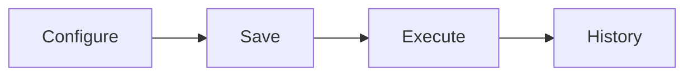

---

## Configuration / Syntax (if applicable)

Typical configuration sections:

- General
- Source Code Management
- Build Triggers
- Build Environment
- Build Steps
- Post-build Actions

---

## Important Commands (if applicable)

Not applicable.

---

## Important Files (if applicable)

```
config.xml
```

---

## Real-World Use Cases

- CI builds
- Deployment pipelines
- Utility jobs

---

## Advantages

- Flexible
- Supports multiple build tools

---

## Limitations

- Poor configuration management increases maintenance

---

## Common Interview Questions (Concept Only)

- What are the main sections of Job Configuration?
- Where is Job Configuration stored?

---

## Common Mistakes

- Incorrect SCM credentials
- Missing build triggers
- Hardcoded environment variables

---

## Troubleshooting

- Verify configuration
- Review Console Output
- Validate SCM connectivity

---

## Summary

Job Configuration defines every aspect of how Jenkins executes and manages a job.

---

# Build Triggers

## Overview

A **Build Trigger** defines **when a Jenkins job should start**.

Jobs can be triggered manually, automatically, or on a schedule.

---

## Why It Is Used

Build Triggers automate CI/CD by starting builds whenever predefined events occur.

---

## Architecture / Working

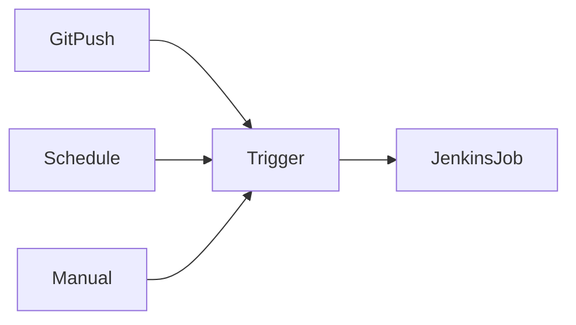

---

## Key Components

- Manual Trigger
- GitHub Webhook
- SCM Polling
- Scheduled Build (Cron)
- Upstream Project Trigger

---

## Types (if applicable)

| Trigger | Purpose |
|----------|----------|
| Manual Build | User starts the build |
| Poll SCM | Periodically checks for repository changes |
| Webhook | GitHub/GitLab immediately notifies Jenkins after a push |
| Scheduled Build | Runs according to a cron schedule |
| Upstream Build | Starts after another job completes |

> **Interview Point**
>
> **Webhooks are preferred over SCM Polling** because they trigger builds immediately and avoid unnecessary repository polling.

---

## Lifecycle / Workflow

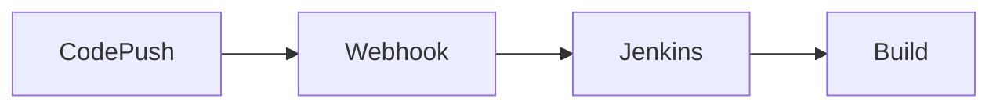

---

## Configuration / Syntax (if applicable)

SCM Polling Example

```
H/5 * * * *
```

Runs approximately every 5 minutes.

Nightly Build

```
0 2 * * *
```

Runs daily at 2:00 AM.

---

## Important Commands (if applicable)

Not applicable.

---

## Important Files (if applicable)

```
config.xml
```

---

## Real-World Use Cases

- Build after every Git push
- Nightly builds
- Weekly security scans
- Scheduled cleanup jobs
- Automatic deployments

---

## Advantages

- Fully automated builds
- Faster feedback
- Eliminates manual execution
- Supports event-driven automation

---

## Limitations

- Poorly configured triggers can start unnecessary builds
- Frequent polling increases server load

---

## Common Interview Questions (Concept Only)

- What are Build Triggers?
- Difference between SCM Polling and Webhooks?
- What is a Cron Trigger?
- Which trigger is recommended for GitHub?

---

## Common Mistakes

- Using SCM Polling instead of Webhooks without a valid reason
- Configuring overlapping schedules
- Triggering multiple duplicate builds
- Forgetting to configure repository webhooks

---

## Troubleshooting

| Problem | Solution |
|----------|----------|
| Build not triggered | Verify webhook or polling configuration |
| Duplicate builds | Check for multiple configured triggers |
| Scheduled build not running | Validate cron syntax and Jenkins timezone |
| Git webhook failure | Verify repository webhook URL, credentials, and network connectivity |

---

## Summary

Build Triggers determine when Jenkins starts a job. Common triggers include manual execution, Git webhooks, SCM polling, scheduled cron jobs, and upstream job completion. For modern CI/CD workflows, **Git webhooks are the recommended trigger mechanism** because they provide immediate, event-driven pipeline execution.
