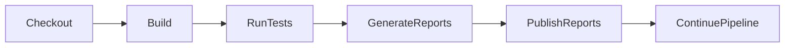
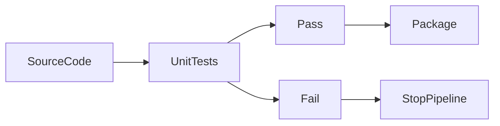
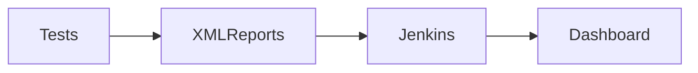

# Testing Integration

## Overview

**Testing Integration** is the process of automatically executing tests during a Jenkins Pipeline to verify that the application functions correctly before packaging or deployment.

Jenkins integrates with various testing frameworks to execute automated tests and publish the results.

A typical testing stage includes:

- Running unit tests
- Collecting test results
- Publishing test reports
- Marking the build as Passed, Failed, or Unstable
- Preventing faulty code from moving to the next stage

> **Interview Point**
>
> Testing is a core stage of **Continuous Integration (CI)**. A build that compiles successfully but fails automated tests should generally **not** proceed to deployment.

---

## Why It Is Used

Testing Integration helps to:

- Detect bugs early
- Improve software quality
- Prevent deployment of defective code
- Automate quality assurance
- Reduce manual testing effort
- Increase developer confidence

---

## Architecture / Working


---

## Key Components

| Component | Purpose |
|------------|----------|
| Jenkins Pipeline | Automates testing |
| Testing Framework | Executes tests |
| Test Reports | Stores test results |
| Build Tool | Runs tests |
| Workspace | Stores temporary results |

---

## Types (if applicable)

Common testing types integrated with Jenkins:

- Unit Testing
- Integration Testing
- Functional Testing
- UI Testing
- API Testing

> **Interview Focus**
>
> For Jenkins interviews, **Unit Testing** and **JUnit Reports** are the most frequently discussed topics.

---

## Lifecycle / Workflow



---

## Configuration / Syntax (if applicable)

Basic Pipeline Example

```groovy
pipeline {

    agent any

    stages {

        stage('Test') {

            steps {

                sh 'mvn test'

            }

        }

    }

}
```

Publish JUnit Reports

```groovy
post {

    always {

        junit 'target/surefire-reports/*.xml'

    }

}
```

---

## Important Commands (if applicable)

Maven

```bash
mvn test
```

Gradle

```bash
gradle test
```

npm

```bash
npm test
```

Python

```bash
pytest
```

---

## Important Files (if applicable)

| File | Purpose |
|------|----------|
| Jenkinsfile | Pipeline definition |
| pom.xml | Maven configuration |
| build.gradle | Gradle configuration |
| package.json | npm configuration |
| target/surefire-reports | Maven JUnit reports |
| build/test-results | Gradle reports |

---

## Real-World Use Cases

- Java applications
- Spring Boot services
- Node.js applications
- Microservices
- REST APIs
- Enterprise CI/CD pipelines

---

## Advantages

- Early bug detection
- Automated validation
- Improved software quality
- Reduced manual testing
- Fast developer feedback
- Supports Continuous Integration

---

## Limitations

- Poor test coverage reduces effectiveness
- Flaky tests cause unreliable builds
- Large test suites increase build time

---

## Common Interview Questions (Concept Only)

- What is Testing Integration?
- Why is automated testing important in CI/CD?
- When should tests execute in a pipeline?
- What happens if tests fail?
- How does Jenkins publish test results?

---

## Common Mistakes

- Skipping automated tests
- Ignoring failed tests
- Running deployments before testing
- Not publishing test reports
- Poor test organization

---

## Troubleshooting

| Problem | Solution |
|----------|----------|
| Tests not executed | Verify pipeline stage |
| Reports missing | Check report path |
| Build marked unstable | Review failed test cases |
| Test framework not found | Install required dependencies |

---

## Summary

Testing Integration enables Jenkins to automatically execute tests, collect results, and ensure application quality before packaging or deployment.

---

# Unit Testing

## Overview

**Unit Testing** is the process of testing individual units or components of an application independently to verify that each unit behaves as expected.

A unit usually refers to:

- A method
- A function
- A class
- A module

Unit tests are typically written by developers and executed automatically during the Jenkins build process.

> **Interview Point**
>
> Unit Testing validates the smallest testable part of an application in isolation, often using mock objects for external dependencies.

---

## Why It Is Used

Unit Testing helps to:

- Detect bugs early
- Improve code quality
- Validate business logic
- Support refactoring
- Reduce debugging effort
- Increase developer confidence

---

## Architecture / Working



---

## Key Components

| Component | Purpose |
|------------|----------|
| Source Code | Application logic |
| Test Framework | Executes tests |
| Assertions | Validate expected behavior |
| Mock Objects | Simulate dependencies |
| Test Runner | Executes test suite |

---

## Types (if applicable)

Popular Unit Testing Frameworks

| Language | Framework |
|----------|-----------|
| Java | JUnit |
| Java | TestNG |
| JavaScript | Jest |
| Python | PyTest |
| C# | NUnit |

---

## Lifecycle / Workflow


---

## Configuration / Syntax (if applicable)

Maven

```bash
mvn test
```

Gradle

```bash
gradle test
```

npm

```bash
npm test
```

---

## Important Commands (if applicable)

```bash
mvn test
gradle test
npm test
pytest
```

---

## Important Files (if applicable)

| File | Purpose |
|------|----------|
| pom.xml | Maven project |
| build.gradle | Gradle project |
| package.json | Node.js project |

---

## Real-World Use Cases

- Business logic validation
- API testing
- Utility classes
- Service layer testing

---

## Advantages

- Early bug detection
- Faster debugging
- Better code quality
- Supports Continuous Integration
- Simplifies maintenance

---

## Limitations

- Does not validate complete application integration
- Requires good test coverage
- External systems often require mocking

---

## Common Interview Questions (Concept Only)

- What is Unit Testing?
- Why are unit tests important?
- What is a unit?
- What are mock objects?
- Difference between Unit Testing and Integration Testing?

---

## Common Mistakes

- Writing tests with external dependencies
- Low code coverage
- Ignoring failed tests
- Testing multiple components together

---

## Troubleshooting

| Problem | Solution |
|----------|----------|
| Tests failing unexpectedly | Review assertions |
| Missing dependencies | Install testing framework |
| Slow tests | Remove unnecessary external calls |

---

## Summary

Unit Testing validates individual components independently and is one of the earliest quality checks in a Jenkins CI pipeline.

---

# Test Reports

## Overview

**Test Reports** are structured summaries generated after test execution that provide detailed information about passed, failed, skipped, and errored test cases.

Jenkins collects these reports and displays them in the job dashboard for easy analysis.

> **Interview Point**
>
> Jenkins does not generate test reports itself. Test frameworks generate report files (usually XML), and Jenkins publishes them.

---

## Why It Is Used

Test Reports help to:

- Analyze test execution
- Identify failed test cases
- Monitor application quality
- Track testing history
- Improve debugging

---

## Architecture / Working



---

## Key Components

| Component | Purpose |
|------------|----------|
| Test Framework | Generates reports |
| XML Report | Test results |
| Jenkins | Displays reports |
| Dashboard | Visualizes results |

---

## Types (if applicable)

Common Report Formats

- XML
- HTML

---

## Lifecycle / Workflow


---

## Configuration / Syntax (if applicable)

Publish Reports

```groovy
post {

    always {

        junit 'target/surefire-reports/*.xml'

    }

}
```

---

## Important Commands (if applicable)

Maven

```bash
mvn test
```

Gradle

```bash
gradle test
```

---

## Important Files (if applicable)

| File | Purpose |
|------|----------|
| target/surefire-reports | Maven reports |
| build/test-results | Gradle reports |

---

## Real-World Use Cases

- CI dashboards
- QA reporting
- Release validation

---

## Advantages

- Easy debugging
- Historical tracking
- Visual reporting
- Build quality metrics

---

## Limitations

- Incorrect report path prevents publishing
- Missing reports reduce visibility

---

## Common Interview Questions (Concept Only)

- What are Test Reports?
- Why publish test reports?
- Where are reports stored?
- Which report formats does Jenkins support?

---

## Common Mistakes

- Incorrect XML path
- Forgetting report publishing
- Ignoring failed tests

---

## Troubleshooting

| Problem | Solution |
|----------|----------|
| Reports missing | Verify XML path |
| No tests displayed | Check report generation |
| Invalid report | Validate XML format |

---

## Summary

Test Reports provide detailed visibility into automated test execution and help teams quickly identify and resolve software defects.

---

# JUnit Reports

## Overview

**JUnit Reports** are XML files generated by the JUnit testing framework (and many other frameworks using the same XML format) that contain detailed test execution results.

Jenkins uses the **JUnit Plugin** to read these reports and display:

- Passed tests
- Failed tests
- Skipped tests
- Test execution history
- Trend graphs

> **Interview Point**
>
> Jenkins can publish JUnit-style XML reports generated by frameworks other than JUnit, as long as they follow the JUnit XML format.

---

## Why It Is Used

JUnit Reports help to:

- Publish automated test results
- Display build quality
- Track failures
- Generate historical trends
- Improve debugging

---

## Architecture / Working


---

## Key Components

| Component | Purpose |
|------------|----------|
| JUnit Framework | Executes tests |
| XML Report | Stores results |
| Jenkins JUnit Plugin | Publishes reports |
| Dashboard | Displays results |

---

## Types (if applicable)

Common Report Locations

| Tool | Location |
|------|----------|
| Maven | `target/surefire-reports/*.xml` |
| Gradle | `build/test-results/test/*.xml` |

---

## Lifecycle / Workflow


---

## Configuration / Syntax (if applicable)

Publish JUnit Reports

```groovy
post {

    always {

        junit 'target/surefire-reports/*.xml'

    }

}
```

Multiple Report Paths

```groovy
junit '**/test-results/*.xml'
```

---

## Important Commands (if applicable)

Run Maven Tests

```bash
mvn test
```

Run Gradle Tests

```bash
gradle test
```

---

## Important Files (if applicable)

| File | Purpose |
|------|----------|
| `target/surefire-reports/*.xml` | Maven JUnit reports |
| `build/test-results/test/*.xml` | Gradle JUnit reports |
| Jenkinsfile | Pipeline definition |

---

## Real-World Use Cases

- Spring Boot applications
- Enterprise Java projects
- Microservices
- Continuous Integration pipelines
- Automated regression testing

---

## Advantages

- Standard XML format
- Easy Jenkins integration
- Historical reporting
- Test trend analysis
- Detailed failure information

---

## Limitations

- XML reports must be generated correctly
- Incorrect file paths prevent report publishing
- Large test suites produce large report files

---

## Common Interview Questions (Concept Only)

- What are JUnit Reports?
- How does Jenkins publish JUnit reports?
- Where are Maven JUnit reports stored?
- What happens if a JUnit report contains failed tests?
- Can Jenkins publish reports from frameworks other than JUnit?

---

## Common Mistakes

- Incorrect report file path
- Forgetting to execute tests before publishing reports
- Deleting reports before the publish step
- Assuming Jenkins generates reports automatically

---

## Troubleshooting

| Problem | Solution |
|----------|----------|
| No JUnit reports found | Verify report path and ensure tests executed successfully |
| Build marked unstable | Review failed test cases |
| XML parsing error | Validate report format |
| Reports not displayed | Confirm the JUnit Plugin is installed and configured |

---

## Summary

JUnit Reports provide standardized XML-based test results that Jenkins can publish to display detailed testing information, historical trends, and build quality metrics. They are one of the most commonly used reporting mechanisms in enterprise Jenkins CI/CD pipelines.
