# Credentials Management

## Overview

**Credentials Management** in Jenkins is the process of securely storing, managing, and accessing sensitive information such as passwords, API tokens, SSH keys, and cloud credentials without exposing them in jobs or pipelines.

Instead of hardcoding secrets inside a Jenkinsfile or scripts, Jenkins stores them in its **Credentials Store** and injects them into jobs only when needed.

Common credentials include:

- Username & Password
- SSH Private Keys
- Personal Access Tokens (PAT)
- API Keys
- Secret Text
- Cloud Service Principal Credentials
- Docker Registry Credentials

> **Interview Point**
>
> **Never hardcode secrets in a Jenkinsfile.** Store them in Jenkins Credentials and reference them using their **Credential ID**.

---

## Why It Is Used

Credentials Management helps to:

- Secure sensitive information
- Prevent credential leakage
- Centralize secret management
- Simplify authentication
- Support CI/CD automation
- Improve compliance and auditing

---

## Architecture / Working

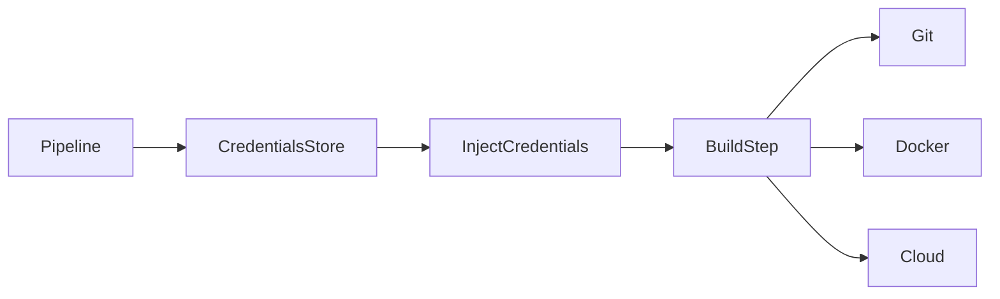

---

## Key Components

| Component | Purpose |
|------------|----------|
| Credentials Store | Securely stores secrets |
| Credential ID | Unique identifier |
| Jenkins Pipeline | Requests credentials |
| Credentials Binding Plugin | Injects secrets into jobs |
| Build Agent | Uses credentials during execution |

---

## Types (if applicable)

Common Jenkins Credential Types

| Credential Type | Usage |
|-----------------|------|
| Username & Password | Git, Docker, Databases |
| SSH Username with Private Key | Git SSH, Linux Servers |
| Secret Text | API Tokens, PATs |
| Secret File | Certificates, Configuration Files |
| Certificate | SSL/TLS Authentication |

---

## Lifecycle / Workflow

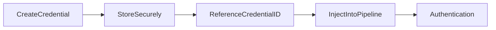

---

## Configuration / Syntax (if applicable)

Declarative Pipeline Example

```groovy
pipeline {

    agent any

    environment {

        GITHUB_TOKEN = credentials('github-pat')

    }

    stages {

        stage('Example') {

            steps {

                sh 'echo "Credential loaded successfully"'

            }

        }

    }

}
```

Using `withCredentials`

```groovy
withCredentials([
    usernamePassword(
        credentialsId: 'git-creds',
        usernameVariable: 'USERNAME',
        passwordVariable: 'PASSWORD'
    )
]) {

    sh 'echo "Authenticated"'

}
```

---

## Important Commands (if applicable)

No CLI commands are commonly used.

Credential management is primarily performed through:

- Jenkins UI
- Jenkins Pipeline
- Jenkins Configuration as Code (JCasC)

---

## Important Files (if applicable)

| File | Purpose |
|------|----------|
| Jenkinsfile | References credentials |
| config.xml | Jenkins configuration (managed internally) |

---

## Real-World Use Cases

- Clone private Git repositories
- Push Docker images
- Deploy to Kubernetes
- Authenticate with Azure
- Authenticate with AWS
- Access private APIs

---

## Advantages

- Secure secret storage
- Prevents hardcoding passwords
- Centralized management
- Easy pipeline integration
- Supports multiple authentication methods

---

## Limitations

- Credentials must be managed carefully
- Excessive permissions increase security risk
- Backup and migration require attention

---

## Common Interview Questions (Concept Only)

- What is Jenkins Credentials Management?
- Why should secrets not be hardcoded?
- What is a Credential ID?
- How are credentials accessed in a pipeline?
- Which credential types does Jenkins support?

---

## Common Mistakes

- Hardcoding passwords
- Printing secrets in logs
- Using administrator credentials for every job
- Sharing one credential across unrelated projects
- Giving excessive permissions

---

## Troubleshooting

| Problem | Solution |
|----------|----------|
| Credential not found | Verify Credential ID |
| Authentication failed | Check username/password or key |
| Secret exposed in logs | Mask sensitive output |
| Permission denied | Verify credential access |

---

## Summary

Credentials Management allows Jenkins to securely store and inject secrets into pipelines, enabling secure authentication without exposing sensitive information in source code.

---

# Credentials Store

## Overview

The **Credentials Store** is Jenkins' secure repository for storing authentication information used by jobs and pipelines.

Credentials are encrypted and referenced by a unique **Credential ID**.

> **Interview Point**
>
> Pipelines reference **Credential IDs**, not actual passwords.

---

## Why It Is Used

The Credentials Store helps to:

- Secure passwords
- Store SSH keys
- Store API tokens
- Manage cloud credentials
- Centralize authentication

---

## Architecture / Working

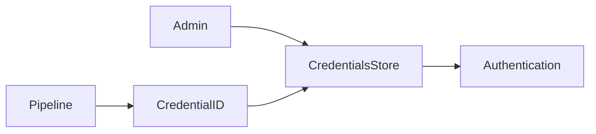

---

## Key Components

| Component | Purpose |
|------------|----------|
| Global Credentials | Shared across Jenkins |
| Folder Credentials | Folder-specific |
| Domain | Organizes credentials |
| Credential ID | Pipeline reference |

---

## Types (if applicable)

Credential Scopes

| Scope | Usage |
|-------|------|
| Global | Available across Jenkins |
| Folder | Available only within a folder |
| System | Internal Jenkins use |

---

## Lifecycle / Workflow

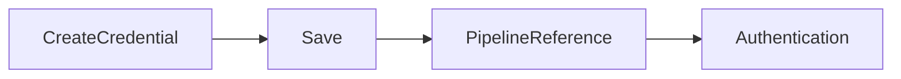

---

## Configuration / Syntax (if applicable)

Environment Variable Example

```groovy
environment {

    MY_SECRET = credentials('secret-id')

}
```

---

## Important Commands (if applicable)

Not Applicable

---

## Important Files (if applicable)

Managed internally by Jenkins.

---

## Real-World Use Cases

- Git authentication
- Docker Hub login
- Azure Service Principal
- AWS IAM credentials

---

## Advantages

- Centralized
- Secure
- Easy to manage
- Encrypted storage

---

## Limitations

- Requires proper access control
- Credentials require periodic rotation

---

## Common Interview Questions (Concept Only)

- What is the Jenkins Credentials Store?
- Where are credentials stored?
- What is a Credential ID?

---

## Common Mistakes

- Duplicate credentials
- Weak naming conventions
- Poor permission management

---

## Troubleshooting

| Problem | Solution |
|----------|----------|
| Missing credential | Verify scope |
| Incorrect ID | Check Credential ID |

---

## Summary

The Credentials Store securely manages secrets and provides centralized authentication for Jenkins pipelines.

---

# Username & Password

## Overview

The **Username & Password** credential type stores authentication information consisting of a username and password.

This is one of the most commonly used credential types.

Typical uses include:

- Git authentication
- Docker Hub
- Databases
- Internal applications
- Legacy systems

> **Interview Point**
>
> GitHub now recommends **Personal Access Tokens (PATs)** instead of account passwords for HTTPS authentication.

---

## Why It Is Used

- Authenticate to Git
- Access private repositories
- Login to Docker Hub
- Connect to databases
- Authenticate to internal services

---

## Architecture / Working

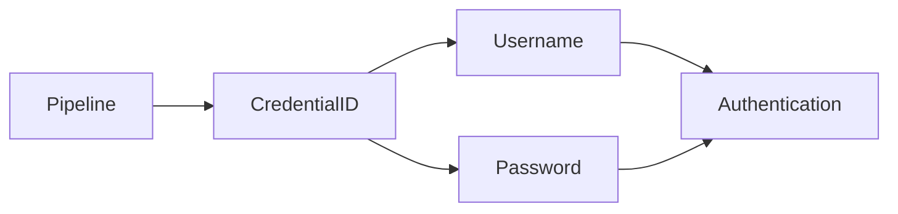

---

## Key Components

| Component | Purpose |
|------------|----------|
| Username | Login name |
| Password | Authentication secret |
| Credential ID | Pipeline reference |

---

## Types (if applicable)

Typical Usage

- GitHub
- GitLab
- Bitbucket
- Docker Hub
- Databases

---

## Lifecycle / Workflow

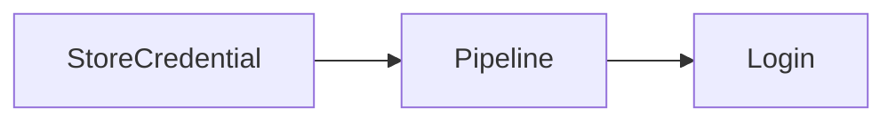

---

## Configuration / Syntax (if applicable)

```groovy
withCredentials([
usernamePassword(
credentialsId: 'git-creds',
usernameVariable: 'USER',
passwordVariable: 'PASS'
)
]) {

    sh 'git clone https://example.com/repo.git'

}
```

---

## Important Commands (if applicable)

Not Applicable

---

## Important Files (if applicable)

Jenkinsfile

---

## Real-World Use Cases

- Clone private repositories
- Push Docker images
- Database authentication

---

## Advantages

- Simple
- Easy to configure
- Widely supported

---

## Limitations

- Password rotation required
- Less secure than SSH for Git

---

## Common Interview Questions (Concept Only)

- When should Username & Password credentials be used?
- Why are PATs replacing passwords?

---

## Common Mistakes

- Using actual passwords instead of PATs
- Printing passwords in console logs

---

## Troubleshooting

| Problem | Solution |
|----------|----------|
| Login failed | Verify credentials |
| Permission denied | Check account access |

---

## Summary

Username & Password credentials provide simple authentication for services that require traditional login credentials.

---

# SSH Keys

## Overview

**SSH Keys** provide secure, passwordless authentication using a public/private key pair.

Jenkins stores the **private key**, while the remote server or Git provider stores the **public key**.

SSH authentication is widely used for:

- Git repositories
- Linux servers
- Deployment automation
- Remote command execution

> **Interview Point**
>
> SSH authentication is generally more secure than password-based authentication for Git operations.

---

## Why It Is Used

- Passwordless authentication
- Secure Git access
- Server deployment
- Remote automation

---

## Architecture / Working

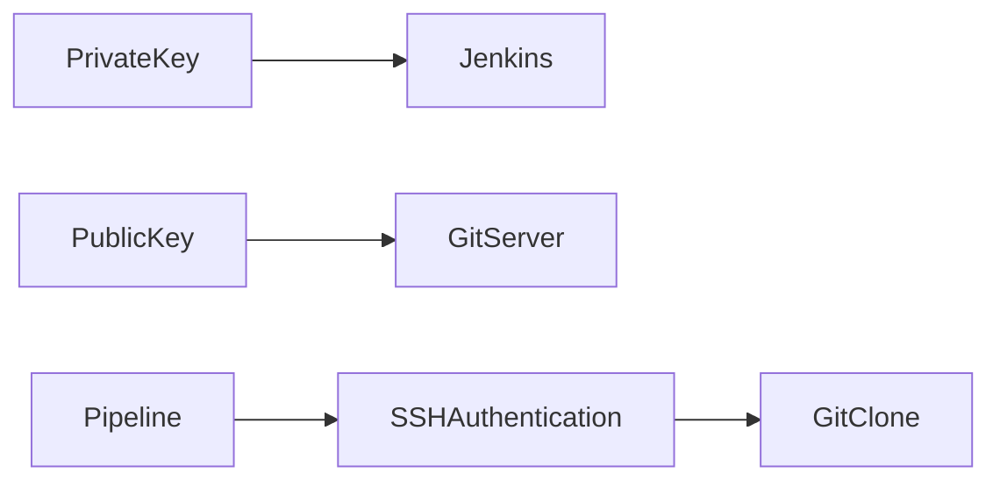

---

## Key Components

| Component | Purpose |
|------------|----------|
| Private Key | Stored in Jenkins |
| Public Key | Stored on remote system |
| SSH Agent | Uses private key |
| Credential ID | Pipeline reference |

---

## Types (if applicable)

SSH Credential

- SSH Username with Private Key

---

## Lifecycle / Workflow

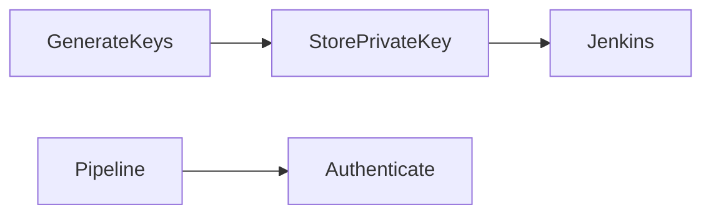

---

## Configuration / Syntax (if applicable)

```groovy
sshagent(['git-ssh']) {

    sh 'git clone git@github.com:example/repo.git'

}
```

---

## Important Commands (if applicable)

Generate SSH Key

```bash
ssh-keygen
```

View Public Key

```bash
cat ~/.ssh/id_ed25519.pub
```

---

## Important Files (if applicable)

| File | Purpose |
|------|----------|
| id_ed25519 | Private key |
| id_ed25519.pub | Public key |
| known_hosts | Trusted hosts |

---

## Real-World Use Cases

- GitHub
- GitLab
- Azure Repos
- Linux deployment
- Kubernetes automation

---

## Advantages

- Secure
- Passwordless
- Easy automation
- Industry standard

---

## Limitations

- Key management required
- Lost private key requires regeneration

---

## Common Interview Questions (Concept Only)

- How does SSH authentication work?
- Why use SSH instead of passwords?
- Where should private keys be stored?

---

## Common Mistakes

- Exposing private keys
- Incorrect file permissions
- Not adding the public key to the server

---

## Troubleshooting

| Problem | Solution |
|----------|----------|
| Permission denied (publickey) | Verify public key installation |
| Invalid key | Regenerate keys |
| Authentication failed | Check Credential ID |

---

## Summary

SSH Keys provide secure, passwordless authentication and are the preferred method for Git operations and server access in Jenkins pipelines.

---

# Secret Text

## Overview

**Secret Text** stores a single sensitive value rather than a username/password pair.

Examples include:

- GitHub Personal Access Tokens (PAT)
- API Keys
- OAuth Tokens
- Access Tokens
- License Keys

> **Interview Point**
>
> Secret Text is commonly used for **API authentication** and **Personal Access Tokens (PATs)**.

---

## Why It Is Used

- Store API tokens
- Authenticate cloud services
- Secure automation
- Access third-party APIs

---

## Architecture / Working

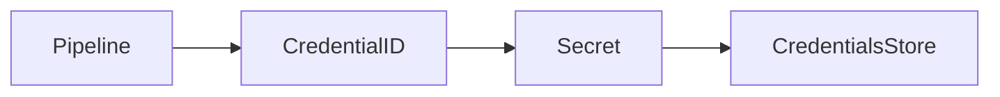

---

## Key Components

| Component | Purpose |
|------------|----------|
| Secret Text | Sensitive value |
| Credential ID | Pipeline reference |

---

## Types (if applicable)

Examples

- GitHub PAT
- Azure Token
- AWS Token
- API Key

---

## Lifecycle / Workflow

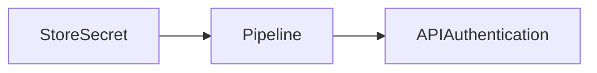

---

## Configuration / Syntax (if applicable)

```groovy
withCredentials([
string(credentialsId: 'github-token',
variable: 'TOKEN')
]) {

    sh 'echo "Using secure token"'

}
```

---

## Important Commands (if applicable)

Not Applicable

---

## Important Files (if applicable)

Jenkinsfile

---

## Real-World Use Cases

- GitHub PAT
- Azure DevOps PAT
- REST API authentication
- Slack notifications

---

## Advantages

- Simple
- Secure
- Easy integration

---

## Limitations

- Single value only
- Token rotation required

---

## Common Interview Questions (Concept Only)

- What is Secret Text?
- When should Secret Text be used?
- Difference between Secret Text and Username & Password?

---

## Common Mistakes

- Printing tokens
- Hardcoding API keys

---

## Troubleshooting

| Problem | Solution |
|----------|----------|
| Invalid token | Verify secret |
| Unauthorized | Check API permissions |

---

## Summary

Secret Text securely stores single authentication values such as API keys and Personal Access Tokens for use in Jenkins pipelines.

---

# Environment Variables

## Overview

**Environment Variables** allow Jenkins to make credentials and configuration values available to build steps during pipeline execution.

Sensitive credentials can be injected into environment variables at runtime without exposing them in the pipeline code.

> **Interview Point**
>
> Environment variables themselves are **not a secure storage mechanism**. Jenkins Credentials Store provides the security, while environment variables provide temporary access during execution.

---

## Why It Is Used

Environment Variables help to:

- Pass credentials to scripts
- Configure applications
- Share values across pipeline stages
- Avoid hardcoding configuration

---

## Architecture / Working

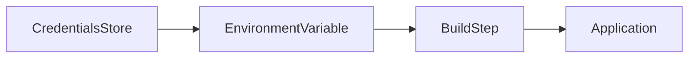

---

## Key Components

| Component | Purpose |
|------------|----------|
| Environment Variable | Runtime configuration |
| Credentials Binding | Secure injection |
| Jenkins Pipeline | Uses variables |

---

## Types (if applicable)

Examples

- PATH
- JAVA_HOME
- BUILD_NUMBER
- GIT_BRANCH
- Custom variables
- Credential-based variables

---

## Lifecycle / Workflow

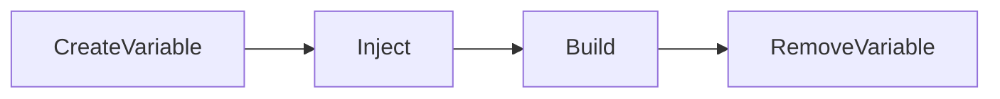

---

## Configuration / Syntax (if applicable)

Declarative Pipeline

```groovy
pipeline {

    agent any

    environment {

        APP_ENV = 'production'
        API_TOKEN = credentials('api-token')

    }

    stages {

        stage('Build') {

            steps {

                sh 'echo $APP_ENV'

            }

        }

    }

}
```

Scripted Pipeline

```groovy
withEnv(["ENV=production"]) {

    sh 'echo $ENV'

}
```

---

## Important Commands (if applicable)

Display Environment Variables

```bash
printenv
```

```bash
env
```

---

## Important Files (if applicable)

| File | Purpose |
|------|----------|
| Jenkinsfile | Defines environment variables |

---

## Real-World Use Cases

- Cloud authentication
- Database connections
- Docker registry login
- Kubernetes deployment
- API integrations

---

## Advantages

- Easy configuration management
- Reusable
- Secure when combined with Credentials Store
- Improves portability

---

## Limitations

- Variables exist only during execution
- Secrets can leak if explicitly printed to logs
- Not intended for persistent secret storage

---

## Common Interview Questions (Concept Only)

- What are Jenkins environment variables?
- How are credentials injected into environment variables?
- Difference between environment variables and credentials?
- Can environment variables store secrets securely?

---

## Common Mistakes

- Printing secret variables to console output
- Hardcoding sensitive values
- Confusing environment variables with credential storage
- Reusing variable names across stages without care

---

## Troubleshooting

| Problem | Solution |
|----------|----------|
| Variable not available | Verify pipeline scope |
| Credential variable empty | Check Credential ID |
| Secret displayed in logs | Remove debug output and use credentials binding |

---

## Summary

Environment Variables provide runtime configuration values for Jenkins pipelines and are commonly used to expose credentials, application settings, and build metadata securely during pipeline execution when combined with the Jenkins Credentials Store.
