# Jenkins Plugins

## Overview

**Jenkins Plugins** are modular extensions that add new features and integrations to Jenkins without modifying its core functionality.

Jenkins follows a **plugin-based architecture**, allowing users to install only the features they need. Plugins enable Jenkins to integrate with tools such as Git, Docker, Kubernetes, Maven, Azure, AWS, SonarQube, Slack, and many more.

Some common capabilities provided by plugins include:

- Source Code Management (SCM)
- Build Automation
- Testing
- Artifact Management
- Containerization
- Cloud Deployments
- Notifications
- Security

> **Interview Point**
>
> Jenkins' popularity comes largely from its **plugin ecosystem**, which contains thousands of plugins for integrating with DevOps tools.

---

## Why It Is Used

Jenkins Plugins help to:

- Extend Jenkins functionality
- Integrate with third-party tools
- Automate CI/CD workflows
- Support multiple programming languages
- Simplify pipeline development
- Improve deployment automation

---

## Architecture / Working

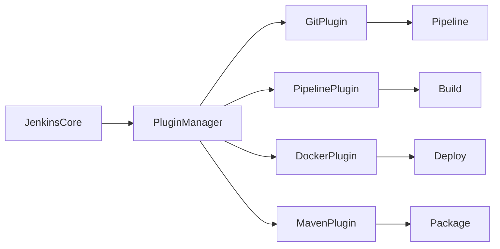

---

## Key Components

| Component | Purpose |
|-----------|----------|
| Jenkins Core | Base functionality |
| Plugin Manager | Installs and updates plugins |
| Installed Plugins | Extend Jenkins capabilities |
| Update Center | Repository for plugins |
| Dependencies | Required supporting plugins |

---

## Types (if applicable)

Common Plugin Categories

| Category | Examples |
|-----------|-----------|
| SCM | Git Plugin |
| Pipeline | Pipeline Plugin |
| Build Tools | Maven Plugin |
| Containers | Docker Plugin |
| Cloud | Kubernetes Plugin |
| Security | Credentials Plugin |
| Notifications | Slack Plugin |
| Code Quality | SonarQube Plugin |

---

## Lifecycle / Workflow

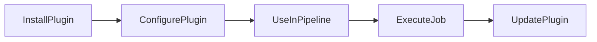

---

## Configuration / Syntax (if applicable)

Example Pipeline Using Multiple Plugins

```groovy
pipeline {

    agent any

    stages {

        stage('Checkout') {

            steps {

                git 'https://github.com/example/repo.git'

            }

        }

        stage('Build') {

            steps {

                sh 'mvn clean package'

            }

        }

        stage('Docker Build') {

            steps {

                sh 'docker build -t app .'

            }

        }

    }

}
```

---

## Important Commands (if applicable)

Plugin management is primarily performed through the Jenkins UI.

Useful commands:

Restart Jenkins after installing plugins (Linux)

```bash
sudo systemctl restart jenkins
```

Check Jenkins status

```bash
sudo systemctl status jenkins
```

---

## Important Files (if applicable)

| File | Purpose |
|------|----------|
| Jenkinsfile | Uses plugin features |
| plugins/ directory | Stores installed plugins |
| config.xml | Jenkins configuration |

---

## Real-World Use Cases

- Git integration
- Docker image creation
- Kubernetes deployment
- Maven builds
- SonarQube analysis
- Slack notifications
- Azure deployments

---

## Advantages

- Highly extensible
- Supports thousands of integrations
- Easy installation
- Active community support
- Enables complete CI/CD automation

---

## Limitations

- Too many plugins can slow Jenkins
- Plugin compatibility issues
- Security vulnerabilities in outdated plugins
- Plugin dependency conflicts

---

## Common Interview Questions (Concept Only)

- What are Jenkins Plugins?
- Why are plugins required?
- How are plugins installed?
- What is the Plugin Manager?
- What happens if a plugin dependency is missing?

---

## Common Mistakes

- Installing unnecessary plugins
- Ignoring plugin updates
- Installing incompatible plugin versions
- Not restarting Jenkins when required
- Using deprecated plugins

---

## Troubleshooting

| Problem | Solution |
|----------|----------|
| Plugin not visible | Restart Jenkins |
| Plugin installation failed | Check internet connectivity and Update Center |
| Dependency error | Install required dependent plugins |
| Pipeline step not found | Verify required plugin is installed |
| Jenkins startup failure | Review plugin compatibility and logs |

---

## Summary

Jenkins Plugins extend Jenkins by adding integrations with DevOps tools, making Jenkins one of the most flexible and widely adopted CI/CD automation platforms.

---

# Plugin Management

## Overview

**Plugin Management** is the process of installing, updating, configuring, disabling, and removing Jenkins plugins.

Jenkins provides a built-in **Plugin Manager** accessible through the web interface.

> **Interview Point**
>
> Most Jenkins features beyond the core installation are provided through plugins.

---

## Why It Is Used

Plugin Management helps to:

- Install new functionality
- Update plugins
- Remove unused plugins
- Resolve plugin dependencies
- Maintain Jenkins security

---

## Architecture / Working

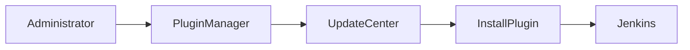

---

## Key Components

| Component | Purpose |
|-----------|----------|
| Installed Plugins | Active plugins |
| Available Plugins | Installable plugins |
| Updates | New versions |
| Dependencies | Supporting plugins |

---

## Types (if applicable)

Plugin Operations

- Install
- Update
- Disable
- Enable
- Uninstall

---

## Lifecycle / Workflow


---

## Configuration / Syntax (if applicable)

Managed through:

**Manage Jenkins → Plugins**

---

## Important Commands (if applicable)

Restart Jenkins

```bash
sudo systemctl restart jenkins
```

---

## Important Files (if applicable)

| File | Purpose |
|------|----------|
| plugins/ | Plugin storage |
| updates/ | Update information |

---

## Real-World Use Cases

- Install Git Plugin
- Upgrade Docker Plugin
- Remove unused plugins
- Enable Kubernetes integration

---

## Advantages

- Easy installation
- Centralized management
- Automatic dependency handling

---

## Limitations

- Updates may require restart
- Version compatibility issues

---

## Common Interview Questions (Concept Only)

- What is Plugin Manager?
- How are plugins updated?
- Why restart Jenkins after plugin installation?

---

## Common Mistakes

- Updating plugins directly in production
- Ignoring dependency warnings
- Installing duplicate functionality

---

## Troubleshooting

| Problem | Solution |
|----------|----------|
| Plugin update failed | Check Update Center connectivity |
| Plugin disabled | Enable and restart Jenkins |

---

## Summary

Plugin Management allows administrators to maintain Jenkins by installing, updating, configuring, and removing plugins safely.

---

# Git Plugin

## Overview

The **Git Plugin** enables Jenkins to integrate with Git repositories such as:

- GitHub
- GitLab
- Bitbucket
- Azure Repos

It allows Jenkins to clone repositories, checkout branches, poll for changes, and trigger builds automatically.

> **Interview Point**
>
> The Git Plugin is one of the most commonly installed Jenkins plugins and is required for most CI pipelines.

---

## Why It Is Used

The Git Plugin helps to:

- Clone repositories
- Checkout branches
- Detect code changes
- Trigger builds
- Support Git authentication

---

## Architecture / Working

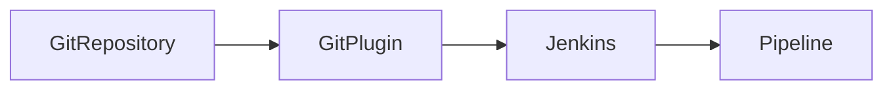

---

## Key Components

| Component | Purpose |
|-----------|----------|
| Repository URL | Git source |
| Credentials | Authentication |
| Branch | Source branch |
| Webhooks | Automatic builds |

---

## Types (if applicable)

Supported Repositories

- GitHub
- GitLab
- Bitbucket
- Azure Repos

---

## Lifecycle / Workflow

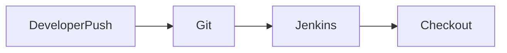

---

## Configuration / Syntax (if applicable)

```groovy
git branch: 'main',
url: 'https://github.com/example/repo.git'
```

---

## Important Commands (if applicable)

```bash
git clone
git fetch
git checkout
```

---

## Important Files (if applicable)

Jenkinsfile

---

## Real-World Use Cases

- Source checkout
- CI automation
- GitHub Webhooks
- Branch-based pipelines

---

## Advantages

- Native Git integration
- Supports authentication
- Easy pipeline usage

---

## Limitations

- Git must be installed on agents
- Credentials required for private repositories

---

## Common Interview Questions (Concept Only)

- What is the Git Plugin?
- How does Jenkins clone repositories?
- What authentication methods are supported?

---

## Common Mistakes

- Incorrect repository URL
- Missing credentials
- Wrong branch name

---

## Troubleshooting

| Problem | Solution |
|----------|----------|
| Authentication failed | Verify credentials |
| Repository not found | Check repository URL |
| Branch not found | Verify branch name |

---

## Summary

The Git Plugin enables Jenkins to integrate with Git repositories for automated source code checkout and Continuous Integration workflows.

---

# Pipeline Plugin

## Overview

The **Pipeline Plugin** enables Jenkins to execute CI/CD workflows defined as code using a **Jenkinsfile**.

Instead of manually configuring jobs through the UI, pipelines are written in **Groovy DSL** and stored with the application source code.

> **Interview Point**
>
> The Pipeline Plugin introduced the concept of **Pipeline as Code**, making Jenkins pipelines version-controlled and reproducible.

---

## Why It Is Used

Pipeline Plugin helps to:

- Automate CI/CD
- Define pipelines as code
- Support version control
- Improve maintainability
- Enable complex workflows

---

## Architecture / Working

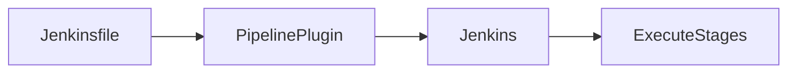

---

## Key Components

| Component | Purpose |
|-----------|----------|
| Jenkinsfile | Pipeline definition |
| Stages | Pipeline phases |
| Steps | Individual actions |
| Agent | Build node |

---

## Types (if applicable)

Pipeline Types

- Declarative Pipeline
- Scripted Pipeline

---

## Lifecycle / Workflow

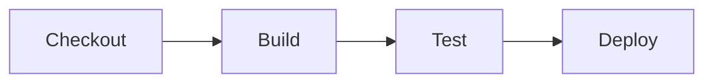

---

## Configuration / Syntax (if applicable)

```groovy
pipeline {

    agent any

    stages {

        stage('Build') {

            steps {

                echo 'Building'

            }

        }

    }

}
```

---

## Important Commands (if applicable)

Not Applicable

---

## Important Files (if applicable)

| File | Purpose |
|------|----------|
| Jenkinsfile | Pipeline definition |

---

## Real-World Use Cases

- CI/CD automation
- Docker builds
- Kubernetes deployment
- Cloud deployment

---

## Advantages

- Pipeline as Code
- Version controlled
- Reusable
- Easy collaboration

---

## Limitations

- Groovy learning curve
- Debugging complex pipelines

---

## Common Interview Questions (Concept Only)

- What is the Pipeline Plugin?
- What is Pipeline as Code?
- Difference between Declarative and Scripted Pipelines?

---

## Common Mistakes

- Hardcoding values
- Large Jenkinsfiles
- Poor stage organization

---

## Troubleshooting

| Problem | Solution |
|----------|----------|
| Pipeline syntax error | Validate Jenkinsfile |
| Stage skipped | Review pipeline conditions |

---

## Summary

The Pipeline Plugin enables Jenkins to automate complete CI/CD workflows using version-controlled Jenkinsfiles.

---

# Docker Plugin

## Overview

The **Docker Plugin** integrates Jenkins with Docker, allowing pipelines to build, run, and manage Docker containers and images.

It supports:

- Docker builds
- Docker agents
- Containerized builds
- Docker registry authentication

> **Interview Point**
>
> Jenkins commonly uses Docker containers as build agents to ensure consistent build environments.

---

## Why It Is Used

Docker Plugin helps to:

- Build Docker images
- Execute builds inside containers
- Push images to registries
- Create reproducible environments

---

## Architecture / Working

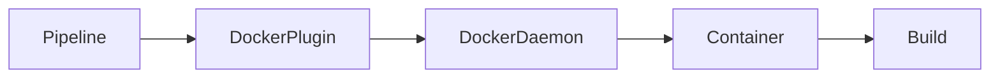

---

## Key Components

| Component | Purpose |
|-----------|----------|
| Docker Engine | Executes containers |
| Docker Plugin | Jenkins integration |
| Docker Registry | Stores images |

---

## Types (if applicable)

Supported Features

- Docker Build
- Docker Agent
- Docker Registry

---

## Lifecycle / Workflow

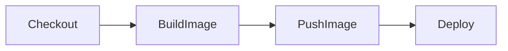

---

## Configuration / Syntax (if applicable)

```groovy
agent {

    docker {

        image 'maven:3.9'

    }

}
```

---

## Important Commands (if applicable)

```bash
docker build
docker run
docker push
docker pull
```

---

## Important Files (if applicable)

| File | Purpose |
|------|----------|
| Dockerfile | Image definition |
| Jenkinsfile | Pipeline |

---

## Real-World Use Cases

- Docker image creation
- Containerized builds
- Kubernetes deployments
- CI/CD automation

---

## Advantages

- Consistent environments
- Portable builds
- Easy scaling

---

## Limitations

- Docker Engine required
- Image management overhead

---

## Common Interview Questions (Concept Only)

- What is the Docker Plugin?
- Why use Docker agents?
- How does Jenkins build Docker images?

---

## Common Mistakes

- Docker daemon not running
- Missing registry credentials
- Large Docker images

---

## Troubleshooting

| Problem | Solution |
|----------|----------|
| Cannot connect to Docker | Start Docker daemon |
| Build failed | Review Dockerfile |
| Push failed | Verify registry credentials |

---

## Summary

The Docker Plugin integrates Jenkins with Docker, enabling containerized builds and automated image management.

---

# Maven Integration Plugin

## Overview

The **Maven Integration Plugin** allows Jenkins to build Maven-based Java applications while integrating with Maven's lifecycle, dependency management, and test reporting.

It simplifies Maven project configuration and provides build information directly within Jenkins.

> **Interview Point**
>
> Modern Jenkins pipelines often invoke Maven using shell commands (`mvn clean install`), but the Maven Integration Plugin is still widely used in Freestyle projects and enterprise environments.

---

## Why It Is Used

Maven Integration Plugin helps to:

- Execute Maven builds
- Manage dependencies
- Publish test reports
- Archive artifacts
- Simplify Java project automation

---

## Architecture / Working

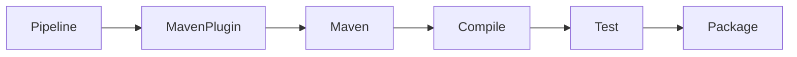

---

## Key Components

| Component | Purpose |
|-----------|----------|
| Maven | Build tool |
| pom.xml | Project configuration |
| Maven Plugin | Jenkins integration |
| Artifact | Build output |

---

## Types (if applicable)

Supported Maven Goals

- clean
- compile
- test
- package
- install
- deploy

---

## Lifecycle / Workflow

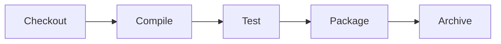

---

## Configuration / Syntax (if applicable)

```groovy
stage('Build') {

    steps {

        sh 'mvn clean package'

    }

}
```

---

## Important Commands (if applicable)

```bash
mvn clean
mvn compile
mvn test
mvn package
mvn install
```

---

## Important Files (if applicable)

| File | Purpose |
|------|----------|
| pom.xml | Maven configuration |
| Jenkinsfile | Pipeline |
| target/ | Build output |

---

## Real-World Use Cases

- Spring Boot builds
- Java microservices
- Enterprise Java applications
- Automated testing

---

## Advantages

- Seamless Maven integration
- Automatic dependency management
- Supports test reporting
- Easy artifact generation

---

## Limitations

- Maven must be installed or configured as a Jenkins tool
- Less commonly used in scripted pipelines compared to direct Maven CLI invocation

---

## Common Interview Questions (Concept Only)

- What is the Maven Integration Plugin?
- How does Jenkins execute Maven builds?
- What is `pom.xml`?
- Which Maven lifecycle phase creates deployable artifacts?

---

## Common Mistakes

- Incorrect Maven installation path
- Missing JDK configuration
- Invalid `pom.xml`
- Dependency version conflicts

---

## Troubleshooting

| Problem | Solution |
|----------|----------|
| Maven command not found | Configure Maven installation in Jenkins |
| Build failed | Review Maven console output |
| Dependency download failed | Verify internet access or repository configuration |
| JDK mismatch | Configure the correct Java version |

---

## Summary

The Maven Integration Plugin enables Jenkins to automate Java application builds using Maven, supporting dependency management, testing, packaging, and artifact generation within CI/CD pipelines.
