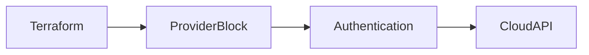
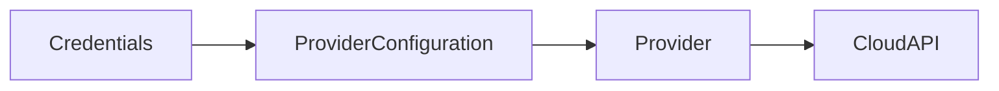
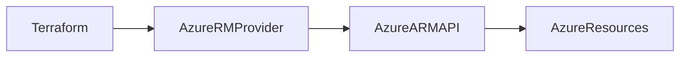
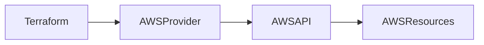

# Providers

## Overview

A **Provider** is a plugin that enables Terraform to interact with cloud platforms, SaaS services, and other APIs.

Terraform itself does **not** create infrastructure. Instead, it communicates with the appropriate provider, which translates Terraform configurations into API calls to create, modify, or delete resources.

Examples of popular providers include:

- Azure (AzureRM)
- AWS
- Google Cloud
- Kubernetes
- Docker
- GitHub
- VMware

> **Interview Tip**
>
> **Terraform Core** determines **what** needs to change, while the **Provider** performs the actual API calls to create or modify infrastructure.

---

## Why It Is Used

Providers are used to:

- Provision cloud infrastructure
- Manage existing resources
- Communicate with cloud APIs
- Support multi-cloud deployments
- Integrate with third-party services
- Maintain infrastructure consistency

---

## Architecture / Working


### Working Process

1. User writes Terraform configuration.
2. Terraform reads the required provider.
3. `terraform init` downloads the provider plugin.
4. Provider authenticates with the cloud platform.
5. Terraform sends execution plans to the provider.
6. Provider invokes cloud APIs.
7. Infrastructure is created or updated.

---

## Key Components

| Component | Purpose |
|-----------|----------|
| Provider Plugin | Connects Terraform to external APIs |
| Provider Block | Configures authentication and settings |
| Required Providers | Specifies provider source and version |
| Provider Registry | Downloads official provider plugins |
| Cloud API | Executes infrastructure operations |

---

## Types (if applicable)

### Official Providers

Maintained by HashiCorp

Examples:

- AzureRM
- AWS
- Kubernetes
- Docker

### Partner Providers

Maintained by technology vendors.

Examples:

- Datadog
- Oracle Cloud
- Cloudflare

### Community Providers

Maintained by the open-source community.

---

## Lifecycle / Workflow


---

## Configuration / Syntax (if applicable)

### Required Provider

```hcl
terraform {

  required_providers {

    azurerm = {

      source = "hashicorp/azurerm"

      version = "~>4.0"

    }

  }

}
```

Provider Configuration

```hcl
provider "azurerm" {

  features {}

}
```

AWS Provider

```hcl
provider "aws" {

  region = "ap-south-1"

}
```

---

## Important Commands (if applicable)

Initialize Providers

```bash
terraform init
```

View Installed Providers

```bash
terraform providers
```

Upgrade Providers

```bash
terraform init -upgrade
```

Validate Configuration

```bash
terraform validate
```

---

## Important Files (if applicable)

| File | Purpose |
|------|----------|
| providers.tf | Provider configuration |
| versions.tf | Provider version constraints |
| main.tf | Resource definitions |
| .terraform.lock.hcl | Provider dependency lock file |
| .terraform/ | Downloaded provider plugins |

---

## Real-World Use Cases

- Deploy Azure Virtual Machines
- Provision AWS EC2 instances
- Create Kubernetes clusters
- Manage Docker containers
- Configure GitHub repositories
- Provision Azure Storage Accounts
- Build networking infrastructure

---

## Advantages

- Supports multiple cloud providers
- Automatic plugin downloads
- Version-controlled providers
- Large provider ecosystem
- Extensible architecture

---

## Limitations

- Internet required for first download
- Provider versions must be managed carefully
- Authentication configuration differs between providers
- Breaking changes may occur during major provider upgrades

---

## Common Interview Questions (Concept Only)

- What is a Terraform Provider?
- Why are providers required?
- What happens during `terraform init`?
- Where are provider plugins downloaded?
- What is the purpose of the `required_providers` block?
- Can Terraform work without a provider?
- What is the difference between Terraform Core and a Provider?
- How do you upgrade provider versions?

---

## Common Mistakes

- Forgetting to run `terraform init`
- Hardcoding cloud credentials
- Ignoring provider version constraints
- Mixing incompatible provider versions
- Not committing `.terraform.lock.hcl` to version control

---

## Troubleshooting

| Problem | Solution |
|----------|----------|
| Provider download failed | Check internet connectivity and registry access |
| Unsupported provider version | Update version constraints |
| Authentication failed | Verify cloud credentials |
| Unknown provider | Check provider source name |
| Provider initialization failed | Rerun `terraform init` |

---

## Summary

Providers are plugins that enable Terraform to communicate with cloud platforms and external services. They authenticate with cloud APIs, translate Terraform configurations into API requests, and provision infrastructure.

---

# Provider Block

## Overview

A **Provider Block** configures how Terraform communicates with a specific provider.

It defines:

- Authentication
- Region or location
- Subscription or account
- Provider-specific settings

Without a provider block, Terraform cannot determine how to connect to the target platform.

> **Interview Tip**
>
> A provider block configures **how Terraform connects**, while a resource block defines **what to create**.

---

## Why It Is Used

The provider block is used to:

- Authenticate with cloud providers
- Specify deployment regions
- Configure provider features
- Support multiple provider instances

---

## Architecture / Working



---

## Key Components

| Component | Purpose |
|-----------|----------|
| Provider Name | Specifies the cloud provider |
| Authentication | Cloud credentials |
| Region/Location | Deployment location |
| Provider Settings | Provider-specific configuration |

---

## Types (if applicable)

### Single Provider

```hcl
provider "aws" {

  region = "ap-south-1"

}
```

### Multiple Provider Configurations

```hcl
provider "aws" {

  alias = "mumbai"

  region = "ap-south-1"

}

provider "aws" {

  alias = "tokyo"

  region = "ap-northeast-1"

}
```

---

## Lifecycle / Workflow

Configure Provider → Authenticate → Create Resources

---

## Configuration / Syntax (if applicable)

Azure

```hcl
provider "azurerm" {

  features {}

}
```

AWS

```hcl
provider "aws" {

  region = "us-east-1"

}
```

---

## Important Commands (if applicable)

```bash
terraform init

terraform validate
```

---

## Important Files (if applicable)

providers.tf

---

## Real-World Use Cases

- Azure deployment
- AWS multi-region deployment
- Multi-cloud infrastructure
- Production and development environments

---

## Advantages

- Flexible configuration
- Supports aliases
- Supports multiple providers

---

## Limitations

- Incorrect configuration prevents resource creation
- Authentication is provider-specific

---

## Common Interview Questions (Concept Only)

- What is a Provider Block?
- Can Terraform have multiple provider blocks?
- Why do we use aliases?

---

## Common Mistakes

- Missing provider configuration
- Incorrect region
- Invalid authentication

---

## Troubleshooting

Run:

```bash
terraform validate
```

Check provider credentials.

---

## Summary

A Provider Block defines how Terraform authenticates and communicates with a cloud provider.

---

# Provider Configuration

## Overview

Provider configuration specifies the settings required for a provider to communicate with cloud APIs.

Typical configuration includes:

- Credentials
- Region
- Subscription
- Tenant
- Provider-specific options

Terraform recommends using **environment variables or managed identities** instead of hardcoding credentials.

> **Interview Tip**
>
> Never store cloud credentials directly in Terraform configuration files.

---

## Why It Is Used

Provider configuration allows Terraform to:

- Authenticate securely
- Select deployment regions
- Configure provider behavior
- Support multiple environments

---

## Architecture / Working



---

## Key Components

| Component | Purpose |
|-----------|----------|
| Credentials | Authentication |
| Region | Deployment location |
| Subscription | Azure account |
| Features | Provider-specific settings |

---

## Types (if applicable)

Authentication Methods

- Environment Variables
- Azure CLI Login
- AWS CLI Credentials
- Managed Identity
- IAM Roles
- Service Principal

---

## Lifecycle / Workflow

Configure → Authenticate → Execute

---

## Configuration / Syntax (if applicable)

AWS

```hcl
provider "aws" {

  region = "ap-south-1"

}
```

Azure

```hcl
provider "azurerm" {

  features {}

}
```

---

## Important Commands (if applicable)

```bash
terraform init

terraform providers
```

---

## Important Files (if applicable)

providers.tf

---

## Real-World Use Cases

- Azure deployments
- AWS automation
- Multi-region deployments
- CI/CD pipelines

---

## Advantages

- Flexible authentication
- Supports multiple environments
- Secure integrations

---

## Limitations

- Authentication differs by provider
- Incorrect credentials stop deployments

---

## Common Interview Questions (Concept Only)

- How should providers be authenticated?
- Should credentials be stored in code?

---

## Common Mistakes

- Hardcoding secrets
- Wrong subscription
- Wrong region

---

## Troubleshooting

Verify cloud credentials before running Terraform.

---

## Summary

Provider configuration defines authentication and connection settings required for Terraform to manage cloud resources securely.

---

# Azure Provider

## Overview

The **AzureRM Provider** enables Terraform to provision and manage Microsoft Azure resources.

It communicates with the Azure Resource Manager (ARM) APIs.

Common resources include:

- Resource Groups
- Virtual Machines
- Storage Accounts
- Virtual Networks
- Load Balancers
- App Services
- AKS Clusters

> **Interview Tip**
>
> The official Azure provider is **AzureRM** (`hashicorp/azurerm`).

---

## Why It Is Used

Used for:

- Azure infrastructure automation
- Infrastructure as Code
- CI/CD deployments
- Environment consistency

---

## Architecture / Working



---

## Key Components

| Component | Purpose |
|-----------|----------|
| AzureRM Provider | Azure API communication |
| ARM API | Resource management |
| Service Principal | Authentication |
| Resource Group | Resource container |

---

## Types (if applicable)

Authentication Options

- Azure CLI
- Service Principal
- Managed Identity
- Environment Variables

---

## Lifecycle / Workflow

Authenticate → Plan → Apply → Azure Resources

---

## Configuration / Syntax (if applicable)

```hcl
terraform {

  required_providers {

    azurerm = {

      source = "hashicorp/azurerm"

      version = "~>4.0"

    }

  }

}

provider "azurerm" {

  features {}

}
```

---

## Important Commands (if applicable)

```bash
az login

terraform init

terraform apply
```

---

## Important Files (if applicable)

providers.tf

---

## Real-World Use Cases

- Azure VM deployment
- Azure Networking
- Azure Kubernetes Service
- Azure Storage

---

## Advantages

- Official Microsoft-supported provider
- Large resource coverage
- Continuous updates

---

## Limitations

- Azure authentication required
- Provider versions evolve frequently

---

## Common Interview Questions (Concept Only)

- What is AzureRM?
- How does Terraform authenticate with Azure?
- What APIs does AzureRM use?

---

## Common Mistakes

- Forgetting `features {}`
- Wrong subscription
- Expired credentials

---

## Troubleshooting

Verify:

```bash
az account show
```

---

## Summary

AzureRM is Terraform's official provider for managing Microsoft Azure infrastructure through Azure Resource Manager APIs.

---

# AWS Provider

## Overview

The **AWS Provider** enables Terraform to provision and manage Amazon Web Services resources.

It communicates directly with AWS service APIs.

Common resources include:

- EC2
- VPC
- S3
- IAM
- RDS
- EKS
- Lambda

> **Interview Tip**
>
> The official AWS provider is **hashicorp/aws**.

---

## Why It Is Used

Used to:

- Automate AWS deployments
- Provision cloud infrastructure
- Support Infrastructure as Code
- Build repeatable environments

---

## Architecture / Working



---

## Key Components

| Component | Purpose |
|-----------|----------|
| AWS Provider | Connects Terraform to AWS |
| IAM | Authentication |
| Region | Deployment location |
| AWS API | Resource management |

---

## Types (if applicable)

Authentication Methods

- AWS CLI
- IAM User
- IAM Role
- Environment Variables
- EC2 Instance Profile

---

## Lifecycle / Workflow

Authenticate → Plan → Apply → AWS Resources

---

## Configuration / Syntax (if applicable)

```hcl
terraform {

  required_providers {

    aws = {

      source = "hashicorp/aws"

      version = "~>5.0"

    }

  }

}

provider "aws" {

  region = "ap-south-1"

}
```

---

## Important Commands (if applicable)

```bash
aws configure

terraform init

terraform apply
```

---

## Important Files (if applicable)

providers.tf

---

## Real-World Use Cases

- EC2 deployment
- VPC automation
- S3 bucket creation
- IAM management
- EKS deployment

---

## Advantages

- Mature provider
- Extensive AWS resource support
- Strong community

---

## Limitations

- Requires IAM permissions
- Region-specific resources

---

## Common Interview Questions (Concept Only)

- How does Terraform authenticate with AWS?
- What is the AWS Provider?
- What IAM permissions are required?

---

## Common Mistakes

- Wrong region
- Invalid IAM credentials
- Insufficient IAM permissions

---

## Troubleshooting

Verify credentials:

```bash
aws sts get-caller-identity
```

Verify Terraform:

```bash
terraform providers
```

---

## Summary

The AWS Provider enables Terraform to provision and manage AWS resources securely through AWS APIs using IAM-based authentication and region-specific configurations.
