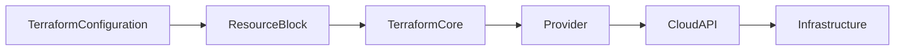
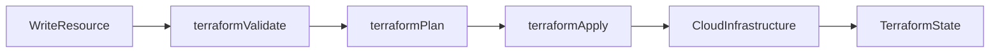
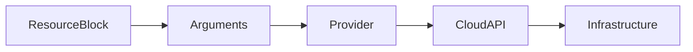
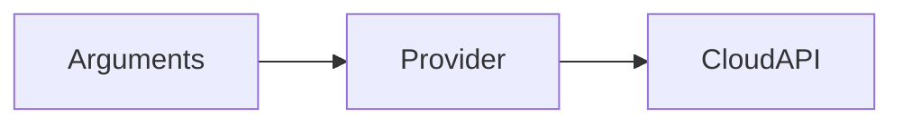
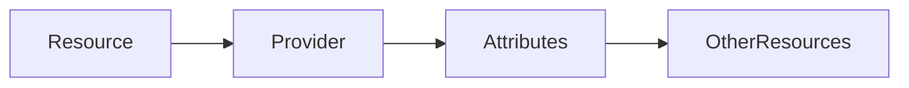
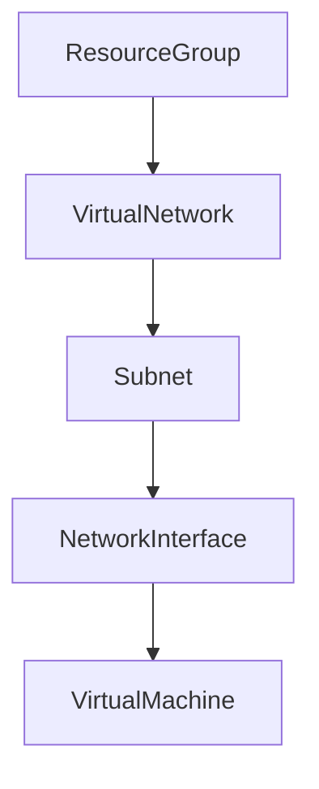

# Resources

## Overview

A **Resource** is the most important building block in Terraform. It represents a real infrastructure component that Terraform creates, updates, or deletes.

Examples of resources include:

- Azure Resource Group
- Azure Virtual Machine
- AWS EC2 Instance
- AWS S3 Bucket
- Azure Virtual Network
- Kubernetes Cluster
- Docker Container

Each resource is defined using a **resource block** in Terraform Configuration Language (HCL).

> **Interview Tip**
>
> **Everything Terraform creates is represented as a Resource.** Nearly every Terraform interview includes questions about resource blocks and dependencies.

---

## Why It Is Used

Resources allow Terraform to:

- Create infrastructure
- Modify existing infrastructure
- Delete infrastructure
- Track infrastructure state
- Build dependencies between resources
- Automate cloud provisioning

---

## Architecture / Working



### Working Process

1. Write resource blocks in HCL.
2. Terraform validates the configuration.
3. Terraform generates an execution plan.
4. Provider communicates with cloud APIs.
5. Infrastructure is created or updated.
6. Terraform stores the resource state.

---

## Key Components

| Component | Purpose |
|-----------|----------|
| Resource Block | Defines infrastructure |
| Resource Type | Specifies the infrastructure type |
| Resource Name | Local identifier within Terraform |
| Arguments | Configure the resource |
| Attributes | Values generated after creation |
| Dependencies | Control resource creation order |

---

## Types (if applicable)

Terraform supports thousands of resource types.

### Azure Resources

- azurerm_resource_group
- azurerm_virtual_machine
- azurerm_storage_account
- azurerm_virtual_network

### AWS Resources

- aws_instance
- aws_vpc
- aws_subnet
- aws_security_group
- aws_s3_bucket

### Kubernetes Resources

- kubernetes_namespace
- kubernetes_deployment
- kubernetes_service

### Docker Resources

- docker_image
- docker_container

---

## Lifecycle / Workflow



---

## Configuration / Syntax (if applicable)

General Syntax

```hcl
resource "<RESOURCE_TYPE>" "<RESOURCE_NAME>" {

    argument = value

}
```

Example (Azure)

```hcl
resource "azurerm_resource_group" "rg" {

  name     = "demo-rg"

  location = "Central India"

}
```

Example (AWS)

```hcl
resource "aws_instance" "web" {

  ami           = "ami-123456"

  instance_type = "t2.micro"

}
```

---

## Important Commands (if applicable)

Initialize

```bash
terraform init
```

Validate

```bash
terraform validate
```

View Plan

```bash
terraform plan
```

Apply

```bash
terraform apply
```

Destroy

```bash
terraform destroy
```

Show State

```bash
terraform state list
```

---

## Important Files (if applicable)

| File | Purpose |
|------|----------|
| main.tf | Resource definitions |
| variables.tf | Resource variables |
| outputs.tf | Resource outputs |
| terraform.tfstate | Tracks resource state |

---

## Real-World Use Cases

- Deploy Azure Virtual Machines
- Create AWS EC2 instances
- Provision Azure Storage Accounts
- Deploy Kubernetes clusters
- Configure Virtual Networks
- Create Security Groups
- Deploy Docker Containers

---

## Advantages

- Declarative
- Version controlled
- Repeatable
- Supports dependencies
- Easy to modify
- Supports automation

---

## Limitations

- Incorrect configuration affects infrastructure
- Provider-specific syntax
- State file must be managed carefully

---

## Common Interview Questions (Concept Only)

- What is a Terraform Resource?
- What is the syntax of a resource block?
- How does Terraform identify resources?
- What is the difference between resource arguments and attributes?
- How are resource dependencies handled?
- What happens when a resource is renamed?
- How does Terraform know whether to create or update a resource?

---

## Common Mistakes

- Duplicate resource names
- Hardcoding values
- Ignoring dependencies
- Deleting resources outside Terraform
- Editing state files manually
- Incorrect resource references

---

## Troubleshooting

| Problem | Solution |
|----------|----------|
| Invalid resource type | Verify provider documentation |
| Unknown argument | Check provider version |
| Resource already exists | Import existing resource |
| Resource not found | Verify state and provider configuration |
| Dependency cycle | Review resource references |

---

## Summary

Resources are the core components of Terraform configurations. Every infrastructure object is represented as a resource block, which Terraform manages through providers and tracks in the state file.

---

# Resource Block

## Overview

A **Resource Block** defines an individual infrastructure resource that Terraform manages.

It contains:

- Resource type
- Resource name
- Resource configuration (arguments)

A resource block uniquely identifies every infrastructure component in a Terraform project.

> **Interview Tip**
>
> The first label identifies **what** to create, while the second label identifies **how Terraform refers to it internally**.

---

## Why It Is Used

Resource blocks define:

- Virtual Machines
- Networks
- Storage
- Databases
- Load Balancers
- Security Groups

---

## Architecture / Working



---

## Key Components

| Component | Purpose |
|-----------|----------|
| resource | Block keyword |
| Resource Type | Cloud resource type |
| Resource Name | Terraform identifier |
| Arguments | Configure resource |

---

## Types (if applicable)

Example Resource Blocks

Azure

```hcl
resource "azurerm_resource_group" "rg" {

}
```

AWS

```hcl
resource "aws_instance" "web" {

}
```

Docker

```hcl
resource "docker_container" "nginx" {

}
```

---

## Lifecycle / Workflow

Create Block → Validate → Apply → Resource Created

---

## Configuration / Syntax (if applicable)

```hcl
resource "aws_instance" "web" {

  ami = "ami-123"

  instance_type = "t2.micro"

}
```

---

## Important Commands (if applicable)

```bash
terraform validate

terraform apply
```

---

## Important Files (if applicable)

main.tf

---

## Real-World Use Cases

- Create EC2
- Deploy Azure VM
- Build VPC
- Deploy Storage

---

## Advantages

- Easy to understand
- Reusable
- Declarative

---

## Limitations

- Resource names must be unique within the module

---

## Common Interview Questions (Concept Only)

- What is a resource block?
- What are the two labels in a resource block?

---

## Common Mistakes

- Duplicate resource names
- Wrong resource type

---

## Troubleshooting

Use

```bash
terraform validate
```

to verify block syntax.

---

## Summary

A resource block defines an infrastructure object and contains all configuration required to provision it.

---

# Resource Arguments

## Overview

**Arguments** are key-value pairs inside a resource block that define how the resource should be configured.

Each resource has its own supported arguments defined by the provider.

Example:

```hcl
instance_type = "t2.micro"
```

---

## Why It Is Used

Arguments configure:

- Resource name
- Region
- VM size
- Storage
- Network
- Tags

---

## Architecture / Working



---

## Key Components

| Component | Purpose |
|-----------|----------|
| Argument Name | Configuration setting |
| Argument Value | Assigned value |

---

## Types (if applicable)

Argument Value Types

- String
- Number
- Boolean
- List
- Map
- Expressions

---

## Lifecycle / Workflow

Define Arguments → Validate → Apply

---

## Configuration / Syntax (if applicable)

```hcl
resource "aws_instance" "web" {

  ami = "ami-123"

  instance_type = "t2.micro"

  tags = {

    Name = "WebServer"

  }

}
```

---

## Important Commands (if applicable)

```bash
terraform validate
```

---

## Important Files (if applicable)

main.tf

---

## Real-World Use Cases

- Configure VM size
- Configure region
- Configure storage
- Configure networking

---

## Advantages

- Flexible
- Easy to customize
- Supports expressions

---

## Limitations

- Provider-specific
- Invalid arguments fail validation

---

## Common Interview Questions (Concept Only)

- What are resource arguments?
- Who defines supported arguments?

---

## Common Mistakes

- Misspelled argument names
- Unsupported arguments

---

## Troubleshooting

Verify arguments in provider documentation.

---

## Summary

Arguments configure how Terraform provisions infrastructure resources.

---

# Resource Attributes

## Overview

**Attributes** are values associated with a resource after it has been created.

Some attributes are defined by the user, while many are automatically generated by the cloud provider.

Examples:

- Resource ID
- Public IP
- DNS Name
- ARN
- Resource Group ID

> **Interview Tip**
>
> Arguments are **inputs** to Terraform, while attributes are **outputs** generated by Terraform or the provider.

---

## Why It Is Used

Attributes allow Terraform to:

- Reference other resources
- Build dependencies
- Output values
- Connect infrastructure

---

## Architecture / Working



---

## Key Components

| Component | Purpose |
|-----------|----------|
| Input Attributes | User-defined values |
| Computed Attributes | Generated values |

---

## Types (if applicable)

Common Attributes

- id
- arn
- name
- public_ip
- private_ip
- location

---

## Lifecycle / Workflow

Create Resource → Generate Attributes → Reference Elsewhere

---

## Configuration / Syntax (if applicable)

Reference Example

```hcl
azurerm_resource_group.rg.name
```

AWS Example

```hcl
aws_instance.web.public_ip
```

---

## Important Commands (if applicable)

```bash
terraform output

terraform show
```

---

## Important Files (if applicable)

outputs.tf

---

## Real-World Use Cases

- VM public IP
- Resource IDs
- Network IDs
- DNS names

---

## Advantages

- Dynamic
- Reusable
- Eliminates hardcoding

---

## Limitations

- Computed only after creation
- Cannot reference nonexistent resources

---

## Common Interview Questions (Concept Only)

- What is a resource attribute?
- Difference between arguments and attributes?

---

## Common Mistakes

- Referencing attributes before resource creation
- Typographical errors in references

---

## Troubleshooting

Use

```bash
terraform show
```

or

```bash
terraform output
```

to inspect attribute values.

---

## Summary

Attributes are values associated with resources and are commonly used for resource references, outputs, and dependencies.

---

# Resource Dependencies

## Overview

A **Resource Dependency** defines the order in which Terraform creates or destroys resources.

Terraform automatically detects most dependencies by analyzing resource references.

Example:

A Virtual Machine depends on:

- Resource Group
- Virtual Network
- Subnet
- Network Interface

Terraform creates these resources in the correct order.

> **Interview Tip**
>
> Terraform automatically determines dependencies whenever one resource references another. Use `depends_on` only when Terraform cannot infer the dependency.

---

## Why It Is Used

Dependencies ensure:

- Correct creation order
- Correct deletion order
- Infrastructure consistency
- Reliable deployments

---

## Architecture / Working



---

## Key Components

| Component | Purpose |
|-----------|----------|
| Implicit Dependency | Created through references |
| Explicit Dependency | Created using `depends_on` |

---

## Types (if applicable)

### Implicit Dependency

Terraform automatically detects the relationship.

```hcl
resource_group_name = azurerm_resource_group.rg.name
```

### Explicit Dependency

```hcl
depends_on = [

    azurerm_resource_group.rg

]
```

---

## Lifecycle / Workflow

Detect Dependencies → Plan Order → Apply Resources

---

## Configuration / Syntax (if applicable)

Implicit

```hcl
resource_group_name = azurerm_resource_group.rg.name
```

Explicit

```hcl
depends_on = [

    azurerm_resource_group.rg

]
```

---

## Important Commands (if applicable)

Execution Plan

```bash
terraform plan
```

Dependency Graph

```bash
terraform graph
```

---

## Important Files (if applicable)

main.tf

---

## Real-World Use Cases

- VM depends on NIC
- NIC depends on Subnet
- Subnet depends on VNet
- VNet depends on Resource Group

---

## Advantages

- Automatic dependency detection
- Prevents deployment failures
- Correct execution order
- Reduces manual configuration

---

## Limitations

- Circular dependencies cause failures
- Overusing `depends_on` increases complexity

---

## Common Interview Questions (Concept Only)

- What are Terraform dependencies?
- What is the difference between implicit and explicit dependencies?
- When should `depends_on` be used?
- How does Terraform determine execution order?
- What is a circular dependency?

---

## Common Mistakes

- Using `depends_on` unnecessarily
- Creating circular dependencies
- Forgetting resource references
- Hardcoding IDs instead of using references

---

## Troubleshooting

| Problem | Solution |
|----------|----------|
| Circular dependency | Remove or redesign resource relationships |
| Incorrect execution order | Use `depends_on` only if required |
| Missing dependency | Reference the dependent resource instead of hardcoding values |
| Resource not found | Verify referenced resource names and state |

---

## Summary

Terraform automatically manages resource dependencies by analyzing references between resources. When automatic detection is insufficient, explicit dependencies can be defined using `depends_on` to ensure resources are created and destroyed in the correct order.
