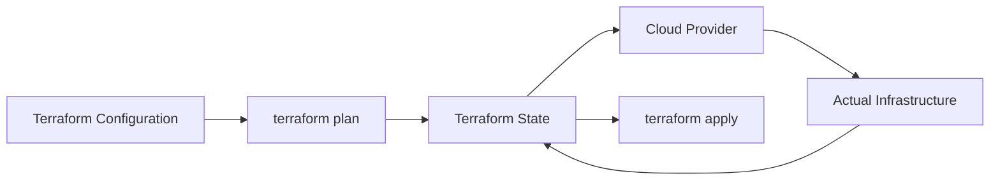
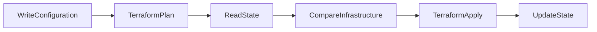
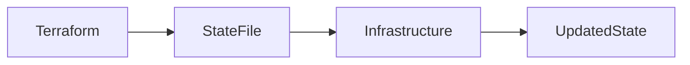
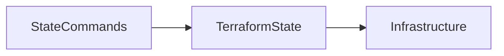
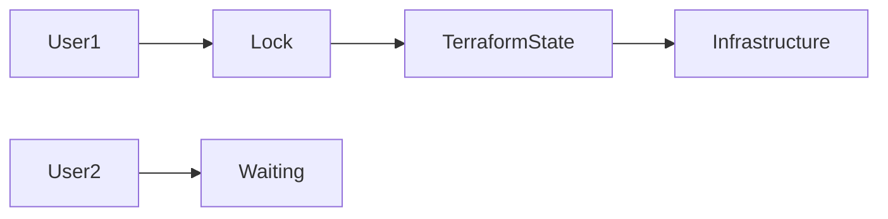
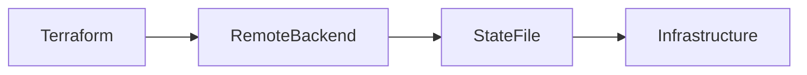

# Terraform State

## Overview

Terraform **State** is a file that records the current state of your infrastructure. It maps the resources defined in your Terraform configuration to the actual resources created in the cloud provider.

Terraform uses the state file to determine:

- What resources already exist
- What changes are required
- What needs to be created, modified, or destroyed

Without the state file, Terraform would have to query every resource from the cloud provider during each execution, making deployments slow and inefficient.

> **Interview Tip**
>
> **Terraform State is the source of truth for Terraform, not the cloud provider.**

---

## Why It Is Used

Terraform State is used to:

- Track deployed infrastructure
- Compare desired state with actual state
- Improve execution performance
- Store resource metadata
- Enable resource dependencies
- Support updates without recreating resources

---

## Architecture / Working



### Working Process

1. Terraform reads configuration files.
2. Terraform reads the state file.
3. Terraform compares desired state with current state.
4. Terraform creates an execution plan.
5. Infrastructure is updated.
6. State file is updated.

---

## Key Components

| Component | Purpose |
|-----------|----------|
| State File | Stores infrastructure metadata |
| Resource Mapping | Maps Terraform resources to cloud resources |
| Resource Attributes | Stores IDs, IPs, names, etc. |
| Dependencies | Tracks relationships between resources |
| Outputs | Stores output values |

---

## Types (if applicable)

Terraform State can be:

| Type | Description |
|------|-------------|
| Local State | Stored on local machine |
| Remote State | Stored in remote backend (Azure Storage, S3, etc.) |

---

## Lifecycle / Workflow



---

## Configuration / Syntax (if applicable)

Initialize Terraform

```bash
terraform init
```

View State

```bash
terraform show
```

List Resources

```bash
terraform state list
```

---

## Important Commands (if applicable)

View State

```bash
terraform show
```

List Resources

```bash
terraform state list
```

Show Resource

```bash
terraform state show <resource_name>
```

Pull State

```bash
terraform state pull
```

Push State

```bash
terraform state push terraform.tfstate
```

Remove Resource from State

```bash
terraform state rm <resource_name>
```

Move Resource

```bash
terraform state mv source destination
```

---

## Important Files (if applicable)

| File | Purpose |
|------|----------|
| terraform.tfstate | Current infrastructure state |
| terraform.tfstate.backup | Automatic backup |
| .terraform/ | Provider plugins and metadata |

---

## Real-World Use Cases

- Track Azure Resource Groups
- Track AWS EC2 Instances
- Detect infrastructure drift
- Maintain infrastructure consistency
- Enable incremental deployments

---

## Advantages

- Fast execution
- Tracks infrastructure accurately
- Enables dependency management
- Supports automation
- Prevents unnecessary resource recreation

---

## Limitations

- Sensitive data may be stored
- State corruption can affect deployments
- Local state is unsuitable for teams
- Requires secure storage

---

## Common Interview Questions (Concept Only)

- What is Terraform State?
- Why is Terraform State required?
- Where is Terraform State stored?
- Can Terraform work without a state file?
- Why shouldn't local state be used in teams?

---

## Common Mistakes

- Deleting state files manually
- Editing state files directly
- Storing local state in Git
- Ignoring state backups
- Sharing local state between team members

---

## Troubleshooting

| Problem | Solution |
|----------|----------|
| State file missing | Restore from backup or remote backend |
| State out of sync | Run `terraform refresh` (older versions) or `terraform plan`/`apply` to reconcile |
| Corrupted state | Restore backup |
| Duplicate resources | Import existing infrastructure |

---

## Summary

Terraform State is the core mechanism that allows Terraform to manage infrastructure efficiently. It stores infrastructure metadata, tracks resources, detects changes, and enables reliable deployments.

---

# State File

## Overview

The **State File** (`terraform.tfstate`) is a JSON file automatically generated by Terraform after infrastructure deployment.

It contains:

- Resource IDs
- Attributes
- Metadata
- Dependencies
- Output values

> **Interview Tip**
>
> Never manually edit the state file unless absolutely necessary.

---

## Why It Is Used

The state file helps Terraform:

- Track resources
- Detect changes
- Avoid recreating resources
- Improve deployment speed

---

## Architecture / Working



---

## Key Components

| Component | Description |
|-----------|-------------|
| Version | State version |
| Resources | Managed infrastructure |
| Outputs | Stored outputs |
| Metadata | Resource information |

---

## Types (if applicable)

| State File | Purpose |
|------------|----------|
| terraform.tfstate | Active state |
| terraform.tfstate.backup | Backup copy |

---

## Lifecycle / Workflow

Create → Update → Save → Read → Modify

---

## Configuration / Syntax (if applicable)

Terraform automatically creates:

```text
terraform.tfstate
```

---

## Important Commands (if applicable)

Display State

```bash
terraform show
```

Pull State

```bash
terraform state pull
```

---

## Important Files (if applicable)

```
terraform.tfstate

terraform.tfstate.backup
```

---

## Real-World Use Cases

- Store Azure VM IDs
- Track Storage Accounts
- Store VNet information

---

## Advantages

- Automatic
- Fast
- Reliable

---

## Limitations

- Contains sensitive information
- Must be secured

---

## Common Interview Questions (Concept Only)

- What is `terraform.tfstate`?
- Is it safe to edit the state file?

---

## Common Mistakes

- Committing state to Git
- Manual editing

---

## Troubleshooting

Restore the backup if the state file becomes corrupted.

---

## Summary

The state file stores Terraform's view of infrastructure and is automatically maintained after every deployment.

---

# State Commands

## Overview

Terraform provides **state commands** to inspect and manage the state file without modifying cloud infrastructure.

These commands help administrators:

- Inspect resources
- Move resources
- Remove resources
- Pull or push state

> **Interview Tip**
>
> State commands affect Terraform's state, **not the actual infrastructure**, unless followed by other Terraform operations.

---

## Why It Is Used

State commands are useful for:

- Troubleshooting
- Refactoring configurations
- Managing imports
- Correcting state inconsistencies

---

## Architecture / Working



---

## Key Components

| Command | Purpose |
|----------|----------|
| state list | List resources |
| state show | Display resource details |
| state rm | Remove resource from state |
| state mv | Move resource |
| state pull | Download state |
| state push | Upload state |

---

## Types (if applicable)

Inspection Commands

Management Commands

Migration Commands

---

## Lifecycle /Workflow

Inspect → Modify → Save

---

## Configuration / Syntax (if applicable)

List

```bash
terraform state list
```

Show

```bash
terraform state show azurerm_resource_group.rg
```

Remove

```bash
terraform state rm azurerm_resource_group.rg
```

Move

```bash
terraform state mv old_resource new_resource
```

---

## Important Commands (if applicable)

```bash
terraform state list

terraform state show

terraform state rm

terraform state mv

terraform state pull

terraform state push
```

---

## Important Files (if applicable)

terraform.tfstate

---

## Real-World Use Cases

- Rename resources
- Remove imported resources
- Recover state
- Refactor Terraform projects

---

## Advantages

- Safe state management
- Supports migration
- Simplifies troubleshooting

---

## Limitations

- Incorrect commands may create state inconsistencies
- Requires careful usage

---

## Common Interview Questions (Concept Only)

- What does `terraform state list` do?
- Difference between `state rm` and destroying a resource?
- What is `terraform state mv` used for?

---

## Common Mistakes

- Removing resources unintentionally
- Moving incorrect resources

---

## Troubleshooting

Always create a backup before running state modification commands.

---

## Summary

State commands provide safe tools for inspecting and managing Terraform state without directly changing infrastructure.

---

# State Locking

## Overview

State Locking prevents multiple users from modifying the same Terraform state simultaneously.

Without locking:

- Two users may apply changes at the same time.
- State corruption may occur.
- Infrastructure may become inconsistent.

Most remote backends automatically support state locking.

> **Interview Tip**
>
> State locking is essential for collaborative Terraform environments.

---

## Why It Is Used

State locking:

- Prevents concurrent writes
- Protects state integrity
- Avoids deployment conflicts
- Ensures consistency

---

## Architecture / Working



---

## Key Components

| Component | Purpose |
|-----------|----------|
| Lock | Prevents concurrent access |
| Backend | Stores lock information |
| Unlock | Releases state |

---

## Types (if applicable)

Automatic Locking

Manual Unlock

---

## Lifecycle / Workflow

Acquire Lock → Apply → Update State → Release Lock

---

## Configuration / Syntax (if applicable)

Disable Lock (not recommended)

```bash
terraform apply -lock=false
```

Force Unlock

```bash
terraform force-unlock LOCK_ID
```

---

## Important Commands (if applicable)

```bash
terraform force-unlock LOCK_ID
```

---

## Important Files (if applicable)

Managed by backend.

---

## Real-World Use Cases

- Team deployments
- CI/CD pipelines
- Azure DevOps
- GitHub Actions

---

## Advantages

- Prevents corruption
- Safe collaboration
- Reliable deployments

---

## Limitations

- Stale locks may require manual removal
- Local backend does not support collaborative locking

---

## Common Interview Questions (Concept Only)

- What is state locking?
- Why is state locking important?
- How do you remove a stale lock?
- What happens if locking is disabled?

---

## Common Mistakes

- Using `-lock=false`
- Force unlocking active deployments

---

## Troubleshooting

If a deployment crashes and leaves a stale lock:

```bash
terraform force-unlock LOCK_ID
```

---

## Summary

State locking prevents concurrent modifications to Terraform state and is essential for team-based deployments.

---

# Remote State

## Overview

Remote State stores Terraform state in a centralized backend rather than on a developer's local machine.

Common remote backends include:

- Azure Storage Account
- AWS S3
- Google Cloud Storage
- Terraform Cloud

> **Interview Tip**
>
> Remote State is the recommended approach for production environments because it enables collaboration, state locking, versioning, and centralized management.

---

## Why It Is Used

Remote State provides:

- Team collaboration
- Centralized storage
- State locking
- Versioning
- Backup
- High availability

---

## Architecture / Working



---

## Key Components

| Component | Purpose |
|-----------|----------|
| Backend | Stores state |
| State Lock | Prevents concurrent updates |
| Versioning | Tracks state history |

---

## Types (if applicable)

| Backend | Example |
|----------|----------|
| Azure | Azure Storage Account |
| AWS | Amazon S3 |
| GCP | Google Cloud Storage |
| Terraform Cloud | Hosted backend |

---

## Lifecycle / Workflow

Configure Backend → Initialize → Store State → Lock State → Update State

---

## Configuration / Syntax (if applicable)

Azure Backend

```hcl
terraform {

  backend "azurerm" {

    resource_group_name  = "rg-demo"

    storage_account_name = "terraformstate"

    container_name       = "tfstate"

    key                  = "prod.tfstate"

  }

}
```

Initialize Backend

```bash
terraform init
```

---

## Important Commands (if applicable)

Initialize Backend

```bash
terraform init
```

Reconfigure Backend

```bash
terraform init -reconfigure
```

Migrate State

```bash
terraform init -migrate-state
```

---

## Important Files (if applicable)

| File | Purpose |
|------|----------|
| backend.tf | Backend configuration |
| terraform.tfstate | Stored remotely |

---

## Real-World Use Cases

- Azure DevOps Pipelines
- GitHub Actions
- Multi-user Terraform projects
- Enterprise Infrastructure as Code
- Disaster recovery and version-controlled state management

---

## Advantages

- Centralized storage
- State locking
- Versioning
- Secure collaboration
- Backup support

---

## Limitations

- Requires backend infrastructure
- Additional configuration
- Backend access permissions required

---

## Common Interview Questions (Concept Only)

- What is Remote State?
- Why is Remote State preferred over Local State?
- Which Azure service is commonly used for Terraform Remote State?
- What are the benefits of Remote State?
- Does Remote State support locking?

---

## Common Mistakes

- Forgetting backend authentication
- Using local state in team projects
- Not enabling backend versioning
- Misconfiguring backend storage

---

## Troubleshooting

| Problem | Solution |
|----------|----------|
| Backend initialization failed | Verify backend configuration and credentials |
| Authentication failed | Check cloud credentials and permissions |
| State migration failed | Re-run `terraform init -migrate-state` after verifying backend access |
| Lock acquisition failed | Wait for the active operation to finish or use `terraform force-unlock` if the lock is stale |

---

## Summary

Remote State is the production-standard approach for storing Terraform state. It enables centralized management, collaboration, automatic locking, versioning, and secure Infrastructure as Code workflows.
