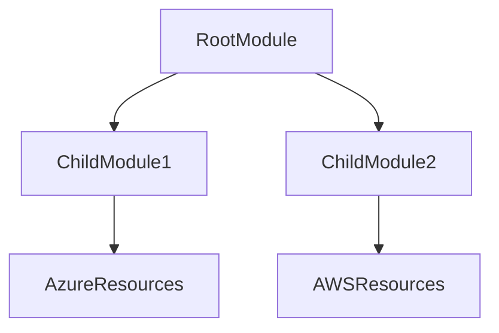
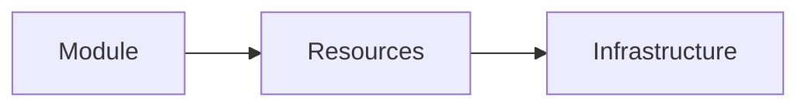
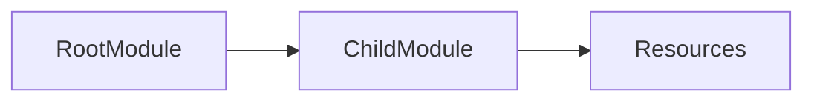
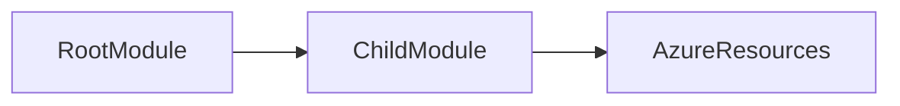
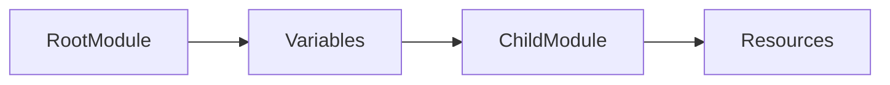
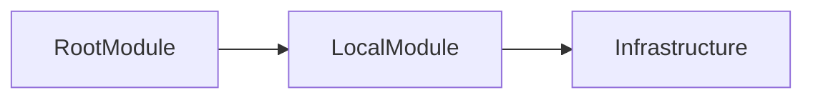

# Modules

## Overview

**Modules** are reusable containers of Terraform configuration files that help organize, standardize, and reuse Infrastructure as Code (IaC).

Instead of writing the same Terraform code multiple times, you can create a module once and reuse it across multiple projects or environments.

A module can contain:

- Resources
- Variables
- Outputs
- Data Sources
- Locals

> **Interview Tip**
>
> **Every Terraform configuration is a module.**
>
> The directory where you execute Terraform commands is called the **Root Module**.

---

## Why It Is Used

Modules help to:

- Reuse infrastructure code
- Reduce code duplication
- Improve maintainability
- Standardize infrastructure
- Simplify large projects
- Enable team collaboration

---

## Architecture / Working



### Working Process

1. Root module calls a child module.
2. Input variables are passed to the child module.
3. Child module creates resources.
4. Outputs are returned to the root module.

---

## Key Components

| Component | Purpose |
|-----------|----------|
| Root Module | Main Terraform configuration |
| Child Module | Reusable infrastructure code |
| Variables | Module inputs |
| Outputs | Return values from module |
| Source | Module location |

---

## Types (if applicable)

| Module Type | Description |
|-------------|-------------|
| Root Module | Main working directory |
| Child Module | Reusable module called by another module |
| Local Module | Module stored locally |
| Registry Module | Module downloaded from Terraform Registry |
| Git Module | Module stored in Git repository |

---

## Lifecycle / Workflow


---

## Configuration / Syntax (if applicable)

Basic Module Call

```hcl
module "network" {

  source = "./modules/network"

}
```

Passing Variables

```hcl
module "network" {

  source = "./modules/network"

  location = "East US"

}
```

Access Module Output

```hcl
module.network.subnet_id
```

---

## Important Commands (if applicable)

Initialize Modules

```bash
terraform init
```

Validate Configuration

```bash
terraform validate
```

Preview Changes

```bash
terraform plan
```

Deploy

```bash
terraform apply
```

---

## Important Files (if applicable)

| File | Purpose |
|------|----------|
| main.tf | Module resources |
| variables.tf | Module inputs |
| outputs.tf | Module outputs |
| versions.tf | Provider and Terraform versions |

Typical Structure

```text
project/

├── main.tf
├── variables.tf
├── outputs.tf
└── modules/
    ├── network/
    │   ├── main.tf
    │   ├── variables.tf
    │   └── outputs.tf
    └── vm/
        ├── main.tf
        ├── variables.tf
        └── outputs.tf
```

---

## Real-World Use Cases

- Standard Virtual Machine deployment
- Standard VNet deployment
- Shared Storage Account module
- Kubernetes cluster module
- Landing Zone deployments
- Enterprise Infrastructure Templates

---

## Advantages

- Code reusability
- Better organization
- Easier maintenance
- Standardized deployments
- Simplified collaboration
- Reduced duplication

---

## Limitations

- Requires good module design
- Debugging multiple modules can be challenging
- Poorly designed modules reduce flexibility

---

## Common Interview Questions (Concept Only)

- What is a Terraform Module?
- Why are Modules used?
- What is the difference between Root Module and Child Module?
- How are variables passed to a module?
- How are outputs returned from a module?

---

## Common Mistakes

- Hardcoding values inside modules
- Not defining input variables
- Forgetting outputs
- Creating overly complex modules
- Duplicating code instead of reusing modules

---

## Troubleshooting

| Problem | Solution |
|----------|----------|
| Module not found | Verify the `source` path |
| Missing input variable | Provide required variable values |
| Output not accessible | Ensure it is defined in `outputs.tf` |
| Changes not detected | Run `terraform init` after updating module source |
| Module download failure | Check network connectivity and source URL |

---

## Summary

Terraform Modules enable reusable, maintainable, and standardized Infrastructure as Code. They are fundamental to production Terraform deployments and are heavily used in enterprise environments to simplify infrastructure management.

---

# Module Basics

## Overview

A **Module** is a collection of Terraform configuration files grouped together to perform a specific infrastructure task.

Examples:

- Virtual Machine Module
- Networking Module
- Storage Module
- Database Module

Instead of repeating Terraform code, you call the module whenever needed.

> **Interview Tip**
>
> Think of a module as a reusable function in a programming language.

---

## Why It Is Used

Modules help to:

- Reuse code
- Standardize deployments
- Improve readability
- Simplify maintenance

---

## Architecture / Working



---

## Key Components

| Component | Purpose |
|-----------|----------|
| Resources | Infrastructure definition |
| Variables | User input |
| Outputs | Returned values |

---

## Types (if applicable)

- Infrastructure Module
- Networking Module
- Compute Module
- Storage Module

---

## Lifecycle / Workflow

Create Module → Define Variables → Add Resources → Define Outputs → Reuse

---

## Configuration / Syntax (if applicable)

```hcl
module "storage" {

  source = "./modules/storage"

}
```

---

## Important Commands (if applicable)

```bash
terraform init

terraform plan

terraform apply
```

---

## Important Files (if applicable)

- main.tf
- variables.tf
- outputs.tf

---

## Real-World Use Cases

- Reusable VM deployments
- Shared networking
- Enterprise templates

---

## Advantages

- Reusable
- Organized
- Easy maintenance

---

## Limitations

- Requires planning
- Can become complex if poorly designed

---

## Common Interview Questions (Concept Only)

- What is a Terraform Module?
- Why should modules be used?

---

## Common Mistakes

- Hardcoding values
- Not exposing variables

---

## Troubleshooting

Verify module structure and source path.

---

## Summary

Modules package Terraform configurations into reusable building blocks that simplify infrastructure deployment.

---

# Root Module

## Overview

The **Root Module** is the Terraform configuration in the directory where Terraform commands are executed.

Every Terraform project has exactly **one Root Module**.

> **Interview Tip**
>
> The directory containing your primary `main.tf` file is the Root Module.

---

## Why It Is Used

The Root Module:

- Starts deployment
- Calls child modules
- Passes variables
- Receives outputs

---

## Architecture / Working



---

## Key Components

| Component | Purpose |
|-----------|----------|
| main.tf | Main configuration |
| Module Calls | Invoke child modules |
| Variables | Inputs |
| Outputs | Final outputs |

---

## Types (if applicable)

Primary module only

---

## Lifecycle / Workflow

Terraform Commands → Root Module → Child Modules → Resources

---

## Configuration / Syntax (if applicable)

```hcl
module "network" {

  source = "./modules/network"

}
```

---

## Important Commands (if applicable)

```bash
terraform init

terraform apply
```

---

## Important Files (if applicable)

- main.tf
- variables.tf
- outputs.tf

---

## Real-World Use Cases

- Production deployment
- Development deployment
- Environment orchestration

---

## Advantages

- Central management
- Easy module orchestration

---

## Limitations

- Can become large if modules are not used

---

## Common Interview Questions (Concept Only)

- What is a Root Module?
- Can a Terraform project have multiple Root Modules?

---

## Common Mistakes

- Placing reusable code directly in the Root Module

---

## Troubleshooting

Ensure Terraform commands are executed from the correct directory.

---

## Summary

The Root Module is the entry point of every Terraform deployment and coordinates child modules and infrastructure creation.

---

# Child Module

## Overview

A **Child Module** is any module called by another module (typically the Root Module).

Child Modules contain reusable infrastructure logic.

---

## Why It Is Used

They help to:

- Reuse infrastructure
- Separate responsibilities
- Reduce duplication

---

## Architecture / Working



---

## Key Components

| Component | Purpose |
|-----------|----------|
| Source | Module location |
| Variables | Inputs |
| Outputs | Returned values |

---

## Types (if applicable)

- Local Child Module
- Registry Module
- Git Module

---

## Lifecycle / Workflow

Call Module → Receive Inputs → Create Resources → Return Outputs

---

## Configuration / Syntax (if applicable)

```hcl
module "vm" {

  source = "./modules/vm"

}
```

---

## Important Commands (if applicable)

```bash
terraform init
```

---

## Important Files (if applicable)

- main.tf
- variables.tf
- outputs.tf

---

## Real-World Use Cases

- VM module
- Networking module
- Storage module

---

## Advantages

- Reusable
- Organized
- Easier maintenance

---

## Limitations

- Requires version management

---

## Common Interview Questions (Concept Only)

- What is a Child Module?
- How is a Child Module invoked?

---

## Common Mistakes

- Incorrect module source path

---

## Troubleshooting

Run `terraform init` after modifying module sources.

---

## Summary

Child Modules contain reusable Terraform code and are called from Root Modules to create infrastructure consistently.

---

# Module Inputs

## Overview

**Module Inputs** are variables passed from the Root Module to a Child Module.

They make modules reusable by allowing different values for different deployments.

> **Interview Tip**
>
> Module inputs are defined in the child module using `variable` blocks and supplied by the calling module.

---

## Why It Is Used

Module Inputs allow:

- Flexible deployments
- Reusable modules
- Environment-specific values

---

## Architecture / Working



---

## Key Components

| Component | Purpose |
|-----------|----------|
| Variable | Input parameter |
| Module Call | Supplies values |

---

## Types (if applicable)

- String
- Number
- Boolean
- List
- Map
- Object

---

## Lifecycle / Workflow

Define Variable → Pass Value → Use in Resources

---

## Configuration / Syntax (if applicable)

Child Module

```hcl
variable "location" {

  type = string

}
```

Root Module

```hcl
module "network" {

  source = "./modules/network"

  location = "East US"

}
```

---

## Important Commands (if applicable)

```bash
terraform validate
```

---

## Important Files (if applicable)

variables.tf

---

## Real-World Use Cases

- Region selection
- VM size
- Resource names
- Tags

---

## Advantages

- Flexible
- Reusable
- Environment independent

---

## Limitations

- Missing required inputs cause validation errors

---

## Common Interview Questions (Concept Only)

- How are values passed into modules?
- Where are module variables defined?

---

## Common Mistakes

- Forgetting required variables

---

## Troubleshooting

Verify variable names match between the Root Module and Child Module.

---

## Summary

Module Inputs provide configurable values to child modules, enabling reusable and flexible Terraform code.

---

# Module Outputs

## Overview

**Module Outputs** expose values from a Child Module so they can be used by the Root Module or other modules.

Examples:

- Resource IDs
- Public IPs
- Storage Account names
- Virtual Network IDs

> **Interview Tip**
>
> Outputs are the only supported mechanism for exposing values from a child module.

---

## Why It Is Used

Outputs allow:

- Module communication
- Resource sharing
- Reusable infrastructure

---

## Architecture / Working


---

## Key Components

| Component | Purpose |
|-----------|----------|
| output | Defines exported value |
| Module Reference | Consumes output |

---

## Types (if applicable)

- String
- Number
- List
- Map
- Object

---

## Lifecycle / Workflow

Create Resource → Generate Value → Export Output → Consume in Root Module

---

## Configuration / Syntax (if applicable)

Child Module

```hcl
output "vnet_id" {

  value = azurerm_virtual_network.vnet.id

}
```

Root Module

```hcl
module.network.vnet_id
```

---

## Important Commands (if applicable)

```bash
terraform output
```

---

## Important Files (if applicable)

outputs.tf

---

## Real-World Use Cases

- Pass subnet IDs
- Share storage account names
- Share resource IDs
- Share public IP addresses

---

## Advantages

- Module communication
- Better modularity
- Reusable outputs

---

## Limitations

- Output must be explicitly defined

---

## Common Interview Questions (Concept Only)

- What are Module Outputs?
- How are outputs accessed?

---

## Common Mistakes

- Forgetting to create outputs

---

## Troubleshooting

Verify the output is defined and referenced correctly.

---

## Summary

Module Outputs expose values from child modules, allowing other modules and the Root Module to reuse deployed infrastructure information.

---

# Local Modules

## Overview

A **Local Module** is a Terraform module stored on the local filesystem and referenced using a relative or absolute path.

It is the most common module type during development.

> **Interview Tip**
>
> Local Modules are referenced using the `source` argument with a local path.

---

## Why It Is Used

Local Modules are used to:

- Organize projects
- Develop reusable modules
- Test modules before publishing

---

## Architecture / Working



---

## Key Components

| Component | Purpose |
|-----------|----------|
| source | Local directory path |
| Module Files | Terraform configuration |

---

## Types (if applicable)

- Relative path
- Absolute path

---

## Lifecycle / Workflow

Create Module Directory → Reference Module → Initialize → Deploy

---

## Configuration / Syntax (if applicable)

Relative Path

```hcl
module "network" {

  source = "./modules/network"

}
```

Absolute Path (less common)

```hcl
module "network" {

  source = "/home/user/modules/network"

}
```

---

## Important Commands (if applicable)

Initialize Modules

```bash
terraform init
```

Deploy

```bash
terraform apply
```

---

## Important Files (if applicable)

```text
modules/
├── network/
├── vm/
└── storage/
```

---

## Real-World Use Cases

- Development environments
- Enterprise reusable modules
- Team-shared module repositories
- Standard infrastructure templates

---

## Advantages

- Easy development
- Fast testing
- No internet dependency
- Simple project organization

---

## Limitations

- Local to a machine or repository
- Harder to share across multiple repositories compared to registry modules

---

## Common Interview Questions (Concept Only)

- What is a Local Module?
- How do you reference a Local Module?
- When should Local Modules be used?

---

## Common Mistakes

- Incorrect `source` path
- Forgetting to run `terraform init` after adding or changing modules

---

## Troubleshooting

| Problem | Solution |
|----------|----------|
| Module not found | Verify the `source` path |
| Module changes not detected | Run `terraform init` |
| Invalid module structure | Ensure the module contains valid `.tf` files |

---

## Summary

Local Modules are reusable Terraform modules stored within the local project directory. They are the preferred approach for developing, testing, and organizing reusable Infrastructure as Code before publishing modules to a registry.
