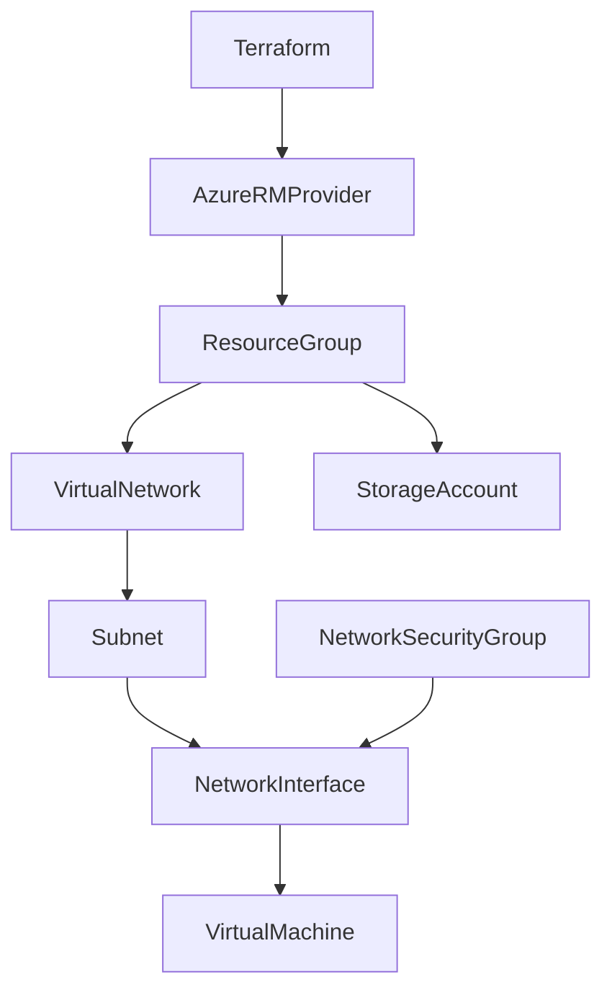
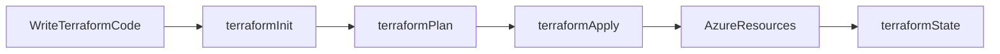
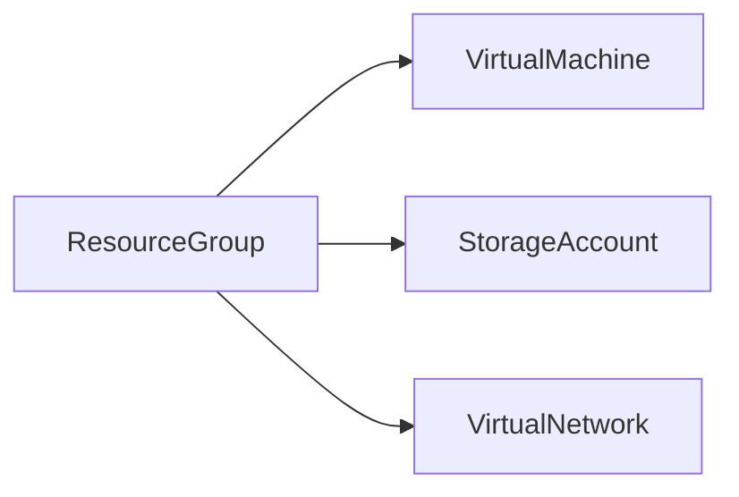
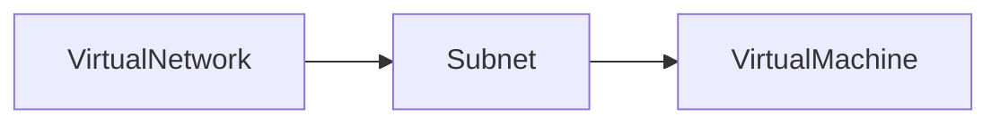
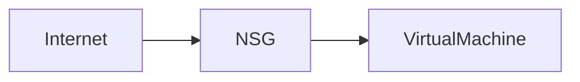
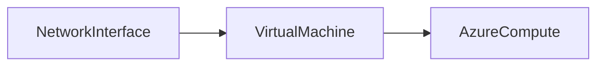
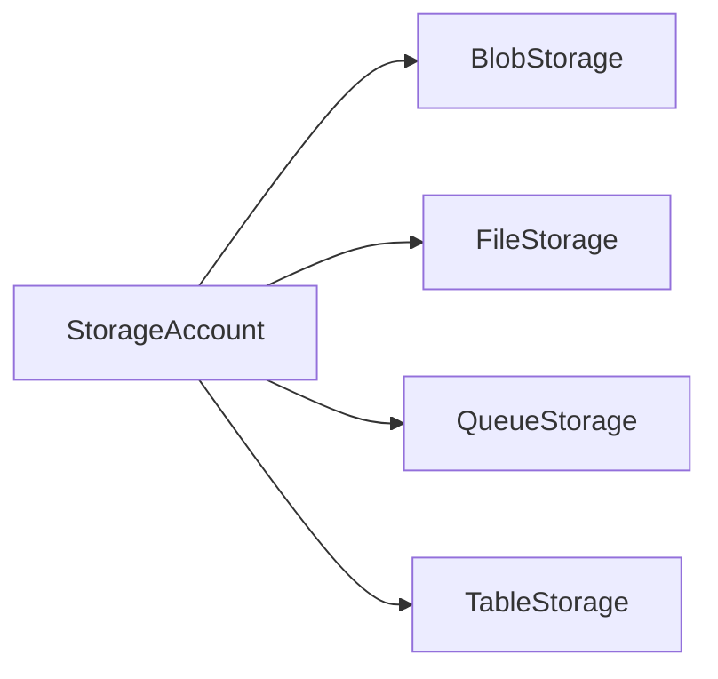

# Provisioning Azure Infrastructure

## Overview

Provisioning Azure Infrastructure with Terraform involves defining Azure resources as code using **HashiCorp Configuration Language (HCL)**. Terraform communicates with Azure Resource Manager (ARM) through the **AzureRM Provider** to create, update, and delete resources.

A typical Azure deployment includes:

- Resource Group
- Virtual Network (VNet)
- Subnet
- Network Security Group (NSG)
- Virtual Machine (VM)
- Storage Account

> **Interview Tip**
>
> Almost every Azure DevOps or Terraform interview includes creating a VM with networking resources using Terraform. Understand the dependency order and how resources reference each other.

---

## Why It Is Used

Terraform is used to provision Azure infrastructure because it:

- Automates infrastructure deployment
- Eliminates manual Azure Portal operations
- Provides repeatable deployments
- Supports version-controlled infrastructure
- Enables Infrastructure as Code (IaC)
- Integrates with CI/CD pipelines

---

## Architecture / Working



---

## Key Components

| Component | Purpose |
|-----------|----------|
| Resource Group | Logical container for Azure resources |
| Virtual Network | Private Azure network |
| Subnet | Segments a Virtual Network |
| Network Security Group | Controls inbound and outbound traffic |
| Network Interface (NIC) | Connects VM to a subnet |
| Virtual Machine | Compute resource |
| Storage Account | Stores blobs, files, queues, tables |

---

## Types (if applicable)

Typical Azure Infrastructure Order

1. Resource Group
2. Virtual Network
3. Subnet
4. Network Security Group
5. Network Interface
6. Virtual Machine
7. Storage Account

---

## Lifecycle / Workflow



---

## Configuration / Syntax (if applicable)

Basic Resource Example

```hcl
resource "azurerm_resource_group" "rg" {

  name     = "demo-rg"

  location = "East US"

}
```

Deploy

```bash
terraform init

terraform plan

terraform apply
```

---

## Important Commands (if applicable)

Initialize

```bash
terraform init
```

Validate

```bash
terraform validate
```

Plan

```bash
terraform plan
```

Apply

```bash
terraform apply
```

Destroy

```bash
terraform destroy
```

---

## Important Files (if applicable)

| File | Purpose |
|------|----------|
| providers.tf | Azure provider configuration |
| main.tf | Azure resources |
| variables.tf | Input variables |
| outputs.tf | Output values |
| terraform.tfvars | Variable values |
| terraform.tfstate | Infrastructure state |

---

## Real-World Use Cases

- Azure Landing Zones
- Enterprise infrastructure deployment
- Dev/Test environments
- Production VM deployment
- Multi-environment infrastructure
- Automated CI/CD provisioning

---

## Advantages

- Automated deployments
- Repeatable infrastructure
- Version-controlled configurations
- Easy rollback through code changes
- Cloud-native automation

---

## Limitations

- Requires Azure credentials
- Terraform state must be protected
- Incorrect changes may modify production resources

---

## Common Interview Questions (Concept Only)

- What is the typical Azure resource creation order?
- Why is a Resource Group required?
- Can a VM exist without a Virtual Network?
- Why does a VM require a Network Interface?
- How are Terraform resource dependencies created?

---

## Common Mistakes

- Creating resources in the wrong order
- Hardcoding resource names
- Forgetting resource references
- Using incorrect Azure locations
- Ignoring state management

---

## Troubleshooting

| Problem | Solution |
|----------|----------|
| Authentication failed | Verify Azure credentials |
| Resource already exists | Use Data Sources or import existing resources |
| Dependency error | Verify resource references |
| Invalid location | Use supported Azure region names |
| State mismatch | Verify Terraform state and backend configuration |

---

## Summary

Provisioning Azure infrastructure with Terraform involves creating Azure resources in the correct dependency order using Infrastructure as Code. Understanding how networking, compute, and storage resources interact is essential for Azure DevOps interviews and production deployments.

---

# Resource Group

## Overview

A **Resource Group** is a logical container that holds Azure resources such as VMs, VNets, Storage Accounts, and Databases.

Every Azure resource belongs to exactly one Resource Group.

> **Interview Tip**
>
> Azure resources cannot exist without a Resource Group.

---

## Why It Is Used

Resource Groups help:

- Organize resources
- Manage permissions
- Apply policies
- Monitor costs
- Delete related resources together

---

## Architecture / Working



---

## Key Components

| Component | Purpose |
|-----------|----------|
| Name | Resource Group name |
| Location | Azure region |
| Tags | Resource organization |

---

## Types (if applicable)

Single Resource Group

Multiple Resource Groups

---

## Lifecycle / Workflow

Create Resource Group → Deploy Resources → Manage Resources → Delete Resource Group

---

## Configuration / Syntax (if applicable)

```hcl
resource "azurerm_resource_group" "rg" {

  name     = "demo-rg"

  location = "East US"

}
```

---

## Important Commands (if applicable)

```bash
terraform apply
```

---

## Important Files (if applicable)

main.tf

---

## Real-World Use Cases

- Production resources
- Development resources
- Project isolation

---

## Advantages

- Easy organization
- Centralized management
- Simplified cleanup

---

## Limitations

- Resources cannot span multiple Resource Groups

---

## Common Interview Questions (Concept Only)

- What is a Resource Group?
- Can Azure resources exist without one?

---

## Common Mistakes

- Creating unnecessary Resource Groups
- Mixing unrelated resources

---

## Troubleshooting

Verify location and naming conventions.

---

## Summary

Resource Groups are logical containers used to organize and manage Azure resources.

---

# Virtual Network

## Overview

A **Virtual Network (VNet)** provides private networking for Azure resources.

It enables secure communication between Azure resources and on-premises environments.

> **Interview Tip**
>
> A Virtual Machine must connect to a Virtual Network through a Network Interface.

---

## Why It Is Used

Virtual Networks provide:

- Private networking
- Resource isolation
- Secure communication
- Hybrid connectivity

---

## Architecture / Working



---

## Key Components

| Component | Purpose |
|-----------|----------|
| Address Space | IP range |
| Subnets | Network segmentation |
| DNS | Name resolution |

---

## Types (if applicable)

Single VNet

Peered VNets

---

## Lifecycle / Workflow

Create VNet → Create Subnets → Deploy Resources

---

## Configuration / Syntax (if applicable)

```hcl
resource "azurerm_virtual_network" "vnet" {

  name                = "demo-vnet"

  address_space       = ["10.0.0.0/16"]

  location            = azurerm_resource_group.rg.location

  resource_group_name = azurerm_resource_group.rg.name

}
```

---

## Important Commands (if applicable)

```bash
terraform apply
```

---

## Important Files (if applicable)

main.tf

---

## Real-World Use Cases

- Private VM networking
- Kubernetes networking
- Application isolation

---

## Advantages

- Secure networking
- Private IP communication

---

## Limitations

- Address planning required

---

## Common Interview Questions (Concept Only)

- What is a Virtual Network?
- What is an address space?

---

## Common Mistakes

- Overlapping IP ranges

---

## Troubleshooting

Verify CIDR ranges and subnet boundaries.

---

## Summary

Virtual Networks provide isolated private networking for Azure resources.

---

# Subnet

## Overview

A **Subnet** divides a Virtual Network into smaller logical networks.

Every Azure Virtual Machine is deployed into a subnet.

> **Interview Tip**
>
> A subnet must belong to a Virtual Network.

---

## Why It Is Used

Subnets provide:

- Network segmentation
- Security isolation
- Efficient IP allocation

---

## Architecture / Working


---

## Key Components

| Component | Purpose |
|-----------|----------|
| CIDR Block | Subnet address range |
| Resources | Connected Azure services |

---

## Types (if applicable)

Public

Private

---

## Lifecycle / Workflow

Create VNet → Create Subnet → Deploy Resources

---

## Configuration / Syntax (if applicable)

```hcl
resource "azurerm_subnet" "subnet" {

  name                 = "web-subnet"

  resource_group_name  = azurerm_resource_group.rg.name

  virtual_network_name = azurerm_virtual_network.vnet.name

  address_prefixes     = ["10.0.1.0/24"]

}
```

---

## Important Commands (if applicable)

```bash
terraform apply
```

---

## Important Files (if applicable)

main.tf

---

## Real-World Use Cases

- Web tier
- Application tier
- Database tier

---

## Advantages

- Better security
- Improved organization

---

## Limitations

- Address range cannot overlap

---

## Common Interview Questions (Concept Only)

- Why are subnets required?
- Can multiple subnets exist in one VNet?

---

## Common Mistakes

- Overlapping subnet ranges

---

## Troubleshooting

Verify subnet CIDR ranges.

---

## Summary

Subnets divide Virtual Networks into smaller segments for improved management and security.

---

# Network Security Group

## Overview

A **Network Security Group (NSG)** controls inbound and outbound network traffic using security rules.

It acts as a virtual firewall for Azure resources.

> **Interview Tip**
>
> NSGs can be associated with both **Subnets** and **Network Interfaces**.

---

## Why It Is Used

NSGs:

- Protect Azure resources
- Control traffic
- Restrict ports
- Improve security

---

## Architecture / Working



---

## Key Components

| Component | Purpose |
|-----------|----------|
| Rules | Allow or deny traffic |
| Priority | Rule processing order |
| Direction | Inbound or outbound |

---

## Types (if applicable)

Inbound Rules

Outbound Rules

---

## Lifecycle / Workflow

Create NSG → Define Rules → Associate with Subnet or NIC

---

## Configuration / Syntax (if applicable)

```hcl
resource "azurerm_network_security_group" "nsg" {

  name                = "demo-nsg"

  location            = azurerm_resource_group.rg.location

  resource_group_name = azurerm_resource_group.rg.name

}
```

---

## Important Commands (if applicable)

```bash
terraform apply
```

---

## Important Files (if applicable)

main.tf

---

## Real-World Use Cases

- SSH access
- Web server access
- Database protection

---

## Advantages

- Strong security
- Centralized traffic control

---

## Limitations

- Incorrect rules may block access

---

## Common Interview Questions (Concept Only)

- What is an NSG?
- Can NSGs be attached to both subnets and NICs?

---

## Common Mistakes

- Incorrect rule priorities
- Blocking required ports

---

## Troubleshooting

Verify NSG rule priorities and associations.

---

## Summary

Network Security Groups protect Azure resources by filtering inbound and outbound traffic.

---

# Virtual Machine

## Overview

An Azure **Virtual Machine (VM)** provides scalable compute resources for running applications and services.

A VM requires:

- Resource Group
- Virtual Network
- Subnet
- Network Interface
- Operating System Image

> **Interview Tip**
>
> Terraform creates the Network Interface before the Virtual Machine because of implicit resource dependencies.

---

## Why It Is Used

Virtual Machines are used for:

- Web servers
- Application servers
- Databases
- Development environments
- CI/CD agents

---

## Architecture / Working



---

## Key Components

| Component | Purpose |
|-----------|----------|
| Network Interface | Network connectivity |
| OS Disk | Operating system |
| Image | VM operating system |
| Size | Compute resources |

---

## Types (if applicable)

Linux VM

Windows VM

---

## Lifecycle / Workflow

Create NIC → Create VM → Configure OS → Deploy Applications

---

## Configuration / Syntax (if applicable)

Basic Example

```hcl
resource "azurerm_linux_virtual_machine" "vm" {

  name = "demo-vm"

}
```

---

## Important Commands (if applicable)

```bash
terraform apply
```

---

## Important Files (if applicable)

main.tf

---

## Real-World Use Cases

- Jenkins server
- Web server
- Bastion host
- Application server

---

## Advantages

- Flexible
- Scalable
- Supports multiple operating systems

---

## Limitations

- Requires networking resources
- Ongoing compute costs

---

## Common Interview Questions (Concept Only)

- What resources are required before creating a VM?
- Why is a Network Interface required?

---

## Common Mistakes

- Forgetting NIC configuration
- Missing SSH credentials

---

## Troubleshooting

Verify image, size, authentication, and networking configuration.

---

## Summary

Virtual Machines provide Azure compute resources and depend on networking components such as Virtual Networks, Subnets, and Network Interfaces.

---

# Storage Account

## Overview

An Azure **Storage Account** provides cloud storage services such as:

- Blob Storage
- File Shares
- Queues
- Tables

It is one of the most commonly deployed Azure resources.

> **Interview Tip**
>
> Storage Account names must be globally unique across Azure.

---

## Why It Is Used

Storage Accounts are used for:

- Application data
- Terraform remote state
- Backups
- Logs
- File sharing

---

## Architecture / Working



---

## Key Components

| Component | Purpose |
|-----------|----------|
| Blob Storage | Object storage |
| File Shares | SMB file storage |
| Queues | Messaging |
| Tables | NoSQL storage |

---

## Types (if applicable)

General Purpose v2 (GPv2)

Premium Storage

---

## Lifecycle / Workflow

Create Storage Account → Create Containers → Store Data

---

## Configuration / Syntax (if applicable)

```hcl
resource "azurerm_storage_account" "storage" {

  name                     = "demostorage12345"

  resource_group_name      = azurerm_resource_group.rg.name

  location                 = azurerm_resource_group.rg.location

  account_tier             = "Standard"

  account_replication_type = "LRS"

}
```

---

## Important Commands (if applicable)

```bash
terraform apply
```

---

## Important Files (if applicable)

main.tf

---

## Real-World Use Cases

- Terraform Remote State
- Application files
- Logs
- Backups
- Static website hosting

---

## Advantages

- Highly available
- Durable
- Scalable
- Cost-effective

---

## Limitations

- Storage account names must be globally unique
- Performance depends on selected SKU

---

## Common Interview Questions (Concept Only)

- What services are provided by a Storage Account?
- Why are Storage Accounts commonly used with Terraform?
- Why must Storage Account names be globally unique?
- What is the purpose of replication types such as LRS?

---

## Common Mistakes

- Choosing a duplicate storage account name
- Selecting an inappropriate replication option
- Storing Terraform state without access controls

---

## Troubleshooting

| Problem | Solution |
|----------|----------|
| Storage account name already exists | Choose a globally unique name |
| Deployment fails | Verify SKU and replication type |
| Authentication issues | Check Azure credentials and permissions |
| Access denied | Review RBAC roles and storage account access settings |

---

## Summary

Azure Storage Accounts provide scalable and durable cloud storage services. They are widely used for application data, backups, logs, and Terraform remote state, making them a core resource in Azure infrastructure deployments and a frequent topic in Azure DevOps interviews.
