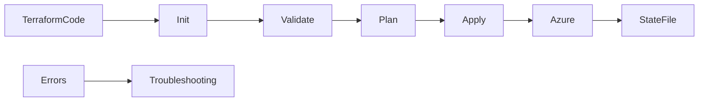
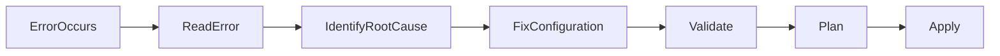
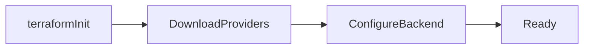
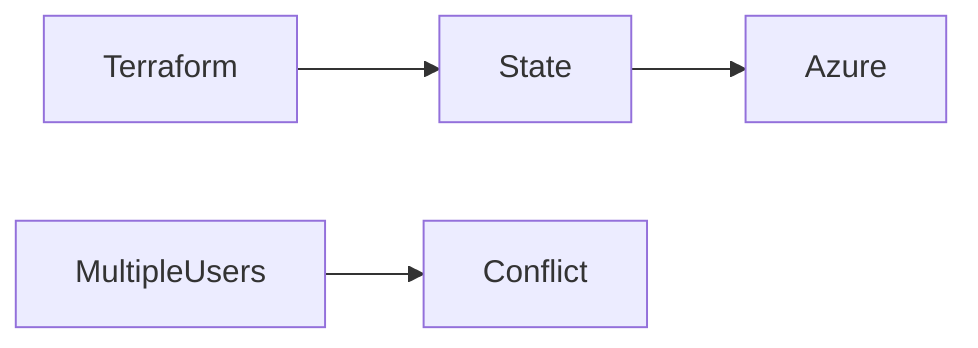
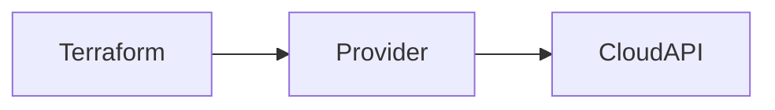
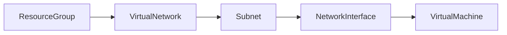
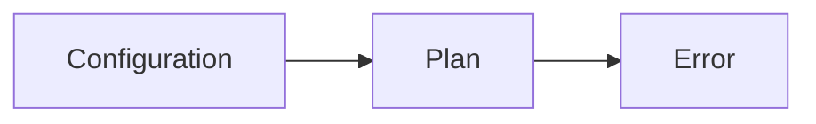
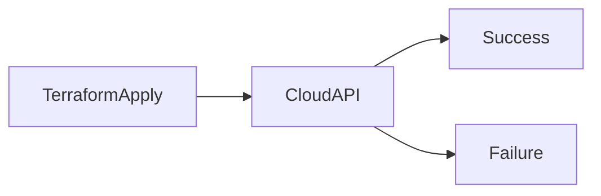

# Troubleshooting

## Overview

Terraform troubleshooting involves identifying and resolving errors that occur during the infrastructure lifecycle. Most issues occur during one of the following stages:

- Initialization (`terraform init`)
- Validation (`terraform validate`)
- Planning (`terraform plan`)
- Deployment (`terraform apply`)
- State Management

Understanding how to read Terraform error messages and identify their root causes is an essential skill for DevOps Engineers, Cloud Engineers, and SREs.

> **Interview Tip**
>
> Around 80% of real-world Terraform issues fall into these categories:
>
> - Initialization errors
> - Authentication/provider errors
> - State conflicts
> - Dependency issues
> - Plan failures
> - Apply failures

---

## Why It Is Used

Troubleshooting helps to:

- Identify infrastructure deployment failures
- Reduce deployment downtime
- Prevent accidental infrastructure changes
- Resolve configuration issues quickly
- Maintain consistent Infrastructure as Code (IaC)

---

## Architecture / Working



---

## Key Components

| Component | Purpose |
|-----------|----------|
| Terraform CLI | Executes Terraform commands |
| Provider | Connects to cloud APIs |
| Backend | Stores Terraform state |
| State File | Tracks deployed resources |
| Execution Plan | Preview of infrastructure changes |
| Logs | Error diagnosis |

---

## Types (if applicable)

| Error Type | Stage |
|------------|-------|
| Initialization Errors | Init |
| Authentication Errors | Init / Plan |
| Provider Errors | Init / Apply |
| State Conflicts | Plan / Apply |
| Dependency Issues | Plan / Apply |
| Plan Errors | Plan |
| Apply Failures | Apply |

---

## Lifecycle / Workflow



---

## Configuration / Syntax (if applicable)

Useful Validation Commands

```bash
terraform fmt

terraform validate

terraform plan

terraform show

terraform state list
```

---

## Important Commands (if applicable)

Initialize

```bash
terraform init
```

Validate

```bash
terraform validate
```

Plan

```bash
terraform plan
```

Apply

```bash
terraform apply
```

Show State

```bash
terraform show
```

List Resources

```bash
terraform state list
```

Refresh State

```bash
terraform refresh
```

Unlock State (Use Carefully)

```bash
terraform force-unlock LOCK_ID
```

Enable Debug Logging

Linux

```bash
export TF_LOG=DEBUG
```

Windows PowerShell

```powershell
$env:TF_LOG="DEBUG"
```

Disable Debug Logging

Linux

```bash
unset TF_LOG
```

---

## Important Files (if applicable)

| File | Purpose |
|------|----------|
| main.tf | Infrastructure configuration |
| providers.tf | Provider configuration |
| variables.tf | Input variables |
| terraform.tfstate | Infrastructure state |
| terraform.tfstate.backup | State backup |
| terraform.lock.hcl | Provider dependency lock file |

---

## Real-World Use Cases

- Failed Azure deployments
- Provider authentication failures
- Team state conflicts
- Resource dependency issues
- CI/CD deployment failures
- Production troubleshooting

---

## Advantages

- Faster issue resolution
- Safer deployments
- Reduced downtime
- Easier debugging
- Improved deployment reliability

---

## Limitations

- Error messages may involve multiple resources
- State corruption can require manual recovery
- Incorrect fixes can affect production infrastructure

---

## Common Interview Questions (Concept Only)

- What are the most common Terraform deployment errors?
- How do you troubleshoot a failed `terraform apply`?
- What causes state locking issues?
- How do you enable Terraform debug logging?
- What should you check first when `terraform init` fails?

---

## Common Mistakes

- Ignoring Terraform error messages
- Editing the state file manually
- Hardcoding credentials
- Skipping `terraform validate`
- Running `terraform apply` without reviewing the plan
- Using local state for team environments

---

## Troubleshooting

Always troubleshoot in this order:

1. Read the complete error message.
2. Identify the failing resource.
3. Verify provider authentication.
4. Check the Terraform state.
5. Validate configuration.
6. Review dependencies.
7. Run `terraform plan` again before applying changes.

---

## Summary

Terraform troubleshooting primarily focuses on initialization, authentication, state management, dependency resolution, planning, and deployment issues. Understanding these common error categories significantly improves deployment reliability and is a key interview topic.

---

# Initialization Errors

## Overview

Initialization errors occur during `terraform init`.

Terraform cannot proceed until initialization completes successfully.

> **Interview Tip**
>
> Most initialization errors are related to providers, backends, or internet connectivity.

---

## Why It Is Used

Initialization prepares Terraform by:

- Downloading providers
- Initializing modules
- Configuring the backend
- Creating dependency lock files

---

## Architecture / Working



---

## Key Components

| Component | Purpose |
|-----------|----------|
| Provider Download | Required plugins |
| Backend Initialization | State storage |
| Module Download | External modules |

---

## Types (if applicable)

- Provider download failure
- Backend initialization failure
- Module download failure

---

## Lifecycle / Workflow

Run `terraform init` → Download Providers → Initialize Backend → Ready

---

## Configuration / Syntax (if applicable)

```bash
terraform init
```

Reconfigure Backend

```bash
terraform init -reconfigure
```

Upgrade Providers

```bash
terraform init -upgrade
```

---

## Important Commands (if applicable)

```bash
terraform init

terraform init -upgrade

terraform init -reconfigure
```

---

## Important Files (if applicable)

- terraform.lock.hcl
- backend.tf

---

## Real-World Use Cases

- Provider installation
- Backend migration
- Module initialization

---

## Advantages

- Ensures dependencies are available

---

## Limitations

- Requires internet access (unless providers are cached)
- Backend must be accessible

---

## Common Interview Questions (Concept Only)

- What does `terraform init` do?
- Why would `terraform init` fail?

---

## Common Mistakes

- Forgetting to initialize after changing providers
- Incorrect backend configuration

---

## Troubleshooting

| Problem | Solution |
|----------|----------|
| Provider download failed | Verify internet access |
| Backend initialization failed | Check backend configuration |
| Provider version conflict | Run `terraform init -upgrade` |
| Module download failed | Verify module source path |

---

## Summary

Initialization errors prevent Terraform from preparing the working directory and usually involve providers, modules, or backend configuration.

---

# State Conflicts

## Overview

Terraform State Conflicts occur when the Terraform state file does not accurately represent the actual infrastructure or when multiple users modify the state simultaneously.

> **Interview Tip**
>
> In team environments, always use a **remote backend with state locking** to prevent state conflicts.

---

## Why It Is Used

Understanding state conflicts helps:

- Prevent infrastructure corruption
- Avoid duplicate resources
- Support collaborative deployments

---

## Architecture / Working



---

## Key Components

| Component | Purpose |
|-----------|----------|
| State File | Tracks infrastructure |
| Backend | Stores state |
| State Lock | Prevents concurrent changes |

---

## Types (if applicable)

- State lock conflict
- Drift
- Corrupted state

---

## Lifecycle / Workflow

Read State → Compare Infrastructure → Update State

---

## Configuration / Syntax (if applicable)

List State

```bash
terraform state list
```

Show State

```bash
terraform show
```

Unlock State

```bash
terraform force-unlock LOCK_ID
```

---

## Important Commands (if applicable)

```bash
terraform state list

terraform show

terraform force-unlock
```

---

## Important Files (if applicable)

- terraform.tfstate
- terraform.tfstate.backup

---

## Real-World Use Cases

- Team deployments
- Azure Storage backend
- Multi-user environments

---

## Advantages

- Tracks infrastructure accurately
- Prevents duplicate deployments

---

## Limitations

- Requires backend locking for teams

---

## Common Interview Questions (Concept Only)

- What causes state conflicts?
- How does Terraform state locking work?

---

## Common Mistakes

- Sharing local state files
- Editing state manually

---

## Troubleshooting

| Problem | Solution |
|----------|----------|
| State locked | Wait or use `terraform force-unlock` after confirming no active operation |
| Drift detected | Refresh state and review infrastructure |
| Corrupted state | Restore from backup |

---

## Summary

State conflicts occur when Terraform's state becomes inconsistent or is modified concurrently. Remote state with locking minimizes these issues.

---

# Provider Errors

## Overview

Provider errors occur when Terraform cannot communicate correctly with the cloud provider.

These errors usually involve authentication, authorization, unsupported versions, or API connectivity.

---

## Why It Is Used

Troubleshooting provider errors ensures Terraform can successfully communicate with Azure or AWS APIs.

---

## Architecture / Working



---

## Key Components

| Component | Purpose |
|-----------|----------|
| Provider | Cloud communication |
| Credentials | Authentication |
| Cloud API | Resource management |

---

## Types (if applicable)

- Authentication failure
- Authorization failure
- Unsupported provider version

---

## Lifecycle / Workflow

Initialize Provider → Authenticate → Connect → Deploy

---

## Configuration / Syntax (if applicable)

Provider

```hcl
provider "azurerm" {

  features {}

}
```

---

## Important Commands (if applicable)

```bash
terraform init

terraform providers
```

---

## Important Files (if applicable)

providers.tf

---

## Real-World Use Cases

- Azure authentication
- AWS authentication
- Multi-cloud deployments

---

## Advantages

- Enables cloud communication

---

## Limitations

- Depends on valid credentials

---

## Common Interview Questions (Concept Only)

- What causes provider errors?
- How do you troubleshoot authentication failures?

---

## Common Mistakes

- Expired credentials
- Wrong subscription
- Incorrect provider version

---

## Troubleshooting

Verify:

- Credentials
- Subscription
- Tenant
- Provider version
- RBAC permissions

---

## Summary

Provider errors typically result from authentication, authorization, or provider configuration issues.

---

# Dependency Issues

## Overview

Dependency issues occur when Terraform attempts to create a resource before its required dependencies are available.

Terraform automatically determines many dependencies through resource references, but explicit dependencies may sometimes be necessary.

---

## Why It Is Used

Proper dependency management ensures:

- Correct deployment order
- Reliable infrastructure creation
- Reduced deployment failures

---

## Architecture / Working



---

## Key Components

| Component | Purpose |
|-----------|----------|
| Resource References | Implicit dependencies |
| depends_on | Explicit dependency |

---

## Types (if applicable)

- Implicit dependency
- Explicit dependency

---

## Lifecycle / Workflow

Create Dependency → Create Dependent Resource

---

## Configuration / Syntax (if applicable)

```hcl
depends_on = [

  azurerm_resource_group.rg

]
```

---

## Important Commands (if applicable)

```bash
terraform graph
```

---

## Important Files (if applicable)

main.tf

---

## Real-World Use Cases

- VM deployment
- Networking
- Storage provisioning

---

## Advantages

- Correct deployment order
- Predictable infrastructure creation

---

## Limitations

- Unnecessary explicit dependencies can slow deployments

---

## Common Interview Questions (Concept Only)

- What is an implicit dependency?
- When should `depends_on` be used?

---

## Common Mistakes

- Missing resource references
- Overusing `depends_on`

---

## Troubleshooting

Verify resource references and use `depends_on` only when Terraform cannot infer the dependency.

---

## Summary

Dependency issues occur when resources are created in an incorrect order. Terraform usually resolves dependencies automatically through references.

---

# Plan Errors

## Overview

Plan errors occur during `terraform plan` when Terraform cannot determine the required infrastructure changes.

---

## Why It Is Used

Identifying plan errors prevents failed deployments before infrastructure is modified.

---

## Architecture / Working



---

## Key Components

| Component | Purpose |
|-----------|----------|
| Configuration | Desired state |
| State | Current state |

---

## Types (if applicable)

- Missing variables
- Invalid syntax
- Unsupported arguments

---

## Lifecycle / Workflow

Validate → Plan → Review

---

## Configuration / Syntax (if applicable)

```bash
terraform plan
```

---

## Important Commands (if applicable)

```bash
terraform validate

terraform plan
```

---

## Important Files (if applicable)

- main.tf
- variables.tf

---

## Real-World Use Cases

- Infrastructure validation
- Deployment review

---

## Advantages

- Prevents invalid deployments

---

## Limitations

- Does not detect runtime API failures

---

## Common Interview Questions (Concept Only)

- What causes `terraform plan` to fail?
- Why run `terraform validate` before `terraform plan`?

---

## Common Mistakes

- Missing required variables
- Invalid HCL syntax
- Incorrect resource references

---

## Troubleshooting

Run `terraform fmt`, `terraform validate`, and review the reported line numbers and variable definitions.

---

## Summary

Plan errors identify configuration problems before infrastructure changes are applied, making them an important safeguard.

---

# Apply Failures

## Overview

Apply failures occur when Terraform begins creating or modifying resources but cannot complete the operation successfully.

These failures often originate from cloud provider APIs rather than Terraform syntax.

> **Interview Tip**
>
> Successful planning does not guarantee a successful apply. Provider-side constraints such as quotas, permissions, naming rules, or existing resources may only surface during `terraform apply`.

---

## Why It Is Used

Understanding apply failures helps to:

- Resolve deployment issues quickly
- Protect production environments
- Ensure infrastructure consistency

---

## Architecture / Working



---

## Key Components

| Component | Purpose |
|-----------|----------|
| Provider | Sends API requests |
| Cloud API | Creates resources |
| State File | Tracks deployment progress |

---

## Types (if applicable)

- Permission denied
- Resource already exists
- Quota exceeded
- Invalid resource configuration
- Naming conflicts

---

## Lifecycle / Workflow

Plan Approved → Apply → Cloud API → Resource Created or Error Returned

---

## Configuration / Syntax (if applicable)

```bash
terraform apply

terraform apply tfplan
```

---

## Important Commands (if applicable)

```bash
terraform apply

terraform show

terraform state list
```

---

## Important Files (if applicable)

- terraform.tfstate
- terraform.tfstate.backup

---

## Real-World Use Cases

- Azure VM deployment failures
- Storage account name conflicts
- Network configuration failures
- CI/CD deployment issues

---

## Advantages

- Reveals runtime infrastructure issues
- Updates Terraform state after successful operations

---

## Limitations

- Partial resource creation may require cleanup or state reconciliation
- Failures can leave infrastructure in an intermediate state

---

## Common Interview Questions (Concept Only)

- What causes `terraform apply` to fail?
- Why can `terraform plan` succeed while `terraform apply` fails?
- How do you troubleshoot failed infrastructure deployments?

---

## Common Mistakes

- Ignoring cloud provider quotas
- Using duplicate globally unique resource names
- Deploying without sufficient permissions
- Not reviewing provider error messages

---

## Troubleshooting

| Problem | Solution |
|----------|----------|
| Permission denied | Verify IAM/RBAC roles and credentials |
| Resource already exists | Import the resource or use a different name |
| Quota exceeded | Request a quota increase or choose another region |
| Invalid configuration | Review provider documentation and resource properties |
| Partial deployment | Inspect the state file and reconcile resources before retrying |

---

## Summary

Apply failures occur when Terraform cannot successfully complete infrastructure changes due to cloud provider constraints, permissions, quotas, or runtime validation. Careful review of provider error messages and state information is essential for resolving these issues.
