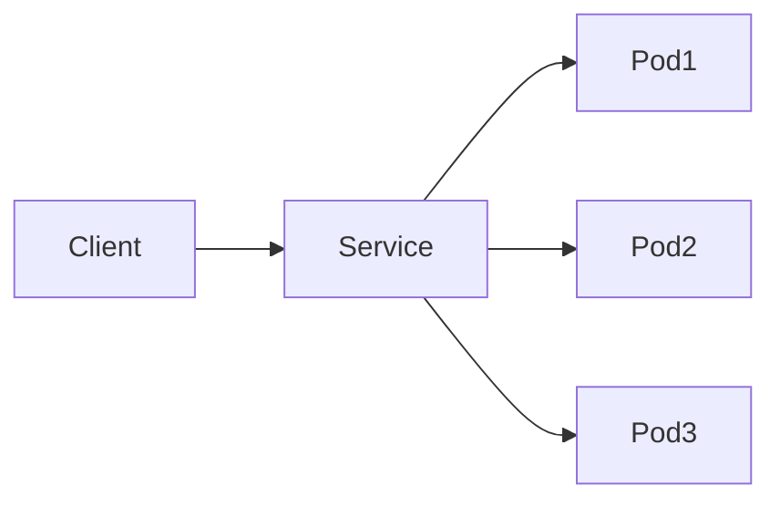
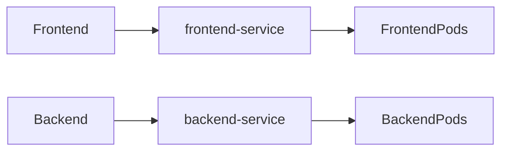
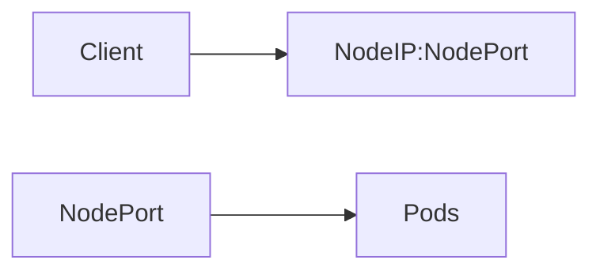

# Services

## Overview

A **Service** in Kubernetes is an abstraction that provides a **stable network endpoint** for accessing one or more Pods.

Pods are **ephemeral**—they can be created, deleted, or rescheduled at any time, causing their IP addresses to change. A Service solves this problem by exposing a **stable IP address and DNS name**, allowing applications to communicate reliably without needing to know individual Pod IPs.

A Service selects Pods using **labels and selectors** and automatically routes traffic to healthy Pods.

> **Interview Tip**
>
> Pods are temporary, but **Services provide a permanent way to access them**.
>
> One of the most common interview questions is:
>
> **"Why do we need Services if Pods already have IP addresses?"**

---

## Why It Is Used

Services are used to:

- Provide a stable endpoint for Pods
- Enable communication between applications
- Load balance traffic across multiple Pods
- Support service discovery
- Expose applications internally or externally
- Decouple clients from Pod lifecycle

---

## Architecture / Working



Service Discovery



---

## Key Components

| Component | Purpose |
|-----------|----------|
| Service | Stable network endpoint |
| Selector | Selects matching Pods |
| Labels | Identify Pods |
| Endpoints | List of healthy Pod IPs |
| Cluster IP | Internal Service IP |
| kube-proxy | Routes traffic |

---

## Types (if applicable)

| Service Type | Access Scope | Common Use Case |
|--------------|--------------|-----------------|
| ClusterIP | Internal Cluster | Microservices |
| NodePort | External via Node IP | Testing |
| LoadBalancer | External Load Balancer | Production |
| ExternalName | External DNS Mapping | External Services |

---

## Lifecycle / Workflow

```mermaid
flowchart LR

Pod Created

↓

Labels Assigned

↓

Service Selector Matches

↓

Endpoints Created

↓

Traffic Routed
```

---

## Configuration / Syntax (if applicable)

Example Service

```yaml
apiVersion: v1

kind: Service

metadata:
  name: nginx-service

spec:
  selector:
    app: nginx

  ports:
  - port: 80
    targetPort: 80

  type: ClusterIP
```

Create Service

```bash
kubectl apply -f service.yaml
```

---

## Important Commands (if applicable)

List Services

```bash
kubectl get services
```

Describe Service

```bash
kubectl describe service <service-name>
```

View Endpoints

```bash
kubectl get endpoints
```

Delete Service

```bash
kubectl delete service <service-name>
```

Expose Deployment

```bash
kubectl expose deployment nginx \
--port=80 \
--target-port=80
```

---

## Important Files (if applicable)

| File | Purpose |
|------|----------|
| service.yaml | Service definition |
| deployment.yaml | Creates Pods |
| ingress.yaml | External routing |

---

## Real-World Use Cases

- Frontend to backend communication
- Database access
- Internal APIs
- External web applications
- Load balancing
- Microservices communication

---

## Advantages

- Stable IP address
- Built-in load balancing
- Automatic service discovery
- Decouples Pods from clients
- Simplifies networking
- Automatically updates endpoints

---

## Limitations

- Does not perform Layer 7 routing
- ClusterIP is accessible only inside the cluster
- NodePort exposes a limited port range
- LoadBalancer depends on cloud provider support

---

## Common Interview Questions (Concept Only)

- What is a Kubernetes Service?
- Why do Pods need Services?
- How does a Service find Pods?
- What are Endpoints?
- What is kube-proxy's role?
- Can a Service exist without Pods?
- What happens if Pod IPs change?
- Does a Service create Pods?

---

## Common Mistakes

- Using incorrect labels or selectors
- Confusing Service IP with Pod IP
- Assuming Services create Pods
- Forgetting to expose application ports
- Using NodePort in production unnecessarily

---

## Troubleshooting

| Problem | Cause | Solution |
|----------|--------|----------|
| Service has no endpoints | Selector mismatch | Verify Pod labels |
| Cannot access Service | Wrong port | Check Service ports |
| No traffic reaching Pods | Application not listening | Verify targetPort |
| External access fails | Wrong Service type | Use LoadBalancer or Ingress |
| DNS lookup fails | CoreDNS issue | Check DNS Pods |

Useful Commands

```bash
kubectl get svc

kubectl describe svc <service-name>

kubectl get endpoints

kubectl get pods --show-labels

kubectl get events
```

---

## Summary

A Kubernetes Service provides a stable network endpoint for accessing Pods. It uses labels and selectors to route traffic to healthy Pods, enabling reliable communication despite the dynamic nature of Pod IP addresses. Services are a core networking abstraction used in virtually every Kubernetes deployment.

---

# ClusterIP

## Overview

**ClusterIP** is the **default Service type** in Kubernetes.

It exposes a Service using an **internal virtual IP** that is accessible **only within the Kubernetes cluster**.

ClusterIP is primarily used for communication between microservices.

> **Interview Tip**
>
> If the `type` field is omitted in a Service manifest, Kubernetes creates a **ClusterIP** Service by default.

---

## Why It Is Used

- Internal application communication
- Backend APIs
- Database access
- Microservices networking

---

## Architecture / Working


---

## Key Components

| Component | Purpose |
|-----------|----------|
| Cluster IP | Internal virtual IP |
| Selector | Identifies Pods |
| Endpoints | Backend Pods |

---

## Types (if applicable)

Default Service Type

---

## Lifecycle / Workflow

Create Service

↓

Assign Cluster IP

↓

Discover Matching Pods

↓

Route Internal Traffic

---

## Configuration / Syntax (if applicable)

```yaml
spec:
  type: ClusterIP
```

---

## Important Commands (if applicable)

```bash
kubectl get svc

kubectl describe svc
```

---

## Important Files (if applicable)

service.yaml

---

## Real-World Use Cases

- Frontend → Backend
- Backend → Database
- Internal APIs

---

## Advantages

- Secure
- Internal-only
- Built-in load balancing

---

## Limitations

- Not accessible outside the cluster

---

## Common Interview Questions (Concept Only)

- What is ClusterIP?
- Is ClusterIP accessible externally?

---

## Common Mistakes

- Expecting external access

---

## Troubleshooting

Verify Service selectors and ClusterIP assignment.

---

## Summary

ClusterIP is the default Kubernetes Service type used for internal communication between applications inside the cluster.

---

# NodePort

## Overview

A **NodePort** Service exposes an application on a static port (typically **30000–32767**) on every Worker Node.

Applications become accessible using:

```
<Node-IP>:<NodePort>
```

> **Interview Tip**
>
> NodePort is commonly used for testing and small environments. In production, an **Ingress** or **LoadBalancer** is generally preferred.

---

## Why It Is Used

- External testing
- Development clusters
- Simple external access

---

## Architecture / Working



---

## Key Components

| Component | Purpose |
|-----------|----------|
| Node Port | External access |
| ClusterIP | Internal routing |
| Pods | Backend |

---

## Types (if applicable)

NodePort

---

## Lifecycle / Workflow

Create Service

↓

Assign NodePort

↓

Traffic Arrives at Node

↓

Forward to Pods

---

## Configuration / Syntax (if applicable)

```yaml
spec:
  type: NodePort
```

---

## Important Commands (if applicable)

```bash
kubectl get svc
```

---

## Important Files (if applicable)

service.yaml

---

## Real-World Use Cases

- Development
- Testing
- Home lab clusters

---

## Advantages

- Simple
- External access
- Works on any Kubernetes cluster

---

## Limitations

- Limited port range
- No cloud load balancing
- Exposes ports on every node

---

## Common Interview Questions (Concept Only)

- What is NodePort?
- What is the NodePort range?

---

## Common Mistakes

- Using NodePort for production internet-facing applications

---

## Troubleshooting

Verify firewall rules, node IP, and NodePort configuration.

---

## Summary

NodePort exposes a Service on every cluster node using a static port, making it suitable for development and testing environments.

---

# LoadBalancer

## Overview

A **LoadBalancer** Service exposes an application externally by provisioning a cloud provider's load balancer.

It builds upon a NodePort Service and automatically configures an external IP.

Supported by managed Kubernetes platforms such as:

- Azure Kubernetes Service (AKS)
- Amazon Elastic Kubernetes Service (EKS)
- Google Kubernetes Engine (GKE)

---

## Why It Is Used

- Production applications
- Public websites
- External APIs
- Internet-facing services

---

## Architecture / Working


---

## Key Components

| Component | Purpose |
|-----------|----------|
| Cloud Load Balancer | External entry point |
| NodePort | Intermediate routing |
| Pods | Backend |

---

## Types (if applicable)

Cloud LoadBalancer

---

## Lifecycle / Workflow

Create Service

↓

Cloud Load Balancer Provisioned

↓

External IP Assigned

↓

Traffic Routed to Pods

---

## Configuration / Syntax (if applicable)

```yaml
spec:
  type: LoadBalancer
```

---

## Important Commands (if applicable)

```bash
kubectl get svc
```

---

## Important Files (if applicable)

service.yaml

---

## Real-World Use Cases

- Production websites
- APIs
- Enterprise applications
- SaaS platforms

---

## Advantages

- Automatic external IP
- Cloud integration
- Built-in load balancing

---

## Limitations

- Requires cloud provider support
- May incur additional cloud costs

---

## Common Interview Questions (Concept Only)

- What is LoadBalancer?
- Does LoadBalancer create NodePort automatically?

---

## Common Mistakes

- Expecting LoadBalancer to work on local clusters without additional components

---

## Troubleshooting

Check external IP assignment, cloud controller status, and load balancer provisioning.

---

## Summary

LoadBalancer Services expose applications to external users by provisioning a cloud-native load balancer that distributes traffic across backend Pods.

---

# ExternalName

## Overview

An **ExternalName** Service maps a Kubernetes Service name to an external DNS name.

Unlike other Service types, it **does not create a ClusterIP or proxy traffic**.

Instead, Kubernetes returns a DNS CNAME record pointing to the external hostname.

---

## Why It Is Used

- Access external databases
- Connect to third-party APIs
- Reference external services consistently

---

## Architecture / Working


---

## Key Components

| Component | Purpose |
|-----------|----------|
| ExternalName | DNS alias |
| External DNS | Target hostname |

---

## Types (if applicable)

ExternalName

---

## Lifecycle / Workflow

Create Service

↓

DNS Mapping Created

↓

Application Resolves External Host

---

## Configuration / Syntax (if applicable)

```yaml
spec:
  type: ExternalName

  externalName: api.example.com
```

---

## Important Commands (if applicable)

```bash
kubectl get svc
```

---

## Important Files (if applicable)

service.yaml

---

## Real-World Use Cases

- External databases
- SaaS integrations
- Legacy systems

---

## Advantages

- Simple DNS mapping
- No proxy required
- Consistent service names

---

## Limitations

- DNS only
- No load balancing
- No health checks

---

## Common Interview Questions (Concept Only)

- What is ExternalName?
- Does ExternalName create a ClusterIP?

---

## Common Mistakes

- Expecting ExternalName to proxy network traffic

---

## Troubleshooting

Verify DNS resolution and the configured external hostname.

---

## Summary

ExternalName Services provide a DNS alias to external services, allowing applications inside Kubernetes to use a consistent internal service name.

---

# Service Discovery

## Overview

**Service Discovery** is the mechanism that enables applications to automatically locate and communicate with Services without hardcoding IP addresses.

Kubernetes provides built-in service discovery through:

- DNS
- Environment variables

CoreDNS is the default DNS service used in modern Kubernetes clusters.

---

## Why It Is Used

- Automatic application discovery
- Eliminate hardcoded IP addresses
- Simplify microservices communication
- Improve portability

---

## Architecture / Working


---

## Key Components

| Component | Purpose |
|-----------|----------|
| CoreDNS | DNS resolution |
| Service | Stable endpoint |
| ClusterIP | Internal IP |

---

## Types (if applicable)

| Method | Description |
|---------|-------------|
| DNS | Preferred approach |
| Environment Variables | Legacy approach |

---

## Lifecycle / Workflow

Service Created

↓

DNS Record Generated

↓

Application Queries DNS

↓

Traffic Routed to Pods

---

## Configuration / Syntax (if applicable)

Typical DNS format:

```
<service-name>.<namespace>.svc.cluster.local
```

Example:

```
backend.default.svc.cluster.local
```

---

## Important Commands (if applicable)

View Services

```bash
kubectl get svc
```

View CoreDNS

```bash
kubectl get pods -n kube-system
```

---

## Important Files (if applicable)

CoreDNS configuration (managed by the cluster)

---

## Real-World Use Cases

- Frontend → Backend
- API communication
- Database access
- Microservices architectures

---

## Advantages

- Automatic discovery
- Stable service names
- Eliminates hardcoded addresses
- Supports scalable architectures

---

## Limitations

- Depends on healthy cluster DNS
- DNS issues can impact application communication

---

## Common Interview Questions (Concept Only)

- What is Service Discovery?
- How does Kubernetes implement Service Discovery?
- What is CoreDNS?
- What is the default DNS format for a Service?
- Which method is preferred: DNS or environment variables?

---

## Common Mistakes

- Hardcoding Pod IP addresses
- Assuming DNS records exist before the Service is created
- Ignoring CoreDNS health during troubleshooting

---

## Troubleshooting

| Problem | Cause | Solution |
|----------|--------|----------|
| DNS resolution fails | CoreDNS issue | Verify CoreDNS Pods |
| Service name not found | Service missing | Check Service creation |
| Application cannot connect | Incorrect namespace | Verify fully qualified DNS name |
| No backend endpoints | Selector mismatch | Check labels and endpoints |

Useful Commands

```bash
kubectl get svc

kubectl get endpoints

kubectl get pods -n kube-system

kubectl describe svc <service-name>
```

---

## Summary

Service Discovery allows Kubernetes applications to locate Services dynamically using DNS or environment variables. CoreDNS automatically creates DNS records for Services, enabling reliable communication between microservices without relying on changing Pod IP addresses.
