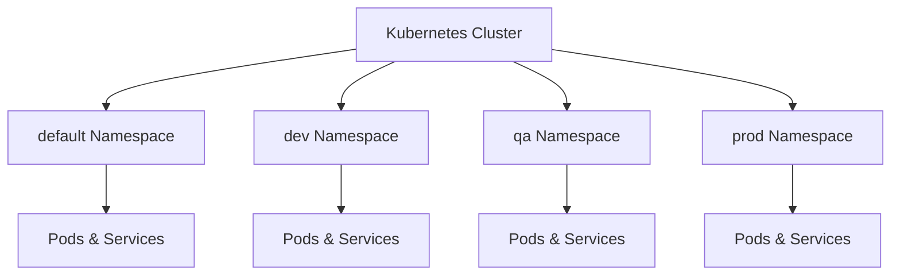
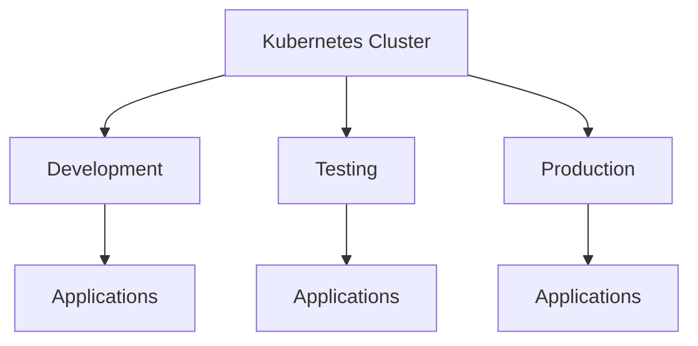
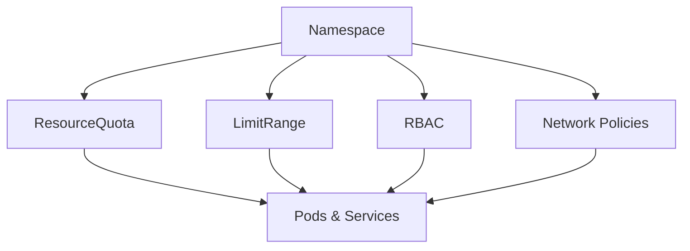

# Namespaces

## Overview

A **Namespace** is a logical partition within a Kubernetes cluster that allows you to organize, isolate, and manage resources.

Namespaces enable multiple teams, projects, or environments to share the same Kubernetes cluster without resource conflicts.

Without Namespaces, all resources are created in the **default** namespace unless explicitly specified.

> **Interview Tip**
>
> Namespaces provide **logical isolation**, **not physical isolation**. All namespaces still share the same Kubernetes cluster and worker nodes.

---

## Why It Is Used

Namespaces are used to:

- Organize cluster resources
- Separate environments (Dev, QA, Prod)
- Support multiple teams
- Prevent naming conflicts
- Apply Resource Quotas
- Apply RBAC permissions
- Improve cluster management

---

## Architecture / Working



Namespace Isolation


---

## Key Components

| Component | Purpose |
|-----------|---------|
| Namespace | Logical resource grouping |
| Resources | Pods, Services, Deployments, etc. |
| ResourceQuota | Limits resource usage |
| LimitRange | Default resource limits |
| RBAC | Access control |
| Network Policies | Network isolation between workloads |

---

## Types (if applicable)

Kubernetes includes several built-in namespaces:

| Namespace | Purpose |
|-----------|---------|
| default | Default namespace for user workloads |
| kube-system | Kubernetes system components |
| kube-public | Publicly readable resources |
| kube-node-lease | Node heartbeat information |

Custom namespaces can also be created for applications or teams.

---

## Lifecycle / Workflow


---

## Configuration / Syntax (if applicable)

Create Namespace

```yaml
apiVersion: v1
kind: Namespace

metadata:
  name: development
```

Deploy a Pod in a Namespace

```yaml
metadata:
  namespace: development
```

---

## Important Commands (if applicable)

List Namespaces

```bash
kubectl get namespaces
```

or

```bash
kubectl get ns
```

Create Namespace

```bash
kubectl create namespace development
```

Delete Namespace

```bash
kubectl delete namespace development
```

View Resources in Namespace

```bash
kubectl get pods -n development
```

Create Resource in Namespace

```bash
kubectl apply -f deployment.yaml -n development
```

Set Default Namespace

```bash
kubectl config set-context --current --namespace=development
```

View Current Namespace

```bash
kubectl config view --minify
```

---

## Important Files (if applicable)

| File | Purpose |
|------|---------|
| namespace.yaml | Namespace definition |
| deployment.yaml | Application deployment |
| resourcequota.yaml | Resource limits |
| limitrange.yaml | Default resource constraints |

---

## Real-World Use Cases

- Development, QA, and Production environments
- Multi-team Kubernetes clusters
- Department-wise resource separation
- Customer-specific workloads
- CI/CD environments
- RBAC implementation
- Resource quota enforcement

---

## Advantages

- Logical resource separation
- Prevents naming conflicts
- Simplifies cluster management
- Supports RBAC
- Enables Resource Quotas
- Supports multi-tenancy
- Easier monitoring and billing

---

## Limitations

- Not physical isolation
- Resources can still share worker nodes
- Does not isolate network traffic by default
- Cluster-wide resources are not namespaced
- Incorrect RBAC can expose resources across namespaces

---

## Common Interview Questions (Concept Only)

- What is a Namespace?
- Why are Namespaces used?
- What is the default namespace?
- Difference between Namespace and Cluster?
- Are Namespaces physically isolated?
- Which Kubernetes resources are not namespaced?
- Can Pods communicate across namespaces?
- How do you switch between namespaces?
- How do Resource Quotas relate to Namespaces?

---

## Common Mistakes

- Forgetting to specify the namespace during deployment
- Assuming Namespaces provide complete security isolation
- Creating all applications in the default namespace
- Confusing Namespace isolation with Network Policies
- Deleting a Namespace without checking its resources

---

## Troubleshooting

| Problem | Cause | Solution |
|----------|--------|----------|
| Resource not found | Wrong namespace | Verify namespace using `kubectl get ns` |
| Pod not visible | Viewing different namespace | Use `kubectl get pods -A` |
| Application cannot communicate | Wrong Service namespace | Verify Service DNS |
| Access denied | RBAC issue | Check RoleBindings |
| Resources missing | Namespace deleted | Restore or recreate resources |

Useful Commands

```bash
kubectl get ns

kubectl get pods -A

kubectl get pods -n development

kubectl describe namespace development

kubectl config view --minify
```

---

## Summary

Namespaces logically divide a Kubernetes cluster into isolated environments, allowing multiple teams and applications to share the same cluster safely. They simplify resource organization, support RBAC, Resource Quotas, and multi-tenancy, making them an essential feature in production Kubernetes environments.

---

# Default Namespace

## Overview

The **default** namespace is the namespace where Kubernetes places resources if no namespace is specified during creation.

Every Kubernetes cluster contains a default namespace immediately after installation.

> **Interview Tip**
>
> If you don't specify a namespace using the `-n` option or in the YAML manifest, Kubernetes creates the resource in the **default** namespace.

---

## Why It Is Used

The default namespace is used for:

- Small clusters
- Learning Kubernetes
- Quick testing
- Temporary workloads

Production environments should generally avoid deploying everything into the default namespace.

---

## Architecture / Working


---

## Key Components

| Component | Purpose |
|-----------|---------|
| default Namespace | Default location for user resources |
| Pods | Workloads |
| Services | Networking |
| Deployments | Application management |

---

## Types (if applicable)

Built-in Namespace

---

## Lifecycle / Workflow


---

## Configuration / Syntax (if applicable)

Example

```yaml
metadata:
  name: nginx
```

Since no namespace is specified, the resource is created in the **default** namespace.

---

## Important Commands (if applicable)

View Resources

```bash
kubectl get pods
```

View Default Namespace

```bash
kubectl get ns
```

---

## Important Files (if applicable)

| File | Purpose |
|------|---------|
| deployment.yaml | Default deployment |

---

## Real-World Use Cases

- Labs
- Tutorials
- Small proof-of-concept clusters

---

## Advantages

- Easy to use
- No additional configuration
- Good for beginners

---

## Limitations

- Poor organization
- Not suitable for multi-team environments
- Difficult to manage large clusters

---

## Common Interview Questions (Concept Only)

- What is the default namespace?
- When is it used?
- Should production workloads use the default namespace?

---

## Common Mistakes

- Deploying everything into the default namespace
- Forgetting namespace organization

---

## Troubleshooting

```bash
kubectl get pods

kubectl get all
```

---

## Summary

The default namespace is Kubernetes' standard namespace for resources when no namespace is specified. It is convenient for learning but not recommended for large production environments.

---

# Custom Namespaces

## Overview

Custom Namespaces are user-created namespaces used to organize applications, environments, or teams.

Examples:

- development
- testing
- staging
- production

---

## Why It Is Used

Custom Namespaces provide:

- Environment separation
- Team isolation
- Better management
- Resource quotas
- RBAC integration

---

## Architecture / Working



---

## Key Components

| Component | Purpose |
|-----------|---------|
| Namespace | Resource grouping |
| ResourceQuota | Resource limits |
| RBAC | Access control |

---

## Types (if applicable)

Examples

- development
- testing
- staging
- production
- monitoring
- logging

---

## Lifecycle / Workflow


---

## Configuration / Syntax (if applicable)

```yaml
kind: Namespace

metadata:
  name: production
```

---

## Important Commands (if applicable)

```bash
kubectl create namespace production

kubectl get ns

kubectl delete namespace production
```

---

## Important Files (if applicable)

namespace.yaml

---

## Real-World Use Cases

- Production clusters
- Team separation
- CI/CD environments
- Multi-tenant Kubernetes

---

## Advantages

- Organized workloads
- Better security
- Easy management

---

## Limitations

- Requires planning
- More administrative overhead

---

## Common Interview Questions (Concept Only)

- Why create custom namespaces?
- What are production namespace strategies?

---

## Common Mistakes

- Creating too many namespaces
- Poor naming conventions

---

## Troubleshooting

```bash
kubectl get ns

kubectl describe namespace production
```

---

## Summary

Custom Namespaces improve organization, security, and resource management by separating applications and teams within the same Kubernetes cluster.

---

# Resource Isolation

## Overview

Resource Isolation limits how resources are shared within a namespace.

Namespaces alone provide **logical separation**, while additional Kubernetes features enforce resource usage and access.

Common isolation mechanisms include:

- ResourceQuota
- LimitRange
- RBAC
- Network Policies

> **Interview Tip**
>
> Namespaces **do not automatically isolate CPU, Memory, or network traffic**. ResourceQuota, LimitRange, RBAC, and Network Policies are required to achieve effective isolation.

---

## Why It Is Used

Resource Isolation helps:

- Prevent resource starvation
- Protect production workloads
- Enforce fair resource usage
- Improve cluster stability
- Implement multi-tenancy

---

## Architecture / Working



---

## Key Components

| Component | Purpose |
|-----------|---------|
| ResourceQuota | Resource limits |
| LimitRange | Default requests & limits |
| RBAC | User access control |
| Network Policies | Network isolation |

---

## Types (if applicable)

Isolation Types

- Resource Isolation
- Security Isolation
- Network Isolation
- Access Isolation

---

## Lifecycle / Workflow


---

## Configuration / Syntax (if applicable)

ResourceQuota

```yaml
kind: ResourceQuota
```

LimitRange

```yaml
kind: LimitRange
```

---

## Important Commands (if applicable)

View Resource Quotas

```bash
kubectl get resourcequota
```

View LimitRanges

```bash
kubectl get limitrange
```

Describe Resource Quota

```bash
kubectl describe resourcequota
```

---

## Important Files (if applicable)

| File | Purpose |
|------|---------|
| resourcequota.yaml | Resource limits |
| limitrange.yaml | Default limits |
| role.yaml | RBAC |
| networkpolicy.yaml | Network isolation |

---

## Real-World Use Cases

- Shared Kubernetes clusters
- Enterprise environments
- Multi-team deployments
- Production workloads
- SaaS platforms
- Kubernetes-as-a-Service

---

## Advantages

- Prevents resource exhaustion
- Improves cluster stability
- Supports multi-tenancy
- Enhances security
- Fair resource allocation

---

## Limitations

- Requires careful planning
- Misconfigured quotas can block deployments
- Increased operational complexity

---

## Common Interview Questions (Concept Only)

- What is Resource Isolation?
- Does a Namespace isolate CPU and Memory?
- What is ResourceQuota?
- What is LimitRange?
- How does RBAC improve isolation?
- How do Network Policies complement Namespaces?

---

## Common Mistakes

- Assuming Namespaces provide complete isolation
- Forgetting ResourceQuota
- Ignoring LimitRanges
- Not configuring RBAC
- Forgetting Network Policies

---

## Troubleshooting

| Problem | Cause | Solution |
|----------|--------|----------|
| Pod creation fails | ResourceQuota exceeded | Increase quota or reduce resource requests |
| Resource limits not applied | Missing LimitRange | Configure LimitRange |
| Access denied | RBAC misconfiguration | Verify Roles and RoleBindings |
| Unexpected network access | Missing Network Policies | Apply appropriate policies |

Useful Commands

```bash
kubectl get resourcequota

kubectl describe resourcequota

kubectl get limitrange

kubectl describe limitrange

kubectl get networkpolicy
```

---

## Summary

Resource Isolation ensures fair and secure resource usage within Kubernetes by combining Namespaces with ResourceQuota, LimitRange, RBAC, and Network Policies. Together, these mechanisms enable secure, stable, and scalable multi-tenant Kubernetes environments.
