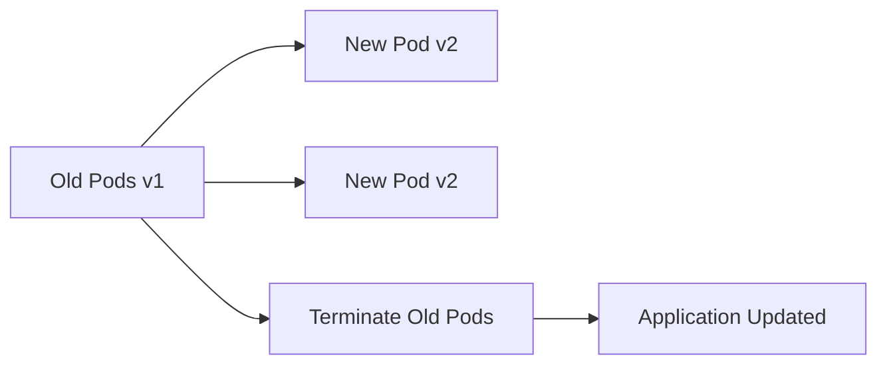
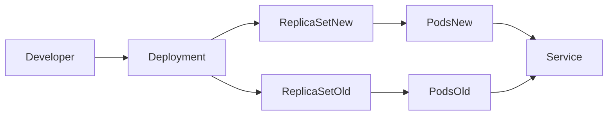
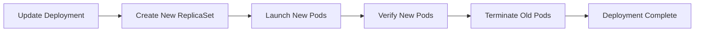
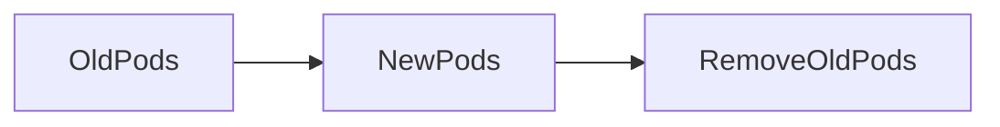
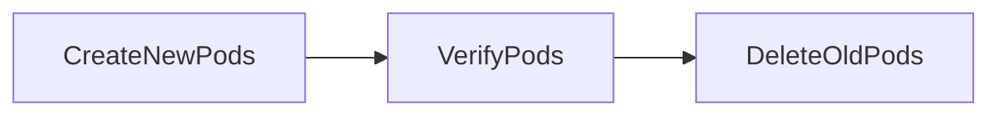
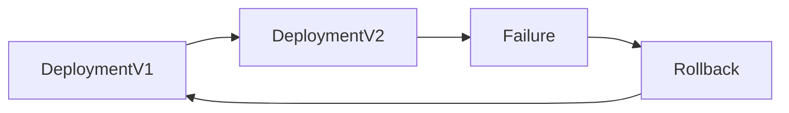
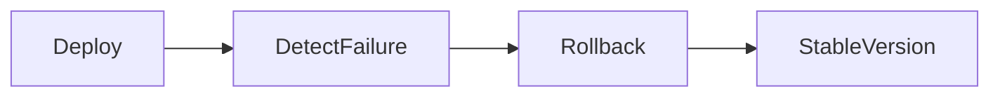
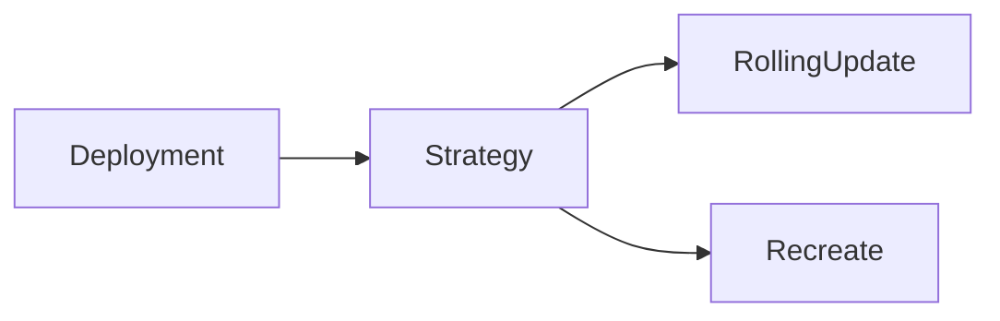
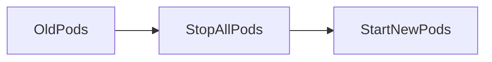

# Rolling Updates

## Overview

**Rolling Updates** are the default deployment strategy in Kubernetes used to update applications **without downtime**.

Instead of stopping all existing Pods and starting new ones, Kubernetes gradually replaces old Pods with new Pods while keeping the application available.

This strategy ensures:

- Zero or minimal downtime
- Continuous application availability
- Controlled deployments
- Easy rollback if deployment fails

> **Interview Tip**
>
> **Deployment** is the Kubernetes resource responsible for Rolling Updates.
>
> By default, every Deployment uses the **RollingUpdate** strategy unless another strategy is specified.

---

## Why It Is Used

Rolling Updates are used to:

- Deploy new application versions
- Avoid downtime
- Minimize deployment risk
- Maintain service availability
- Support CI/CD pipelines
- Enable controlled application upgrades

---

## Architecture / Working



Deployment Process



---

## Key Components

| Component | Purpose |
|-----------|---------|
| Deployment | Manages updates |
| ReplicaSet | Controls Pod replicas |
| Pod | Application instance |
| Service | Maintains application availability |
| Scheduler | Places new Pods |

---

## Types (if applicable)

Deployment Strategies

- RollingUpdate (Default)
- Recreate

---

## Lifecycle / Workflow



---

## Configuration / Syntax (if applicable)

Basic Rolling Update

```yaml
strategy:
  type: RollingUpdate
```

Custom Strategy

```yaml
strategy:
  type: RollingUpdate

  rollingUpdate:
    maxSurge: 1
    maxUnavailable: 1
```

---

## Important Commands (if applicable)

View Deployments

```bash
kubectl get deployment
```

Update Image

```bash
kubectl set image deployment/nginx nginx=nginx:1.25
```

Watch Rollout

```bash
kubectl rollout status deployment/nginx
```

Deployment History

```bash
kubectl rollout history deployment/nginx
```

Pause Deployment

```bash
kubectl rollout pause deployment/nginx
```

Resume Deployment

```bash
kubectl rollout resume deployment/nginx
```

---

## Important Files (if applicable)

| File | Purpose |
|------|---------|
| deployment.yaml | Deployment configuration |
| service.yaml | Application access |

---

## Real-World Use Cases

- Application version upgrades
- Security patch deployment
- CI/CD pipelines
- Feature releases
- Production application updates

---

## Advantages

- Zero downtime
- Continuous availability
- Automatic rollout
- Supports rollback
- Safer production deployments

---

## Limitations

- Longer deployment time than Recreate
- Requires additional cluster resources
- Application must support multiple versions during rollout

---

## Common Interview Questions (Concept Only)

- What is a Rolling Update?
- Why is Rolling Update the default strategy?
- What is maxSurge?
- What is maxUnavailable?
- Does Rolling Update cause downtime?
- Which Kubernetes resource performs Rolling Updates?
- Difference between RollingUpdate and Recreate?

---

## Common Mistakes

- Not checking rollout status
- Updating production without readiness probes
- Using incorrect container images
- Setting maxUnavailable too high
- Ignoring deployment history

---

## Troubleshooting

| Problem | Cause | Solution |
|----------|--------|----------|
| Rollout stuck | Pods not becoming Ready | Check Pod events and logs |
| Deployment failed | Image error | Verify image name and tag |
| Application unavailable | Incorrect readiness probe | Fix probe configuration |
| Pods crash | Application issue | Review container logs |
| Slow rollout | Resource shortage | Check node resources |

Useful Commands

```bash
kubectl rollout status deployment/nginx

kubectl describe deployment nginx

kubectl get rs

kubectl get pods

kubectl logs <pod-name>
```

---

## Summary

Rolling Updates gradually replace old Pods with new ones while keeping the application available. It is the default deployment strategy in Kubernetes and is widely used for production deployments because it minimizes downtime and supports safe application upgrades.

---

# Rolling Update

## Overview

A **Rolling Update** is the deployment strategy that updates application Pods one at a time (or in small batches) while ensuring the desired number of application instances remain available.

Kubernetes creates new Pods first and removes old Pods only after the new Pods become healthy.

> **Interview Tip**
>
> During a Rolling Update, both **old** and **new** application versions may run simultaneously.

---

## Why It Is Used

Rolling Updates provide:

- High availability
- Safer deployments
- Minimal downtime
- Gradual replacement of Pods

---

## Architecture / Working



---

## Key Components

| Component | Purpose |
|-----------|---------|
| Deployment | Controls update |
| ReplicaSet | Manages replicas |
| Pods | Application instances |

---

## Types (if applicable)

Rolling Update Parameters

- maxSurge
- maxUnavailable

---

## Lifecycle / Workflow



---

## Configuration / Syntax (if applicable)

```yaml
strategy:
  type: RollingUpdate
```

---

## Important Commands (if applicable)

```bash
kubectl rollout status deployment/<deployment-name>
```

---

## Important Files (if applicable)

deployment.yaml

---

## Real-World Use Cases

- Web application updates
- API deployments
- Production releases

---

## Advantages

- No downtime
- Automatic deployment
- Supports rollback

---

## Limitations

- Requires additional resources during rollout

---

## Common Interview Questions (Concept Only)

- Explain Rolling Update.
- What happens during a Rolling Update?

---

## Common Mistakes

- Ignoring health checks
- Deploying without readiness probes

---

## Troubleshooting

```bash
kubectl rollout status deployment/<deployment-name>
```

---

## Summary

Rolling Update is Kubernetes' default deployment strategy for updating applications with minimal disruption and maximum availability.

---

# Rollback

## Overview

A **Rollback** restores a Deployment to a previous stable version when a deployment fails or introduces issues.

Kubernetes stores Deployment revision history, allowing administrators to quickly revert to an earlier version.

> **Interview Tip**
>
> Rollback works because Kubernetes maintains previous ReplicaSets.

---

## Why It Is Used

Rollback helps to:

- Recover from failed deployments
- Restore application availability
- Minimize downtime
- Reduce deployment risk

---

## Architecture / Working



---

## Key Components

| Component | Purpose |
|-----------|---------|
| Deployment | Maintains revisions |
| ReplicaSet | Stores previous versions |
| Revision History | Enables rollback |

---

## Types (if applicable)

Rollback Options

- Previous revision
- Specific revision

---

## Lifecycle / Workflow



---

## Configuration / Syntax (if applicable)

Rollback to Previous Revision

```bash
kubectl rollout undo deployment/nginx
```

Rollback to Specific Revision

```bash
kubectl rollout undo deployment/nginx --to-revision=2
```

---

## Important Commands (if applicable)

Deployment History

```bash
kubectl rollout history deployment/nginx
```

Rollback

```bash
kubectl rollout undo deployment/nginx
```

Rollback to Specific Revision

```bash
kubectl rollout undo deployment/nginx --to-revision=2
```

---

## Important Files (if applicable)

deployment.yaml

---

## Real-World Use Cases

- Failed software release
- Application crash
- Configuration mistakes
- Security patch rollback

---

## Advantages

- Quick recovery
- Simple command
- Minimal downtime

---

## Limitations

- Previous ReplicaSet must exist
- Configuration changes outside Deployment are not reverted

---

## Common Interview Questions (Concept Only)

- What is Rollback?
- How do you rollback a Deployment?
- Where is deployment history stored?

---

## Common Mistakes

- Deleting ReplicaSets
- Not verifying deployment history

---

## Troubleshooting

```bash
kubectl rollout history deployment/nginx

kubectl rollout undo deployment/nginx
```

---

## Summary

Rollback restores an application to a previously working Deployment revision, enabling rapid recovery from failed releases.

---

# Deployment Strategies

## Overview

A **Deployment Strategy** defines how Kubernetes replaces old application Pods with new Pods during updates.

Kubernetes supports multiple deployment approaches, each with different availability and deployment characteristics.

---

## Why It Is Used

Deployment Strategies determine:

- Downtime
- Deployment speed
- Risk level
- Resource usage

---

## Architecture / Working



---

## Key Components

| Component | Purpose |
|-----------|---------|
| Deployment | Controls rollout |
| Strategy | Defines update behavior |
| ReplicaSet | Manages Pods |

---

## Types (if applicable)

| Strategy | Downtime | Production Usage |
|-----------|----------|------------------|
| RollingUpdate | No | Recommended |
| Recreate | Yes | Suitable for applications that cannot run multiple versions simultaneously |

> **Interview Tip**
>
> Kubernetes natively supports **RollingUpdate** and **Recreate**.
>
> Strategies such as **Blue-Green** and **Canary** are commonly implemented using additional Kubernetes resources or service meshes, not as built-in Deployment strategy types.

---

## Lifecycle / Workflow

### RollingUpdate


### Recreate



---

## Configuration / Syntax (if applicable)

Rolling Update

```yaml
strategy:
  type: RollingUpdate
```

Recreate

```yaml
strategy:
  type: Recreate
```

---

## Important Commands (if applicable)

```bash
kubectl rollout status deployment/<deployment-name>

kubectl rollout history deployment/<deployment-name>

kubectl rollout undo deployment/<deployment-name>
```

---

## Important Files (if applicable)

| File | Purpose |
|------|---------|
| deployment.yaml | Deployment strategy configuration |

---

## Real-World Use Cases

- Web applications
- REST APIs
- Enterprise applications
- Production releases
- CI/CD deployments

---

## Advantages

- Flexible deployment methods
- Supports zero-downtime updates
- Built-in rollback capability
- Easy integration with CI/CD pipelines

---

## Limitations

- Rolling Updates require extra resources
- Recreate strategy causes downtime

---

## Common Interview Questions (Concept Only)

- What deployment strategies are available in Kubernetes?
- Which strategy is the default?
- RollingUpdate vs Recreate?
- Which strategy is recommended for production?
- What are maxSurge and maxUnavailable?

---

## Common Mistakes

- Using Recreate for highly available applications
- Incorrect maxSurge and maxUnavailable values
- Skipping rollout verification after deployment

---

## Troubleshooting

| Problem | Cause | Solution |
|----------|--------|----------|
| Deployment unavailable | Recreate strategy | Consider RollingUpdate |
| Rollout stalled | Pods not Ready | Check readiness probes |
| Slow deployment | Resource constraints | Verify cluster capacity |
| Rollback unavailable | Deployment history missing | Ensure ReplicaSets are retained |

Useful Commands

```bash
kubectl rollout status deployment/<deployment-name>

kubectl rollout history deployment/<deployment-name>

kubectl describe deployment <deployment-name>

kubectl get rs
```

---

## Summary

Deployment Strategies determine how Kubernetes updates applications. **RollingUpdate** is the default and recommended strategy for production because it provides minimal downtime and supports safe rollouts and rollbacks, while **Recreate** stops all existing Pods before starting new ones and is appropriate only for workloads that cannot support multiple application versions running simultaneously.
