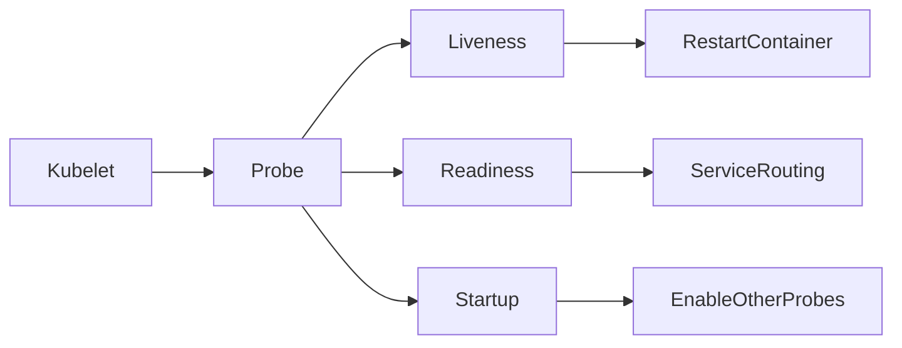
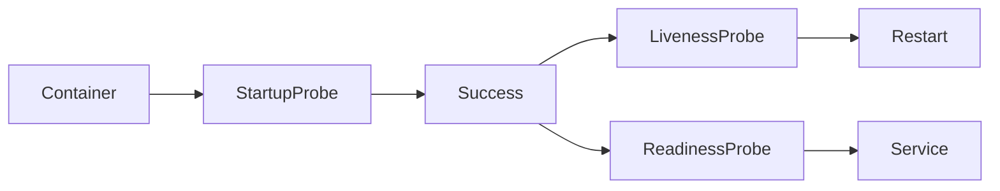
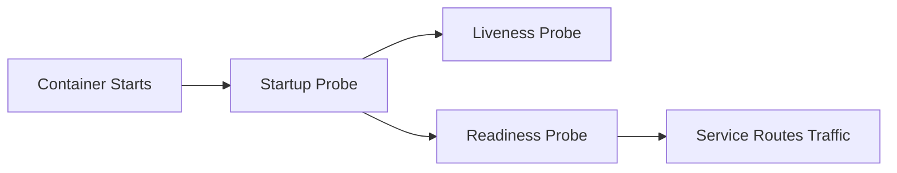
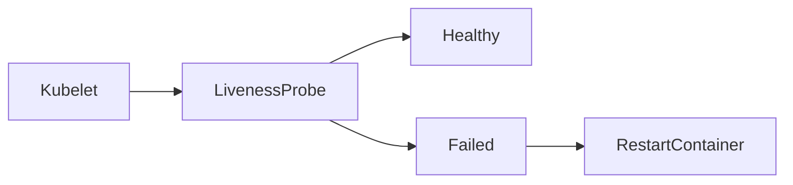
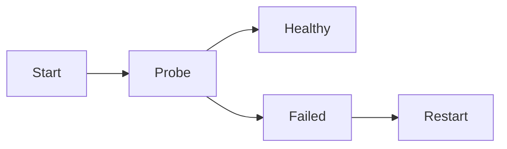
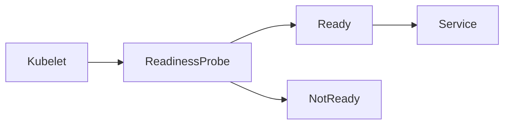
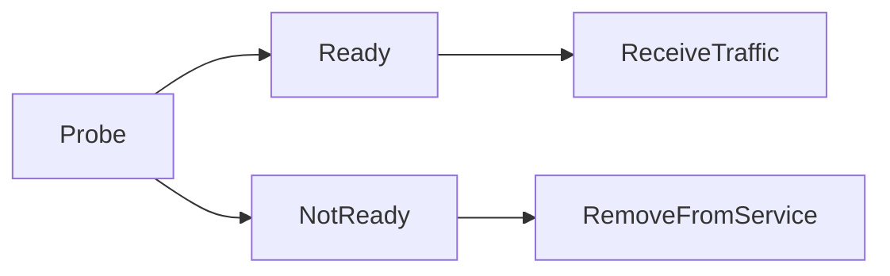
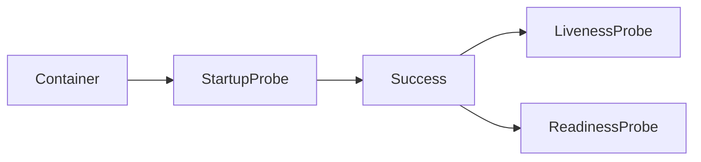
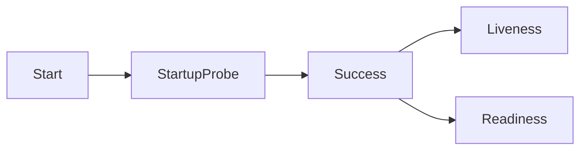

# Health Checks

## Overview

**Health Checks** are mechanisms used by Kubernetes to determine the health and availability of containers running inside Pods.

Kubernetes uses **Probes** to continuously monitor applications and decide whether to:

- Restart a container
- Send traffic to a Pod
- Delay health checks during application startup

There are three types of probes:

- **Liveness Probe**
- **Readiness Probe**
- **Startup Probe**

> **Interview Tip**
>
> Kubernetes checks the **application**, not just the container.
>
> A container can be **Running**, but the application inside it may still be unhealthy.

---

## Why It Is Used

Health Checks help Kubernetes:

- Automatically recover failed applications
- Prevent traffic from reaching unhealthy Pods
- Improve application availability
- Reduce manual intervention
- Support zero-downtime deployments
- Detect application failures early

---

## Architecture / Working



Health Check Flow



---

## Key Components

| Component | Purpose |
|-----------|---------|
| Kubelet | Executes health checks |
| Liveness Probe | Detects failed applications |
| Readiness Probe | Determines if Pod can receive traffic |
| Startup Probe | Handles slow-starting applications |
| Service | Routes traffic only to Ready Pods |

---

## Types (if applicable)

Probe Types

- Liveness Probe
- Readiness Probe
- Startup Probe

Probe Methods

- HTTP GET
- TCP Socket
- Exec Command

---

## Lifecycle / Workflow



---

## Configuration / Syntax (if applicable)

Example

```yaml
livenessProbe:
  httpGet:
    path: /health
    port: 80

readinessProbe:
  httpGet:
    path: /ready
    port: 80

startupProbe:
  httpGet:
    path: /startup
    port: 80
```

---

## Important Commands (if applicable)

View Pod

```bash
kubectl get pods
```

Describe Pod

```bash
kubectl describe pod <pod-name>
```

View Events

```bash
kubectl get events
```

View Logs

```bash
kubectl logs <pod-name>
```

---

## Important Files (if applicable)

| File | Purpose |
|------|---------|
| deployment.yaml | Probe configuration |
| pod.yaml | Health checks |

---

## Real-World Use Cases

- Web applications
- REST APIs
- Databases
- Java applications
- Spring Boot services
- Microservices
- Production deployments

---

## Advantages

- Automatic recovery
- Improved application availability
- Better traffic routing
- Reduced downtime
- Supports self-healing

---

## Limitations

- Incorrect probe configuration causes unnecessary restarts
- Aggressive timing values may create false failures
- Applications must expose health endpoints

---

## Common Interview Questions (Concept Only)

- What are Kubernetes Health Checks?
- Why are probes required?
- Difference between Liveness and Readiness?
- When is Startup Probe used?
- Does Kubernetes restart Pods if Readiness Probe fails?
- What probe types are supported?
- Who executes health checks?

---

## Common Mistakes

- Using the same endpoint for all probes without understanding the application's behavior
- Not configuring Startup Probe for slow-starting applications
- Very short timeout values
- Incorrect health endpoint
- Missing Readiness Probe in production deployments

---

## Troubleshooting

| Problem | Cause | Solution |
|----------|--------|----------|
| Pod restarting continuously | Liveness Probe failing | Verify application health endpoint |
| Pod never becomes Ready | Readiness Probe failing | Check application readiness |
| Service receives no traffic | Pod not Ready | Review Readiness Probe |
| Startup failures | Startup Probe timeout | Increase failureThreshold or periodSeconds |
| Probe timeout | Slow application | Adjust probe timing values |

Useful Commands

```bash
kubectl describe pod <pod-name>

kubectl get events

kubectl logs <pod-name>

kubectl get pods
```

---

## Summary

Health Checks enable Kubernetes to monitor application health using Liveness, Readiness, and Startup Probes. They ensure failed applications are restarted, only healthy Pods receive traffic, and slow-starting applications initialize correctly before normal health checks begin.

---

# Liveness Probe

## Overview

A **Liveness Probe** determines whether an application is still running correctly.

If the Liveness Probe fails repeatedly, Kubernetes assumes the application is unhealthy and automatically restarts the container.

> **Interview Tip**
>
> **Liveness Probe failure → Container Restart**

---

## Why It Is Used

Liveness Probes help:

- Detect application hangs
- Recover from deadlocks
- Restart unhealthy applications
- Improve application availability

---

## Architecture / Working



---

## Key Components

| Component | Purpose |
|-----------|---------|
| Kubelet | Runs probe |
| Liveness Probe | Checks application health |
| Container | Restarted if unhealthy |

---

## Types (if applicable)

Probe Methods

- HTTP GET
- TCP Socket
- Exec Command

---

## Lifecycle / Workflow



---

## Configuration / Syntax (if applicable)

```yaml
livenessProbe:
  httpGet:
    path: /health
    port: 80

  initialDelaySeconds: 10
  periodSeconds: 10
```

---

## Important Commands (if applicable)

```bash
kubectl describe pod <pod-name>

kubectl logs <pod-name>
```

---

## Important Files (if applicable)

deployment.yaml

---

## Real-World Use Cases

- APIs
- Web servers
- Java applications
- Background services

---

## Advantages

- Automatic recovery
- Self-healing applications

---

## Limitations

- Incorrect configuration causes unnecessary restarts

---

## Common Interview Questions (Concept Only)

- What is a Liveness Probe?
- What happens when it fails?
- Does it affect traffic routing?

---

## Common Mistakes

- Very aggressive probe timing
- Incorrect endpoint

---

## Troubleshooting

```bash
kubectl describe pod <pod-name>
```

---

## Summary

Liveness Probes detect unhealthy applications and automatically restart containers when repeated failures occur.

---

# Readiness Probe

## Overview

A **Readiness Probe** determines whether a container is ready to receive network traffic.

If the probe fails, Kubernetes removes the Pod from the Service endpoints but **does not restart** the container.

> **Interview Tip**
>
> **Readiness Probe failure → No traffic**
>
> **No container restart**

---

## Why It Is Used

Readiness Probes:

- Prevent traffic to unavailable Pods
- Improve deployment reliability
- Support rolling updates

---

## Architecture / Working



---

## Key Components

| Component | Purpose |
|-----------|---------|
| Readiness Probe | Traffic eligibility |
| Service | Routes requests |
| Endpoint | Added or removed based on readiness |

---

## Types (if applicable)

Probe Methods

- HTTP GET
- TCP Socket
- Exec Command

---

## Lifecycle / Workflow



---

## Configuration / Syntax (if applicable)

```yaml
readinessProbe:
  httpGet:
    path: /ready
    port: 80
```

---

## Important Commands (if applicable)

```bash
kubectl describe pod <pod-name>

kubectl get endpoints
```

---

## Important Files (if applicable)

deployment.yaml

---

## Real-World Use Cases

- Web APIs
- Microservices
- Databases
- Rolling updates

---

## Advantages

- Prevents failed requests
- Supports zero-downtime deployments

---

## Limitations

- Incorrect configuration delays traffic

---

## Common Interview Questions (Concept Only)

- What is Readiness Probe?
- What happens when Readiness Probe fails?
- Does Kubernetes restart the container?

---

## Common Mistakes

- Confusing Readiness with Liveness
- Missing Readiness Probe

---

## Troubleshooting

```bash
kubectl describe pod <pod-name>

kubectl get endpoints
```

---

## Summary

Readiness Probes determine whether a Pod should receive traffic. Failed readiness checks remove the Pod from Service endpoints without restarting the container.

---

# Startup Probe

## Overview

A **Startup Probe** is designed for applications that require a long startup time.

While the Startup Probe is running, Kubernetes disables both Liveness and Readiness Probes.

Once the Startup Probe succeeds:

- Liveness Probe begins
- Readiness Probe begins

> **Interview Tip**
>
> Startup Probe prevents slow-starting applications from being restarted before they have finished initializing.

---

## Why It Is Used

Startup Probes are useful for:

- Java applications
- Spring Boot
- Databases
- Large enterprise applications
- Applications with long initialization times

---

## Architecture / Working



---

## Key Components

| Component | Purpose |
|-----------|---------|
| Startup Probe | Startup verification |
| Liveness Probe | Starts after Startup succeeds |
| Readiness Probe | Starts after Startup succeeds |

---

## Types (if applicable)

Probe Methods

- HTTP GET
- TCP Socket
- Exec Command

---

## Lifecycle / Workflow



---

## Configuration / Syntax (if applicable)

```yaml
startupProbe:
  httpGet:
    path: /startup
    port: 80

  failureThreshold: 30
  periodSeconds: 10
```

---

## Important Commands (if applicable)

```bash
kubectl describe pod <pod-name>

kubectl logs <pod-name>
```

---

## Important Files (if applicable)

deployment.yaml

---

## Real-World Use Cases

- Spring Boot
- Java EE
- Databases
- Enterprise applications

---

## Advantages

- Prevents premature container restarts
- Supports slow-starting applications
- Improves deployment stability

---

## Limitations

- Not required for fast-starting applications
- Incorrect timing values delay health monitoring

---

## Common Interview Questions (Concept Only)

- What is Startup Probe?
- When should Startup Probe be used?
- What happens after Startup Probe succeeds?
- Difference between Startup and Liveness Probe?

---

## Common Mistakes

- Using Startup Probe for fast-starting applications
- Incorrect failureThreshold values
- Missing Startup Probe for slow applications

---

## Troubleshooting

```bash
kubectl describe pod <pod-name>

kubectl logs <pod-name>

kubectl get events
```

---

## Summary

Startup Probes are designed for applications with long initialization times. They delay Liveness and Readiness checks until the application has successfully started, preventing unnecessary restarts during startup.
