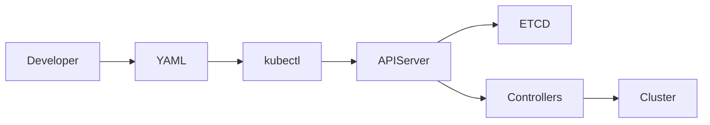
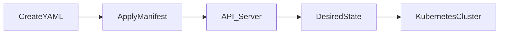
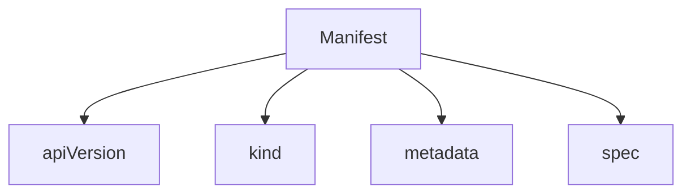
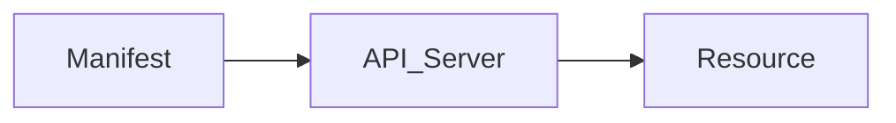
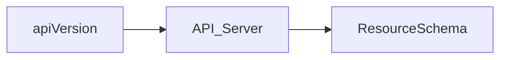
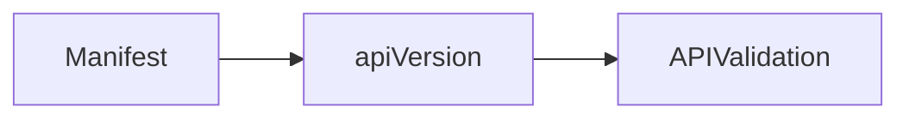
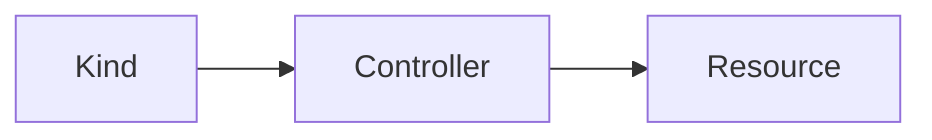
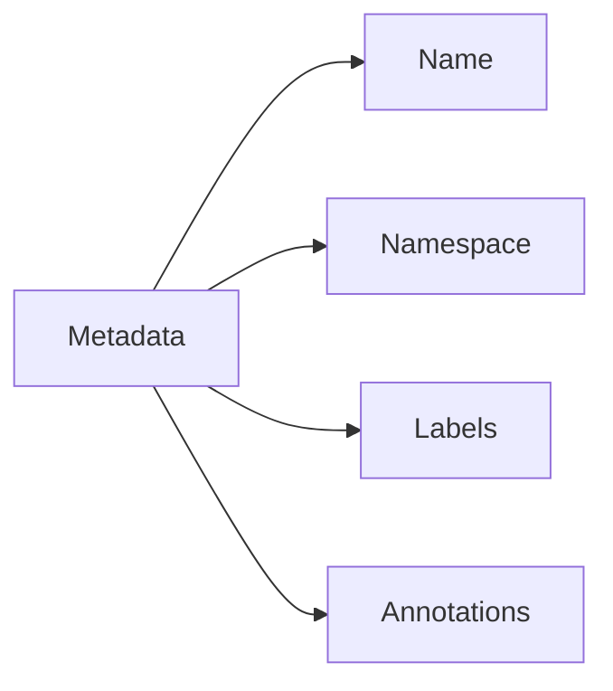
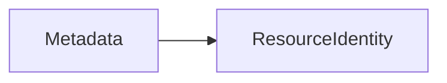
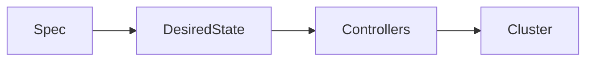

# YAML Manifests

## Overview

A **YAML Manifest** is a configuration file used to define the **desired state** of Kubernetes resources.

Instead of creating resources manually using CLI commands, Kubernetes encourages an **Infrastructure as Code (IaC)** approach where resources are declared in YAML files.

Almost every Kubernetes object can be created using a YAML manifest, including:

- Pods
- Deployments
- Services
- ConfigMaps
- Secrets
- Ingress
- PersistentVolumeClaims
- Namespaces

When a manifest is applied, Kubernetes compares the desired state with the current cluster state and makes the necessary changes.

> **Interview Tip**
>
> Kubernetes is **declarative**, not imperative.
>
> YAML manifests describe **what you want**, and Kubernetes determines **how to achieve it**.

---

## Why It Is Used

YAML manifests are used to:

- Deploy applications
- Define infrastructure as code
- Version-control Kubernetes resources
- Enable CI/CD pipelines
- Maintain consistent environments
- Simplify automation
- Support GitOps workflows

---

## Architecture / Working



Manifest Workflow



---

## Key Components

| Component | Purpose |
|-----------|---------|
| apiVersion | Kubernetes API version |
| kind | Resource type |
| metadata | Resource information |
| spec | Desired configuration |
| status | Current state (managed by Kubernetes) |

> **Interview Tip**
>
> The **status** field is maintained automatically by Kubernetes and is usually **not included** when writing manifests manually.

---

## Types (if applicable)

Common Manifest Types

- Pod
- Deployment
- Service
- ConfigMap
- Secret
- Namespace
- Ingress
- PersistentVolume
- PersistentVolumeClaim

---

## Lifecycle / Workflow


---

## Configuration / Syntax (if applicable)

Basic Manifest

```yaml
apiVersion: apps/v1

kind: Deployment

metadata:
  name: nginx-deployment

spec:
  replicas: 2

  selector:
    matchLabels:
      app: nginx

  template:

    metadata:
      labels:
        app: nginx

    spec:
      containers:
      - name: nginx
        image: nginx:latest
```

General Structure

```yaml
apiVersion:

kind:

metadata:

spec:
```

---

## Important Commands (if applicable)

Create Resource

```bash
kubectl apply -f deployment.yaml
```

Validate Manifest

```bash
kubectl apply --dry-run=client -f deployment.yaml
```

View Resource

```bash
kubectl get deployment
```

View YAML

```bash
kubectl get deployment nginx -o yaml
```

Delete Resource

```bash
kubectl delete -f deployment.yaml
```

---

## Important Files (if applicable)

| File | Purpose |
|------|---------|
| deployment.yaml | Deployment configuration |
| service.yaml | Service configuration |
| ingress.yaml | Ingress configuration |
| configmap.yaml | ConfigMap |
| pvc.yaml | Persistent Volume Claim |

---

## Real-World Use Cases

- CI/CD deployments
- GitOps workflows
- Infrastructure as Code
- Kubernetes application deployment
- Production automation
- Disaster recovery

---

## Advantages

- Declarative configuration
- Version controlled
- Repeatable deployments
- Easy automation
- Supports GitOps
- Human readable

---

## Limitations

- YAML indentation errors are common
- Large applications require multiple manifest files
- Validation occurs only when applied unless linting tools are used

---

## Common Interview Questions (Concept Only)

- What is a Kubernetes YAML Manifest?
- Why are YAML manifests preferred over imperative commands?
- What are the mandatory fields in a Kubernetes manifest?
- What is the difference between spec and status?
- Why is YAML used in Kubernetes?
- What command is used to deploy a manifest?

---

## Common Mistakes

- Incorrect indentation
- Wrong apiVersion
- Invalid kind
- Missing metadata.name
- Incorrect labels and selectors
- Forgetting namespace configuration
- Editing live resources instead of source YAML

---

## Troubleshooting

| Problem | Cause | Solution |
|----------|--------|----------|
| YAML parsing error | Incorrect indentation | Fix spacing |
| Unknown apiVersion | Wrong API version | Verify supported API version |
| Resource not created | Invalid manifest | Validate using dry-run |
| Selector mismatch | Labels don't match | Verify labels and selectors |
| Image pull failure | Incorrect image | Verify image name |

Useful Commands

```bash
kubectl apply --dry-run=client -f deployment.yaml

kubectl describe deployment nginx

kubectl get events

kubectl get deployment -o yaml
```

---

## Summary

YAML Manifests define the desired state of Kubernetes resources. They are the foundation of Infrastructure as Code, GitOps, and CI/CD pipelines, enabling repeatable, version-controlled, and declarative application deployments.

---

# Manifest Structure

## Overview

Every Kubernetes manifest follows a standard structure consisting of several top-level fields.

The most important fields are:

- apiVersion
- kind
- metadata
- spec

Some resources also contain a **status** field, but Kubernetes automatically manages it.

---

## Why It Is Used

A standard manifest structure:

- Ensures consistency
- Allows Kubernetes to interpret resources
- Simplifies automation

---

## Architecture / Working



---

## Key Components

| Field | Purpose |
|--------|---------|
| apiVersion | API version |
| kind | Resource type |
| metadata | Resource identity |
| spec | Desired configuration |

---

## Types (if applicable)

Top-Level Fields

- apiVersion
- kind
- metadata
- spec
- status (generated by Kubernetes)

---

## Lifecycle / Workflow



---

## Configuration / Syntax (if applicable)

```yaml
apiVersion:

kind:

metadata:

spec:
```

---

## Important Commands (if applicable)

```bash
kubectl explain deployment
```

---

## Important Files (if applicable)

All Kubernetes YAML manifests

---

## Real-World Use Cases

- Application deployment
- Infrastructure provisioning

---

## Advantages

- Consistent structure
- Easy automation

---

## Limitations

- Incorrect fields prevent deployment

---

## Common Interview Questions (Concept Only)

- What fields exist in every manifest?
- Is status written manually?

---

## Common Mistakes

- Missing required fields

---

## Troubleshooting

```bash
kubectl explain deployment
```

---

## Summary

Every Kubernetes manifest follows a predictable structure that defines the resource type and its desired configuration.

---

# apiVersion

## Overview

`apiVersion` specifies which Kubernetes API version should process the resource.

Different resource types belong to different API groups.

Examples:

```yaml
apiVersion: v1
```

```yaml
apiVersion: apps/v1
```

```yaml
apiVersion: networking.k8s.io/v1
```

> **Interview Tip**
>
> Choosing the correct `apiVersion` is mandatory. An unsupported version results in manifest validation errors.

---

## Why It Is Used

It tells Kubernetes:

- Which API group to use
- How to interpret the manifest
- Which schema to validate

---

## Architecture / Working



---

## Key Components

| Example | Resource |
|----------|----------|
| v1 | Pod, Service |
| apps/v1 | Deployment |
| networking.k8s.io/v1 | Ingress |

---

## Types (if applicable)

Common API Groups

- v1
- apps/v1
- batch/v1
- networking.k8s.io/v1

---

## Lifecycle / Workflow



---

## Configuration / Syntax (if applicable)

```yaml
apiVersion: apps/v1
```

---

## Important Commands (if applicable)

```bash
kubectl api-resources

kubectl api-versions
```

---

## Important Files (if applicable)

All manifests

---

## Real-World Use Cases

Every Kubernetes resource

---

## Advantages

- API compatibility
- Version control

---

## Limitations

- Deprecated versions eventually become unsupported

---

## Common Interview Questions (Concept Only)

- What is apiVersion?
- Why is apiVersion required?

---

## Common Mistakes

- Using deprecated API versions

---

## Troubleshooting

```bash
kubectl api-resources
```

---

## Summary

The `apiVersion` field tells Kubernetes which API version should process and validate the resource definition.

---

# kind

## Overview

`kind` specifies the **type of Kubernetes resource** being created.

Examples:

- Pod
- Deployment
- Service
- ConfigMap
- Secret

> **Interview Tip**
>
> `kind` determines which Kubernetes object the manifest represents.

---

## Why It Is Used

It identifies:

- Resource type
- Object schema
- Kubernetes controller responsible for managing it

---

## Architecture / Working


---

## Key Components

| Kind | Controller |
|------|------------|
| Pod | Kubelet |
| Deployment | Deployment Controller |
| Service | Service Controller |

---

## Types (if applicable)

Common Resource Types

- Pod
- Deployment
- Service
- Namespace
- Secret
- ConfigMap
- Ingress

---

## Lifecycle / Workflow



---

## Configuration / Syntax (if applicable)

```yaml
kind: Deployment
```

---

## Important Commands (if applicable)

```bash
kubectl api-resources
```

---

## Important Files (if applicable)

All manifests

---

## Real-World Use Cases

Every Kubernetes object

---

## Advantages

- Defines resource identity

---

## Limitations

- Invalid kinds cannot be created

---

## Common Interview Questions (Concept Only)

- What is kind?
- Can a manifest omit kind?

---

## Common Mistakes

- Incorrect capitalization
- Unsupported resource type

---

## Troubleshooting

```bash
kubectl api-resources
```

---

## Summary

The `kind` field identifies the Kubernetes resource type to be created or managed.

---

# metadata

## Overview

`metadata` contains information that uniquely identifies a Kubernetes resource.

It includes:

- Resource name
- Namespace
- Labels
- Annotations

> **Interview Tip**
>
> Every resource should have a unique `metadata.name` within its namespace.

---

## Why It Is Used

Metadata is used for:

- Resource identification
- Organization
- Selection
- Automation

---

## Architecture / Working



---

## Key Components

| Field | Purpose |
|--------|---------|
| name | Resource name |
| namespace | Resource scope |
| labels | Resource grouping |
| annotations | Additional metadata |

---

## Types (if applicable)

Metadata Fields

- Name
- Namespace
- Labels
- Annotations

---

## Lifecycle / Workflow



---

## Configuration / Syntax (if applicable)

```yaml
metadata:
  name: nginx

  namespace: production

  labels:
    app: nginx
```

---

## Important Commands (if applicable)

```bash
kubectl get deployment --show-labels
```

---

## Important Files (if applicable)

All manifests

---

## Real-World Use Cases

- Resource organization
- Service selection
- CI/CD automation

---

## Advantages

- Easy resource management
- Supports selectors

---

## Limitations

- Incorrect labels break Service routing

---

## Common Interview Questions (Concept Only)

- What information is stored in metadata?
- Difference between labels and annotations?

---

## Common Mistakes

- Duplicate resource names
- Incorrect labels

---

## Troubleshooting

```bash
kubectl describe deployment nginx
```

---

## Summary

The `metadata` section uniquely identifies Kubernetes resources and provides labels, namespaces, and annotations used throughout the cluster.

---

# spec

## Overview

`spec` defines the **desired state** of a Kubernetes resource.

The exact contents of `spec` depend on the resource type.

For example:

- Deployment → Replicas, containers
- Service → Ports, selector
- Pod → Containers, volumes
- PVC → Storage request

> **Interview Tip**
>
> **spec = Desired State**
>
> **status = Current State**

---

## Why It Is Used

The `spec` field tells Kubernetes:

- What should be created
- How it should behave
- Desired configuration

---

## Architecture / Working



---

## Key Components

| Component | Purpose |
|-----------|---------|
| replicas | Number of Pods |
| containers | Application containers |
| ports | Network ports |
| selector | Resource matching |

---

## Types (if applicable)

Examples

- Deployment Spec
- Service Spec
- Pod Spec
- PVC Spec

---

## Lifecycle / Workflow


---

## Configuration / Syntax (if applicable)

```yaml
spec:
  replicas: 3

  selector:
    matchLabels:
      app: nginx

  template:

    metadata:
      labels:
        app: nginx

    spec:
      containers:
      - name: nginx
        image: nginx:latest
```

---

## Important Commands (if applicable)

Explain Spec Fields

```bash
kubectl explain deployment.spec
```

Describe Resource

```bash
kubectl describe deployment nginx
```

---

## Important Files (if applicable)

All manifests

---

## Real-World Use Cases

- Deploy applications
- Configure networking
- Define storage
- Configure workloads

---

## Advantages

- Declarative configuration
- Flexible
- Resource-specific customization

---

## Limitations

- Incorrect values prevent resources from working correctly

---

## Common Interview Questions (Concept Only)

- What is the purpose of the spec field?
- Difference between spec and status?
- Who updates the status field?

---

## Common Mistakes

- Incorrect indentation
- Missing required fields
- Invalid selectors
- Incorrect container definitions

---

## Troubleshooting

```bash
kubectl explain deployment.spec

kubectl describe deployment nginx

kubectl get deployment nginx -o yaml
```

---

## Summary

The `spec` section defines the desired state of a Kubernetes resource. Kubernetes continuously compares the desired state in `spec` with the actual cluster state and reconciles any differences to keep the resource in its intended configuration.
