# Kubernetes in CI/CD

## Overview

Kubernetes is commonly used as the **deployment platform** in CI/CD pipelines. After an application is built, tested, and packaged into a container image, the CI/CD pipeline deploys that image to a Kubernetes cluster.

A typical CI/CD workflow includes:

1. Developer commits code.
2. CI tool builds the application.
3. Container image is created.
4. Image is pushed to a registry.
5. Kubernetes deployment is updated.
6. Kubernetes performs a rolling update.
7. Deployment is verified.
8. Traffic is served by the new version.

> **Interview Tip**
>
> Kubernetes is primarily involved in the **CD (Continuous Delivery/Deployment)** phase. It is responsible for deploying and managing applications, not for building the application itself.

---

## Why It Is Used

Kubernetes in CI/CD provides:

- Automated deployments
- Zero or minimal downtime releases
- Easy rollbacks
- Scalability
- Consistent deployments
- Self-healing workloads
- Faster software delivery

---

## Architecture / Working

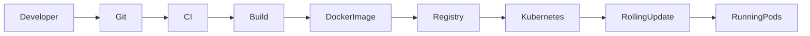

CI/CD Deployment Workflow

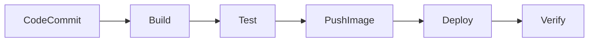

---

## Key Components

| Component | Purpose |
|-----------|---------|
| Git Repository | Stores source code |
| CI Tool | Builds and tests application |
| Container Registry | Stores container images |
| Kubernetes | Deploys applications |
| Deployment | Manages Pods |
| Service | Exposes application |
| Ingress | External access |

---

## Types (if applicable)

Deployment Approaches

- Rolling Update
- Blue-Green Deployment
- Canary Deployment

> **Interview Note**
>
> Rolling Update is the default Kubernetes deployment strategy and is the most frequently used in interviews and production.

---

## Lifecycle / Workflow

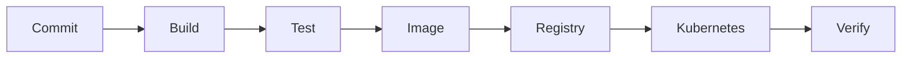

---

## Configuration / Syntax (if applicable)

Deployment Example

```yaml
containers:
- name: web
  image: myrepo/web:v1.0
```

Update Image

```yaml
containers:
- image: myrepo/web:v2.0
```

---

## Important Commands (if applicable)

Deploy Manifest

```bash
kubectl apply -f deployment.yaml
```

Update Image

```bash
kubectl set image deployment/web web=myrepo/web:v2
```

View Deployment

```bash
kubectl get deployments
```

Check Rollout

```bash
kubectl rollout status deployment/web
```

Rollback

```bash
kubectl rollout undo deployment/web
```

---

## Important Files (if applicable)

| File | Purpose |
|------|---------|
| deployment.yaml | Application deployment |
| service.yaml | Service configuration |
| ingress.yaml | External access |
| Dockerfile | Builds application image |

---

## Real-World Use Cases

- Automated software releases
- Microservices deployment
- Enterprise CI/CD pipelines
- GitOps workflows
- Production application updates

---

## Advantages

- Automated deployments
- High availability
- Self-healing
- Easy rollbacks
- Scalable deployments
- Reduced downtime

---

## Limitations

- Requires Kubernetes cluster
- CI/CD pipeline complexity
- Requires image registry
- Deployment failures still require troubleshooting

---

## Common Interview Questions (Concept Only)

- Where is Kubernetes used in CI/CD?
- Does Kubernetes build applications?
- What happens after a Docker image is pushed?
- How does Kubernetes perform deployments?
- Why is Kubernetes suitable for CI/CD?

---

## Common Mistakes

- Deploying without verifying image availability
- Using the `latest` image tag in production
- Not monitoring rollout status
- Skipping deployment verification
- Updating live resources instead of source manifests

---

## Troubleshooting

| Problem | Cause | Solution |
|----------|--------|----------|
| Deployment failed | Invalid manifest | Validate YAML |
| Pod not updated | Old image tag | Update image version |
| Image pull failure | Registry issue | Verify registry access |
| Rollout stuck | Pod startup failure | Check rollout status and logs |
| Service unavailable | Selector mismatch | Verify labels and selectors |

Useful Commands

```bash
kubectl get deployments

kubectl rollout status deployment/web

kubectl describe deployment web

kubectl get pods

kubectl logs <pod-name>
```

---

## Summary

Kubernetes automates application deployment in CI/CD pipelines by deploying container images, managing rolling updates, monitoring application health, and supporting rapid rollbacks when necessary.

---

# Deploy Applications

## Overview

Deploying an application in Kubernetes means creating Kubernetes resources that run one or more application containers.

Applications are typically deployed using:

- Deployment
- Service
- ConfigMap
- Secret
- Ingress

The Deployment resource manages the application's lifecycle.

> **Interview Tip**
>
> Applications are usually deployed using **Deployment**, not directly with Pods, because Deployments provide self-healing, scaling, and rolling updates.

---

## Why It Is Used

Application deployment enables:

- Automated releases
- High availability
- Scalability
- Self-healing
- Version-controlled deployments

---

## Architecture / Working

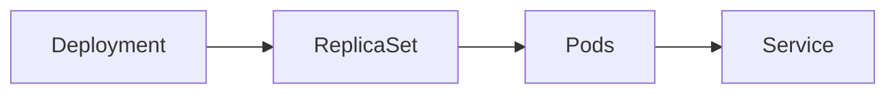

---

## Key Components

| Component | Purpose |
|-----------|---------|
| Deployment | Manages application |
| ReplicaSet | Maintains replica count |
| Pod | Runs containers |
| Service | Exposes application |

---

## Types (if applicable)

Common Deployment Resources

- Deployment
- StatefulSet
- DaemonSet
- Job

---

## Lifecycle / Workflow

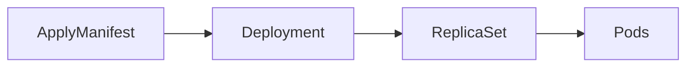

---

## Configuration / Syntax (if applicable)

Deploy Application

```bash
kubectl apply -f deployment.yaml
```

---

## Important Commands (if applicable)

```bash
kubectl get deployments

kubectl get pods

kubectl describe deployment web
```

---

## Important Files (if applicable)

- deployment.yaml
- service.yaml

---

## Real-World Use Cases

- Deploy APIs
- Deploy web applications
- Deploy microservices

---

## Advantages

- Automated deployment
- Easy scaling
- High availability

---

## Limitations

- Requires correctly configured manifests

---

## Common Interview Questions (Concept Only)

- Which Kubernetes resource deploys applications?
- Why use Deployments instead of Pods?

---

## Common Mistakes

- Deploying standalone Pods in production

---

## Troubleshooting

```bash
kubectl describe deployment web

kubectl get pods
```

---

## Summary

Deployments are the standard Kubernetes resource for running production applications because they provide automation, scaling, and self-healing.

---

# Rolling Deployment

## Overview

A **Rolling Deployment** (Rolling Update) updates application Pods gradually instead of replacing all Pods simultaneously.

New Pods are created while old Pods are terminated in phases, minimizing downtime.

It is the **default deployment strategy** in Kubernetes.

> **Interview Tip**
>
> Kubernetes Deployments use **RollingUpdate** as the default strategy unless another strategy is explicitly configured.

---

## Why It Is Used

Rolling deployments provide:

- Minimal downtime
- Gradual upgrades
- Easy rollback
- Continuous application availability

---

## Architecture / Working

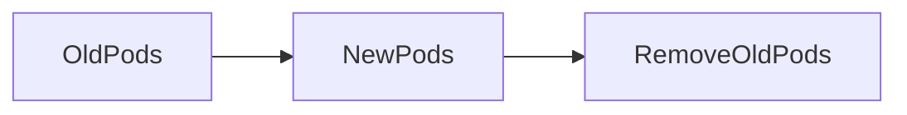

Rolling Update Process

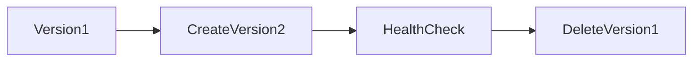

---

## Key Components

| Component | Purpose |
|-----------|---------|
| Deployment | Controls rollout |
| ReplicaSet | Manages versions |
| Pods | Running application |

---

## Types (if applicable)

Deployment Strategies

- RollingUpdate
- Recreate

---

## Lifecycle / Workflow

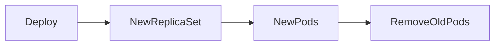

---

## Configuration / Syntax (if applicable)

```yaml
strategy:
  type: RollingUpdate
```

---

## Important Commands (if applicable)

Check Rollout

```bash
kubectl rollout status deployment/web
```

Rollback

```bash
kubectl rollout undo deployment/web
```

---

## Important Files (if applicable)

deployment.yaml

---

## Real-World Use Cases

- Production releases
- Application upgrades
- Version updates

---

## Advantages

- Zero or minimal downtime
- Safer deployments
- Automatic rollback support

---

## Limitations

- Slower than recreating all Pods
- Requires additional cluster resources during the update

---

## Common Interview Questions (Concept Only)

- What is a rolling deployment?
- Why is RollingUpdate preferred?
- What is the default deployment strategy?

---

## Common Mistakes

- Updating directly in production without verifying rollout

---

## Troubleshooting

```bash
kubectl rollout status deployment/web

kubectl rollout history deployment/web
```

---

## Summary

Rolling deployments update applications gradually, ensuring high availability while replacing old application versions with new ones.

---

# Update Images

## Overview

Updating container images deploys a new version of an application without recreating the entire Kubernetes infrastructure.

Kubernetes detects the new image version and performs a rolling update.

> **Interview Tip**
>
> Production deployments should use **versioned image tags** rather than `latest` to ensure predictable releases and rollbacks.

---

## Why It Is Used

Image updates allow:

- New feature deployment
- Bug fixes
- Security patches
- Version upgrades

---

## Architecture / Working


---

## Key Components

| Component | Purpose |
|-----------|---------|
| Deployment | Tracks image version |
| Registry | Stores images |
| Pod | Runs updated image |

---

## Types (if applicable)

Image Update Methods

- Update YAML manifest
- `kubectl set image`

---

## Lifecycle / Workflow

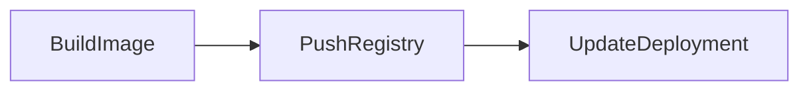

---

## Configuration / Syntax (if applicable)

Update Image

```bash
kubectl set image deployment/web web=myrepo/web:v2
```

---

## Important Commands (if applicable)

View Deployment

```bash
kubectl get deployment
```

Verify Image

```bash
kubectl describe deployment web
```

---

## Important Files (if applicable)

deployment.yaml

---

## Real-World Use Cases

- New application releases
- Security updates
- Bug fixes

---

## Advantages

- Quick updates
- Supports rolling deployment
- Version control

---

## Limitations

- Incorrect image tags cause deployment failures

---

## Common Interview Questions (Concept Only)

- How do you update an image?
- What happens after updating the image?

---

## Common Mistakes

- Reusing `latest`
- Forgetting to push the new image before deployment

---

## Troubleshooting

```bash
kubectl rollout status deployment/web

kubectl describe deployment web
```

---

## Summary

Updating images triggers Kubernetes to perform a controlled rollout of the new application version while maintaining service availability.

---

# Verify Deployment

## Overview

Deployment verification ensures that the application has been successfully updated and is functioning correctly after deployment.

Verification confirms:

- Pods are running
- Rollout completed
- Application is healthy
- Services are available

> **Interview Tip**
>
> A successful `kubectl apply` does **not** guarantee a successful deployment. Always verify rollout status and Pod health.

---

## Why It Is Used

Verification ensures:

- Successful deployment
- Healthy Pods
- Available replicas
- No rollout failures
- Application readiness

---

## Architecture / Working

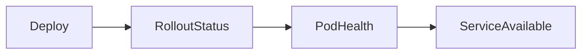

---

## Key Components

| Component | Purpose |
|-----------|---------|
| Deployment | Rollout status |
| Pods | Running application |
| Service | Connectivity |
| Logs | Application validation |

---

## Types (if applicable)

Verification Methods

- Rollout status
- Pod status
- Logs
- Describe output
- Application testing

---

## Lifecycle / Workflow

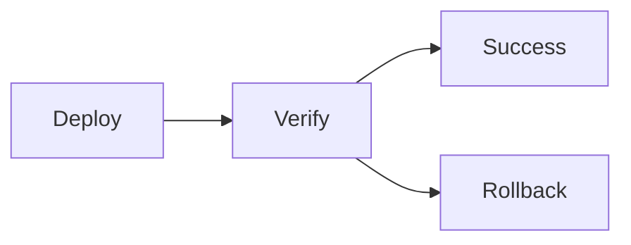

---

## Configuration / Syntax (if applicable)

Check Rollout

```bash
kubectl rollout status deployment/web
```

Check Pods

```bash
kubectl get pods
```

---

## Important Commands (if applicable)

Describe Deployment

```bash
kubectl describe deployment web
```

View Logs

```bash
kubectl logs <pod-name>
```

Rollback

```bash
kubectl rollout undo deployment/web
```

---

## Important Files (if applicable)

deployment.yaml

---

## Real-World Use Cases

- Production releases
- CI/CD validation
- Release verification

---

## Advantages

- Detects deployment failures early
- Prevents faulty releases
- Supports reliable production deployments

---

## Limitations

- Manual application testing may still be required

---

## Common Interview Questions (Concept Only)

- How do you verify a Kubernetes deployment?
- Which command checks rollout status?
- How do you confirm Pods are healthy after deployment?

---

## Common Mistakes

- Assuming deployment success without verification
- Ignoring Pod readiness
- Not reviewing logs after deployment

---

## Troubleshooting

| Problem | Cause | Solution |
|----------|--------|----------|
| Rollout incomplete | Pod startup failure | Check rollout status and Pod events |
| Pods not Ready | Probe failures | Review readiness and liveness probes |
| Image pull failure | Registry issue | Verify image and credentials |
| Application unavailable | Service or selector mismatch | Verify Service configuration |

Useful Commands

```bash
kubectl rollout status deployment/web

kubectl get deployments

kubectl get pods

kubectl describe deployment web

kubectl logs <pod-name>

kubectl get svc
```

---

## Summary

Deployment verification confirms that Kubernetes successfully rolled out the new application version, Pods are healthy, Services are functioning, and the application is ready to receive production traffic. It is a critical final step in every CI/CD pipeline.
