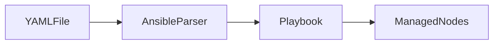
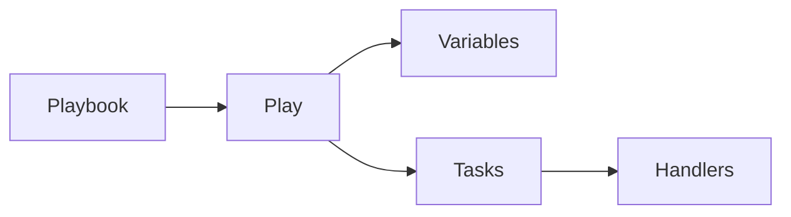
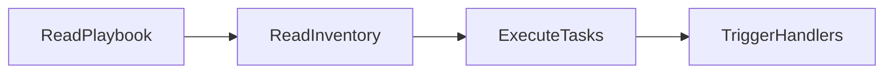
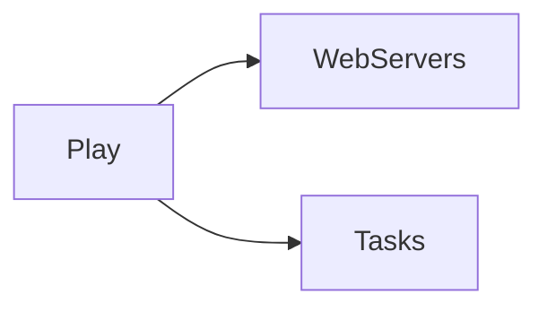
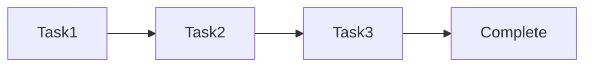
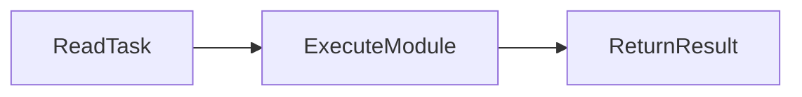
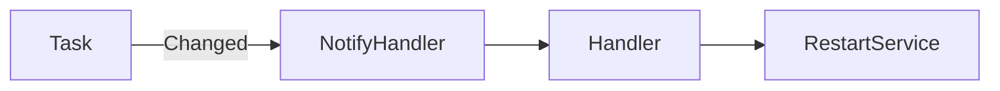
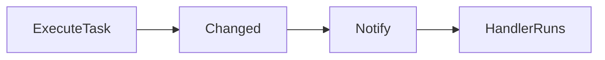
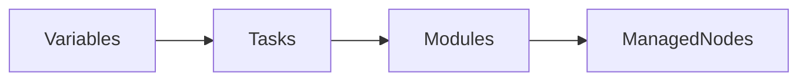
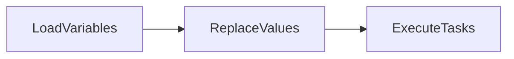

# Playbooks

## Overview

Ansible Playbooks are YAML files that define **automation workflows**. They describe **what tasks should be executed, on which hosts, and in what order**.

Unlike Ad-Hoc Commands, Playbooks are:

- Reusable
- Version-controlled
- Idempotent
- Scalable
- Easy to maintain

Playbooks are the core of Ansible automation and are widely used for:

- Configuration Management
- Application Deployment
- Infrastructure Provisioning
- Patch Management
- Server Administration

> **Interview Tip**
>
> **Ad-Hoc Commands** are used for one-time tasks, while **Playbooks** are used for repeatable automation.

---

# YAML Basics

## Overview

YAML (**YAML Ain't Markup Language**) is the language used to write Ansible Playbooks.

YAML is:

- Human-readable
- Indentation-based
- Easy to learn
- Widely used in DevOps tools (Ansible, Kubernetes, Docker Compose, GitHub Actions)

Ansible Playbooks are simply YAML files with a `.yml` or `.yaml` extension.

> **Interview Tip**
>
> YAML uses **spaces, not tabs**. Incorrect indentation is one of the most common causes of Playbook errors.

---

## Why It Is Used

YAML provides:

- Simple syntax
- Better readability
- Easy configuration management
- Structured data representation

---

## Architecture / Working



---

## Key Components

| Component | Purpose |
|-----------|---------|
| Key | Configuration name |
| Value | Assigned value |
| List | Collection of items |
| Dictionary | Key-value pairs |
| Indentation | Defines hierarchy |

---

## Types (if applicable)

Common YAML Structures

- Scalars
- Lists
- Dictionaries

---

## Lifecycle / Workflow


---

## Configuration / Syntax (if applicable)

Simple Key-Value Pair

```yaml
name: Install Apache
```

List

```yaml
packages:
  - git
  - nginx
  - docker
```

Dictionary

```yaml
user:
  name: ubuntu
  shell: /bin/bash
```

Playbook Example

```yaml
---
- hosts: web
  tasks:
    - name: Print Message
      debug:
        msg: "Hello World"
```

---

## Important Commands (if applicable)

Validate YAML Syntax

```bash
ansible-playbook --syntax-check playbook.yml
```

---

## Important Files (if applicable)

| File | Purpose |
|------|---------|
| playbook.yml | Ansible Playbook |
| ansible.cfg | Configuration |
| inventory | Managed hosts |

---

## Real-World Use Cases

- Infrastructure automation
- Application deployment
- Kubernetes configuration
- CI/CD pipelines

---

## Advantages

- Easy to read
- Human-friendly
- Widely supported
- Version-control friendly

---

## Limitations

- Sensitive to indentation
- Tabs are not allowed
- Formatting errors cause parsing failures

---

## Common Interview Questions (Concept Only)

- Why does Ansible use YAML?
- Why are tabs not allowed in YAML?
- What file extension is used for Playbooks?

---

## Common Mistakes

- Using tabs
- Incorrect indentation
- Missing colon (`:`)
- Mixing spaces and tabs

---

## Troubleshooting

| Problem | Cause | Solution |
|----------|--------|----------|
| YAML syntax error | Incorrect indentation | Use spaces consistently |
| Mapping values not allowed | Missing colon | Verify syntax |
| Unexpected token | Invalid YAML structure | Validate the file |

Useful Commands

```bash
ansible-playbook --syntax-check playbook.yml
```

---

## Summary

YAML is the language used to define Ansible Playbooks. Proper indentation and syntax are essential because even small formatting mistakes can prevent a Playbook from executing.

---

# Playbook Structure

## Overview

Every Playbook follows a structured layout.

A typical Playbook contains:

- Hosts
- Variables
- Become
- Tasks
- Handlers

Understanding the structure is essential for writing maintainable automation.

---

## Why It Is Used

A standard structure provides:

- Readability
- Reusability
- Consistency
- Easier troubleshooting

---

## Architecture / Working



---

## Key Components

| Component | Purpose |
|-----------|---------|
| hosts | Target hosts |
| vars | Variables |
| become | Privilege escalation |
| tasks | Actions to execute |
| handlers | Triggered tasks |

---

## Types (if applicable)

Playbook Components

- Plays
- Tasks
- Variables
- Handlers

---

## Lifecycle / Workflow



---

## Configuration / Syntax (if applicable)

```yaml
---
- name: Install Nginx
  hosts: web
  become: true

  vars:
    package_name: nginx

  tasks:
    - name: Install Package
      package:
        name: "{{ package_name }}"
        state: present

  handlers:
    - name: Restart Nginx
      service:
        name: nginx
        state: restarted
```

---

## Important Commands (if applicable)

Run Playbook

```bash
ansible-playbook playbook.yml
```

Syntax Check

```bash
ansible-playbook --syntax-check playbook.yml
```

---

## Important Files (if applicable)

| File | Purpose |
|------|---------|
| playbook.yml | Playbook definition |

---

## Real-World Use Cases

- Deploy applications
- Configure servers
- Install packages
- Restart services

---

## Advantages

- Organized
- Modular
- Reusable
- Easy maintenance

---

## Limitations

- Larger Playbooks require modularization
- Poor structure reduces readability

---

## Common Interview Questions (Concept Only)

- What are the main sections of a Playbook?
- What is the purpose of `hosts`?
- Where are variables defined?

---

## Common Mistakes

- Incorrect indentation
- Missing hosts
- Defining tasks outside a play

---

## Troubleshooting

```bash
ansible-playbook --syntax-check playbook.yml
```

---

## Summary

A Playbook has a consistent structure that organizes automation into plays, variables, tasks, and handlers, making it reusable and easy to maintain.

---

# Plays

## Overview

A Play is the highest-level object inside a Playbook.

A Play maps:

- A group of hosts
- Variables
- Tasks
- Handlers

One Playbook can contain one or multiple Plays.

> **Interview Tip**
>
> A **Play** targets hosts, while **Tasks** perform the actual work.

---

## Why It Is Used

Plays help:

- Target different host groups
- Separate automation logic
- Organize workflows

---

## Architecture / Working



---

## Key Components

| Component | Purpose |
|-----------|---------|
| hosts | Target group |
| tasks | Actions |
| vars | Variables |
| become | Privilege escalation |

---

## Types (if applicable)

- Single Play
- Multiple Plays

---

## Lifecycle / Workflow


---

## Configuration / Syntax (if applicable)

```yaml
- hosts: web

  tasks:
    - name: Display Hostname
      command: hostname
```

---

## Important Commands (if applicable)

```bash
ansible-playbook playbook.yml
```

---

## Important Files (if applicable)

Playbook

---

## Real-World Use Cases

- Configure web servers
- Configure database servers
- Multi-tier deployments

---

## Advantages

- Logical separation
- Easy maintenance
- Supports multiple environments

---

## Limitations

- Large Plays become difficult to manage
- Too many unrelated tasks reduce readability

---

## Common Interview Questions (Concept Only)

- What is a Play?
- Can a Playbook contain multiple Plays?
- What does the `hosts` keyword define?

---

## Common Mistakes

- Missing hosts
- Mixing unrelated tasks
- Poor Play organization

---

## Troubleshooting

```bash
ansible-playbook playbook.yml
```

---

## Summary

A Play defines which hosts Ansible targets and groups related automation tasks together within a Playbook.

---

# Tasks

## Overview

Tasks are the individual operations performed by Ansible within a Play.

Each Task usually calls one Ansible module to perform a specific action.

Examples include:

- Install packages
- Copy files
- Restart services
- Create users

Tasks execute **sequentially** by default.

---

## Why It Is Used

Tasks perform the actual automation work.

---

## Architecture / Working



---

## Key Components

| Component | Purpose |
|-----------|---------|
| Task | Unit of work |
| Module | Performs action |
| Name | Human-readable description |

---

## Types (if applicable)

Examples

- Package task
- Copy task
- Service task
- User task

---

## Lifecycle / Workflow



---

## Configuration / Syntax (if applicable)

```yaml
tasks:
  - name: Install Git
    package:
      name: git
      state: present
```

---

## Important Commands (if applicable)

```bash
ansible-playbook playbook.yml
```

---

## Important Files (if applicable)

Playbook

---

## Real-World Use Cases

- Install Docker
- Configure Nginx
- Deploy applications
- Restart services

---

## Advantages

- Modular
- Readable
- Reusable

---

## Limitations

- Tasks execute sequentially unless configured otherwise
- Poorly named tasks make troubleshooting harder

---

## Common Interview Questions (Concept Only)

- What is a Task?
- Can one task call multiple modules?
- In what order are tasks executed?

---

## Common Mistakes

- Missing task names
- Poor naming conventions
- Using incorrect modules

---

## Troubleshooting

```bash
ansible-playbook playbook.yml -v
```

---

## Summary

Tasks are the building blocks of a Playbook. Each task performs a single operation using an Ansible module and executes sequentially.

---

# Handlers

## Overview

Handlers are special tasks that execute **only when notified** by another task.

They are commonly used to restart services **only when a configuration change occurs**.

This prevents unnecessary service restarts and makes Playbooks more efficient.

> **Interview Tip**
>
> A Handler runs **only if a notifying task reports a change**.

---

## Why It Is Used

Handlers help:

- Avoid unnecessary restarts
- Improve efficiency
- Trigger actions only when needed

---

## Architecture / Working



---

## Key Components

| Component | Purpose |
|-----------|---------|
| Handler | Conditional task |
| notify | Triggers handler |
| changed | Determines execution |

---

## Types (if applicable)

Common Handlers

- Restart Service
- Reload Service
- Restart Application

---

## Lifecycle / Workflow



---

## Configuration / Syntax (if applicable)

```yaml
tasks:
  - name: Copy Config
    copy:
      src: nginx.conf
      dest: /etc/nginx/nginx.conf
    notify:
      - Restart Nginx

handlers:
  - name: Restart Nginx
    service:
      name: nginx
      state: restarted
```

---

## Important Commands (if applicable)

```bash
ansible-playbook playbook.yml
```

---

## Important Files (if applicable)

Playbook

---

## Real-World Use Cases

- Restart Apache after configuration changes
- Reload Nginx
- Restart application services

---

## Advantages

- Prevents unnecessary restarts
- Improves efficiency
- Supports idempotency

---

## Limitations

- Runs only when notified
- Executes after all tasks in the play complete

---

## Common Interview Questions (Concept Only)

- What is a Handler?
- When does a Handler execute?
- What is the purpose of `notify`?

---

## Common Mistakes

- Forgetting `notify`
- Handler name mismatch
- Expecting handlers to run immediately after the task

---

## Troubleshooting

```bash
ansible-playbook playbook.yml -v
```

---

## Summary

Handlers are special tasks triggered only when another task reports a change. They are most commonly used to restart or reload services efficiently.

---

# Variables

## Overview

Variables store reusable values that can be referenced throughout a Playbook.

Instead of hardcoding values, variables allow Playbooks to be flexible, reusable, and easier to maintain.

Variables can represent:

- Package names
- Usernames
- Ports
- File paths
- Environment-specific settings

> **Interview Tip**
>
> Variables make Playbooks reusable across development, testing, and production environments without modifying the task logic.

---

## Why It Is Used

Variables help:

- Eliminate hardcoded values
- Improve readability
- Reuse Playbooks
- Support multiple environments

---

## Architecture / Working



---

## Key Components

| Component | Purpose |
|-----------|---------|
| vars | Defines variables within a play |
| Variable Reference | Uses stored values |
| Variable Files | Stores reusable variables |

---

## Types (if applicable)

Common Variable Sources

- Play Variables (`vars`)
- Host Variables
- Group Variables
- Variable Files
- Extra Variables (`--extra-vars`)

---

## Lifecycle / Workflow



---

## Configuration / Syntax (if applicable)

Define Variables

```yaml
vars:
  package_name: nginx
  service_name: nginx
```

Reference Variables

```yaml
tasks:
  - name: Install Package
    package:
      name: "{{ package_name }}"
      state: present
```

Pass Variables from CLI

```bash
ansible-playbook playbook.yml --extra-vars "package_name=httpd"
```

---

## Important Commands (if applicable)

Run with Extra Variables

```bash
ansible-playbook playbook.yml --extra-vars "env=production"
```

---

## Important Files (if applicable)

| File | Purpose |
|------|---------|
| playbook.yml | Playbook variables |
| host_vars/ | Host-specific variables |
| group_vars/ | Group-specific variables |

---

## Real-World Use Cases

- Deploy to multiple environments
- Configure different package versions
- Use different ports or hostnames
- Customize application settings

---

## Advantages

- Eliminates duplication
- Improves maintainability
- Makes Playbooks reusable
- Simplifies environment-specific configuration

---

## Limitations

- Variable precedence can become confusing
- Poor naming conventions reduce readability

---

## Common Interview Questions (Concept Only)

- What are Variables in Ansible?
- How are variables referenced?
- What is the difference between Host Variables and Group Variables?
- Which variable source has higher precedence?

---

## Common Mistakes

- Hardcoding values instead of using variables
- Using inconsistent variable names
- Forgetting Jinja2 syntax (`{{ variable_name }}`)

---

## Troubleshooting

| Problem | Cause | Solution |
|----------|--------|----------|
| Variable undefined | Variable not declared | Verify variable definition |
| Wrong value used | Variable precedence | Check variable source |
| Syntax error | Incorrect Jinja2 format | Use `{{ variable_name }}` |

Useful Commands

```bash
ansible-playbook playbook.yml --extra-vars "env=dev"

ansible-inventory --list
```

---

## Summary

Variables make Playbooks flexible and reusable by replacing hardcoded values with reusable data. They support environment-specific configurations and are a fundamental feature for writing maintainable Ansible automation.
