# Modules

## Overview

Ansible Modules are reusable units of code that perform specific tasks on managed nodes. Every task in an Ansible Playbook uses a module to perform an action such as installing packages, copying files, managing users, or controlling services.

Modules are executed on managed nodes and return structured JSON output to the Ansible Control Node.

> **Interview Tip**
>
> Every Ansible task executes exactly one module. Modules are the building blocks of Ansible automation.

---

# command Module

## Overview

The `command` module executes commands on managed nodes without invoking a shell.

It is the safest module for running system commands because it does not process shell features like pipes, redirection, or environment variable expansion.

---

## Why It Is Used

- Execute Linux commands safely
- Retrieve system information
- Run administrative commands
- Perform simple operations

---

## Architecture / Working

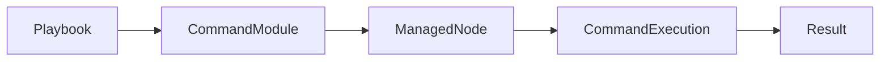

---

## Key Components

| Component | Description |
|-----------|-------------|
| command | Executes system command |
| argv | Passes command arguments as a list |
| creates | Skips command if file exists |
| removes | Runs command only if file exists |

---

## Types (if applicable)

- Simple command execution
- Conditional execution using `creates`
- Conditional execution using `removes`

---

## Lifecycle / Workflow

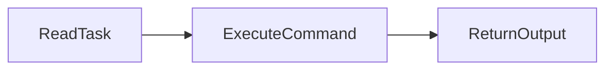

---

## Configuration / Syntax

```yaml
- name: Check hostname
  command: hostname
```

Using arguments

```yaml
- name: List directory
  command:
    argv:
      - ls
      - -l
      - /tmp
```

---

## Important Commands

```bash
ansible web -m command -a "hostname"

ansible web -m command -a "uptime"
```

---

## Important Files

None

---

## Real-World Use Cases

- Check hostname
- Verify disk usage
- Retrieve OS information
- Execute maintenance commands

---

## Advantages

- Safe
- Idempotent-friendly
- No shell interpretation

---

## Limitations

- Cannot use pipes (`|`)
- Cannot use redirects (`>`)
- Cannot use shell variables (`$HOME`)

---

## Common Interview Questions (Concept Only)

- What is the difference between command and shell module?
- Why is command considered safer?

---

## Common Mistakes

- Using pipes
- Using environment variables
- Expecting shell features

---

## Troubleshooting

| Problem | Solution |
|----------|----------|
| Pipe not working | Use shell module |
| Variable not expanding | Use shell module |

---

## Summary

The command module executes commands directly without a shell and is the preferred choice whenever shell features are not required.

---

# shell Module

## Overview

The `shell` module executes commands through the system shell.

Unlike the `command` module, it supports shell features such as:

- Pipes
- Redirection
- Variables
- Command chaining

---

## Why It Is Used

- Execute shell scripts
- Use Linux shell features
- Run complex commands

---

## Architecture / Working

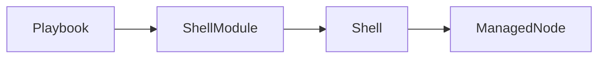

---

## Key Components

| Component | Description |
|-----------|-------------|
| shell | Executes through shell |
| executable | Specify shell |
| creates | Skip execution |
| removes | Conditional execution |

---

## Types

- Simple shell command
- Script execution
- Pipeline execution

---

## Lifecycle /Workflow

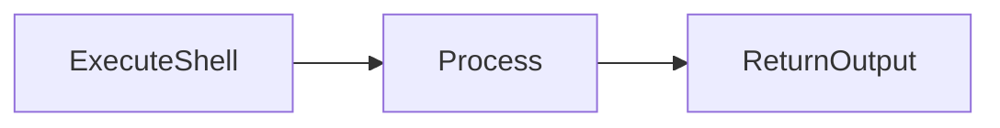

---

## Configuration / Syntax

```yaml
- name: Count log entries
  shell: cat /var/log/syslog | wc -l
```

---

## Important Commands

```bash
ansible web -m shell -a "df -h | grep /"
```

---

## Important Files

None

---

## Real-World Use Cases

- Execute shell scripts
- Parse command output
- Log processing

---

## Advantages

- Supports shell syntax
- Flexible

---

## Limitations

- Less secure
- Can introduce shell injection risks

---

## Common Interview Questions (Concept Only)

- When should shell be used?
- Difference between shell and command?

---

## Common Mistakes

- Using shell unnecessarily
- Executing unsafe commands

---

## Troubleshooting

Use `command` whenever shell functionality is unnecessary.

---

## Summary

Use the shell module only when shell features such as pipes or redirection are required.

---

# copy Module

## Overview

The `copy` module copies files from the Control Node to Managed Nodes.

---

## Why It Is Used

- Deploy configuration files
- Copy scripts
- Copy certificates

---

## Architecture / Working

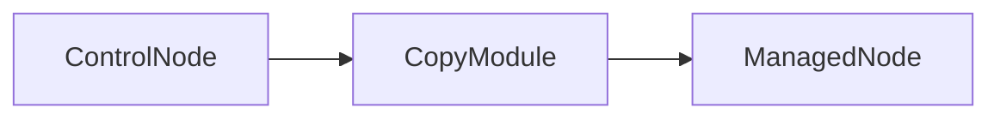

---

## Key Components

| Parameter | Purpose |
|------------|----------|
| src | Source file |
| dest | Destination |
| owner | File owner |
| group | Group owner |
| mode | Permissions |

---

## Types

- File copy
- Inline content copy

---

## Lifecycle / Workflow


---

## Configuration / Syntax

```yaml
- name: Copy configuration
  copy:
    src: nginx.conf
    dest: /etc/nginx/nginx.conf
```

---

## Important Commands

```bash
ansible web -m copy -a "src=test.txt dest=/tmp/test.txt"
```

---

## Important Files

- Source file
- Destination file

---

## Real-World Use Cases

- Deploy configs
- Deploy scripts
- Deploy SSL certificates

---

## Advantages

- Simple
- Idempotent

---

## Limitations

- Large files transfer slowly

---

## Common Interview Questions (Concept Only)

- Difference between copy and template?
- Does copy support variables?

---

## Common Mistakes

- Wrong destination path
- Incorrect permissions

---

## Troubleshooting

Verify file exists on Control Node.

---

## Summary

The copy module transfers files directly without modifying content.

---

# file Module

## Overview

The `file` module manages files, directories, links, and permissions.

---

## Why It Is Used

- Create directories
- Delete files
- Modify permissions

---

## Architecture / Working

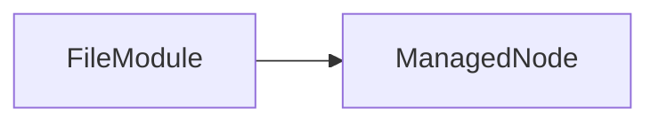

---

## Key Components

| Parameter | Purpose |
|------------|----------|
| path | File path |
| state | Desired state |
| owner | Owner |
| mode | Permissions |

---

## Types

- File
- Directory
- Link
- Absent

---

## Lifecycle / Workflow

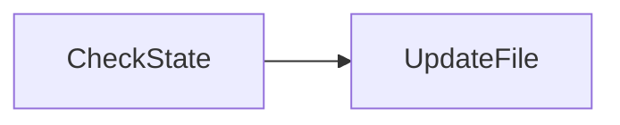

---

## Configuration / Syntax

```yaml
- name: Create directory
  file:
    path: /opt/app
    state: directory
```

---

## Important Commands

None

---

## Important Files

Filesystem

---

## Real-World Use Cases

- Directory creation
- Permission management

---

## Advantages

- Idempotent
- Simple

---

## Limitations

- Cannot edit file contents

---

## Common Interview Questions (Concept Only)

- What states does the file module support?

---

## Common Mistakes

- Incorrect permissions

---

## Troubleshooting

Verify filesystem permissions.

---

## Summary

The file module manages filesystem objects without modifying file contents.

---

# template Module

## Overview

The `template` module copies Jinja2 templates from the Control Node to Managed Nodes while replacing variables dynamically.

---

## Why It Is Used

- Dynamic configuration
- Environment-specific deployment

---

## Architecture / Working

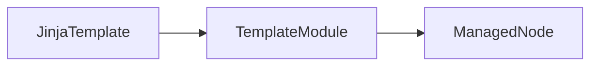

---

## Key Components

| Component | Purpose |
|------------|----------|
| src | Template |
| dest | Destination |
| Variables | Dynamic values |

---

## Types

- Jinja2 template

---

## Lifecycle / Workflow

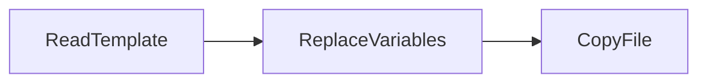

---

## Configuration / Syntax

```yaml
- name: Deploy config
  template:
    src: nginx.conf.j2
    dest: /etc/nginx/nginx.conf
```

---

## Important Commands

None

---

## Important Files

| File | Purpose |
|------|---------|
| *.j2 | Template |

---

## Real-World Use Cases

- Nginx configs
- Apache configs
- Application configs

---

## Advantages

- Dynamic
- Reusable

---

## Limitations

- Requires Jinja2 syntax

---

## Common Interview Questions (Concept Only)

- Difference between template and copy?

---

## Common Mistakes

- Invalid Jinja2 syntax

---

## Troubleshooting

Validate template variables.

---

## Summary

The template module generates dynamic configuration files using Jinja2 variables.

---

# service Module

## Overview

The `service` module manages system services.

---

## Why It Is Used

- Start services
- Stop services
- Restart services
- Enable boot startup

---

## Architecture / Working

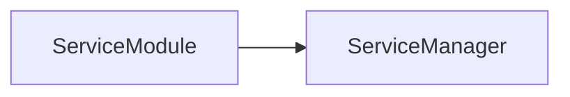

---

## Key Components

| Parameter | Purpose |
|------------|----------|
| name | Service |
| state | Desired state |
| enabled | Boot status |

---

## Types

- started
- stopped
- restarted
- reloaded

---

## Lifecycle / Workflow

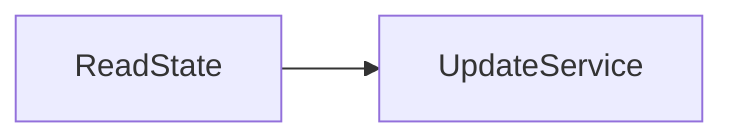

---

## Configuration / Syntax

```yaml
- name: Start nginx
  service:
    name: nginx
    state: started
```

---

## Important Commands

None

---

## Important Files

System service definitions

---

## Real-World Use Cases

- Restart Apache
- Enable Docker

---

## Advantages

- Cross-platform abstraction

---

## Limitations

- Limited service-manager-specific options

---

## Common Interview Questions (Concept Only)

- Difference between started and restarted?

---

## Common Mistakes

- Wrong service name

---

## Troubleshooting

Verify service exists.

---

## Summary

The service module manages Linux services consistently across distributions.

---

# package Module

## Overview

The `package` module provides a generic interface for installing or removing software packages.

---

## Why It Is Used

- Cross-platform package management

---

## Architecture / Working

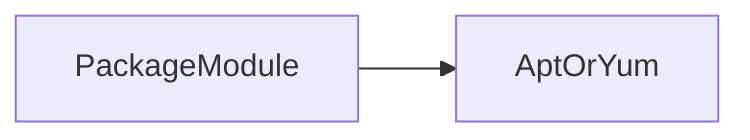

---

## Key Components

| Parameter | Purpose |
|------------|----------|
| name | Package |
| state | Desired state |

---

## Types

- Install
- Remove

---

## Lifecycle / Workflow

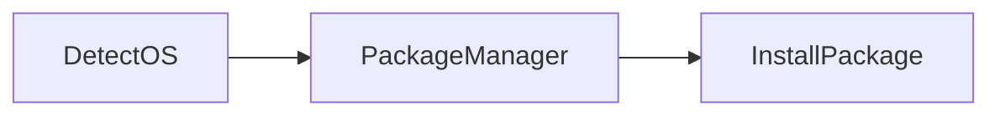

---

## Configuration / Syntax

```yaml
- package:
    name: git
    state: present
```

---

## Important Commands

None

---

## Important Files

Package repositories

---

## Real-World Use Cases

- Install Git
- Install Docker

---

## Advantages

- Platform independent

---

## Limitations

- Limited package-manager-specific features

---

## Common Interview Questions (Concept Only)

- Difference between package and apt?

---

## Common Mistakes

- Assuming all options are supported

---

## Troubleshooting

Verify repositories.

---

## Summary

The package module automatically selects the appropriate package manager.

---

# apt Module

## Overview

The `apt` module manages Debian and Ubuntu packages.

---

## Why It Is Used

- Install packages
- Update cache
- Upgrade packages

---

## Architecture / Working

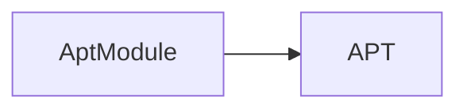

---

## Key Components

| Parameter | Purpose |
|------------|----------|
| update_cache | Refresh package list |
| name | Package |
| state | Desired state |

---

## Types

- Install
- Upgrade
- Remove

---

## Lifecycle / Workflow


---

## Configuration / Syntax

```yaml
- apt:
    name: nginx
    state: present
    update_cache: yes
```

---

## Important Commands

None

---

## Important Files

`/etc/apt/sources.list`

---

## Real-World Use Cases

Ubuntu automation

---

## Advantages

- Native Ubuntu support

---

## Limitations

Ubuntu/Debian only

---

## Common Interview Questions (Concept Only)

- Difference between apt and package?

---

## Common Mistakes

Skipping cache update

---

## Troubleshooting

Run `apt update`.

---

## Summary

The apt module is optimized for Debian-based systems.

---

# yum Module

## Overview

The `yum` module manages packages on RHEL-based systems.

---

## Why It Is Used

- Install packages
- Update software

---

## Architecture / Working

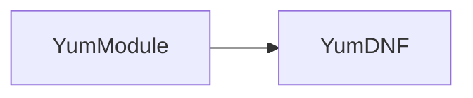

---

## Key Components

| Parameter | Purpose |
|------------|----------|
| name | Package |
| state | Desired state |

---

## Types

- Install
- Update
- Remove

---

## Lifecycle / Workflow

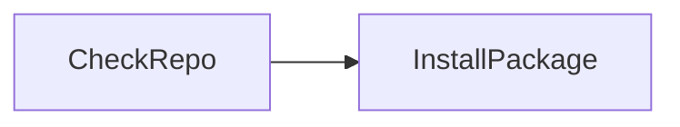

---

## Configuration / Syntax

```yaml
- yum:
    name: httpd
    state: present
```

---

## Important Commands

None

---

## Important Files

Repository configuration

---

## Real-World Use Cases

RHEL automation

---

## Advantages

Native RHEL support

---

## Limitations

RHEL-based systems only

---

## Common Interview Questions (Concept Only)

- Difference between yum and package?

---

## Common Mistakes

Missing repositories

---

## Troubleshooting

Verify repository configuration.

---

## Summary

The yum module manages software packages on RHEL-based systems.

---

# user Module

## Overview

The `user` module manages Linux user accounts.

---

## Why It Is Used

- Create users
- Delete users
- Manage groups

---

## Architecture / Working

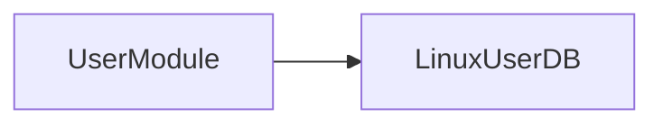

---

## Key Components

| Parameter | Purpose |
|------------|----------|
| name | Username |
| state | Present/Absent |
| groups | User groups |

---

## Types

- Create
- Modify
- Delete

---

## Lifecycle / Workflow

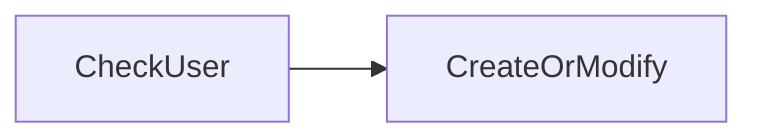

---

## Configuration / Syntax

```yaml
- user:
    name: devuser
    state: present
```

---

## Important Commands

None

---

## Important Files

- `/etc/passwd`
- `/etc/shadow`

---

## Real-World Use Cases

- Provision users
- Create service accounts

---

## Advantages

- Idempotent
- Secure

---

## Limitations

OS-specific behavior

---

## Common Interview Questions (Concept Only)

- How do you create users using Ansible?

---

## Common Mistakes

Incorrect group names

---

## Troubleshooting

Verify user existence.

---

## Summary

The user module automates Linux user and group management.

---

# git Module

## Overview

The `git` module clones or updates Git repositories on managed nodes.

---

## Why It Is Used

- Deploy applications
- Download source code
- Update repositories

---

## Architecture / Working

```mermaid
flowchart LR
    GitRepository --> GitModule
    GitModule --> ManagedNode
```

---

## Key Components

| Parameter | Purpose |
|------------|----------|
| repo | Repository URL |
| dest | Destination directory |
| version | Branch or tag |

---

## Types

- Clone
- Pull
- Checkout branch

---

## Lifecycle / Workflow

```mermaid
flowchart LR
    ConnectRepo --> CloneOrPull --> CheckoutVersion
```

---

## Configuration / Syntax

```yaml
- git:
    repo: https://github.com/example/app.git
    dest: /opt/app
    version: main
```

---

## Important Commands

None

---

## Important Files

Git repository

---

## Real-World Use Cases

- Deploy applications
- CI/CD pipelines
- Infrastructure code deployment

---

## Advantages

- Idempotent
- Supports branches and tags

---

## Limitations

- Git must be installed
- Repository access permissions are required

---

## Common Interview Questions (Concept Only)

- How does the git module work?
- How do you deploy a specific branch?

---

## Common Mistakes

- Git not installed
- Invalid repository URL
- Missing SSH keys for private repositories

---

## Troubleshooting

| Problem | Cause | Solution |
|----------|--------|----------|
| Authentication failed | Missing SSH key or credentials | Configure SSH keys or Git credentials |
| Repository not found | Incorrect repository URL | Verify repository path |
| Destination already exists | Existing directory conflict | Remove directory or use `force: yes` if appropriate |

---

## Summary

The git module automates cloning and updating Git repositories on managed nodes, making it an essential module for application deployment and CI/CD workflows.
