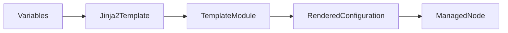
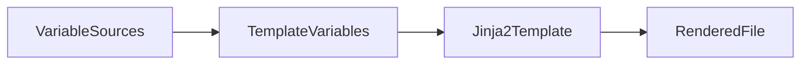
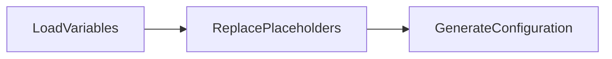
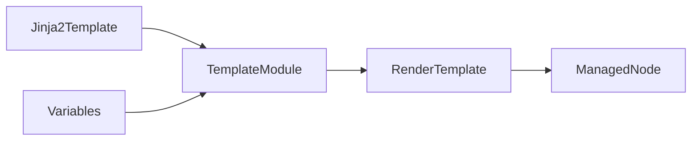

# Templates

## Overview

Templates in Ansible are dynamic configuration files that use the **Jinja2 templating engine** to generate customized files on managed nodes.

Unlike the `copy` module, which copies files exactly as they are, templates allow placeholders (variables) to be replaced with actual values during playbook execution.

Templates are commonly used to generate:

- Web server configurations
- Database configurations
- Application configuration files
- Service configuration files
- Environment-specific settings

> **Interview Tip**
>
> The **copy module** copies files without modification, while the **template module** renders Jinja2 variables before copying the file.

---

# Jinja2 Templates

## Overview

Jinja2 is the templating engine used by Ansible to create dynamic configuration files.

It allows variables, expressions, conditions, and loops to be embedded inside template files.

Template files usually have the extension:

```
.j2
```

Example:

```
nginx.conf.j2
```

---

## Why It Is Used

Jinja2 templates help to:

- Generate dynamic configuration files
- Reuse the same template across multiple environments
- Reduce duplicate configuration files
- Improve maintainability

---

## Architecture / Working



---

## Key Components

| Component | Description |
|-----------|-------------|
| Jinja2 Template | File containing variables |
| Variables | Dynamic values |
| Template Module | Renders template |
| Rendered File | Final configuration file |

---

## Types (if applicable)

Common Jinja2 Features

- Variables
- Expressions
- Filters
- Conditions
- Loops

---

## Lifecycle / Workflow


---

## Configuration / Syntax (if applicable)

Template File

```jinja2
server {

    listen {{ http_port }};

    server_name {{ server_name }};

}
```

Playbook

```yaml
vars:

  http_port: 80

  server_name: example.com
```

Generated File

```text
server {

    listen 80;

    server_name example.com;

}
```

---

## Important Commands (if applicable)

Run Playbook

```bash
ansible-playbook site.yml
```

Syntax Check

```bash
ansible-playbook --syntax-check site.yml
```

---

## Important Files (if applicable)

| File | Purpose |
|------|---------|
| *.j2 | Jinja2 Template |
| playbook.yml | Variables |
| group_vars/ | Shared variables |
| host_vars/ | Host variables |

---

## Real-World Use Cases

- Generate Nginx configuration
- Generate Apache Virtual Hosts
- Configure HAProxy
- Configure Docker daemon
- Configure Kubernetes services
- Create application configuration files

---

## Advantages

- Dynamic
- Reusable
- Environment-independent
- Easy maintenance

---

## Limitations

- Requires Jinja2 syntax knowledge
- Incorrect variables cause rendering errors

---

## Common Interview Questions (Concept Only)

- What is Jinja2?
- Why are templates used?
- Difference between copy and template?
- What extension is used for template files?

---

## Common Mistakes

- Incorrect variable names
- Invalid Jinja2 syntax
- Missing variables
- Forgetting `.j2` extension

---

## Troubleshooting

| Problem | Cause | Solution |
|----------|--------|----------|
| Undefined variable | Variable missing | Define variable |
| Template syntax error | Invalid Jinja2 syntax | Verify template |
| Wrong output | Incorrect variable value | Check variable source |

Useful Commands

```bash
ansible-playbook --syntax-check site.yml
```

---

## Summary

Jinja2 templates allow Ansible to generate dynamic configuration files by replacing variables with actual values during playbook execution, making automation reusable and environment-specific.

---

# Template Variables

## Overview

Template Variables are values inserted into Jinja2 templates during rendering.

Variables can come from:

- Play Variables
- Inventory
- Host Variables
- Group Variables
- Facts
- Registered Variables
- Extra Variables

They are enclosed within:

```jinja2
{{ variable_name }}
```

---

## Why It Is Used

Template Variables allow:

- Environment-specific configurations
- Dynamic values
- Reusable templates
- Reduced duplication

---

## Architecture / Working



---

## Key Components

| Component | Purpose |
|-----------|---------|
| Variables | Store values |
| Facts | Automatic variables |
| Registered Variables | Task output |
| Extra Variables | Runtime override |

---

## Types (if applicable)

Common Variable Sources

- vars
- group_vars
- host_vars
- Facts
- Registered Variables
- Extra Variables

---

## Lifecycle / Workflow



---

## Configuration / Syntax (if applicable)

Playbook

```yaml
vars:

  app_name: inventory

  app_port: 8080
```

Template

```jinja2
Application={{ app_name }}

Port={{ app_port }}
```

Rendered Output

```text
Application=inventory

Port=8080
```

---

## Important Commands (if applicable)

Display Variables

```bash
ansible all -m setup
```

---

## Important Files (if applicable)

| File | Purpose |
|------|---------|
| group_vars/ | Shared variables |
| host_vars/ | Host variables |
| *.j2 | Template |

---

## Real-World Use Cases

- Generate database credentials
- Configure server names
- Configure IP addresses
- Configure ports
- Environment-specific deployment

---

## Advantages

- Flexible
- Dynamic
- Reusable
- Easy maintenance

---

## Limitations

- Missing variables cause failures
- Incorrect precedence may generate unexpected values

---

## Common Interview Questions (Concept Only)

- How are variables referenced inside templates?
- Which variable sources can templates use?
- What happens if a variable is undefined?

---

## Common Mistakes

- Misspelled variable names
- Incorrect variable precedence
- Missing variable definitions

---

## Troubleshooting

```yaml
- debug:
    var: app_name
```

Check variables before rendering.

---

## Summary

Template Variables allow Jinja2 templates to generate customized configuration files by replacing placeholders with values from Ansible variable sources.

---

# template Module

## Overview

The `template` module renders a Jinja2 template on the Control Node and copies the generated file to the Managed Node.

Unlike the `copy` module, the file content is dynamically generated before being transferred.

> **Interview Tip**
>
> **copy → Static file**
>
> **template → Dynamic file**

---

## Why It Is Used

The template module is used to:

- Generate configuration files
- Deploy application settings
- Customize configurations for each server
- Support environment-specific deployments

---

## Architecture / Working



---

## Key Components

| Parameter | Purpose |
|-----------|---------|
| src | Template file |
| dest | Destination path |
| owner | File owner |
| group | Group owner |
| mode | File permissions |

---

## Types (if applicable)

Common Operations

- Render template
- Copy rendered file
- Update existing configuration

---

## Lifecycle / Workflow


---

## Configuration / Syntax (if applicable)

Template File

```jinja2
server {

    listen {{ http_port }};

    server_name {{ hostname }};

}
```

Playbook

```yaml
- hosts: web

  vars:

    http_port: 80

    hostname: app.example.com

  tasks:

    - name: Deploy Nginx Configuration
      template:
        src: nginx.conf.j2
        dest: /etc/nginx/nginx.conf
```

---

## Important Commands (if applicable)

Run Playbook

```bash
ansible-playbook site.yml
```

Syntax Check

```bash
ansible-playbook --syntax-check site.yml
```

Dry Run

```bash
ansible-playbook site.yml --check
```

---

## Important Files (if applicable)

| File | Purpose |
|------|---------|
| nginx.conf.j2 | Template |
| playbook.yml | Automation |
| group_vars/ | Variables |
| host_vars/ | Variables |

---

## Real-World Use Cases

- Configure Nginx
- Configure Apache
- Configure HAProxy
- Deploy Kubernetes manifests
- Configure Docker daemon
- Generate application configuration
- Configure SSH
- Configure system services

---

## Advantages

- Dynamic configuration
- Reusable templates
- Supports variables
- Environment-aware
- Reduces duplicate files

---

## Limitations

- Requires valid Jinja2 syntax
- Missing variables cause template rendering failures
- Complex templates can become difficult to maintain

---

## Common Interview Questions (Concept Only)

- What does the template module do?
- Difference between template and copy module?
- Where does template rendering occur?
- Which templating engine does Ansible use?
- What is the extension of a Jinja2 template?

---

## Common Mistakes

- Using the copy module instead of template
- Incorrect variable names
- Invalid Jinja2 syntax
- Missing template file
- Wrong destination path
- Incorrect file permissions

---

## Troubleshooting

| Problem | Cause | Solution |
|----------|--------|----------|
| Template not found | Incorrect src path | Verify template location |
| Undefined variable | Variable missing | Define the variable |
| Invalid Jinja2 syntax | Syntax error | Validate template |
| Configuration not updated | Old template cached | Verify task execution and rendered output |

Useful Commands

```bash
ansible-playbook --syntax-check site.yml

ansible-playbook site.yml --check

ansible-playbook site.yml -v
```

---

## Summary

The `template` module is one of the most commonly used Ansible modules for production automation. It combines Jinja2 templates with Ansible variables to generate dynamic configuration files before copying them to managed nodes, making deployments flexible, reusable, and environment-specific.
