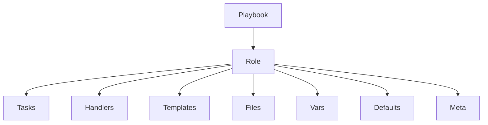
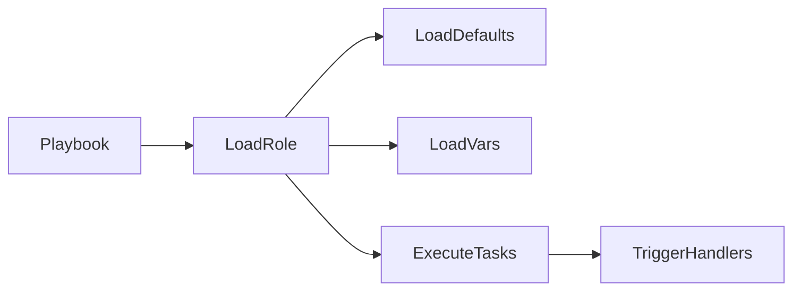
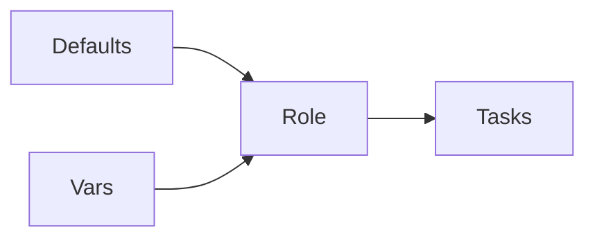
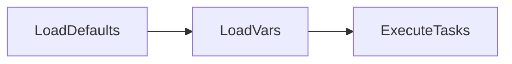

# Roles

## Overview

Ansible Roles provide a standardized way to organize Playbooks, variables, templates, handlers, tasks, and files into reusable components.

Instead of placing everything inside one large Playbook, Roles divide automation into smaller, independent modules that can be reused across multiple projects.

Roles improve:

- Reusability
- Maintainability
- Scalability
- Readability
- Collaboration

> **Interview Tip**
>
> Roles are one of the most frequently asked Ansible interview topics. Every medium-to-large production project uses Roles to organize automation.

---

# Role Structure

## Overview

A Role follows a predefined directory structure recognized by Ansible.

Although every directory is optional, using the standard structure makes projects easier to understand and maintain.

---

## Why It Is Used

The standard Role structure helps to:

- Separate different types of automation content
- Encourage code reuse
- Improve project organization
- Simplify collaboration among teams

---

## Architecture / Working



---

## Key Components

| Directory | Purpose |
|-----------|---------|
| tasks | Main automation tasks |
| handlers | Triggered tasks |
| templates | Jinja2 templates |
| files | Static files |
| vars | High-priority variables |
| defaults | Default variables |
| meta | Role metadata |

---

## Types (if applicable)

Standard Role Directories

- tasks
- handlers
- templates
- files
- vars
- defaults
- meta

---

## Lifecycle / Workflow



---

## Configuration / Syntax (if applicable)

Typical Role Structure

```text
roles/

└── nginx/
    ├── defaults/
    │   └── main.yml
    ├── files/
    ├── handlers/
    │   └── main.yml
    ├── meta/
    │   └── main.yml
    ├── tasks/
    │   └── main.yml
    ├── templates/
    ├── vars/
    │   └── main.yml
```

---

## Important Commands (if applicable)

Create Role

```bash
ansible-galaxy init nginx
```

---

## Important Files (if applicable)

| File | Purpose |
|------|---------|
| tasks/main.yml | Main tasks |
| handlers/main.yml | Handlers |
| defaults/main.yml | Default variables |
| vars/main.yml | Role variables |
| meta/main.yml | Metadata |

---

## Real-World Use Cases

- Nginx installation
- Docker installation
- Kubernetes configuration
- Database deployment
- User management

---

## Advantages

- Reusable
- Organized
- Easy maintenance
- Scalable

---

## Limitations

- Initial learning curve
- Too many small Roles can complicate navigation

---

## Common Interview Questions (Concept Only)

- What is an Ansible Role?
- Why are Roles used?
- What directories are commonly found in a Role?
- Which file is executed first inside the tasks directory?

---

## Common Mistakes

- Placing tasks outside `tasks/main.yml`
- Ignoring standard directory structure
- Mixing unrelated tasks within a single Role

---

## Troubleshooting

| Problem | Cause | Solution |
|----------|--------|----------|
| Role not found | Incorrect directory | Verify roles path |
| Task not executed | Missing `tasks/main.yml` | Create `tasks/main.yml` |
| Variable missing | Wrong variable location | Verify defaults or vars directory |

Useful Commands

```bash
ansible-galaxy init nginx

ansible-playbook site.yml
```

---

## Summary

The standard Role structure organizes automation into reusable directories, making Ansible projects easier to maintain and scale.

---

# Create Roles

## Overview

Roles can be created manually or by using the `ansible-galaxy init` command.

Using `ansible-galaxy init` is recommended because it automatically generates the standard directory structure.

---

## Why It Is Used

Creating Roles helps to:

- Standardize automation
- Promote code reuse
- Reduce duplication
- Improve project organization

---

## Architecture / Working


---

## Key Components

| Component | Purpose |
|-----------|---------|
| ansible-galaxy | Creates Role |
| Role Directory | Stores automation |
| tasks/main.yml | Primary task file |

---

## Types (if applicable)

Role Creation Methods

- Automatic
- Manual

---

## Lifecycle / Workflow


---

## Configuration / Syntax (if applicable)

Create Role

```bash
ansible-galaxy init apache
```

Generated Structure

```text
roles/
└── apache/
```

---

## Important Commands (if applicable)

Create Role

```bash
ansible-galaxy init role_name
```

List Installed Roles

```bash
ansible-galaxy list
```

---

## Important Files (if applicable)

Generated Role Directories

---

## Real-World Use Cases

- Web server automation
- Database installation
- Kubernetes deployment
- Docker installation

---

## Advantages

- Quick setup
- Standard structure
- Easier maintenance

---

## Limitations

- Empty directories require implementation

---

## Common Interview Questions (Concept Only)

- How do you create a Role?
- Which command creates the directory structure?

---

## Common Mistakes

- Creating incorrect directory names
- Forgetting `tasks/main.yml`

---

## Troubleshooting

```bash
ansible-galaxy init nginx
```

---

## Summary

The `ansible-galaxy init` command generates the recommended Role structure, reducing manual setup and ensuring consistency.

---

# Use Roles

## Overview

Roles are included inside Playbooks using the `roles` keyword.

When a Playbook executes a Role, Ansible automatically loads:

- Variables
- Tasks
- Templates
- Handlers
- Files

---

## Why It Is Used

Using Roles enables:

- Modular Playbooks
- Code reuse
- Better organization
- Easier maintenance

---

## Architecture / Working


---

## Key Components

| Component | Purpose |
|-----------|---------|
| roles | Includes Roles |
| tasks | Executes automation |
| handlers | Triggered tasks |

---

## Types (if applicable)

Role Inclusion

- Single Role
- Multiple Roles

---

## Lifecycle / Workflow


---

## Configuration / Syntax (if applicable)

Single Role

```yaml
- hosts: web

  roles:
    - nginx
```

Multiple Roles

```yaml
- hosts: web

  roles:
    - common
    - docker
    - nginx
```

---

## Important Commands (if applicable)

Run Playbook

```bash
ansible-playbook site.yml
```

---

## Important Files (if applicable)

Playbook

---

## Real-World Use Cases

- Install Docker
- Configure Web Servers
- Deploy Applications
- Configure Databases

---

## Advantages

- Cleaner Playbooks
- Modular automation
- Easy reuse

---

## Limitations

- Role dependency management must be handled carefully
- Variable conflicts may occur

---

## Common Interview Questions (Concept Only)

- How do you include a Role?
- Can multiple Roles be used?
- In what order are Roles executed?

---

## Common Mistakes

- Incorrect Role names
- Missing Role directories
- Incorrect roles path

---

## Troubleshooting

| Problem | Cause | Solution |
|----------|--------|----------|
| Role not found | Wrong directory | Verify roles path |
| Tasks not executed | Missing tasks/main.yml | Create task file |

Useful Commands

```bash
ansible-playbook site.yml
```

---

## Summary

Roles are included in Playbooks using the `roles` keyword, enabling modular, reusable, and maintainable automation.

---

# Role Variables

## Overview

Role Variables are variables defined specifically for a Role.

Ansible provides two common directories for storing Role variables:

- `defaults/`
- `vars/`

These directories differ mainly in **variable precedence**.

> **Interview Tip**
>
> - `defaults/main.yml` → Lowest precedence, easy to override.
> - `vars/main.yml` → Higher precedence, harder to override.

---

## Why It Is Used

Role Variables help to:

- Configure Roles
- Avoid hardcoding values
- Support environment-specific deployments
- Improve Role reusability

---

## Architecture / Working



---

## Key Components

| Directory | Purpose |
|-----------|---------|
| defaults | Default variable values |
| vars | Role-specific variables |
| tasks | Uses variables |

---

## Types (if applicable)

### Default Variables

Located in:

```text
defaults/main.yml
```

Lowest precedence.

---

### Role Variables

Located in:

```text
vars/main.yml
```

Higher precedence.

---

## Lifecycle / Workflow



---

## Configuration / Syntax (if applicable)

Default Variable

```yaml
# defaults/main.yml

package_name: nginx
```

Role Variable

```yaml
# vars/main.yml

service_name: nginx
```

Using Variables

```yaml
tasks:

- name: Install Package
  package:
    name: "{{ package_name }}"
    state: present
```

---

## Important Commands (if applicable)

Run Playbook

```bash
ansible-playbook site.yml
```

---

## Important Files (if applicable)

| File | Purpose |
|------|---------|
| defaults/main.yml | Default variables |
| vars/main.yml | Role variables |

---

## Real-World Use Cases

- Configure package names
- Configure ports
- Configure service names
- Environment-specific deployment
- Application configuration

---

## Advantages

- Centralized configuration
- Reusable Roles
- Easy customization
- Better maintainability

---

## Limitations

- Incorrect precedence can cause unexpected behavior
- Poor variable naming may lead to conflicts

---

## Common Interview Questions (Concept Only)

- What is the difference between `defaults` and `vars`?
- Which has higher precedence?
- Why should default values be stored in `defaults/main.yml`?

---

## Common Mistakes

- Placing default values in `vars`
- Duplicate variable names
- Ignoring variable precedence

---

## Troubleshooting

| Problem | Cause | Solution |
|----------|--------|----------|
| Variable not overridden | Defined in `vars` | Move to `defaults` if it should be customizable |
| Undefined variable | Missing definition | Verify variable file |

Useful Commands

```bash
ansible-playbook site.yml

ansible-playbook site.yml --extra-vars "package_name=httpd"
```

---

## Summary

Role Variables make Roles configurable and reusable. Default values belong in `defaults/main.yml`, while values that should rarely change can be placed in `vars/main.yml`. Understanding the difference in precedence is essential for writing flexible and maintainable Roles.
