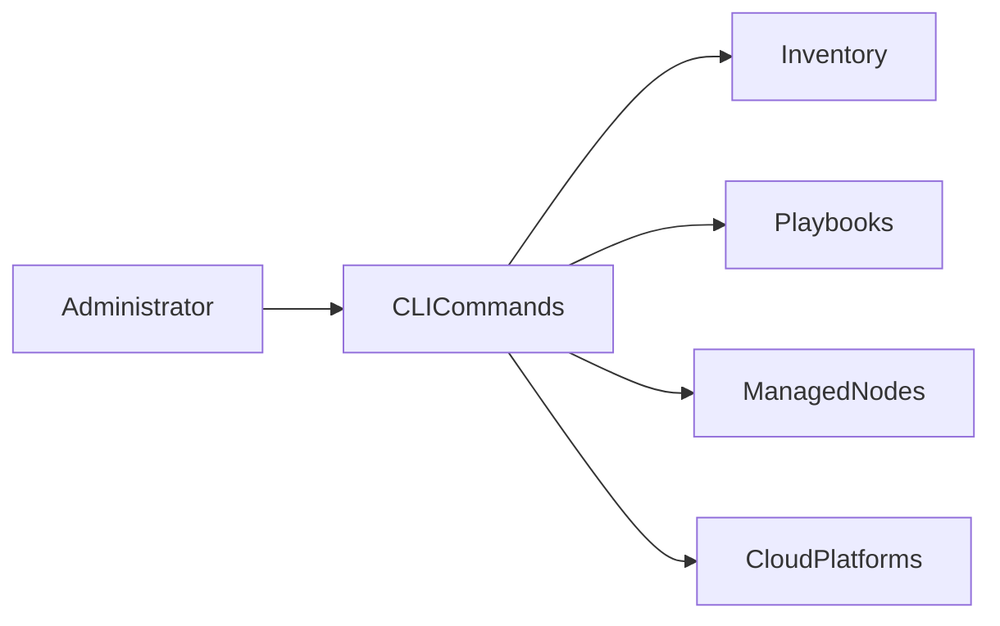

# Essential Ansible Commands

## Overview

Ansible provides several command-line tools (CLI) for managing infrastructure, running automation, working with inventories, securing sensitive data, installing reusable content, and accessing module documentation.

The most important commands every DevOps Engineer should know are:

- `ansible`
- `ansible-playbook`
- `ansible-inventory`
- `ansible-galaxy`
- `ansible-vault`
- `ansible-doc`

> **Interview Tip**
>
> These commands are asked in almost every Ansible interview. Be prepared to explain **when each command is used**, not just its syntax.

---

## Why It Is Used

These commands help to:

- Manage infrastructure
- Execute automation
- Verify inventories
- Install reusable roles and collections
- Encrypt sensitive information
- Access built-in documentation

---

## Architecture / Working



---

## Key Components

| Command | Purpose |
|----------|---------|
| ansible | Run ad-hoc commands |
| ansible-playbook | Execute Playbooks |
| ansible-inventory | Manage inventory |
| ansible-galaxy | Install roles and collections |
| ansible-vault | Encrypt sensitive data |
| ansible-doc | View documentation |

---

## Types (if applicable)

CLI Categories

- Infrastructure Management
- Playbook Execution
- Inventory Management
- Security
- Documentation
- Content Management

---

## Lifecycle / Workflow


---

## Configuration / Syntax (if applicable)

General Syntax

```bash
ansible <pattern> [options]

ansible-playbook playbook.yml

ansible-inventory [options]

ansible-galaxy [options]

ansible-vault [options]

ansible-doc [module]
```

---

## Important Commands (if applicable)

```bash
ansible --version

ansible-playbook site.yml

ansible-inventory --list

ansible-galaxy collection list

ansible-vault view secrets.yml

ansible-doc copy
```

---

## Important Files (if applicable)

| File | Purpose |
|------|---------|
| inventory | Target hosts |
| ansible.cfg | Configuration |
| playbook.yml | Automation |
| requirements.yml | Galaxy collections |
| vault.yml | Encrypted variables |

---

## Real-World Use Cases

- Configure servers
- Deploy applications
- Install software
- Manage inventories
- Secure credentials
- Install reusable roles
- View module documentation

---

## Advantages

- Simple CLI
- Agentless automation
- Easy troubleshooting
- Rich documentation
- Secure secret management

---

## Limitations

- Requires SSH connectivity
- Commands depend on proper inventory configuration
- Vault passwords must be managed securely

---

## Common Interview Questions (Concept Only)

- What are the essential Ansible CLI commands?
- Which command executes Playbooks?
- Which command encrypts sensitive data?
- Which command displays module documentation?
- How do you verify an inventory?

---

## Common Mistakes

- Executing Playbooks with incorrect inventory
- Forgetting Vault passwords
- Using outdated collections
- Running commands without testing connectivity

---

## Troubleshooting

| Problem | Cause | Solution |
|----------|--------|----------|
| Host unreachable | Inventory or SSH issue | Verify connectivity |
| Module not found | Missing collection | Install required collection |
| Vault decryption failed | Wrong password | Verify Vault password |

Useful Commands

```bash
ansible --version

ansible all -m ping

ansible-playbook site.yml --syntax-check
```

---

## Summary

The Ansible CLI provides powerful tools for infrastructure automation, inventory management, security, and documentation. Mastering these commands is essential for production environments and technical interviews.

---

# ansible

## Overview

The `ansible` command executes **ad-hoc commands** directly on managed hosts without requiring a Playbook.

It is primarily used for quick administrative tasks and testing.

> **Interview Tip**
>
> Use `ansible` for one-time operations and `ansible-playbook` for repeatable automation.

---

## Why It Is Used

The `ansible` command helps to:

- Test connectivity
- Execute Linux commands
- Install packages
- Restart services
- Gather information

---

## Architecture / Working


---

## Key Components

| Component | Purpose |
|-----------|---------|
| Inventory | Target hosts |
| Module | Performs operation |
| Pattern | Selects hosts |

---

## Types (if applicable)

Common Modules

- ping
- command
- shell
- copy
- service

---

## Lifecycle / Workflow


---

## Configuration / Syntax (if applicable)

General Syntax

```bash
ansible <host-pattern> -m <module> -a "<arguments>"
```

Examples

```bash
ansible all -m ping

ansible web -m command -a "uptime"

ansible all -m service -a "name=nginx state=restarted"
```

---

## Important Commands (if applicable)

```bash
ansible all -m ping

ansible web -m command -a "hostname"

ansible db -m shell -a "df -h"
```

---

## Important Files (if applicable)

| File | Purpose |
|------|---------|
| inventory | Host definitions |
| ansible.cfg | CLI configuration |

---

## Real-World Use Cases

- Check server availability
- Restart services
- Install packages
- Verify disk usage
- Execute maintenance commands

---

## Advantages

- Fast execution
- No Playbook required
- Ideal for quick administration

---

## Limitations

- Not reusable
- Difficult to manage complex automation
- Limited orchestration

---

## Common Interview Questions (Concept Only)

- What is the `ansible` command?
- What are ad-hoc commands?
- When should `ansible` be used instead of `ansible-playbook`?

---

## Common Mistakes

- Using ad-hoc commands for complex automation
- Forgetting inventory specification
- Using the wrong module

---

## Troubleshooting

```bash
ansible all -m ping

ansible --version
```

---

## Summary

The `ansible` command executes ad-hoc tasks for quick server administration and troubleshooting.

---

# ansible-playbook

## Overview

The `ansible-playbook` command executes YAML Playbooks containing one or more automation tasks.

It is the primary command used for infrastructure automation and application deployment.

> **Interview Tip**
>
> Almost all production automation is executed using `ansible-playbook`.

---

## Why It Is Used

- Execute Playbooks
- Deploy applications
- Configure servers
- Automate infrastructure
- Maintain desired state

---

## Architecture / Working


---

## Key Components

| Component | Purpose |
|-----------|---------|
| Playbook | Automation definition |
| Inventory | Target hosts |
| Modules | Perform tasks |

---

## Types (if applicable)

Execution Modes

- Normal execution
- Check mode
- Verbose mode

---

## Lifecycle / Workflow


---

## Configuration / Syntax (if applicable)

```bash
ansible-playbook site.yml

ansible-playbook site.yml -i inventory

ansible-playbook site.yml --check

ansible-playbook site.yml -v
```

---

## Important Commands (if applicable)

```bash
ansible-playbook site.yml

ansible-playbook site.yml --syntax-check

ansible-playbook site.yml --check

ansible-playbook site.yml -v
```

---

## Important Files (if applicable)

| File | Purpose |
|------|---------|
| playbook.yml | Automation |
| inventory | Hosts |

---

## Real-World Use Cases

- Application deployment
- Configuration management
- Patch management
- Cloud provisioning

---

## Advantages

- Repeatable automation
- Idempotent
- Easy to maintain

---

## Limitations

- Requires properly written Playbooks
- Complex Playbooks need testing

---

## Common Interview Questions (Concept Only)

- What is `ansible-playbook`?
- Difference between `ansible` and `ansible-playbook`?
- What does `--check` do?

---

## Common Mistakes

- Running without syntax validation
- Incorrect inventory
- Ignoring verbose logs

---

## Troubleshooting

```bash
ansible-playbook site.yml --syntax-check

ansible-playbook site.yml -v
```

---

## Summary

`ansible-playbook` executes Playbooks and is the primary command used for production automation.

---

# ansible-inventory

## Overview

The `ansible-inventory` command displays, validates, and analyzes inventory information.

It helps verify that hosts, groups, and variables are loaded correctly.

---

## Why It Is Used

- Validate inventories
- Display host groups
- Debug inventory issues
- Verify dynamic inventory

---

## Architecture / Working


---

## Key Components

| Component | Purpose |
|-----------|---------|
| Inventory | Host definitions |
| Groups | Host organization |
| Variables | Inventory variables |

---

## Types (if applicable)

Inventory Types

- Static
- Dynamic

---

## Lifecycle / Workflow


---

## Configuration / Syntax (if applicable)

```bash
ansible-inventory --list

ansible-inventory --graph

ansible-inventory --host web01
```

---

## Important Commands (if applicable)

```bash
ansible-inventory --list

ansible-inventory --graph
```

---

## Important Files (if applicable)

inventory

---

## Real-World Use Cases

- Verify inventory
- Debug host groups
- Validate dynamic inventory

---

## Advantages

- Easy troubleshooting
- Inventory validation
- Supports dynamic inventories

---

## Limitations

- Read-only utility
- Requires valid inventory

---

## Common Interview Questions (Concept Only)

- What does `ansible-inventory` do?
- Difference between `--list` and `--graph`?

---

## Common Mistakes

- Invalid inventory syntax
- Missing hosts

---

## Troubleshooting

```bash
ansible-inventory --graph
```

---

## Summary

`ansible-inventory` validates and displays inventory information for troubleshooting and verification.

---

# ansible-galaxy

## Overview

The `ansible-galaxy` command installs and manages reusable Ansible content such as **roles** and **collections**.

---

## Why It Is Used

- Install roles
- Install collections
- Share automation
- Reuse community content

---

## Architecture / Working


---

## Key Components

| Component | Purpose |
|-----------|---------|
| Role | Reusable automation |
| Collection | Modules, plugins, roles |

---

## Types (if applicable)

Galaxy Content

- Roles
- Collections

---

## Lifecycle / Workflow


---

## Configuration / Syntax (if applicable)

```bash
ansible-galaxy collection install amazon.aws

ansible-galaxy role install geerlingguy.nginx
```

---

## Important Commands (if applicable)

```bash
ansible-galaxy collection list

ansible-galaxy role list
```

---

## Important Files (if applicable)

requirements.yml

---

## Real-World Use Cases

- Install Azure modules
- Install Kubernetes modules
- Install reusable roles

---

## Advantages

- Large ecosystem
- Easy reuse
- Community support

---

## Limitations

- Internet access required
- Version compatibility must be managed

---

## Common Interview Questions (Concept Only)

- What is Ansible Galaxy?
- Difference between roles and collections?
- How do you install a collection?

---

## Common Mistakes

- Installing incorrect versions
- Missing dependencies

---

## Troubleshooting

```bash
ansible-galaxy collection list
```

---

## Summary

`ansible-galaxy` manages reusable automation content, including roles and collections.

---

# ansible-vault

## Overview

The `ansible-vault` command encrypts sensitive information such as passwords, API keys, SSH keys, and cloud credentials.

It ensures secrets are stored securely in version control.

---

## Why It Is Used

- Encrypt credentials
- Protect secrets
- Secure configuration
- Meet compliance requirements

---

## Architecture / Working


---

## Key Components

| Component | Purpose |
|-----------|---------|
| Vault | Encryption utility |
| Vault Password | Decryption key |
| Encrypted File | Protected content |

---

## Types (if applicable)

Vault Operations

- Create
- Encrypt
- Edit
- View
- Decrypt

---

## Lifecycle / Workflow


---

## Configuration / Syntax (if applicable)

```bash
ansible-vault create secrets.yml

ansible-vault edit secrets.yml

ansible-vault view secrets.yml
```

---

## Important Commands (if applicable)

```bash
ansible-vault encrypt secrets.yml

ansible-vault decrypt secrets.yml

ansible-vault edit secrets.yml
```

---

## Important Files (if applicable)

vault.yml

---

## Real-World Use Cases

- Store database passwords
- Store Azure credentials
- Store AWS secrets
- Secure API keys

---

## Advantages

- Strong encryption
- Git-friendly
- Built into Ansible

---

## Limitations

- Vault password management required
- Lost password means data cannot be recovered

---

## Common Interview Questions (Concept Only)

- What is Ansible Vault?
- Why use Vault?
- Can encrypted files be committed to Git?

---

## Common Mistakes

- Losing Vault password
- Storing secrets unencrypted
- Sharing Vault password insecurely

---

## Troubleshooting

```bash
ansible-vault view secrets.yml
```

---

## Summary

`ansible-vault` securely encrypts sensitive information used by Ansible Playbooks.

---

# ansible-doc

## Overview

The `ansible-doc` command displays built-in documentation for Ansible modules, plugins, and collections.

It is the fastest way to learn module parameters and examples directly from the command line.

> **Interview Tip**
>
> Experienced DevOps engineers frequently use `ansible-doc` instead of searching online because it provides version-specific documentation installed with Ansible.

---

## Why It Is Used

- View module documentation
- Learn module parameters
- View examples
- Verify supported options

---

## Architecture / Working


---

## Key Components

| Component | Purpose |
|-----------|---------|
| Module | Documentation source |
| Examples | Usage examples |
| Parameters | Supported options |

---

## Types (if applicable)

Documentation Types

- Modules
- Plugins
- Collections

---

## Lifecycle / Workflow


---

## Configuration / Syntax (if applicable)

```bash
ansible-doc copy

ansible-doc service

ansible-doc apt
```

---

## Important Commands (if applicable)

```bash
ansible-doc copy

ansible-doc shell

ansible-doc service

ansible-doc -l
```

---

## Important Files (if applicable)

None

---

## Real-World Use Cases

- Learn new modules
- Verify parameters
- Troubleshoot module usage
- Explore installed collections

---

## Advantages

- Offline documentation
- Version-specific information
- Includes examples
- Fast access

---

## Limitations

- Only documents installed content
- Does not provide infrastructure design guidance

---

## Common Interview Questions (Concept Only)

- What is `ansible-doc`?
- How do you view module documentation?
- How do you list available modules?

---

## Common Mistakes

- Searching for incorrect module names
- Assuming documentation matches a different Ansible version

---

## Troubleshooting

```bash
ansible-doc -l

ansible-doc copy
```

---

## Summary

`ansible-doc` provides built-in documentation for Ansible modules, plugins, and collections, making it an essential tool for learning, troubleshooting, and validating module usage.
