# PromQL

## Overview

PromQL (Prometheus Query Language) is the powerful query language used to retrieve, filter, aggregate, and analyze metrics stored in the Prometheus Time-Series Database (TSDB).

PromQL enables you to:

- View current metric values
- Analyze historical trends
- Calculate rates
- Aggregate metrics
- Filter metrics using labels
- Create Grafana dashboards
- Define alerting rules

PromQL is one of the **most frequently asked topics** in Prometheus interviews because almost every dashboard and alert depends on it.

> **Interview Tip**
>
> Remember the four building blocks of PromQL:
>
> - Metric Name
> - Labels (Selectors)
> - Functions
> - Operators

---

## Why It Is Used

PromQL is used to:

- Retrieve metrics
- Monitor application performance
- Calculate request rates
- Aggregate metrics across servers
- Filter metrics by labels
- Build dashboards
- Trigger alerts

---

## Architecture / Working

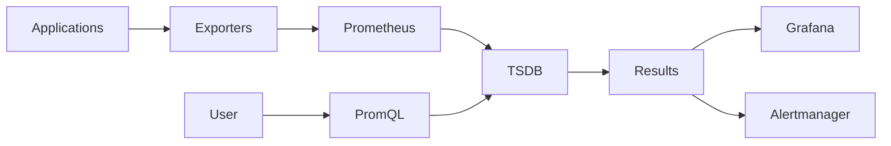

### Working Process

1. Metrics are collected by Prometheus.
2. Metrics are stored in TSDB.
3. PromQL queries retrieve metric data.
4. Results are displayed in Grafana or evaluated by Alertmanager.

---

## Key Components

| Component | Purpose |
|-----------|---------|
| Metric Name | Identifies the metric |
| Labels | Filter metrics |
| Selectors | Select matching time series |
| Functions | Calculate values |
| Operators | Perform calculations |
| Aggregations | Combine multiple metrics |

---

## Types (if applicable)

PromQL Queries

| Query Type | Purpose |
|------------|----------|
| Instant Query | Current value |
| Range Query | Historical values |

---

## Lifecycle / Workflow

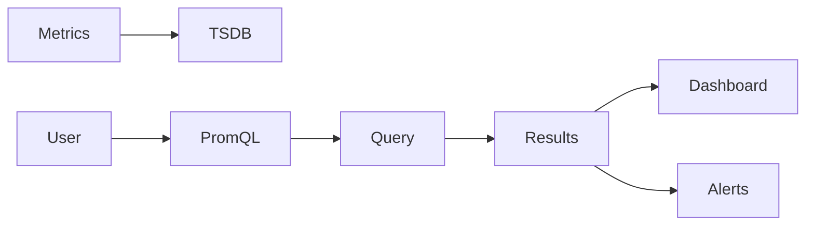

---

## Configuration / Syntax (if applicable)

Basic Query

```promql
up
```

Metric with Labels

```promql
up{job="node-exporter"}
```

Range Vector

```promql
up[5m]
```

---

## Important Commands (if applicable)

Prometheus Query UI

```
http://localhost:9090/graph
```

API Query

```bash
curl "http://localhost:9090/api/v1/query?query=up"
```

---

## Important Files (if applicable)

| File | Purpose |
|------|----------|
| prometheus.yml | Metric collection |
| alert.rules.yml | Alert expressions using PromQL |

---

## Real-World Use Cases

- CPU monitoring
- Memory monitoring
- Request rate calculation
- Error rate monitoring
- Kubernetes monitoring
- Alert rule creation

---

## Advantages

- Powerful querying
- Flexible filtering
- Rich aggregation functions
- Supports alerting
- Grafana integration

---

## Limitations

- Requires PromQL knowledge
- Complex expressions can affect performance
- High-cardinality queries may be expensive

---

## Common Interview Questions (Concept Only)

- What is PromQL?
- Why is PromQL used?
- What are the two query types?
- What are label selectors?
- What is the difference between rate() and increase()?
- Which functions are commonly used?

---

## Common Mistakes

- Forgetting label selectors
- Using Counter values directly instead of rate()
- Confusing Instant and Range queries
- Writing expensive high-cardinality queries

---

## Troubleshooting

| Problem | Cause | Solution |
|----------|--------|----------|
| No results | Wrong metric name | Verify metric |
| Empty query | Wrong labels | Check labels |
| Slow query | High-cardinality metrics | Optimize query |
| Incorrect rate | Using Gauge instead of Counter | Verify metric type |

Useful Commands

```bash
curl "http://localhost:9090/api/v1/query?query=up"
```

---

## Summary

PromQL is the query language used to retrieve, filter, aggregate, and analyze Prometheus metrics. It is fundamental for dashboards, alerting, and monitoring in production environments.

---

# Instant Queries

## Overview

An Instant Query returns the **current value** of one or more metrics at a single point in time.

It answers questions such as:

- What is the CPU usage now?
- Is the server up?
- How much memory is currently used?

> **Interview Tip**
>
> Instant Queries return an **Instant Vector**, representing the latest sample for each matching time series.

---

## Why It Is Used

Instant Queries are used to:

- Check current system health
- Display live dashboards
- Validate exporters
- Troubleshoot issues

---

## Architecture / Working

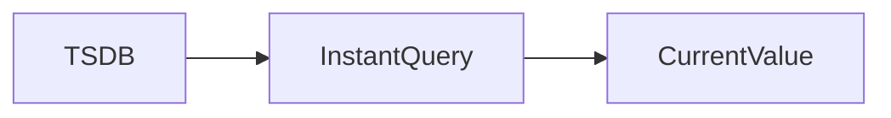

---

## Key Components

| Component | Purpose |
|-----------|---------|
| Metric | Current measurement |
| Timestamp | Latest sample |
| Labels | Identify series |

---

## Types (if applicable)

Examples

- `up`
- `node_memory_MemAvailable_bytes`
- `cpu_usage_percent`

---

## Lifecycle / Workflow

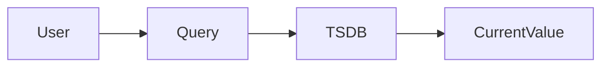

---

## Configuration / Syntax (if applicable)

```promql
up
```

```promql
node_memory_MemAvailable_bytes
```

---

## Important Commands (if applicable)

Prometheus Graph

```
http://localhost:9090/graph
```

---

## Important Files (if applicable)

None

---

## Real-World Use Cases

- Verify server availability
- Display current CPU usage
- Check active Pods

---

## Advantages

- Fast
- Simple
- Low resource usage

---

## Limitations

- No historical analysis

---

## Common Interview Questions (Concept Only)

- What is an Instant Query?
- What does it return?
- When should Instant Queries be used?

---

## Common Mistakes

- Using Instant Queries for trend analysis
- Expecting historical data

---

## Troubleshooting

- Verify metric name
- Check exporter

---

## Summary

Instant Queries return the latest value of a metric and are primarily used for real-time monitoring.

---

# Range Queries

## Overview

A Range Query retrieves metric values over a specified time period instead of returning only the latest value.

Range Queries are used for:

- Historical analysis
- Trend visualization
- Rate calculations
- Dashboard graphs

> **Interview Tip**
>
> Range Queries return a **Range Vector**, which contains multiple samples collected over time.

---

## Why It Is Used

Range Queries help analyze:

- CPU trends
- Memory trends
- Request rates
- Error trends
- Network traffic

---

## Architecture / Working

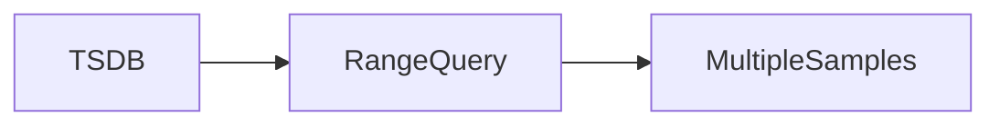

---

## Key Components

| Component | Purpose |
|-----------|---------|
| Range Vector | Historical samples |
| Time Window | Query duration |

---

## Types (if applicable)

Examples

- `[5m]`
- `[15m]`
- `[1h]`
- `[24h]`

---

## Lifecycle / Workflow

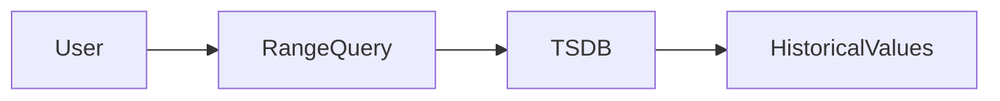

---

## Configuration / Syntax (if applicable)

```promql
up[5m]
```

```promql
rate(http_requests_total[5m])
```

---

## Important Commands (if applicable)

Prometheus Graph UI

---

## Important Files (if applicable)

None

---

## Real-World Use Cases

- CPU trend graphs
- Request rate charts
- Capacity planning

---

## Advantages

- Historical analysis
- Supports functions like `rate()`

---

## Limitations

- Larger queries consume more resources

---

## Common Interview Questions (Concept Only)

- What is a Range Query?
- Difference between Instant and Range Query?

---

## Common Mistakes

- Forgetting the range selector
- Using large time windows unnecessarily

---

## Troubleshooting

- Reduce query duration
- Optimize labels

---

## Summary

Range Queries return historical metric values over a specified time window and are essential for trend analysis and dashboard visualization.

---

# Selectors

## Overview

Selectors filter metrics based on their labels.

They allow PromQL to retrieve only the metrics that match specified conditions.

> **Interview Tip**
>
> Labels are one of Prometheus's most powerful features, and selectors are how you query them.

---

## Why It Is Used

Selectors help:

- Filter environments
- Select specific servers
- Group applications
- Query Kubernetes namespaces

---

## Architecture / Working

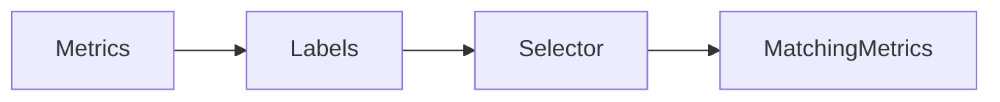

---

## Key Components

| Selector | Purpose |
|-----------|---------|
| `=` | Equal |
| `!=` | Not Equal |
| `=~` | Regex Match |
| `!~` | Regex Not Match |

---

## Types (if applicable)

Examples

Exact Match

```promql
up{job="node-exporter"}
```

Not Equal

```promql
up{job!="mysql"}
```

Regex

```promql
up{job=~"node.*"}
```

---

## Lifecycle / Workflow

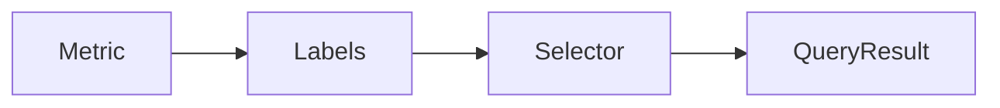

---

## Configuration / Syntax (if applicable)

```promql
node_cpu_seconds_total{instance="server1"}
```

---

## Important Commands (if applicable)

PromQL examples

---

## Important Files (if applicable)

None

---

## Real-World Use Cases

- Filter production servers
- Monitor specific clusters
- Query namespaces

---

## Advantages

- Flexible filtering
- Regex support
- Efficient querying

---

## Limitations

- Incorrect labels return no data

---

## Common Interview Questions (Concept Only)

- What are label selectors?
- Difference between `=` and `=~`?

---

## Common Mistakes

- Wrong label names
- Case-sensitive mismatches

---

## Troubleshooting

- Verify labels
- Use Prometheus expression browser

---

## Summary

Selectors filter metrics using labels, allowing precise and flexible PromQL queries.

---

# Aggregation Functions

## Overview

Aggregation functions combine multiple time series into summarized results.

They are used to calculate totals, averages, minimums, maximums, and counts across multiple metrics.

> **Interview Tip**
>
> Aggregation functions are frequently combined with `by()` and `without()` clauses.

---

## Why It Is Used

Aggregation is used for:

- Cluster-wide CPU usage
- Average memory usage
- Total requests
- Maximum latency

---

## Architecture / Working

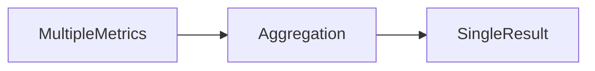

---

## Key Components

| Function | Purpose |
|----------|----------|
| sum() | Total |
| avg() | Average |
| max() | Maximum |
| min() | Minimum |
| count() | Count |
| topk() | Top values |
| bottomk() | Lowest values |

---

## Types (if applicable)

Common Examples

```promql
sum(node_memory_MemAvailable_bytes)
```

```promql
avg(cpu_usage_percent)
```

```promql
sum by(instance)(rate(http_requests_total[5m]))
```

---

## Lifecycle / Workflow

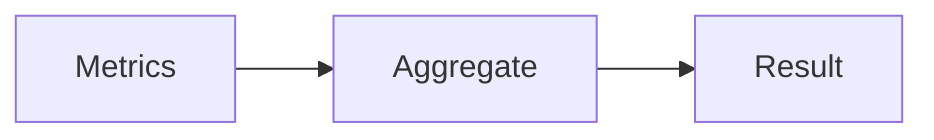

---

## Configuration / Syntax (if applicable)

```promql
sum(rate(http_requests_total[5m]))
```

---

## Important Commands (if applicable)

PromQL only

---

## Important Files (if applicable)

None

---

## Real-World Use Cases

- Cluster CPU
- Region-wide memory
- Total requests

---

## Advantages

- Simplifies dashboards
- Cluster-wide analysis

---

## Limitations

- Can hide individual host issues

---

## Common Interview Questions (Concept Only)

- What is `sum()`?
- What is `avg()`?
- Difference between `by()` and `without()`?

---

## Common Mistakes

- Forgetting grouping labels
- Aggregating incompatible metrics

---

## Troubleshooting

- Verify aggregation labels
- Check query output

---

## Summary

Aggregation functions summarize multiple time series into meaningful values for dashboards, alerts, and reporting.

---

# Rate Functions

## Overview

Rate functions calculate how quickly **Counter** metrics increase over time.

Since Counters continuously increase, raw values are often less useful than their rate of change.

> **Interview Tip**
>
> Always use `rate()` or `increase()` with **Counter** metrics. Never use them with Gauges.

---

## Why It Is Used

Rate functions help measure:

- Requests per second
- Errors per minute
- Packet transmission rates
- Transaction throughput

---

## Architecture / Working

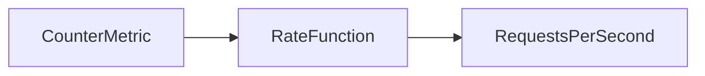

---

## Key Components

| Function | Purpose |
|-----------|---------|
| rate() | Average per-second rate |
| irate() | Instantaneous rate |
| increase() | Total increase over a period |

---

## Types (if applicable)

Examples

```promql
rate(http_requests_total[5m])
```

```promql
increase(http_requests_total[1h])
```

```promql
irate(http_requests_total[5m])
```

---

## Lifecycle / Workflow

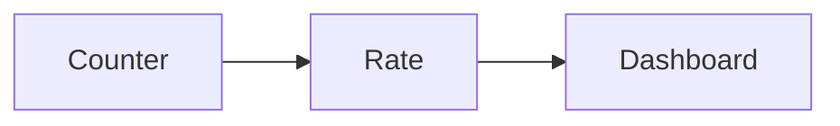

---

## Configuration / Syntax (if applicable)

```promql
rate(http_requests_total[5m])
```

---

## Important Commands (if applicable)

PromQL only

---

## Important Files (if applicable)

None

---

## Real-World Use Cases

- API requests/sec
- Error rate
- Network traffic

---

## Advantages

- Accurate trend analysis
- Handles counter resets
- Essential for monitoring traffic

---

## Limitations

- Works only with Counters
- Requires range vectors

---

## Common Interview Questions (Concept Only)

- What is `rate()`?
- Difference between `rate()` and `irate()`?
- When should `increase()` be used?

---

## Common Mistakes

- Using `rate()` with Gauges
- Using raw Counter values

---

## Troubleshooting

- Verify metric type
- Use an appropriate time range

---

## Summary

Rate functions calculate the rate of change for Counter metrics and are essential for monitoring traffic, requests, and error rates.

---

# Filtering

## Overview

Filtering narrows query results by selecting only the time series that match specific label conditions.

Filtering enables precise monitoring in environments with many servers, applications, or Kubernetes resources.

> **Interview Tip**
>
> Filtering is implemented using **label selectors**, and can be combined with aggregation and rate functions for powerful queries.

---

## Why It Is Used

Filtering is used to:

- Select production environments
- Monitor specific applications
- Query Kubernetes namespaces
- Isolate individual servers
- Exclude unwanted metrics

---

## Architecture / Working

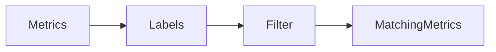

---

## Key Components

| Operator | Purpose |
|-----------|---------|
| `=` | Equal |
| `!=` | Not Equal |
| `=~` | Regex Match |
| `!~` | Regex Not Match |

---

## Types (if applicable)

Examples

```promql
up{job="node-exporter"}
```

```promql
up{environment="production"}
```

```promql
up{instance=~"server.*"}
```

---

## Lifecycle / Workflow

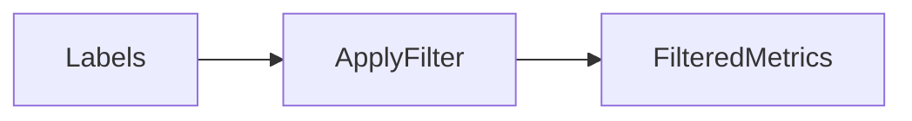

---

## Configuration / Syntax (if applicable)

```promql
rate(http_requests_total{job="api"}[5m])
```

---

## Important Commands (if applicable)

PromQL only

---

## Important Files (if applicable)

None

---

## Real-World Use Cases

- Production-only monitoring
- Kubernetes namespace filtering
- Region-specific dashboards
- Application-specific alerts

---

## Advantages

- Precise queries
- Better dashboard organization
- Improved alert accuracy

---

## Limitations

- Depends on consistent labeling
- Incorrect labels produce empty results

---

## Common Interview Questions (Concept Only)

- How does filtering work in PromQL?
- What are label selectors?
- How do regex selectors work?
- Why are labels important for filtering?

---

## Common Mistakes

- Incorrect label names
- Case-sensitive mismatches
- Overusing regex selectors
- Inconsistent labeling across environments

---

## Troubleshooting

| Problem | Cause | Solution |
|----------|--------|----------|
| Empty query result | Wrong label | Verify label names and values |
| Too many results | Broad selector | Add additional label filters |
| Slow query | Expensive regex | Simplify selectors |

Useful Commands

```promql
up

up{job="node-exporter"}

rate(http_requests_total{environment="production"}[5m])
```

---

## Summary

Filtering uses label selectors to retrieve only the required time series, making PromQL queries more precise, efficient, and suitable for dashboards, alerting, and large-scale production environments.
