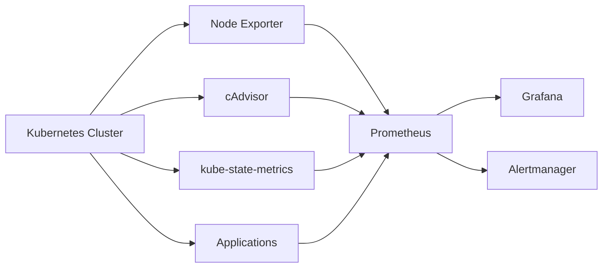
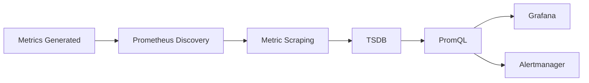
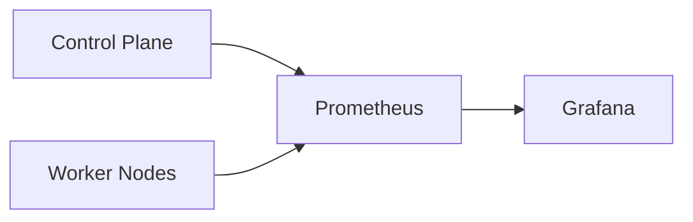
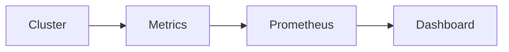
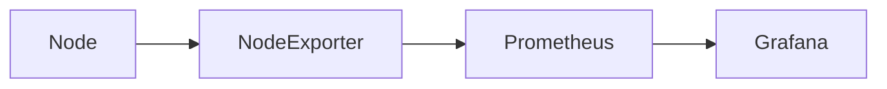
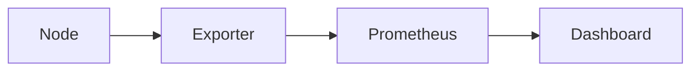
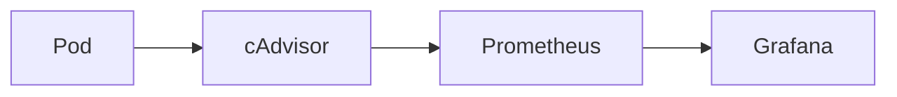
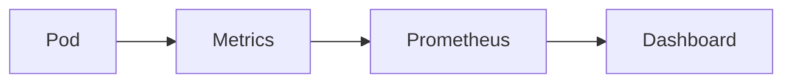
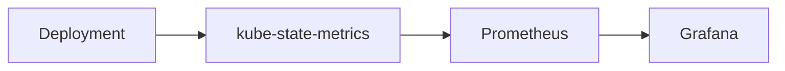
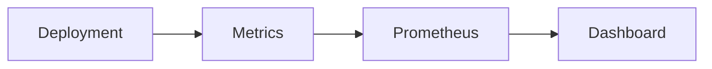

# Kubernetes Monitoring

## Overview

Kubernetes Monitoring is the process of continuously collecting, storing, visualizing, and alerting on metrics from Kubernetes clusters, nodes, pods, containers, and workloads.

Prometheus is the **de facto standard** monitoring solution for Kubernetes because it integrates natively with Kubernetes service discovery and automatically discovers monitoring targets.

A typical Kubernetes monitoring stack includes:

- Prometheus
- kube-state-metrics
- Node Exporter
- cAdvisor
- Grafana
- Alertmanager

> **Interview Tip**
>
> In Kubernetes, Prometheus typically collects metrics from:
>
> - Kubernetes API Server
> - kubelet
> - cAdvisor
> - Node Exporter
> - kube-state-metrics
> - Applications exposing `/metrics`

---

## Why It Is Used

Kubernetes monitoring helps to:

- Monitor cluster health
- Detect node failures
- Monitor Pods and Deployments
- Track resource utilization
- Identify performance bottlenecks
- Trigger alerts
- Support capacity planning

---

## Architecture / Working



### Working Process

1. Kubernetes components expose metrics.
2. Prometheus discovers targets using Kubernetes Service Discovery.
3. Metrics are scraped and stored in TSDB.
4. Grafana visualizes the metrics.
5. Alertmanager sends notifications when alert rules are triggered.

---

## Key Components

| Component | Purpose |
|-----------|---------|
| Prometheus | Collects and stores metrics |
| Grafana | Visualization |
| Alertmanager | Alert notifications |
| Node Exporter | Node metrics |
| cAdvisor | Container metrics |
| kube-state-metrics | Kubernetes object metrics |
| Kubernetes Service Discovery | Automatically discovers monitoring targets |

---

## Types (if applicable)

Common Monitoring Categories

| Category | Examples |
|-----------|-----------|
| Cluster | API Server, Scheduler |
| Nodes | CPU, Memory, Disk |
| Pods | Restarts, Status |
| Containers | CPU, Memory |
| Deployments | Replicas |
| Networking | Traffic, Errors |

---

## Lifecycle / Workflow



---

## Configuration / Syntax (if applicable)

Example Query

```promql
up
```

Node CPU

```promql
rate(node_cpu_seconds_total[5m])
```

Pod Count

```promql
count(kube_pod_info)
```

---

## Important Commands (if applicable)

Check Targets

```
http://localhost:9090/targets
```

Check Alerts

```
http://localhost:9090/alerts
```

PromQL UI

```
http://localhost:9090/graph
```

---

## Important Files (if applicable)

| File | Purpose |
|------|----------|
| prometheus.yml | Prometheus configuration |
| alert.rules.yml | Alert rules |
| alertmanager.yml | Alertmanager configuration |

---

## Real-World Use Cases

- Kubernetes production monitoring
- Capacity planning
- Pod failure detection
- Cluster health dashboards
- Resource optimization
- SLA/SLO monitoring

---

## Advantages

- Native Kubernetes integration
- Automatic service discovery
- Rich PromQL support
- Powerful dashboards
- Scalable monitoring

---

## Limitations

- Large clusters require more storage
- High-cardinality metrics increase resource usage
- Requires multiple exporters

---

## Common Interview Questions (Concept Only)

- Why is Prometheus widely used for Kubernetes?
- Which components expose Kubernetes metrics?
- What is kube-state-metrics?
- What is cAdvisor?
- How does Prometheus discover Kubernetes targets?

---

## Common Mistakes

- Monitoring only nodes
- Ignoring kube-state-metrics
- High-cardinality metrics
- Missing alert rules

---

## Troubleshooting

| Problem | Cause | Solution |
|----------|--------|----------|
| Missing Kubernetes metrics | Exporter unavailable | Verify exporter Pods |
| Targets Down | Service Discovery issue | Check Prometheus targets |
| Missing dashboards | Wrong PromQL | Validate queries |
| Missing alerts | Alert rules not loaded | Reload Prometheus |

Useful Commands

```bash
kubectl get pods -A

kubectl get svc -A

kubectl get endpoints -A
```

---

## Summary

Prometheus provides comprehensive Kubernetes monitoring by collecting metrics from cluster components, nodes, containers, workloads, and applications, enabling visualization, alerting, and performance analysis.

---

# Monitor Kubernetes Cluster

## Overview

Cluster monitoring focuses on the overall health and availability of the Kubernetes control plane and worker nodes.

It ensures that the cluster itself is functioning correctly.

> **Interview Tip**
>
> Cluster monitoring answers the question:
>
> **"Is my Kubernetes cluster healthy?"**

---

## Why It Is Used

Cluster monitoring helps detect:

- Control Plane failures
- API Server issues
- Scheduler failures
- Node failures
- Resource shortages

---

## Architecture / Working



---

## Key Components

| Component | Purpose |
|-----------|---------|
| API Server | Cluster API |
| Scheduler | Pod scheduling |
| Controller Manager | Cluster controllers |
| etcd | Cluster state |
| Worker Nodes | Application execution |

---

## Types (if applicable)

Cluster Metrics

- API availability
- Scheduler latency
- Node availability
- Resource utilization

---

## Lifecycle / Workflow



---

## Configuration / Syntax (if applicable)

API Server Availability

```promql
up{job="apiserver"}
```

---

## Important Commands (if applicable)

```bash
kubectl cluster-info

kubectl get componentstatuses
```

---

## Important Files (if applicable)

prometheus.yml

---

## Real-World Use Cases

- Control Plane monitoring
- Production health checks
- Cluster availability

---

## Advantages

- Early failure detection
- Improved reliability

---

## Limitations

- Requires multiple exporters

---

## Common Interview Questions (Concept Only)

- What should be monitored in a Kubernetes cluster?
- Which Control Plane components expose metrics?

---

## Common Mistakes

- Ignoring Control Plane metrics

---

## Troubleshooting

- Verify API Server
- Check Prometheus targets

---

## Summary

Cluster monitoring ensures Kubernetes control plane and worker node health, providing visibility into the overall platform.

---

# Monitor Nodes

## Overview

Node monitoring focuses on the physical or virtual machines that run Kubernetes workloads.

Node metrics are typically collected using **Node Exporter**.

> **Interview Tip**
>
> **Node Exporter monitors the operating system, not Kubernetes objects.**

---

## Why It Is Used

Node monitoring helps detect:

- CPU saturation
- Memory exhaustion
- Disk usage
- Network problems
- Node failures

---

## Architecture / Working



---

## Key Components

| Component | Purpose |
|-----------|---------|
| Node Exporter | OS metrics |
| Prometheus | Metric collection |
| Grafana | Visualization |

---

## Types (if applicable)

Node Metrics

- CPU
- Memory
- Disk
- Network
- Filesystem

---

## Lifecycle / Workflow



---

## Configuration / Syntax (if applicable)

CPU

```promql
rate(node_cpu_seconds_total[5m])
```

Memory

```promql
node_memory_MemAvailable_bytes
```

---

## Important Commands (if applicable)

```bash
kubectl top nodes
```

---

## Important Files (if applicable)

None

---

## Real-World Use Cases

- CPU monitoring
- Memory monitoring
- Capacity planning

---

## Advantages

- Infrastructure visibility
- OS-level monitoring

---

## Limitations

- Does not monitor Pods

---

## Common Interview Questions (Concept Only)

- What is Node Exporter?
- Which metrics does it expose?

---

## Common Mistakes

- Confusing Node Exporter with kube-state-metrics

---

## Troubleshooting

- Verify Node Exporter Pods
- Check scrape targets

---

## Summary

Node monitoring focuses on infrastructure health by collecting operating system metrics from Kubernetes worker nodes.

---

# Monitor Pods

## Overview

Pod monitoring tracks the health and resource usage of Kubernetes Pods.

Prometheus collects Pod metrics using:

- kubelet
- cAdvisor
- kube-state-metrics
- Application exporters

---

## Why It Is Used

Pod monitoring helps identify:

- Crashes
- Restarts
- CPU usage
- Memory usage
- Container failures

---

## Architecture / Working



---

## Key Components

| Component | Purpose |
|-----------|---------|
| Pod | Application |
| cAdvisor | Container metrics |
| kube-state-metrics | Pod status |

---

## Types (if applicable)

Pod Metrics

- Running Pods
- Pending Pods
- Restart Count
- CPU
- Memory

---

## Lifecycle / Workflow



---

## Configuration / Syntax (if applicable)

Pod Count

```promql
count(kube_pod_info)
```

Running Pods

```promql
kube_pod_status_phase{phase="Running"}
```

---

## Important Commands (if applicable)

```bash
kubectl get pods

kubectl top pods
```

---

## Important Files (if applicable)

None

---

## Real-World Use Cases

- Detect Pod crashes
- Monitor resource usage
- Identify restart loops

---

## Advantages

- Application visibility
- Failure detection

---

## Limitations

- Requires exporters

---

## Common Interview Questions (Concept Only)

- How are Pod metrics collected?
- Which exporter provides Pod metrics?

---

## Common Mistakes

- Ignoring restart metrics

---

## Troubleshooting

- Verify kubelet metrics
- Check kube-state-metrics

---

## Summary

Pod monitoring provides visibility into application health, resource usage, and lifecycle events.

---

# Monitor Deployments

## Overview

Deployment monitoring tracks Kubernetes Deployments to ensure the desired number of application replicas are available and healthy.

Deployment metrics are provided mainly by **kube-state-metrics**.

> **Interview Tip**
>
> **Deployments are monitored through kube-state-metrics, not Node Exporter.**

---

## Why It Is Used

Deployment monitoring detects:

- Failed rollouts
- Replica shortages
- Unavailable Pods
- Scaling issues

---

## Architecture / Working



---

## Key Components

| Component | Purpose |
|-----------|---------|
| Deployment | Manages Pods |
| ReplicaSet | Desired replicas |
| kube-state-metrics | Deployment metrics |

---

## Types (if applicable)

Deployment Metrics

- Desired Replicas
- Available Replicas
- Updated Replicas
- Unavailable Replicas

---

## Lifecycle / Workflow



---

## Configuration / Syntax (if applicable)

Available Replicas

```promql
kube_deployment_status_replicas_available
```

Unavailable Replicas

```promql
kube_deployment_status_replicas_unavailable
```

Desired Replicas

```promql
kube_deployment_spec_replicas
```

---

## Important Commands (if applicable)

```bash
kubectl get deployments

kubectl rollout status deployment <deployment-name>
```

---

## Important Files (if applicable)

None

---

## Real-World Use Cases

- Monitor rolling updates
- Verify application availability
- Detect failed deployments
- Monitor scaling operations

---

## Advantages

- Tracks deployment health
- Detects rollout failures
- Supports production monitoring

---

## Limitations

- Depends on kube-state-metrics
- Does not provide application-level metrics

---

## Common Interview Questions (Concept Only)

- How are Deployment metrics collected?
- Which exporter provides Deployment metrics?
- Which metrics indicate Deployment health?
- How do you monitor rolling updates?

---

## Common Mistakes

- Confusing Deployment metrics with Pod metrics
- Ignoring unavailable replica counts
- Not monitoring rollout status

---

## Troubleshooting

| Problem | Cause | Solution |
|----------|--------|----------|
| Deployment metrics missing | kube-state-metrics unavailable | Verify kube-state-metrics Pod |
| Replica count incorrect | Deployment update in progress | Check rollout status |
| Dashboard empty | Wrong PromQL | Validate query in Prometheus |

Useful Commands

```bash
kubectl get deployments

kubectl describe deployment <deployment-name>

kubectl rollout status deployment <deployment-name>
```

---

## Summary

Deployment monitoring ensures Kubernetes applications maintain the desired number of healthy replicas, detects rollout failures, tracks scaling operations, and provides visibility into application availability using metrics from kube-state-metrics.
