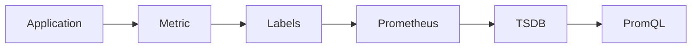
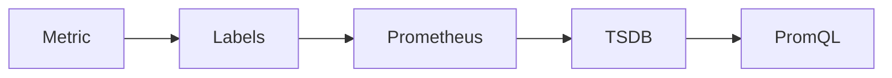
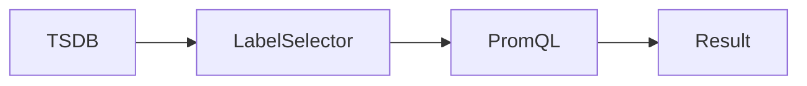
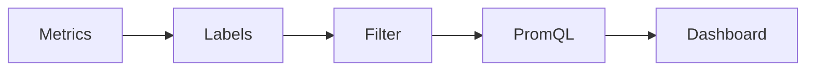

# Labels

## Overview

Labels are **key-value pairs** attached to every Prometheus metric. They provide metadata that identifies and categorizes metrics, making it possible to filter, group, and aggregate time-series data.

Without labels, Prometheus would only store metric names, making it difficult to distinguish metrics from different servers, applications, environments, or Kubernetes resources.

> **Interview Tip**
>
> A Prometheus **time series** is uniquely identified by:
>
> - Metric Name
> - Complete Set of Labels
>
> Example:
>
> ```text
> http_requests_total{job="web",instance="10.0.0.1:8080",method="GET",status="200"}
> ```

---

## Why It Is Used

Labels help to:

- Differentiate metrics
- Identify resources
- Filter metrics
- Aggregate data
- Group related metrics
- Support multi-dimensional monitoring
- Enable flexible PromQL queries

---

## Architecture / Working



### Working Process

1. Application exposes metrics with labels.
2. Prometheus scrapes the metrics.
3. Each unique label combination becomes a separate time series.
4. PromQL uses labels to filter, group, and aggregate metrics.

---

## Key Components

| Component | Purpose |
|-----------|---------|
| Metric Name | Identifies the metric |
| Label Key | Metadata name |
| Label Value | Metadata value |
| Time Series | Metric + Labels |

Example

```text
http_requests_total{
    job="frontend",
    instance="10.0.0.5:8080",
    method="GET",
    status="200"
}
```

---

## Types (if applicable)

Common Labels

| Label | Purpose |
|--------|----------|
| job | Application name |
| instance | Target address |
| namespace | Kubernetes namespace |
| pod | Pod name |
| container | Container name |
| node | Kubernetes node |
| method | HTTP method |
| status | HTTP response code |
| environment | dev/test/prod |
| region | Deployment region |

---

## Lifecycle / Workflow



---

## Configuration / Syntax (if applicable)

Metric without Labels

```text
up
```

Metric with Labels

```text
up{
    job="node-exporter",
    instance="server01:9100"
}
```

Example PromQL

```promql
up{job="node-exporter"}
```

---

## Important Commands (if applicable)

Query Metrics

```
http://localhost:9090/graph
```

View Labels

```
http://localhost:9090/api/v1/labels
```

View Label Values

```
http://localhost:9090/api/v1/label/job/values
```

---

## Important Files (if applicable)

| File | Purpose |
|------|----------|
| prometheus.yml | Target labels and relabeling configuration |

---

## Real-World Use Cases

- Monitor production servers
- Separate development and production environments
- Filter Kubernetes Pods
- Monitor multiple applications
- Regional monitoring

---

## Advantages

- Multi-dimensional monitoring
- Flexible filtering
- Easy aggregation
- Supports dynamic environments
- Ideal for Kubernetes

---

## Limitations

- High-cardinality labels increase storage usage
- Excessive labels reduce query performance
- Poor label design complicates monitoring

---

## Common Interview Questions (Concept Only)

- What are labels in Prometheus?
- Why are labels important?
- What uniquely identifies a time series?
- What is high cardinality?
- Which labels are commonly used?

---

## Common Mistakes

- Using user IDs or session IDs as labels
- Creating too many unique label values
- Inconsistent label naming
- Using labels for frequently changing values

---

## Troubleshooting

| Problem | Cause | Solution |
|----------|--------|----------|
| Too many time series | High-cardinality labels | Remove unnecessary labels |
| Slow queries | Excessive label combinations | Simplify label usage |
| Missing metrics | Incorrect labels | Verify exporter output |
| Aggregation incorrect | Wrong labels | Review PromQL grouping |

Useful Commands

```bash
curl http://localhost:9090/api/v1/labels

curl http://localhost:9090/api/v1/label/job/values
```

---

## Summary

Labels are key-value pairs that provide metadata for Prometheus metrics. They enable flexible querying, filtering, grouping, and aggregation while uniquely identifying each time series.

---

# Label Selectors

## Overview

Label Selectors are PromQL expressions used to filter metrics based on one or more labels.

They allow engineers to retrieve only the metrics relevant to a specific application, server, environment, namespace, or any other labeled resource.

> **Interview Tip**
>
> PromQL uses **label selectors** to choose which time series should be included in a query.

---

## Why It Is Used

Label selectors help to:

- Filter metrics
- Query specific applications
- Monitor environments
- Analyze Kubernetes workloads
- Reduce unnecessary data

---

## Architecture / Working



---

## Key Components

| Component | Purpose |
|-----------|---------|
| Label | Metadata |
| Selector | Filter condition |
| PromQL | Executes query |

---

## Types (if applicable)

Selector Types

| Selector | Description |
|----------|-------------|
| `=` | Exact match |
| `!=` | Not equal |
| `=~` | Regular expression |
| `!~` | Negative regular expression |

---

## Lifecycle / Workflow

```mermaid
flowchart LR

    Metric --> Label Selector --> Matching Time Series --> Query Result
```

---

## Configuration / Syntax (if applicable)

Exact Match

```promql
up{job="node-exporter"}
```

Multiple Labels

```promql
up{
    job="node-exporter",
    instance="server01:9100"
}
```

Not Equal

```promql
up{job!="database"}
```

Regex

```promql
up{job=~"web.*"}
```

Negative Regex

```promql
up{job!~"test.*"}
```

---

## Important Commands (if applicable)

Prometheus Query UI

```
http://localhost:9090/graph
```

---

## Important Files (if applicable)

None

---

## Real-World Use Cases

- Monitor production servers
- Filter Kubernetes namespaces
- View only web servers
- Separate staging and production

---

## Advantages

- Flexible filtering
- Powerful querying
- Supports regular expressions

---

## Limitations

- Complex regex queries may impact performance

---

## Common Interview Questions (Concept Only)

- What is a label selector?
- Which operators are available?
- How do regex selectors work?

---

## Common Mistakes

- Incorrect regex syntax
- Using labels that do not exist
- Overusing regex filters

---

## Troubleshooting

| Problem | Cause | Solution |
|----------|--------|----------|
| Empty result | Incorrect label | Verify available labels |
| Unexpected metrics | Incorrect selector | Review query |
| Slow query | Complex regex | Simplify filter |

Useful Queries

```promql
up{job="node-exporter"}

up{environment="production"}

up{namespace="default"}
```

---

## Summary

Label selectors filter Prometheus metrics using label values, enabling precise and efficient queries across infrastructure and applications.

---

# Label Filtering

## Overview

Label Filtering is the process of retrieving only the required metrics by applying one or more label selectors in PromQL.

It is one of the most frequently used Prometheus features in dashboards, alerts, and troubleshooting.

> **Interview Tip**
>
> Almost every real-world PromQL query includes label filtering.

---

## Why It Is Used

Label filtering helps to:

- Reduce unnecessary results
- Focus on specific workloads
- Create reusable dashboards
- Build accurate alerts
- Analyze individual services

---

## Architecture / Working



---

## Key Components

| Component | Purpose |
|-----------|---------|
| Labels | Metadata |
| Filter | Select matching metrics |
| PromQL | Executes query |

---

## Types (if applicable)

Common Filtering Examples

| Filter | Example |
|--------|---------|
| Job | `job="web"` |
| Namespace | `namespace="production"` |
| Pod | `pod="frontend-123"` |
| HTTP Status | `status="500"` |
| Environment | `environment="prod"` |

---

## Lifecycle / Workflow

```mermaid
flowchart LR

    Time Series --> Filter --> Query --> Dashboard
```

---

## Configuration / Syntax (if applicable)

Filter by Job

```promql
up{job="web"}
```

Filter by Namespace

```promql
container_cpu_usage_seconds_total{
    namespace="production"
}
```

Filter by HTTP Status

```promql
http_requests_total{
    status="500"
}
```

Filter Multiple Labels

```promql
http_requests_total{
    job="frontend",
    status="200"
}
```

Aggregate with Filtering

```promql
sum(rate(http_requests_total{job="frontend"}[5m]))
```

---

## Important Commands (if applicable)

Prometheus Query Browser

```
http://localhost:9090/graph
```

---

## Important Files (if applicable)

None

---

## Real-World Use Cases

- Monitor production applications
- Kubernetes namespace monitoring
- API error monitoring
- Service-specific dashboards
- Regional monitoring

---

## Advantages

- Efficient querying
- Flexible dashboards
- Precise alerting
- Easy troubleshooting

---

## Limitations

- Depends on good label design
- High-cardinality labels reduce performance

---

## Common Interview Questions (Concept Only)

- How do you filter metrics in Prometheus?
- Which label operators are commonly used?
- Can multiple labels be filtered together?
- Why is label filtering important?

---

## Common Mistakes

- Filtering on nonexistent labels
- Using inconsistent label names
- Overusing regular expressions
- Ignoring high-cardinality labels

---

## Troubleshooting

| Problem | Cause | Solution |
|----------|--------|----------|
| No results | Incorrect label value | Verify labels in Prometheus |
| Duplicate results | Missing filters | Add additional label selectors |
| Slow queries | High-cardinality labels | Simplify filtering |
| Incorrect aggregation | Wrong grouping | Review PromQL expression |

Useful Queries

```promql
up{job="node-exporter"}

up{environment="production"}

sum(rate(http_requests_total{status="500"}[5m]))

count(up{namespace="default"})
```

---

## Summary

Label filtering is a core Prometheus capability that allows engineers to retrieve only the required metrics using label selectors. It enables efficient dashboards, accurate alerting, and powerful PromQL queries across large-scale infrastructure and Kubernetes environments.
