# Dashboards

## Overview

A **Dashboard** in Grafana is a collection of panels that display metrics, logs, and other monitoring data from one or more data sources.

Dashboards provide a centralized view of infrastructure, applications, containers, cloud services, and business metrics.

> **Interview Tip**
>
> A dashboard does **not store data**. It retrieves data from configured data sources whenever it is opened or refreshed.

---

## Why It Is Used

Grafana dashboards help to:

- Visualize system health
- Monitor applications
- Track infrastructure performance
- Analyze trends
- Troubleshoot issues
- Build executive reports
- Monitor Kubernetes, Docker, Azure, AWS, and Linux servers

---

## Architecture / Working

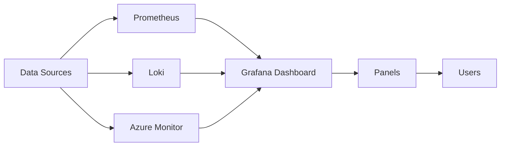

### Working Process

1. Configure one or more data sources.
2. Create a dashboard.
3. Add panels.
4. Write queries.
5. Grafana retrieves live data.
6. Panels display visualizations.
7. Dashboards refresh automatically.

---

## Key Components

| Component | Purpose |
|-----------|---------|
| Dashboard | Collection of panels |
| Panel | Individual visualization |
| Query | Retrieves data |
| Variable | Dynamic filtering |
| Time Picker | Controls time range |
| Refresh Interval | Auto-refresh data |

---

## Types (if applicable)

Common Dashboard Types

| Dashboard | Purpose |
|------------|---------|
| Infrastructure | CPU, Memory, Disk |
| Kubernetes | Cluster monitoring |
| Docker | Container monitoring |
| Application | Application metrics |
| Business | Business KPIs |
| Security | Security monitoring |

---

## Lifecycle / Workflow

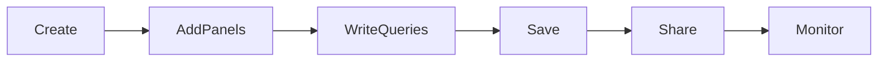

---

## Configuration / Syntax (if applicable)

Dashboard Components

```
Dashboard

├── Panels
├── Variables
├── Queries
├── Alerts
├── Time Range
└── Settings
```

---

## Important Commands (if applicable)

Not applicable.

---

## Important Files (if applicable)

| File | Purpose |
|------|----------|
| Dashboard JSON | Exported dashboard |
| provisioning/dashboards/ | Dashboard provisioning |

---

## Real-World Use Cases

- Kubernetes monitoring
- Docker monitoring
- Azure monitoring
- AWS monitoring
- CI/CD monitoring
- Production health dashboards

---

## Advantages

- Centralized monitoring
- Multiple visualization options
- Real-time monitoring
- Supports multiple data sources
- Easy dashboard sharing

---

## Limitations

- Requires configured data sources
- Complex dashboards may reduce performance
- Query efficiency impacts dashboard speed

---

## Common Interview Questions (Concept Only)

- What is a Grafana dashboard?
- Does a dashboard store monitoring data?
- Can one dashboard use multiple data sources?
- What are dashboard variables?
- How are dashboards shared?

---

## Common Mistakes

- Creating too many panels
- Poor dashboard organization
- Using inefficient queries
- Forgetting to save dashboard changes

---

## Troubleshooting

| Problem | Cause | Solution |
|----------|--------|----------|
| Empty dashboard | No data source | Verify data source |
| Slow dashboard | Heavy queries | Optimize queries |
| Panels not updating | Auto-refresh disabled | Enable refresh |
| No data displayed | Incorrect query | Verify query |

---

## Summary

Grafana dashboards provide centralized, real-time visualization of monitoring data collected from various data sources. They are the primary interface used by DevOps, SRE, and Cloud Engineers to monitor production environments.

---

# Create Dashboards

## Overview

Creating a dashboard involves adding panels, selecting a data source, writing queries, and arranging visualizations.

---

## Why It Is Used

Creating dashboards enables teams to monitor:

- Infrastructure
- Applications
- Containers
- Cloud services
- Business metrics

---

## Architecture / Working

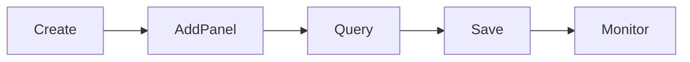

---

## Key Components

| Component | Purpose |
|-----------|---------|
| Dashboard | Container |
| Panel | Visualization |
| Query | Retrieves data |
| Data Source | Monitoring backend |

---

## Types (if applicable)

Dashboard Creation Methods

- Blank dashboard
- Imported dashboard
- Provisioned dashboard

---

## Lifecycle / Workflow

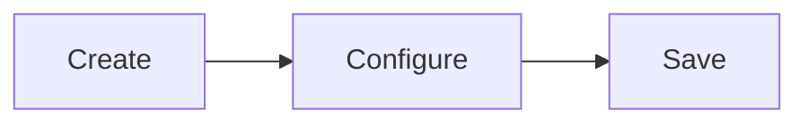

---

## Configuration / Syntax (if applicable)

Typical Steps

1. New Dashboard
2. Add Visualization
3. Select Data Source
4. Write Query
5. Save Dashboard

---

## Important Commands (if applicable)

Not applicable.

---

## Important Files (if applicable)

Dashboard JSON

---

## Real-World Use Cases

- Infrastructure monitoring
- Cluster monitoring
- Application monitoring

---

## Advantages

- Easy creation
- Fully customizable

---

## Limitations

- Requires monitoring backend

---

## Common Interview Questions (Concept Only)

- How do you create a Grafana dashboard?
- What is required before creating a dashboard?

---

## Common Mistakes

- Selecting the wrong data source
- Using inefficient queries

---

## Troubleshooting

- Verify data source
- Test queries

---

## Summary

Dashboards are created by selecting data sources, adding panels, writing queries, and saving the completed visualization.

---

# Import Dashboards

## Overview

Grafana supports importing dashboards from JSON files or the Grafana Dashboard Library.

This saves development time and promotes dashboard standardization.

---

## Why It Is Used

Importing dashboards allows teams to:

- Reuse dashboards
- Standardize monitoring
- Quickly deploy production dashboards

---

## Architecture / Working

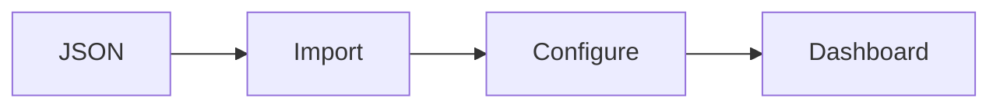

---

## Key Components

| Component | Purpose |
|-----------|---------|
| JSON File | Dashboard definition |
| Dashboard ID | Grafana library identifier |
| Data Source Mapping | Connect imported panels |

---

## Types (if applicable)

Import Methods

- JSON File
- Dashboard ID

---

## Lifecycle / Workflow

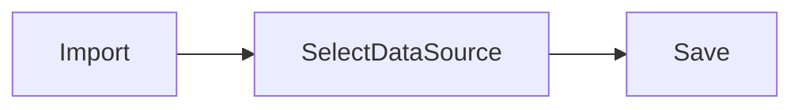

---

## Configuration / Syntax (if applicable)

Import Options

- Upload JSON
- Enter Dashboard ID

---

## Important Commands (if applicable)

Not applicable.

---

## Important Files (if applicable)

Dashboard JSON

---

## Real-World Use Cases

- Kubernetes dashboards
- Node Exporter dashboards
- Docker dashboards

---

## Advantages

- Saves time
- Community dashboards
- Easy deployment

---

## Limitations

- Imported queries may require modification

---

## Common Interview Questions (Concept Only)

- How can dashboards be imported?
- What is required after importing?

---

## Common Mistakes

- Forgetting to map the correct data source

---

## Troubleshooting

- Verify JSON
- Verify data source mapping

---

## Summary

Grafana dashboards can be imported using JSON files or dashboard IDs, allowing quick deployment of standardized monitoring solutions.

---

# Export Dashboards

## Overview

Grafana dashboards can be exported as JSON files for backup, sharing, migration, or version control.

---

## Why It Is Used

Exporting dashboards enables:

- Backup
- Migration
- Sharing
- Git version control

---

## Architecture / Working


---

## Key Components

| Component | Purpose |
|-----------|---------|
| Dashboard | Source |
| JSON File | Export |

---

## Types (if applicable)

Export Formats

- JSON

---

## Lifecycle / Workflow

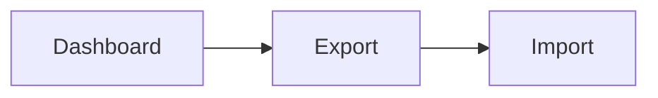

---

## Configuration / Syntax (if applicable)

Dashboard → Settings → JSON Model → Export

---

## Important Commands (if applicable)

Not applicable.

---

## Important Files (if applicable)

```
dashboard.json
```

---

## Real-World Use Cases

- Backup dashboards
- Move dashboards between environments
- Store dashboards in Git

---

## Advantages

- Portable
- Easy backup

---

## Limitations

- Data sources may need remapping

---

## Common Interview Questions (Concept Only)

- Why export dashboards?
- Which file format is used?

---

## Common Mistakes

- Forgetting data source mapping

---

## Troubleshooting

- Validate JSON
- Verify dashboard compatibility

---

## Summary

Exporting dashboards creates portable JSON files for migration, backup, and collaboration.

---

# Dashboard Variables

## Overview

Dashboard Variables are dynamic placeholders that allow users to filter dashboards without editing queries.

Variables make dashboards reusable across multiple servers, clusters, or environments.

> **Interview Tip**
>
> Variables reduce dashboard duplication by allowing one dashboard to work for many resources.

---

## Why It Is Used

Variables help:

- Filter dashboards
- Switch environments
- Select servers
- Choose namespaces
- Select Kubernetes clusters

---

## Architecture / Working

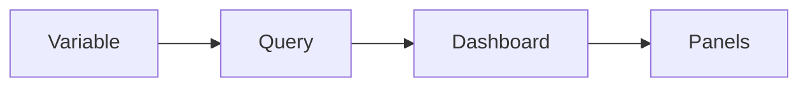

---

## Key Components

| Component | Purpose |
|-----------|---------|
| Variable | Dynamic value |
| Query Variable | Retrieves values |
| Dropdown | User selection |

---

## Types (if applicable)

Common Variable Types

| Variable | Purpose |
|-----------|---------|
| Query | Dynamic values |
| Custom | Manual values |
| Constant | Fixed value |
| Interval | Time intervals |
| Datasource | Select data source |

---

## Lifecycle / Workflow

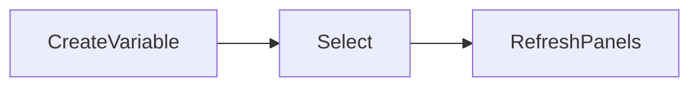

---

## Configuration / Syntax (if applicable)

Example PromQL

```promql
label_values(instance)
```

Example Usage

```promql
node_cpu_seconds_total{instance="$instance"}
```

---

## Important Commands (if applicable)

Not applicable.

---

## Important Files (if applicable)

Stored in dashboard JSON.

---

## Real-World Use Cases

- Environment selection
- Kubernetes namespace filtering
- Node filtering
- Application selection

---

## Advantages

- Reusable dashboards
- Dynamic filtering
- Reduced maintenance

---

## Limitations

- Incorrect variables may return empty dashboards

---

## Common Interview Questions (Concept Only)

- What are dashboard variables?
- Why are variables useful?
- Which variable types are commonly used?

---

## Common Mistakes

- Incorrect variable query
- Using undefined variables

---

## Troubleshooting

- Verify query
- Refresh variable values
- Test PromQL

---

## Summary

Dashboard variables provide dynamic filtering, making Grafana dashboards flexible and reusable across multiple environments.

---

# Dashboard Settings

## Overview

Dashboard Settings control the behavior, appearance, permissions, refresh intervals, variables, annotations, and versioning of a dashboard.

---

## Why It Is Used

Settings help configure:

- Dashboard name
- Refresh interval
- Time range
- Permissions
- Variables
- Version history

---

## Architecture / Working

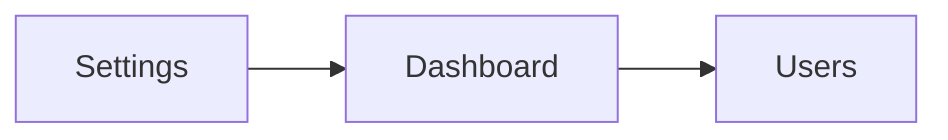

---

## Key Components

| Component | Purpose |
|-----------|---------|
| General | Dashboard information |
| Variables | Dynamic filters |
| Time Options | Time settings |
| Permissions | Access control |
| Versions | Dashboard history |

---

## Types (if applicable)

Common Settings

- General
- Variables
- Annotations
- Permissions
- Time Options

---

## Lifecycle / Workflow

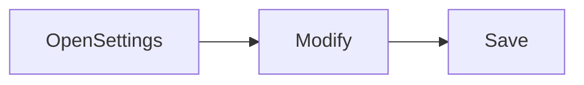

---

## Configuration / Syntax (if applicable)

Typical Settings

- Dashboard Name
- Description
- Time Zone
- Auto Refresh
- Permissions

---

## Important Commands (if applicable)

Not applicable.

---

## Important Files (if applicable)

Dashboard JSON

---

## Real-World Use Cases

- Configure production dashboards
- Team access control
- Dashboard version management

---

## Advantages

- Flexible customization
- Better collaboration
- Dashboard governance

---

## Limitations

- Incorrect settings may affect dashboard usability

---

## Common Interview Questions (Concept Only)

- What can be configured in Dashboard Settings?
- How do you control dashboard permissions?
- Where are dashboard variables configured?

---

## Common Mistakes

- Disabling auto-refresh unintentionally
- Incorrect dashboard permissions
- Forgetting to save changes

---

## Troubleshooting

| Problem | Cause | Solution |
|----------|--------|----------|
| Dashboard not refreshing | Auto-refresh disabled | Enable refresh |
| Variables missing | Variable configuration issue | Verify variable settings |
| Access denied | Permission issue | Check dashboard permissions |
| Wrong time range | Incorrect dashboard settings | Adjust time picker |

---

## Summary

Dashboard Settings allow administrators and users to customize dashboard behavior, security, filtering, refresh intervals, and overall usability, making Grafana dashboards easier to manage and maintain in production environments.
