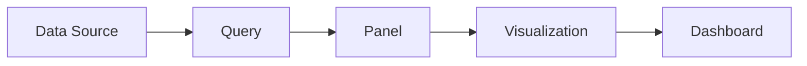
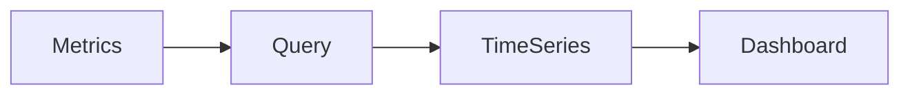
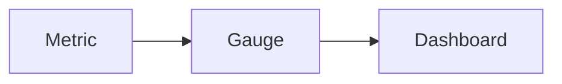
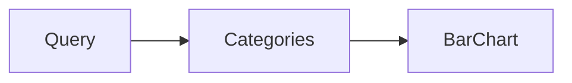
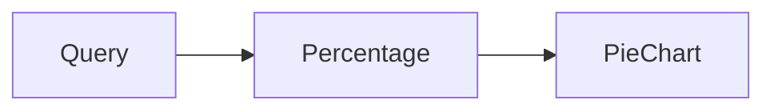

# Panels

## Overview

A **Panel** is the basic visualization component in a Grafana dashboard. Every dashboard consists of one or more panels, each displaying data retrieved from a configured data source.

Panels transform raw metrics, logs, or query results into visual representations such as graphs, gauges, tables, and charts.

> **Interview Tip**
>
> - **Dashboard = Collection of Panels**
> - **Panel = Single Visualization**
> - A panel can query only **one data source at a time**, but a dashboard can contain panels using different data sources.

---

## Why It Is Used

Panels help to:

- Visualize monitoring data
- Identify performance issues
- Monitor system health
- Display KPIs
- Compare trends
- Build operational dashboards
- Improve troubleshooting

---

## Architecture / Working



### Working Process

1. User selects a data source.
2. A query retrieves monitoring data.
3. The panel processes the returned data.
4. Grafana renders the selected visualization.
5. Dashboard refreshes based on the configured interval.

---

## Key Components

| Component | Purpose |
|-----------|---------|
| Panel | Displays visualization |
| Query | Retrieves data |
| Visualization | Graph, Table, Gauge, etc. |
| Transformations | Modify query results |
| Field Options | Customize display |
| Thresholds | Highlight values |
| Legends | Display metric information |

---

## Types (if applicable)

Common Grafana Panel Types

| Panel Type | Best Used For |
|------------|---------------|
| Time Series | Trends over time |
| Stat | Single metric |
| Gauge | Utilization |
| Table | Detailed records |
| Bar Chart | Comparisons |
| Pie Chart | Percentage distribution |

---

## Lifecycle / Workflow


---

## Configuration / Syntax (if applicable)

Typical Panel Configuration

```
Panel

├── Data Source
├── Query
├── Visualization
├── Field Options
├── Thresholds
├── Legend
└── Time Range
```

---

## Important Commands (if applicable)

Not applicable.

---

## Important Files (if applicable)

| File | Purpose |
|------|----------|
| Dashboard JSON | Stores panel configuration |

---

## Real-World Use Cases

- CPU monitoring
- Memory monitoring
- Disk utilization
- Kubernetes dashboards
- Docker monitoring
- Azure monitoring
- AWS monitoring

---

## Advantages

- Interactive visualization
- Highly customizable
- Supports multiple chart types
- Real-time updates

---

## Limitations

- Large numbers of panels may impact dashboard performance
- Poor queries can slow rendering

---

## Common Interview Questions (Concept Only)

- What is a Grafana panel?
- Can one dashboard contain multiple panel types?
- What is the difference between a panel and a dashboard?
- How are panels refreshed?
- Which visualization is best for CPU utilization?

---

## Common Mistakes

- Using inappropriate visualization types
- Creating too many panels
- Inefficient queries
- Incorrect thresholds

---

## Troubleshooting

| Problem | Cause | Solution |
|----------|--------|----------|
| Panel empty | Incorrect query | Verify query |
| Slow loading | Heavy query | Optimize query |
| Wrong values | Incorrect aggregation | Review query |
| No visualization | Data source unavailable | Verify connectivity |

---

## Summary

Panels are the building blocks of Grafana dashboards. They retrieve data from configured data sources and display it using various visualization types to simplify monitoring and troubleshooting.

---

# Time Series

## Overview

The **Time Series** panel is the most commonly used Grafana visualization. It displays metric values over time using line, area, or point graphs.

> **Interview Tip**
>
> The Time Series panel replaced the older Graph panel in modern Grafana versions.

---

## Why It Is Used

Used to monitor:

- CPU usage
- Memory usage
- Network traffic
- Disk utilization
- Request rate
- Error rate

---

## Architecture / Working



---

## Key Components

| Component | Purpose |
|-----------|---------|
| X-Axis | Time |
| Y-Axis | Metric values |
| Legend | Metric names |
| Thresholds | Highlight limits |

---

## Types (if applicable)

Display Modes

- Line
- Area
- Points
- Bars

---

## Lifecycle / Workflow


---

## Configuration / Syntax (if applicable)

Example PromQL

```promql
rate(node_cpu_seconds_total[5m])
```

---

## Important Commands (if applicable)

Not applicable.

---

## Important Files (if applicable)

Dashboard JSON

---

## Real-World Use Cases

- CPU trends
- Network traffic
- Response times

---

## Advantages

- Best for trends
- Interactive
- Highly customizable

---

## Limitations

- Not suitable for single values

---

## Common Interview Questions (Concept Only)

- When should you use a Time Series panel?
- Which axis represents time?

---

## Common Mistakes

- Wrong aggregation
- Too many metrics

---

## Troubleshooting

- Verify time range
- Verify PromQL query

---

## Summary

The Time Series panel is ideal for displaying metrics that change over time and is the most frequently used Grafana visualization.

---

# Stat

## Overview

The **Stat** panel displays a single numeric value representing the latest or aggregated metric.

---

## Why It Is Used

Used to display:

- CPU usage
- Active users
- Total requests
- Memory utilization
- Error count

---

## Architecture / Working


---

## Key Components

| Component | Purpose |
|-----------|---------|
| Value | Current metric |
| Threshold | Color changes |
| Sparkline | Mini trend |

---

## Types (if applicable)

Display

- Single Value
- Value with Sparkline

---

## Lifecycle / Workflow


---

## Configuration / Syntax (if applicable)

Example

```promql
node_memory_MemAvailable_bytes
```

---

## Important Commands (if applicable)

None

---

## Important Files (if applicable)

Dashboard JSON

---

## Real-World Use Cases

- Current CPU usage
- Current Memory usage
- Active Pods

---

## Advantages

- Simple
- Easy to read

---

## Limitations

- No historical trend

---

## Common Interview Questions (Concept Only)

- When should you use a Stat panel?

---

## Common Mistakes

- Using Stat for trend analysis

---

## Troubleshooting

- Verify aggregation

---

## Summary

Stat panels display a single important metric and are commonly used for KPIs.

---

# Gauge

## Overview

The **Gauge** panel displays a metric as a dial showing the current value relative to a defined minimum and maximum.

---

## Why It Is Used

Useful for monitoring:

- CPU utilization
- Memory usage
- Disk usage
- Storage utilization

---

## Architecture / Working



---

## Key Components

| Component | Purpose |
|-----------|---------|
| Needle | Current value |
| Threshold | Warning colors |
| Scale | Min and Max |

---

## Types (if applicable)

Gauge Styles

- Circular
- Bar Gauge

---

## Lifecycle / Workflow


---

## Configuration / Syntax (if applicable)

Example

```promql
100 - (node_memory_MemAvailable_bytes / node_memory_MemTotal_bytes * 100)
```

---

## Important Commands (if applicable)

None

---

## Important Files (if applicable)

Dashboard JSON

---

## Real-World Use Cases

- CPU utilization
- Disk utilization
- Memory utilization

---

## Advantages

- Easy visualization
- Good for percentages

---

## Limitations

- Not suitable for trend analysis

---

## Common Interview Questions (Concept Only)

- What is the purpose of a Gauge panel?

---

## Common Mistakes

- Missing thresholds

---

## Troubleshooting

- Verify Min/Max values

---

## Summary

Gauge panels are ideal for displaying utilization percentages and resource consumption.

---

# Table

## Overview

The **Table** panel displays query results in rows and columns, making it suitable for detailed information rather than graphical visualization.

---

## Why It Is Used

Tables are useful for:

- Pod lists
- Server inventory
- Log entries
- Alert lists
- Status reports

---

## Architecture / Working


---

## Key Components

| Component | Purpose |
|-----------|---------|
| Rows | Records |
| Columns | Fields |
| Sorting | Order data |
| Filters | Search data |

---

## Types (if applicable)

Table Features

- Sorting
- Filtering
- Pagination

---

## Lifecycle / Workflow


---

## Configuration / Syntax (if applicable)

Example

```promql
up
```

---

## Important Commands (if applicable)

None

---

## Important Files (if applicable)

Dashboard JSON

---

## Real-World Use Cases

- Kubernetes pods
- Server inventory
- Alert lists

---

## Advantages

- Detailed information
- Easy comparison

---

## Limitations

- Less visual

---

## Common Interview Questions (Concept Only)

- When should a Table panel be used?

---

## Common Mistakes

- Displaying excessive data

---

## Troubleshooting

- Verify query output

---

## Summary

Table panels provide detailed structured information and are commonly used for inventories and logs.

---

# Bar Chart

## Overview

A **Bar Chart** compares values across categories using horizontal or vertical bars.

---

## Why It Is Used

Useful for:

- Comparing CPU across servers
- Comparing pod counts
- Monthly statistics
- Resource utilization

---

## Architecture / Working



---

## Key Components

| Component | Purpose |
|-----------|---------|
| Categories | X-axis |
| Values | Y-axis |
| Bars | Comparison |

---

## Types (if applicable)

- Vertical
- Horizontal

---

## Lifecycle / Workflow


---

## Configuration / Syntax (if applicable)

Example

```promql
sum by(instance)(rate(node_cpu_seconds_total[5m]))
```

---

## Important Commands (if applicable)

None

---

## Important Files (if applicable)

Dashboard JSON

---

## Real-World Use Cases

- Compare server utilization
- Compare application metrics

---

## Advantages

- Easy comparison
- Clear visualization

---

## Limitations

- Not suitable for long time-series data

---

## Common Interview Questions (Concept Only)

- When is a Bar Chart preferred over a Time Series panel?

---

## Common Mistakes

- Too many categories

---

## Troubleshooting

- Verify aggregation

---

## Summary

Bar Charts are best suited for comparing values across different categories or resources.

---

# Pie Chart

## Overview

The **Pie Chart** displays the proportional distribution of values as slices of a circle.

---

## Why It Is Used

Used for displaying:

- Resource distribution
- Request distribution
- Storage usage
- Error percentage
- Service utilization

---

## Architecture / Working



---

## Key Components

| Component | Purpose |
|-----------|---------|
| Slice | Category |
| Percentage | Relative value |
| Legend | Labels |

---

## Types (if applicable)

Display Modes

- Pie
- Donut

---

## Lifecycle / Workflow


---

## Configuration / Syntax (if applicable)

Example

```promql
sum by(job)(up)
```

---

## Important Commands (if applicable)

None

---

## Important Files (if applicable)

Dashboard JSON

---

## Real-World Use Cases

- Resource distribution
- Traffic distribution
- Service utilization

---

## Advantages

- Easy percentage visualization
- Simple presentation

---

## Limitations

- Poor for many categories
- Not suitable for trend analysis

---

## Common Interview Questions (Concept Only)

- When should you use a Pie Chart?
- Why isn't a Pie Chart suitable for time-series metrics?

---

## Common Mistakes

- Displaying too many slices
- Using Pie Charts for trend analysis

---

## Troubleshooting

- Verify percentage calculations
- Limit the number of categories

---

## Summary

Pie Charts are best used for displaying proportional relationships between categories and are effective when comparing a small number of values.
