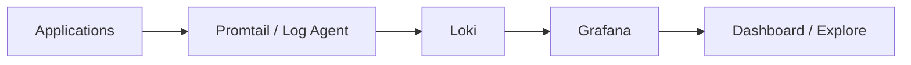
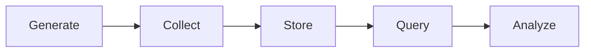
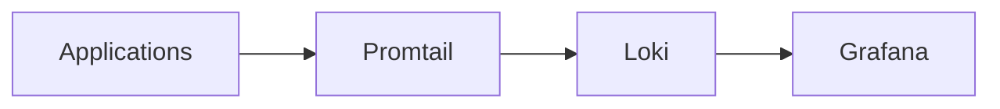
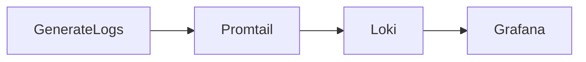
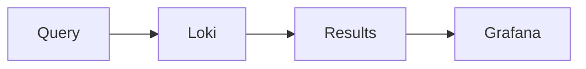
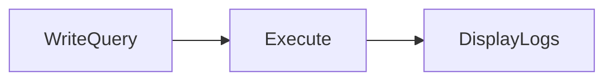
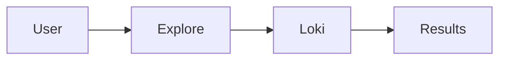
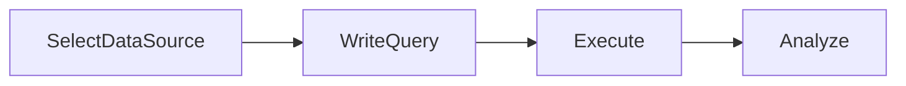

# Logs Integration

## Overview

Logs Integration in Grafana enables centralized log visualization and analysis by connecting Grafana to log management systems such as **Grafana Loki**, **Elasticsearch**, and cloud logging services.

Unlike metrics, which provide numerical data, logs provide detailed event information that helps identify the root cause of issues.

> **Interview Tip**
>
> **Metrics tell you that a problem exists. Logs tell you why it happened.**

---

## Why It Is Used

Logs Integration helps to:

- Centralize application logs
- Troubleshoot production issues
- Investigate application failures
- Correlate logs with metrics
- Analyze security events
- Monitor Kubernetes workloads
- Reduce Mean Time To Resolution (MTTR)

---

## Architecture / Working



### Working Process

1. Applications generate logs.
2. Log agents collect log files.
3. Logs are sent to Loki.
4. Grafana queries Loki.
5. Users search, filter, and analyze logs.

---

## Key Components

| Component | Purpose |
|-----------|---------|
| Log Source | Generates logs |
| Log Agent | Collects logs |
| Loki | Stores logs |
| Grafana | Visualizes logs |
| Explore | Interactive log analysis |

---

## Types (if applicable)

Common Log Sources

| Source | Example |
|----------|----------|
| Linux Servers | Syslog |
| Docker | Container Logs |
| Kubernetes | Pod Logs |
| Applications | Java, Python, .NET |
| Cloud Services | Azure, AWS |

---

## Lifecycle / Workflow



---

## Configuration / Syntax (if applicable)

Typical Workflow

```
Application

↓

Promtail

↓

Loki

↓

Grafana

↓

Explore / Dashboard
```

---

## Important Commands (if applicable)

Not applicable.

---

## Important Files (if applicable)

| File | Purpose |
|------|----------|
| promtail-config.yaml | Promtail configuration |
| loki-config.yaml | Loki configuration |

---

## Real-World Use Cases

- Kubernetes troubleshooting
- Application debugging
- Security investigations
- Container log analysis
- API error tracking
- Audit logging

---

## Advantages

- Centralized logging
- Faster troubleshooting
- Easy correlation with metrics
- Supports large environments
- Simplifies root cause analysis

---

## Limitations

- Large log volumes require storage planning
- Poor labeling affects search performance
- Logs consume more storage than metrics

---

## Common Interview Questions (Concept Only)

- What is Logs Integration in Grafana?
- Why are logs important in monitoring?
- Can Grafana store logs?
- Which data sources support log visualization?
- How are logs different from metrics?

---

## Common Mistakes

- Collecting excessive logs
- Missing labels
- Short log retention
- Ignoring log filtering

---

## Troubleshooting

| Problem | Cause | Solution |
|----------|--------|----------|
| No logs displayed | Data source issue | Verify Loki connection |
| Missing application logs | Agent not running | Check Promtail |
| Slow searches | Large dataset | Add labels and filters |
| Empty dashboard | Wrong query | Verify LogQL query |

---

## Summary

Logs Integration enables Grafana to retrieve, search, and visualize application and infrastructure logs, helping engineers quickly investigate failures and identify root causes.

---

# Loki Integration

## Overview

**Grafana Loki** is Grafana's log aggregation system designed to store and query logs efficiently.

Unlike traditional log management systems, Loki indexes **labels instead of entire log contents**, making it lightweight and scalable.

> **Interview Tip**
>
> **Prometheus stores metrics. Loki stores logs. Grafana visualizes both.**

---

## Why It Is Used

Loki is used to:

- Aggregate logs
- Centralize logging
- Search application logs
- Correlate logs with metrics
- Reduce storage costs

---

## Architecture / Working



---

## Key Components

| Component | Purpose |
|-----------|---------|
| Promtail | Collect logs |
| Loki | Store logs |
| Labels | Index logs |
| Grafana | Query and visualize |

---

## Types (if applicable)

Common Loki Components

- Promtail
- Loki Server
- Grafana
- Object Storage (optional)

---

## Lifecycle / Workflow



---

## Configuration / Syntax (if applicable)

Add Loki as a Data Source

```
URL

↓

Save & Test

↓

Query Logs
```

---

## Important Commands (if applicable)

Not applicable.

---

## Important Files (if applicable)

| File | Purpose |
|------|----------|
| loki-config.yaml | Loki configuration |
| promtail-config.yaml | Promtail configuration |

---

## Real-World Use Cases

- Kubernetes logging
- Docker logging
- Linux server logging
- Microservices monitoring

---

## Advantages

- Lightweight
- Label-based indexing
- Easy Grafana integration
- Cost-efficient

---

## Limitations

- Not designed for full-text indexing
- Requires proper label strategy

---

## Common Interview Questions (Concept Only)

- What is Loki?
- How is Loki different from Elasticsearch?
- Why does Loki use labels?
- What is Promtail?

---

## Common Mistakes

- Excessive label creation
- Missing Promtail configuration
- Poor label design

---

## Troubleshooting

- Verify Loki data source
- Check Promtail logs
- Confirm log ingestion

---

## Summary

Loki is Grafana's log aggregation system that efficiently stores and retrieves logs using label-based indexing.

---

# Log Queries

## Overview

A **Log Query** retrieves log entries from a logging backend such as Loki.

Grafana uses **LogQL** to search, filter, and analyze logs.

---

## Why It Is Used

Log queries allow users to:

- Search logs
- Filter applications
- Troubleshoot issues
- Investigate incidents
- Analyze failures

---

## Architecture / Working



---

## Key Components

| Component | Purpose |
|-----------|---------|
| LogQL | Query language |
| Labels | Filter logs |
| Filters | Narrow results |
| Output | Matching logs |

---

## Types (if applicable)

Query Types

- Label Queries
- Filter Queries
- Regular Expression Queries
- Metric Queries

---

## Lifecycle / Workflow



---

## Configuration / Syntax (if applicable)

Select All Logs

```logql
{job="nginx"}
```

Filter Keyword

```logql
{job="nginx"} |= "error"
```

Exclude Text

```logql
{job="nginx"} != "health"
```

Regex Filter

```logql
{job="nginx"} |~ "timeout|failed"
```

---

## Important Commands (if applicable)

Not applicable.

---

## Important Files (if applicable)

None

---

## Real-World Use Cases

- Search application errors
- Find failed requests
- Investigate crashes
- Debug Kubernetes pods

---

## Advantages

- Fast filtering
- Label-based searches
- Supports regular expressions

---

## Limitations

- Requires proper labeling
- Complex regex may reduce performance

---

## Common Interview Questions (Concept Only)

- What is LogQL?
- How do labels improve log queries?
- What is the purpose of `|=` in LogQL?
- How are log queries different from PromQL?

---

## Common Mistakes

- Incorrect labels
- Poor regular expressions
- Missing filters

---

## Troubleshooting

| Problem | Cause | Solution |
|----------|--------|----------|
| No results | Wrong labels | Verify label names |
| Slow queries | Large dataset | Add filters |
| Missing logs | Ingestion failure | Check Promtail |

---

## Summary

Log Queries use LogQL to retrieve and filter log entries efficiently from Loki for troubleshooting and operational analysis.

---

# Log Exploration

## Overview

**Explore** is Grafana's interactive interface for investigating metrics, logs, and traces without creating dashboards.

It is one of the most frequently used features for production troubleshooting.

> **Interview Tip**
>
> Dashboards are used for monitoring. **Explore** is used for investigation and debugging.

---

## Why It Is Used

Log Exploration helps engineers to:

- Search logs interactively
- Troubleshoot incidents
- Correlate metrics with logs
- Analyze application failures
- Debug Kubernetes workloads

---

## Architecture / Working



---

## Key Components

| Component | Purpose |
|-----------|---------|
| Explore | Interactive interface |
| Query Editor | Write LogQL |
| Time Range | Select investigation period |
| Log Viewer | Display matching logs |

---

## Types (if applicable)

Explore Capabilities

- Metrics
- Logs
- Traces

---

## Lifecycle / Workflow



---

## Configuration / Syntax (if applicable)

Typical Workflow

```
Explore

↓

Select Loki

↓

Write LogQL

↓

Analyze Results
```

---

## Important Commands (if applicable)

Not applicable.

---

## Important Files (if applicable)

None

---

## Real-World Use Cases

- Investigate production incidents
- Debug Kubernetes pods
- Search application exceptions
- Analyze API failures
- Correlate logs with metrics

---

## Advantages

- Interactive troubleshooting
- Real-time searches
- Supports metrics and logs together
- No dashboard creation required

---

## Limitations

- Requires a configured logging backend
- Large datasets may slow searches

---

## Common Interview Questions (Concept Only)

- What is Grafana Explore?
- How is Explore different from a dashboard?
- Why use Explore during troubleshooting?
- Can Explore query logs and metrics together?

---

## Common Mistakes

- Searching without filters
- Selecting the wrong time range
- Using incorrect labels
- Ignoring log context

---

## Troubleshooting

| Problem | Cause | Solution |
|----------|--------|----------|
| No logs returned | Incorrect LogQL | Verify query |
| Slow search | Broad search scope | Narrow time range |
| Missing logs | Ingestion issue | Verify Promtail and Loki |
| Incorrect results | Wrong labels | Check label filters |

---

## Summary

Log Exploration enables engineers to interactively search, filter, and analyze logs using Grafana Explore, making it an essential tool for production troubleshooting and root cause analysis.
