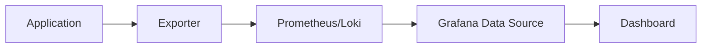
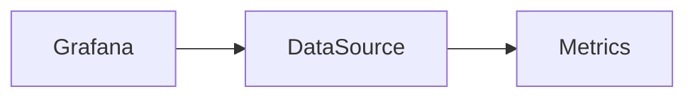
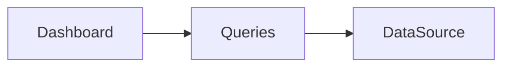
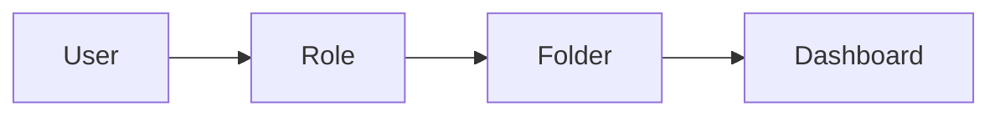

# Troubleshooting

## Overview

Troubleshooting in Grafana involves identifying and resolving issues related to **data sources, dashboards, queries, alerts, permissions, and visualization**.

Since Grafana acts as a **visualization layer**, most problems originate from:

- Data source connectivity
- Incorrect queries
- Authentication/permissions
- Network issues
- Backend monitoring systems (Prometheus, Loki, Elasticsearch, etc.)

> **Interview Tip**
>
> Grafana usually **does not generate the data**. If a dashboard shows "No Data", always verify the data source before troubleshooting Grafana itself.

---

## Why It Is Used

Troubleshooting helps to:

- Restore dashboard functionality
- Ensure accurate monitoring
- Resolve alert failures
- Fix visualization problems
- Improve system availability
- Reduce Mean Time To Resolution (MTTR)

---

## Architecture / Working



A failure at **any layer** can cause dashboards to display incorrect or missing information.

---

## Key Components

| Component | Purpose |
|------------|----------|
| Data Source | Retrieves monitoring data |
| Dashboard | Displays visualizations |
| Panel | Shows queried metrics |
| Query | Retrieves data |
| Alert Rules | Monitor thresholds |
| User Permissions | Controls access |

---

## Types (if applicable)

Common Grafana Issues

- Data Source Connection Issues
- No Data in Panels
- Query Errors
- Alert Failures
- Dashboard Loading Issues
- Permission Issues

---

## Lifecycle / Workflow

```mermaid
flowchart LR

Problem

↓

Identify Component

↓

Check Logs

↓

Verify Configuration

↓

Fix Issue

↓

Validate Dashboard
```

---

## Configuration / Syntax (if applicable)

Typical Troubleshooting Order

```
Dashboard

↓

Panel

↓

Query

↓

Data Source

↓

Monitoring Backend

↓

Exporter
```

---

## Important Commands (if applicable)

Although Grafana itself has few CLI troubleshooting commands, these are commonly used:

```bash
systemctl status grafana-server
```

Check Grafana service.

```bash
journalctl -u grafana-server
```

View Grafana logs.

```bash
systemctl restart grafana-server
```

Restart Grafana.

```bash
curl http://localhost:3000/api/health
```

Verify Grafana health.

---

## Important Files (if applicable)

| File | Purpose |
|------|----------|
| `/etc/grafana/grafana.ini` | Main Grafana configuration |
| `/var/log/grafana/grafana.log` | Grafana logs |
| `dashboard.json` | Dashboard definition |

---

## Real-World Use Cases

- Prometheus becomes unreachable
- Dashboards show "No Data"
- Alerts stop triggering
- Users cannot access dashboards
- Slow dashboard loading
- Invalid PromQL queries

---

## Advantages

- Faster issue resolution
- Improved monitoring reliability
- Better operational visibility
- Reduced downtime

---

## Limitations

- Many issues originate from external systems.
- Requires understanding of the monitoring stack.
- Incorrect permissions may be difficult to identify in large environments.

---

## Common Interview Questions (Concept Only)

- Why would a Grafana dashboard show "No Data"?
- How do you troubleshoot a failed data source?
- What should you check before blaming Grafana?
- How do you troubleshoot Grafana alerts?
- Where are Grafana logs stored?
- How do you verify Grafana is running?
- Why would a dashboard load slowly?
- What causes query failures?
- How do permissions affect dashboards?
- What is the first step when troubleshooting Grafana?

---

## Common Mistakes

- Assuming Grafana stores monitoring data.
- Ignoring Prometheus or Loki health.
- Using incorrect time ranges.
- Forgetting dashboard permissions.
- Not checking Grafana logs.
- Using invalid PromQL queries.

---

## Troubleshooting

---

# Data Source Connection Issues

## Overview

A data source connection issue occurs when Grafana cannot communicate with Prometheus, Loki, Elasticsearch, Azure Monitor, or another configured backend.

---

## Why It Is Used

Without a working data source:

- Dashboards fail
- Queries return errors
- Alerts stop working

---

## Architecture / Working



---

## Key Components

- URL
- Authentication
- Network connectivity
- API endpoint

---

## Types (if applicable)

Common Causes

- Incorrect URL
- Wrong credentials
- Firewall
- Service unavailable
- TLS/SSL issues

---

## Lifecycle / Workflow

```mermaid
flowchart LR

ConnectionFailed

↓

Check URL

↓

Check Authentication

↓

Verify Service

↓

Reconnect
```

---

## Configuration / Syntax (if applicable)

Always use **Save & Test** after configuring a data source.

---

## Important Commands (if applicable)

```bash
curl http://prometheus:9090
```

```bash
systemctl status prometheus
```

---

## Important Files (if applicable)

- `grafana.ini`
- `prometheus.yml`

---

## Real-World Use Cases

- Prometheus restarted
- DNS resolution failure
- Expired TLS certificate

---

## Advantages

- Quick verification using "Save & Test"
- Easy diagnosis

---

## Limitations

- Network issues require external troubleshooting

---

## Common Interview Questions (Concept Only)

- Why does Save & Test fail?
- What causes data source connection failures?

---

## Common Mistakes

- Wrong URL
- Firewall blocks
- Invalid credentials

---

## Troubleshooting

| Problem | Cause | Solution |
|----------|--------|----------|
| Save & Test failed | Incorrect URL | Verify endpoint |
| Timeout | Network issue | Test connectivity |
| Authentication error | Wrong credentials | Update credentials |
| TLS error | Certificate issue | Verify SSL settings |

---

## Summary

Always verify connectivity before investigating dashboards.

---

# No Data in Panels

## Overview

A panel displays **No Data** when its query returns no results.

---

## Why It Is Used

Identifying the reason prevents unnecessary dashboard modifications.

---

## Architecture / Working


---

## Key Components

- Panel
- Query
- Time Range
- Data Source

---

## Types (if applicable)

Common Causes

- Wrong query
- Incorrect time range
- Missing metrics
- Data source failure

---

## Lifecycle / Workflow

```mermaid
flowchart LR

NoData

↓

Check Query

↓

Check Time

↓

Verify Metrics

↓

Display Data
```

---

## Configuration / Syntax (if applicable)

Always verify:

- Time Picker
- Query syntax
- Labels

---

## Important Commands (if applicable)

None

---

## Important Files (if applicable)

None

---

## Real-World Use Cases

- Prometheus restarted
- Metric removed
- Wrong label

---

## Advantages

- Easy diagnosis

---

## Limitations

- Root cause often lies outside Grafana

---

## Common Interview Questions (Concept Only)

- Why does a panel show No Data?

---

## Common Mistakes

- Wrong time range
- Wrong PromQL

---

## Troubleshooting

| Problem | Cause | Solution |
|----------|--------|----------|
| No Data | Wrong query | Verify query |
| Empty graph | Wrong labels | Check labels |
| Missing metric | Exporter stopped | Verify exporter |

---

## Summary

Most "No Data" issues result from incorrect queries or unavailable metrics.

---

# Query Errors

## Overview

Query errors occur when Grafana cannot execute a query successfully.

---

## Why It Is Used

Correct queries are essential for dashboards and alerts.

---

## Architecture / Working


---

## Key Components

- Query
- Query Editor
- Data Source

---

## Types (if applicable)

Common Errors

- Invalid PromQL
- Unknown metric
- Syntax error
- Label mismatch

---

## Lifecycle / Workflow

```mermaid
flowchart LR

WriteQuery

↓

Execute

↓

Error

↓

FixQuery
```

---

## Configuration / Syntax (if applicable)

Validate queries directly in Prometheus before using them in Grafana.

---

## Important Commands (if applicable)

None

---

## Important Files (if applicable)

None

---

## Real-World Use Cases

- Invalid PromQL
- Typo in metric names

---

## Advantages

- Easy testing

---

## Limitations

- Requires PromQL knowledge

---

## Common Interview Questions (Concept Only)

- Why do Grafana queries fail?
- How do you troubleshoot PromQL?

---

## Common Mistakes

- Typographical errors
- Incorrect labels

---

## Troubleshooting

| Problem | Cause | Solution |
|----------|--------|----------|
| Parse error | Syntax issue | Fix PromQL |
| Unknown metric | Metric missing | Verify exporter |
| Empty result | Wrong label | Correct selector |

---

## Summary

Always validate PromQL before using it in dashboards.

---

# Alert Failures

## Overview

Alert failures occur when Grafana cannot evaluate or deliver alert notifications.

---

## Why It Is Used

Reliable alerting ensures rapid response to production incidents.

---

## Architecture / Working


---

## Key Components

- Alert Rule
- Evaluation
- Contact Point
- Notification Policy

---

## Types (if applicable)

Common Issues

- Invalid query
- Missing contact point
- Notification failure

---

## Lifecycle / Workflow

```mermaid
flowchart LR

Rule

↓

Evaluate

↓

Trigger

↓

Notify
```

---

## Configuration / Syntax (if applicable)

Always test alert rules before enabling them.

---

## Important Commands (if applicable)

None

---

## Important Files (if applicable)

None

---

## Real-World Use Cases

- Email alerts not received
- Rule evaluation failed

---

## Advantages

- Early issue detection

---

## Limitations

- Depends on working notification channels

---

## Common Interview Questions (Concept Only)

- Why are Grafana alerts not firing?
- What should you check first?

---

## Common Mistakes

- Invalid thresholds
- Incorrect notification policies

---

## Troubleshooting

| Problem | Cause | Solution |
|----------|--------|----------|
| Alert not firing | Query invalid | Verify query |
| No email | SMTP issue | Verify contact point |
| Evaluation failed | Data unavailable | Check datasource |

---

## Summary

Alert failures typically result from invalid queries or notification configuration issues.

---

# Dashboard Loading Issues

## Overview

Dashboard loading issues occur when dashboards are slow or fail to render.

---

## Why It Is Used

Fast dashboards improve operational efficiency.

---

## Architecture / Working



---

## Key Components

- Dashboard
- Queries
- Panels

---

## Types (if applicable)

Common Causes

- Heavy queries
- Too many panels
- Slow backend

---

## Lifecycle / Workflow

```mermaid
flowchart LR

Load

↓

Execute Queries

↓

Render Panels
```

---

## Configuration / Syntax (if applicable)

Optimize:

- Query complexity
- Refresh interval
- Number of panels

---

## Important Commands (if applicable)

None

---

## Important Files (if applicable)

None

---

## Real-World Use Cases

- Large production dashboards
- High-cardinality Prometheus queries

---

## Advantages

- Better user experience

---

## Limitations

- Backend performance affects dashboards

---

## Common Interview Questions (Concept Only)

- Why is a Grafana dashboard slow?

---

## Common Mistakes

- Too many panels
- Complex queries

---

## Troubleshooting

| Problem | Cause | Solution |
|----------|--------|----------|
| Slow loading | Heavy query | Optimize PromQL |
| Dashboard timeout | Backend delay | Optimize data source |

---

## Summary

Dashboard performance depends primarily on query efficiency and backend responsiveness.

---

# Permission Issues

## Overview

Permission issues occur when users cannot access dashboards, folders, or data sources due to insufficient privileges.

---

## Why It Is Used

Proper permissions ensure secure access to Grafana resources.

---

## Architecture / Working



---

## Key Components

- User
- Team
- Role
- Folder Permission
- Dashboard Permission

---

## Types (if applicable)

Common Issues

- Viewer cannot edit
- Missing dashboard access
- Team permissions missing

---

## Lifecycle /Workflow

```mermaid
flowchart LR

Login

↓

Role Check

↓

Permission Check

↓

Access
```

---

## Configuration / Syntax (if applicable)

Verify:

- User role
- Team membership
- Folder permissions
- Dashboard permissions

---

## Important Commands (if applicable)

None

---

## Important Files (if applicable)

- `grafana.ini`

---

## Real-World Use Cases

- Developer cannot edit dashboards
- Manager cannot view reports

---

## Advantages

- Secure access
- Controlled administration

---

## Limitations

- Complex permission inheritance

---

## Common Interview Questions (Concept Only)

- Why can't a user edit a dashboard?
- How are Folder Permissions different from Dashboard Permissions?

---

## Common Mistakes

- Assigning Viewer instead of Editor
- Ignoring inherited permissions

---

## Troubleshooting

| Problem | Cause | Solution |
|----------|--------|----------|
| Dashboard inaccessible | Missing permission | Review folder/dashboard permissions |
| Cannot edit | Viewer role | Assign Editor |
| Access denied | Team membership missing | Add user to correct team |

---

## Summary

Permission issues are usually caused by incorrect role assignments, folder permissions, or dashboard permissions. Always verify RBAC settings before troubleshooting other components.

---

# Summary

Grafana troubleshooting should follow a structured approach:

1. Verify Grafana service health.
2. Check data source connectivity.
3. Validate dashboard queries.
4. Confirm metrics exist in the backend.
5. Review alert configuration.
6. Inspect dashboard performance.
7. Verify user permissions.

> **Interview Tip**
>
> When troubleshooting Grafana, start from the **data source and work upward**:
>
> **Exporter → Prometheus/Loki → Data Source → Query → Panel → Dashboard → User Permissions**
>
> This systematic approach helps identify the root cause efficiently and is commonly expected in DevOps, SRE, Cloud, and Platform Engineer interviews.
