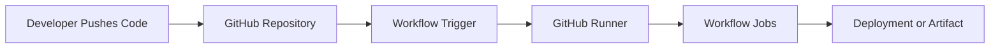
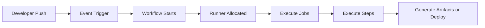

# GitHub Actions Fundamentals

## Overview

GitHub Actions is GitHub's built-in **CI/CD (Continuous Integration and Continuous Deployment/Delivery)** platform that automates software development workflows directly from a GitHub repository.

It allows developers to automatically:

- Build applications
- Run tests
- Perform code quality checks
- Build Docker images
- Deploy applications
- Automate DevOps tasks
- Schedule maintenance jobs

GitHub Actions is event-driven, meaning workflows execute automatically when predefined events occur.

> **Interview Tip**
>
> GitHub Actions is primarily used for **CI/CD automation**, but it can also automate infrastructure provisioning, notifications, security scanning, dependency updates, and scheduled jobs.

---

## Why It Is Used

GitHub Actions helps organizations:

- Automate CI/CD pipelines
- Improve software quality
- Reduce manual work
- Detect issues early
- Standardize deployments
- Accelerate software releases
- Integrate seamlessly with GitHub

Common automation tasks include:

- Build projects
- Execute unit tests
- Run linting
- Build Docker images
- Push images to registries
- Deploy to Kubernetes
- Deploy to Azure, AWS, or GCP
- Send Slack or Teams notifications

---

## Architecture / Working



### Workflow Execution Process

1. Developer pushes code.
2. GitHub detects an event.
3. Workflow is triggered.
4. Runner starts execution.
5. Jobs execute sequentially or in parallel.
6. Deployment or artifacts are produced.

---

## Key Components

| Component | Purpose |
|------------|----------|
| Repository | Stores application code |
| Workflow | Defines automation process |
| Event | Triggers workflow execution |
| Runner | Executes workflow jobs |
| Job | Collection of related steps |
| Step | Individual command or action |
| Action | Reusable automation component |
| Artifact | Files generated by workflow |

---

## Types (if applicable)

### Workflow Triggers

- Push
- Pull Request
- Schedule
- Workflow Dispatch (Manual)
- Release
- Tag Creation
- Issue Events

---

### Runner Types

| Runner | Description |
|----------|-------------|
| GitHub-hosted Runner | Managed by GitHub |
| Self-hosted Runner | Managed by your organization |

---

## Lifecycle / Workflow (if applicable)



---

## Configuration / Syntax (if applicable)

GitHub Actions workflows are written in **YAML**.

Example workflow structure:

```yaml
name: CI Pipeline

on:
  push:
    branches:
      - main

jobs:
  build:
    runs-on: ubuntu-latest

    steps:
      - uses: actions/checkout@v4

      - name: Display Message
        run: echo "Hello GitHub Actions"
```

Workflow file location:

```
.github/
└── workflows/
    └── ci.yml
```

---

## Important Commands (if applicable)

Although GitHub Actions is managed through GitHub, these Git commands commonly trigger workflows:

Clone repository

```bash
git clone <repository-url>
```

Push changes

```bash
git push origin main
```

Create tag

```bash
git tag v1.0.0
git push origin v1.0.0
```

Trigger workflow manually (using GitHub CLI)

```bash
gh workflow run workflow.yml
```

List workflows

```bash
gh workflow list
```

View workflow runs

```bash
gh run list
```

View logs

```bash
gh run view
```

---

## Important Files (if applicable)

| File | Purpose |
|------|----------|
| `.github/workflows/*.yml` | Workflow definitions |
| `Dockerfile` | Docker image build |
| `package.json` | Node.js build configuration |
| `pom.xml` | Maven project configuration |
| `requirements.txt` | Python dependencies |

---

## Real-World Use Cases

- Build Java applications automatically
- Execute automated testing
- Build Docker images
- Push Docker images to Docker Hub
- Deploy applications to Kubernetes
- Deploy Azure Web Apps
- Deploy AWS EC2 applications
- Run Terraform infrastructure provisioning
- Perform security scanning
- Publish software releases

---

## Advantages

- Native GitHub integration
- Easy YAML-based configuration
- Supports CI/CD
- Large marketplace of reusable Actions
- Supports Docker containers
- GitHub-hosted runners available
- Supports self-hosted runners
- Parallel job execution
- Automatic secrets management

---

## Limitations

- Usage limits for free runners
- Complex workflows become difficult to maintain
- GitHub-hosted runners are ephemeral
- Vendor-specific features may reduce portability

---

## Common Interview Questions (Concept Only)

- What is GitHub Actions?
- How is GitHub Actions different from Jenkins?
- What is a workflow?
- What is an event?
- What is a runner?
- What is the difference between a job and a step?
- What is a GitHub-hosted runner?
- What is a self-hosted runner?
- Where are workflows stored?
- Which file format is used by GitHub Actions?
- Can GitHub Actions deploy to Kubernetes?
- Can GitHub Actions deploy to Azure and AWS?

---

## Common Mistakes

- Placing workflow files outside `.github/workflows`
- Incorrect YAML indentation
- Using unsupported runner names
- Hardcoding secrets instead of using GitHub Secrets
- Triggering workflows unintentionally with incorrect events
- Not pinning Action versions
- Ignoring workflow logs when troubleshooting

---

## Troubleshooting

| Problem | Possible Cause | Solution |
|----------|----------------|----------|
| Workflow not running | Incorrect trigger | Verify the `on:` section |
| Workflow not detected | Wrong file location | Store workflow under `.github/workflows/` |
| YAML syntax error | Invalid indentation | Validate YAML formatting |
| Runner unavailable | Incorrect runner label | Verify `runs-on` value |
| Action failed | Incorrect Action version | Use supported Action versions |
| Authentication failure | Missing secrets | Configure GitHub Secrets |
| Deployment failed | Invalid credentials | Verify cloud authentication |
| Job timeout | Long-running process | Optimize workflow or increase timeout |

---

## Summary

GitHub Actions is GitHub's built-in automation platform used for implementing CI/CD pipelines and DevOps workflows.

Key interview points:

- Workflows are defined using YAML.
- Workflows are stored in `.github/workflows/`.
- Workflows are triggered by events.
- Runners execute workflow jobs.
- Jobs contain multiple steps.
- GitHub provides both hosted and self-hosted runners.
- GitHub Actions integrates with Docker, Kubernetes, Azure, AWS, Terraform, Ansible, and many other DevOps tools.
- GitHub Actions is one of the most commonly used CI/CD platforms in modern DevOps environments.
