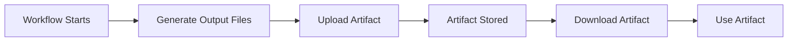
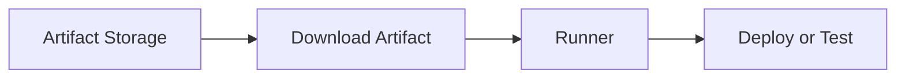
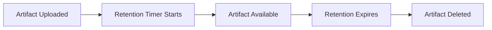

# Artifacts

## Overview

Artifacts are files generated during a GitHub Actions workflow that can be **uploaded, stored, and downloaded** between jobs or after workflow completion.

Artifacts are commonly used to store:

- Build outputs
- Test reports
- Log files
- Code coverage reports
- Deployment packages
- Generated documentation

Unlike the workspace, artifacts persist even after a job finishes (until their retention period expires).

> **Interview Tip**
>
> **Artifacts are used to share files between jobs and to preserve workflow outputs.**
>
> They are **not** used for dependency caching.

---

## Why It Is Used

Artifacts help to:

- Share files between workflow jobs
- Preserve build outputs
- Store deployment packages
- Save test reports
- Download logs for troubleshooting
- Archive generated files

---

## Architecture / Working


---

## Key Components

| Component | Purpose |
|-----------|----------|
| Artifact | Stored workflow file(s) |
| Upload Action | Upload files |
| Download Action | Retrieve files |
| Retention Period | Storage duration |
| Artifact Name | Unique identifier |

---

## Types (if applicable)

Common artifact types:

- Build binaries
- ZIP packages
- Docker image metadata
- Test reports
- Coverage reports
- Application logs
- HTML reports
- Generated documentation

---

## Lifecycle / Workflow (if applicable)



---

## Configuration / Syntax (if applicable)

### Upload an artifact

```yaml
- uses: actions/upload-artifact@v4
  with:
    name: build-files
    path: dist/
```

---

### Upload multiple files

```yaml
- uses: actions/upload-artifact@v4
  with:
    name: reports
    path: |
      reports/
      coverage/
```

---

### Upload a single file

```yaml
- uses: actions/upload-artifact@v4
  with:
    name: log
    path: app.log
```

---

### Download an artifact

```yaml
- uses: actions/download-artifact@v4
  with:
    name: build-files
```

---

### Download all artifacts

```yaml
- uses: actions/download-artifact@v4
```

---

## Important Commands (if applicable)

Artifacts are managed through GitHub Actions.

No CLI commands are typically required during workflow execution.

---

## Important Files (if applicable)

```
.github/
└── workflows/
      ci.yml
```

Common uploaded directories

```
dist/
build/
coverage/
reports/
logs/
```

---

## Real-World Use Cases

- Share compiled application between jobs
- Store JUnit reports
- Save HTML coverage reports
- Upload deployment packages
- Archive build logs
- Preserve generated documentation
- Share Terraform plans
- Store Kubernetes manifests

---

## Advantages

- Easy file sharing between jobs
- Persistent after workflow completion
- Supports multiple files
- Simple configuration
- Useful for debugging

---

## Limitations

- Artifacts consume repository storage.
- Large artifacts increase upload/download time.
- Artifacts automatically expire after the configured retention period.
- Artifacts are intended for workflow outputs, not dependency caching.

---

## Common Interview Questions (Concept Only)

- What is an artifact in GitHub Actions?
- Why are artifacts used?
- How do artifacts differ from caches?
- Can artifacts be shared between jobs?
- Are artifacts permanent?
- How long are artifacts stored?

---

## Common Mistakes

- Confusing artifacts with cache.
- Uploading unnecessary large files.
- Using incorrect artifact paths.
- Uploading empty directories.
- Forgetting to download artifacts in dependent jobs.

---

## Troubleshooting

| Problem | Possible Cause | Solution |
|----------|----------------|----------|
| Artifact missing | Incorrect upload path | Verify file path |
| Download failed | Wrong artifact name | Check uploaded artifact name |
| Empty artifact | Files not generated | Verify build output |
| Upload failed | Invalid path | Ensure files exist |
| Artifact expired | Retention period exceeded | Increase retention if required |

---

## Summary

Artifacts allow workflows to preserve and transfer files between jobs or after workflow execution.

> **Interview Tip**
>
> - Artifacts store **workflow outputs**.
> - Artifacts persist after jobs complete.
> - Artifacts can be downloaded from the GitHub Actions UI or by later workflow jobs.
> - Use artifacts for binaries, reports, logs, and deployment packages.

---

# Upload Artifacts

## Overview

Uploading artifacts stores files generated during workflow execution in GitHub's artifact storage.

The most commonly used action is:

```yaml
actions/upload-artifact
```

---

## Why It Is Used

Upload artifacts to:

- Save build outputs
- Preserve logs
- Archive reports
- Share files with later jobs

---

## Architecture / Working


---

## Key Components

| Component | Purpose |
|-----------|----------|
| upload-artifact | Upload files |
| name | Artifact identifier |
| path | File or directory |

---

## Types (if applicable)

Common uploads

- Build folder
- Reports
- Logs
- Documentation

---

## Lifecycle / Workflow (if applicable)


---

## Configuration / Syntax (if applicable)

Basic upload

```yaml
- uses: actions/upload-artifact@v4
  with:
    name: build-output
    path: build/
```

Multiple paths

```yaml
path: |
  build/
  reports/
```

---

## Important Commands (if applicable)

None

---

## Important Files (if applicable)

Workflow YAML

---

## Real-World Use Cases

- Upload compiled application
- Upload test reports
- Upload Terraform plan
- Upload logs

---

## Advantages

- Easy sharing
- Persistent storage
- Supports multiple files

---

## Limitations

- Upload time increases with artifact size.
- Files must exist before upload.

---

## Common Interview Questions (Concept Only)

- Which action uploads artifacts?
- What parameters are required?

---

## Common Mistakes

- Wrong upload path
- Missing generated files

---

## Troubleshooting

| Problem | Cause | Solution |
|----------|--------|----------|
| Upload failed | File missing | Verify output path |
| Empty artifact | Empty directory | Generate files first |

---

## Summary

Uploading artifacts stores workflow-generated files for later use.

---

# Download Artifacts

## Overview

Artifacts uploaded by earlier jobs can be downloaded by later jobs using:

```yaml
actions/download-artifact
```

---

## Why It Is Used

Download artifacts to:

- Deploy compiled applications
- Analyze reports
- Access logs
- Continue multi-job workflows

---

## Architecture / Working



---

## Key Components

| Component | Purpose |
|-----------|----------|
| download-artifact | Downloads artifacts |
| name | Artifact name |

---

## Types (if applicable)

- Named artifact
- All artifacts

---

## Lifecycle / Workflow (if applicable)


---

## Configuration / Syntax (if applicable)

Download one artifact

```yaml
- uses: actions/download-artifact@v4
  with:
    name: build-output
```

Download all artifacts

```yaml
- uses: actions/download-artifact@v4
```

---

## Important Commands (if applicable)

None

---

## Important Files (if applicable)

Workflow YAML

---

## Real-World Use Cases

- Deploy build package
- Read logs
- Publish reports
- Share binaries

---

## Advantages

- Easy retrieval
- Supports multi-job workflows
- Simple syntax

---

## Limitations

- Artifact must exist.
- Expired artifacts cannot be downloaded.

---

## Common Interview Questions (Concept Only)

- How do you download an artifact?
- Can all artifacts be downloaded at once?

---

## Common Mistakes

- Wrong artifact name
- Download before upload

---

## Troubleshooting

| Problem | Cause | Solution |
|----------|--------|----------|
| Artifact not found | Wrong name | Verify upload step |
| Download failed | Expired artifact | Upload again |

---

## Summary

Downloaded artifacts allow later jobs to use files produced by earlier jobs.

---

# Artifact Retention

## Overview

Artifact Retention defines **how long uploaded artifacts remain available** before GitHub automatically deletes them.

Retention helps manage storage usage while keeping workflow outputs available for debugging or deployment.

---

## Why It Is Used

Retention allows teams to:

- Control storage costs
- Keep build artifacts for troubleshooting
- Automatically clean old workflow outputs
- Meet compliance requirements

---

## Architecture / Working


---

## Key Components

| Component | Purpose |
|-----------|----------|
| retention-days | Number of days to keep artifact |
| Repository Policy | Maximum allowed retention |
| Automatic Cleanup | Deletes expired artifacts |

---

## Types (if applicable)

Retention options

- Default repository retention
- Custom workflow retention

---

## Lifecycle / Workflow (if applicable)



---

## Configuration / Syntax (if applicable)

Example

```yaml
- uses: actions/upload-artifact@v4
  with:
    name: reports
    path: reports/
    retention-days: 30
```

---

## Important Commands (if applicable)

None

---

## Important Files (if applicable)

Workflow YAML

---

## Real-World Use Cases

- Keep logs for 7 days
- Store release packages for 30 days
- Preserve audit reports for longer periods
- Automatically remove temporary build outputs

---

## Advantages

- Saves storage
- Automatic cleanup
- Configurable retention
- Easy management

---

## Limitations

- Expired artifacts cannot be recovered.
- Retention is limited by repository or organization policies.

---

## Common Interview Questions (Concept Only)

- What is artifact retention?
- How do you change artifact retention?
- What happens after retention expires?
- Can expired artifacts be restored?

---

## Common Mistakes

- Setting retention too short
- Keeping artifacts longer than necessary
- Assuming artifacts are stored permanently

---

## Troubleshooting

| Problem | Cause | Solution |
|----------|--------|----------|
| Artifact disappeared | Retention expired | Increase retention period |
| Retention ignored | Exceeds repository policy | Check repository settings |

---

## Summary

Artifact Retention controls how long uploaded workflow artifacts remain available.

> **Interview Tip**
>
> Remember these key differences:
>
> - **Artifacts** store workflow outputs such as binaries, logs, and reports.
> - **Artifacts can be shared between jobs** and downloaded after workflow completion.
> - **Artifacts are temporary** and are automatically removed after the configured retention period.
> - **Artifacts ≠ Cache**:
>   - **Artifacts** → Preserve workflow outputs.
>   - **Cache** → Speed up dependency installation by reusing previously downloaded dependencies.
