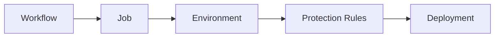
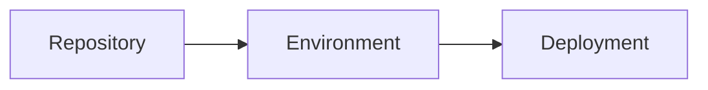
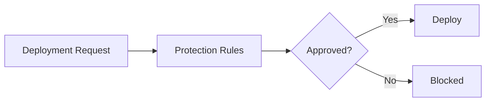
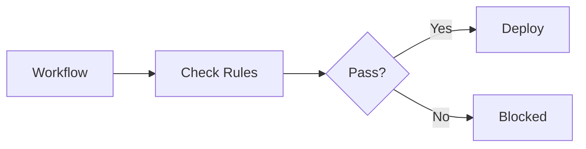
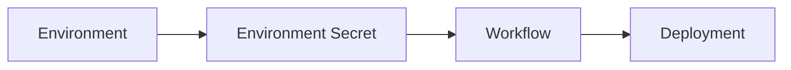
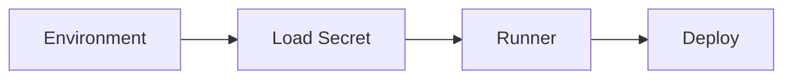
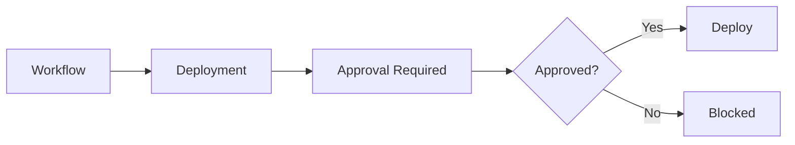
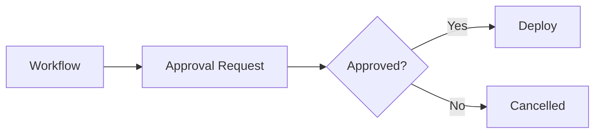

# Environments

## Overview

GitHub Environments provide a way to manage deployments to different stages of the software lifecycle, such as **Development**, **Testing**, **Staging**, and **Production**.

Each environment can have its own:

- Secrets
- Variables
- Deployment protection rules
- Required reviewers
- Wait timers

Environments help teams securely deploy applications while enforcing approval and security policies.

> **Interview Tip**
>
> GitHub Environments are commonly used to protect **Production deployments** by requiring manual approvals before deployment begins.

---

## Why It Is Used

GitHub Environments help to:

- Separate deployment environments
- Secure sensitive credentials
- Protect production deployments
- Control deployment access
- Implement approval workflows
- Improve deployment governance

---

## Architecture / Working



---

## Key Components

| Component | Purpose |
|-----------|----------|
| Environment | Deployment target |
| Environment Variables | Configuration values |
| Environment Secrets | Secure credentials |
| Required Reviewers | Manual approvals |
| Wait Timer | Delay deployment |
| Deployment History | Track deployments |

---

## Types (if applicable)

Common environments

- Development
- Testing
- Staging
- Production

---

## Lifecycle / Workflow (if applicable)


---

## Configuration / Syntax (if applicable)

Assign an environment

```yaml
jobs:
  deploy:
    environment: production
```

Environment with display URL

```yaml
jobs:
  deploy:
    environment:
      name: production
      url: https://example.com
```

---

## Important Commands (if applicable)

Environments are managed through the GitHub repository settings.

No CLI commands are typically required.

---

## Important Files (if applicable)

```
.github/
└── workflows/
      deploy.yml
```

---

## Real-World Use Cases

- Production deployment approvals
- Staging deployment testing
- Development environment deployments
- Separate cloud credentials per environment
- Controlled release process

---

## Advantages

- Secure deployments
- Environment isolation
- Approval workflows
- Deployment tracking
- Improved governance

---

## Limitations

- Additional setup required
- More administrative overhead
- Approval process can increase deployment time

---

## Common Interview Questions (Concept Only)

- What are GitHub Environments?
- Why are environments used?
- Can environments have separate secrets?
- What is the benefit of production environments?
- Can environments require approvals?

---

## Common Mistakes

- Using one environment for every deployment
- Storing production credentials as repository secrets
- Forgetting to configure protection rules
- Deploying directly to production without approvals

---

## Troubleshooting

| Problem | Possible Cause | Solution |
|----------|----------------|----------|
| Deployment not starting | Waiting for approval | Approve deployment |
| Environment not found | Incorrect environment name | Verify workflow configuration |
| Secrets unavailable | Wrong environment | Check environment configuration |
| Deployment blocked | Protection rule failed | Review protection settings |

---

## Summary

GitHub Environments provide secure, controlled deployment targets with their own variables, secrets, and deployment protection policies.

> **Interview Tip**
>
> Production deployments should almost always use GitHub Environments.

---

# GitHub Environments

## Overview

A GitHub Environment represents a deployment target within a repository.

Each environment maintains its own:

- Secrets
- Variables
- Deployment history
- Protection rules

Examples

- Development
- QA
- Staging
- Production

---

## Why It Is Used

GitHub Environments:

- Separate deployment stages
- Protect production
- Simplify configuration management

---

## Architecture / Working



---

## Key Components

| Component | Purpose |
|-----------|----------|
| Environment Name | Deployment target |
| Variables | Configuration |
| Secrets | Credentials |
| Protection Rules | Deployment control |

---

## Types (if applicable)

Common environments

- Development
- Testing
- Staging
- Production

---

## Lifecycle / Workflow (if applicable)


---

## Configuration / Syntax (if applicable)

```yaml
environment: production
```

---

## Important Commands (if applicable)

None

---

## Important Files (if applicable)

Workflow YAML

---

## Real-World Use Cases

- Azure production deployment
- Kubernetes deployment
- AWS deployment

---

## Advantages

- Environment isolation
- Better security
- Centralized management

---

## Limitations

- Requires configuration

---

## Common Interview Questions (Concept Only)

- What is a GitHub Environment?
- Why use multiple environments?

---

## Common Mistakes

- Single environment for every deployment
- Missing environment-specific credentials

---

## Troubleshooting

| Problem | Cause | Solution |
|----------|--------|----------|
| Deployment fails | Wrong environment | Verify environment name |

---

## Summary

GitHub Environments organize and secure deployments to different stages.

---

# Deployment Protection Rules

## Overview

Deployment Protection Rules define conditions that must be satisfied before a deployment is allowed.

Common protection rules include:

- Required reviewers
- Wait timers
- Branch restrictions
- Custom protection rules

---

## Why It Is Used

Protection rules:

- Prevent accidental deployments
- Improve deployment security
- Enforce change approval
- Protect production systems

---

## Architecture / Working



---

## Key Components

| Component | Purpose |
|-----------|----------|
| Required Reviewers | Manual approval |
| Wait Timer | Delay deployment |
| Branch Policy | Allowed branches |
| Deployment History | Audit trail |

---

## Types (if applicable)

Common protection rules

- Required reviewers
- Wait timer
- Branch restrictions

---

## Lifecycle / Workflow (if applicable)



---

## Configuration / Syntax (if applicable)

Protection rules are configured in the GitHub repository settings.

No YAML configuration is required beyond assigning the environment.

---

## Important Commands (if applicable)

None

---

## Important Files (if applicable)

Workflow YAML

---

## Real-World Use Cases

- Production approval
- Scheduled deployments
- Release governance

---

## Advantages

- Better security
- Prevents accidental releases
- Supports approval workflows

---

## Limitations

- Slower deployment process
- Additional administration

---

## Common Interview Questions (Concept Only)

- What are deployment protection rules?
- Why use required reviewers?
- What is a wait timer?

---

## Common Mistakes

- No production protection
- Missing reviewers

---

## Troubleshooting

| Problem | Cause | Solution |
|----------|--------|----------|
| Deployment pending | Waiting for approval | Approve deployment |
| Deployment blocked | Branch restriction | Deploy from allowed branch |

---

## Summary

Deployment Protection Rules ensure deployments meet organizational security and approval requirements.

---

# Environment Secrets

## Overview

Environment Secrets are encrypted credentials available only to workflows deploying to a specific environment.

Each environment can have different credentials.

Example

| Environment | Secret |
|------------|---------|
| Development | Dev Azure Credentials |
| Staging | Staging Azure Credentials |
| Production | Production Azure Credentials |

---

## Why It Is Used

Environment Secrets:

- Protect credentials
- Separate production credentials
- Improve deployment security

---

## Architecture / Working



---

## Key Components

| Component | Purpose |
|-----------|----------|
| Secret | Encrypted value |
| Environment | Secret scope |
| Workflow | Uses secret |

---

## Types (if applicable)

- Development Secret
- Staging Secret
- Production Secret

---

## Lifecycle / Workflow (if applicable)



---

## Configuration / Syntax (if applicable)

```yaml
${{ secrets.AZURE_CREDENTIALS }}
```

---

## Important Commands (if applicable)

None

---

## Important Files (if applicable)

Workflow YAML

---

## Real-World Use Cases

- Azure credentials
- AWS credentials
- Kubernetes kubeconfig
- Docker Hub credentials

---

## Advantages

- Secure
- Environment-specific
- Encrypted

---

## Limitations

- Must configure each environment separately

---

## Common Interview Questions (Concept Only)

- What are Environment Secrets?
- Why use Environment Secrets instead of Repository Secrets?

---

## Common Mistakes

- Using repository secrets for production
- Missing environment configuration

---

## Troubleshooting

| Problem | Cause | Solution |
|----------|--------|----------|
| Secret unavailable | Wrong environment | Verify deployment target |
| Authentication failure | Incorrect secret | Update secret |

---

## Summary

Environment Secrets securely store credentials for individual deployment environments.

---

# Manual Approvals

## Overview

Manual Approvals require one or more reviewers to approve a deployment before it proceeds.

They are commonly configured for **Production environments**.

Without approval, deployment remains in a **Waiting** state.

---

## Why It Is Used

Manual approvals:

- Prevent accidental production deployments
- Support change management
- Improve security
- Meet compliance requirements

---

## Architecture / Working



---

## Key Components

| Component | Purpose |
|-----------|----------|
| Reviewer | Approves deployment |
| Approval Request | Pending deployment |
| Deployment | Starts after approval |

---

## Types (if applicable)

Common approval scenarios

- Production deployment
- Security review
- Release approval

---

## Lifecycle / Workflow (if applicable)



---

## Configuration / Syntax (if applicable)

Assign an environment

```yaml
jobs:
  deploy:
    environment: production
```

Approval settings are configured through the GitHub repository's Environment settings.

---

## Important Commands (if applicable)

None

---

## Important Files (if applicable)

Workflow YAML

---

## Real-World Use Cases

- Production deployment
- Infrastructure changes
- Database migration approval
- Enterprise release management

---

## Advantages

- Safer deployments
- Better governance
- Compliance support
- Reduced production risk

---

## Limitations

- Slower deployment process
- Requires reviewer availability

---

## Common Interview Questions (Concept Only)

- What are Manual Approvals?
- When should Manual Approvals be used?
- Can deployments wait for approval?
- Who can approve a deployment?

---

## Common Mistakes

- No production approval
- Assigning incorrect reviewers
- Assuming approvals are automatic

---

## Troubleshooting

| Problem | Cause | Solution |
|----------|--------|----------|
| Deployment waiting | Approval pending | Reviewer must approve |
| Deployment blocked | Reviewer missing | Configure required reviewers |
| Cannot approve | Insufficient permissions | Verify reviewer permissions |

---

## Summary

Manual Approvals ensure deployments occur only after authorized reviewers approve them.

> **Interview Tip**
>
> Remember these key concepts:
>
> - **GitHub Environments** represent deployment targets such as Development, Staging, and Production.
> - Each environment can have its own **Variables**, **Secrets**, and **Deployment History**.
> - **Deployment Protection Rules** help secure deployments using reviewers, branch restrictions, and wait timers.
> - **Environment Secrets** are encrypted and available only within their assigned environment.
> - **Manual Approvals** are commonly required for Production deployments to prevent accidental releases and enforce change management.
