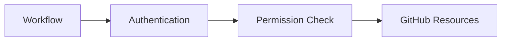
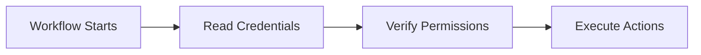
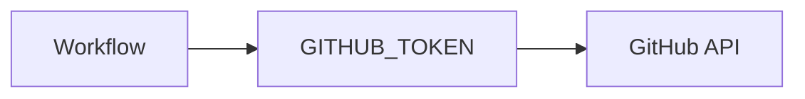
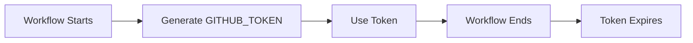
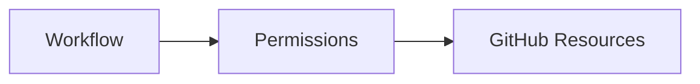
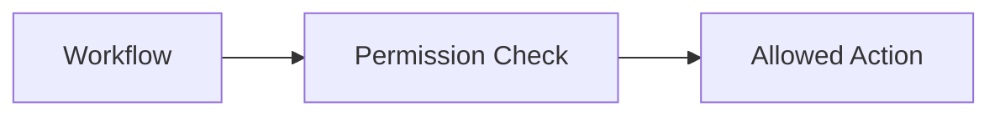
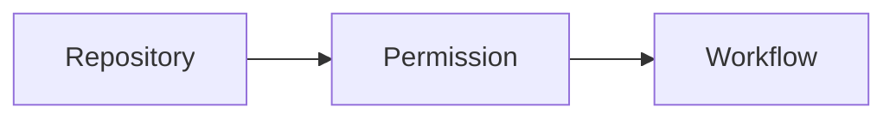
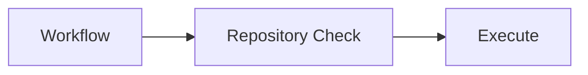
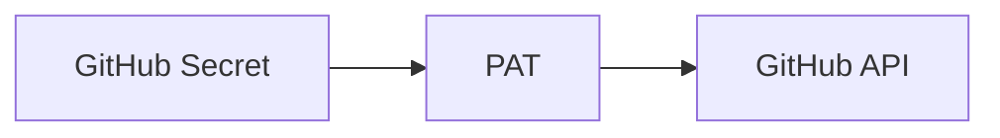
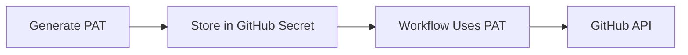

# Permissions & Security

## Overview

GitHub Actions includes built-in security features that control what workflows can access and modify during execution.

Permissions determine whether a workflow can:

- Read repository contents
- Push code
- Create releases
- Deploy applications
- Access GitHub Packages
- Authenticate with external services

The most commonly used authentication methods are:

- `GITHUB_TOKEN`
- Personal Access Token (PAT)
- OpenID Connect (OIDC)
- Repository and Environment Secrets

> **Interview Tip**
>
> Security is one of the most frequently discussed GitHub Actions topics. Always follow the **Principle of Least Privilege** by granting only the permissions required for a workflow.

---

## Why It Is Used

Permissions and security help to:

- Protect repositories
- Prevent unauthorized changes
- Secure deployments
- Control workflow access
- Protect sensitive credentials
- Reduce security risks

---

## Architecture / Working



---

## Key Components

| Component | Purpose |
|-----------|----------|
| GITHUB_TOKEN | Built-in authentication token |
| Workflow Permissions | Define workflow access level |
| Repository Permissions | Control repository operations |
| Personal Access Token (PAT) | User-generated authentication token |
| GitHub Secrets | Secure credential storage |
| Environment Secrets | Environment-specific credentials |

---

## Types (if applicable)

Authentication methods

| Method | Common Usage |
|---------|--------------|
| GITHUB_TOKEN | GitHub API operations within the same repository |
| Personal Access Token (PAT) | Cross-repository access and external authentication |
| OpenID Connect (OIDC) | Cloud authentication without stored secrets |
| SSH Key | Git operations |

---

## Lifecycle / Workflow (if applicable)



---

## Configuration / Syntax (if applicable)

Grant workflow permissions

```yaml
permissions:
  contents: read
```

Grant multiple permissions

```yaml
permissions:
  contents: write
  packages: write
  deployments: write
```

Using the built-in token

```yaml
${{ secrets.GITHUB_TOKEN }}
```

---

## Important Commands (if applicable)

Git authentication

```bash
git push

git clone

gh auth login
```

---

## Important Files (if applicable)

```
.github/
└── workflows/
      build.yml
```

---

## Real-World Use Cases

- Push code changes
- Create GitHub Releases
- Publish Docker images
- Deploy applications
- Create pull requests
- Update repository contents

---

## Advantages

- Secure authentication
- Fine-grained permissions
- Automatic token management
- Supports least privilege
- Native GitHub integration

---

## Limitations

- Incorrect permissions can block workflows.
- Overly broad permissions increase security risk.
- PATs require manual rotation and management.
- Some operations require permissions beyond the default `GITHUB_TOKEN`.

---

## Common Interview Questions (Concept Only)

- What is `GITHUB_TOKEN`?
- When should a Personal Access Token be used?
- What are workflow permissions?
- How do repository permissions work?
- Why should permissions be minimized?

---

## Common Mistakes

- Granting unnecessary write permissions
- Hardcoding tokens in workflow files
- Using expired PATs
- Storing credentials outside GitHub Secrets
- Using administrator tokens unnecessarily

---

## Troubleshooting

| Problem | Possible Cause | Solution |
|----------|----------------|----------|
| Permission denied | Missing workflow permission | Update workflow permissions |
| Push failed | Read-only token | Grant `contents: write` |
| Authentication failed | Invalid PAT | Generate a new PAT |
| Access denied | Missing repository access | Verify repository permissions |
| Workflow cannot create release | Missing permissions | Add `contents: write` permission |

---

## Summary

GitHub Actions security is based on controlled authentication and permission management using tokens, secrets, and access policies.

> **Interview Tip**
>
> Prefer:
>
> - `GITHUB_TOKEN` for repository automation.
> - OpenID Connect (OIDC) for cloud authentication.
> - PAT only when additional permissions or cross-repository access are required.

---

# GITHUB_TOKEN

## Overview

`GITHUB_TOKEN` is an automatically generated token created for every GitHub Actions workflow run.

It allows workflows to securely authenticate with GitHub without storing credentials manually.

Each workflow receives its own temporary token.

> **Interview Tip**
>
> `GITHUB_TOKEN` is automatically created by GitHub. You do **not** need to create or store it manually.

---

## Why It Is Used

`GITHUB_TOKEN` enables workflows to:

- Clone repositories
- Push commits
- Create releases
- Manage issues
- Upload artifacts
- Access GitHub APIs

---

## Architecture / Working



---

## Key Components

| Component | Purpose |
|-----------|----------|
| Temporary Token | Authentication |
| Workflow | Uses token |
| GitHub API | Performs operations |

---

## Types (if applicable)

Only one built-in token is generated per workflow run.

---

## Lifecycle / Workflow (if applicable)



---

## Configuration / Syntax (if applicable)

```yaml
${{ secrets.GITHUB_TOKEN }}
```

Example

```yaml
- name: Checkout
  uses: actions/checkout@v4
```

---

## Important Commands (if applicable)

None

---

## Important Files (if applicable)

Workflow YAML

---

## Real-World Use Cases

- Push commits
- Create releases
- GitHub API automation
- Repository updates

---

## Advantages

- Automatically generated
- Secure
- Short-lived
- No manual management

---

## Limitations

- Limited scope
- Cannot perform some cross-repository operations
- Permissions depend on workflow configuration

---

## Common Interview Questions (Concept Only)

- What is `GITHUB_TOKEN`?
- How is it generated?
- Where is it stored?
- When should it be used?

---

## Common Mistakes

- Treating it like a permanent token
- Assuming it has unlimited permissions
- Hardcoding it into scripts

---

## Troubleshooting

| Problem | Cause | Solution |
|----------|--------|----------|
| Push denied | Missing write permission | Grant `contents: write` |
| API request failed | Insufficient permissions | Update workflow permissions |

---

## Summary

`GITHUB_TOKEN` is the default authentication mechanism for GitHub Actions workflows and should be used whenever possible.

---

# Workflow Permissions

## Overview

Workflow Permissions determine what actions a workflow is allowed to perform on GitHub resources.

Permissions can be configured globally or per workflow.

---

## Why It Is Used

Workflow permissions:

- Improve security
- Prevent unauthorized changes
- Limit workflow capabilities
- Support least privilege

---

## Architecture / Working



---

## Key Components

| Permission | Purpose |
|------------|----------|
| contents | Repository access |
| packages | Package registry |
| deployments | Deployments |
| actions | Workflow actions |
| issues | Manage issues |
| pull-requests | Manage pull requests |

---

## Types (if applicable)

Permission levels

- Read
- Write
- None

---

## Lifecycle / Workflow (if applicable)



---

## Configuration / Syntax (if applicable)

```yaml
permissions:
  contents: read
```

Example

```yaml
permissions:
  contents: write
  deployments: write
```

---

## Important Commands (if applicable)

None

---

## Important Files (if applicable)

Workflow YAML

---

## Real-World Use Cases

- Repository updates
- Release creation
- Package publishing

---

## Advantages

- Fine-grained control
- Better security
- Reduced attack surface

---

## Limitations

- Incorrect permissions may block workflows

---

## Common Interview Questions (Concept Only)

- What are workflow permissions?
- Why should permissions be minimized?
- How are permissions configured?

---

## Common Mistakes

- Granting unnecessary write access
- Forgetting required permissions

---

## Troubleshooting

| Problem | Cause | Solution |
|----------|--------|----------|
| Permission denied | Missing permission | Update workflow configuration |

---

## Summary

Workflow Permissions control exactly what a GitHub Actions workflow can do during execution.

---

# Repository Permissions

## Overview

Repository Permissions define which repositories a workflow, token, or user can access.

These permissions help control repository security and collaboration.

---

## Why It Is Used

Repository permissions:

- Protect repositories
- Control access
- Secure automation
- Prevent unauthorized changes

---

## Architecture / Working



---

## Key Components

| Component | Purpose |
|-----------|----------|
| Repository | GitHub project |
| User | Repository access |
| Workflow | Automation |

---

## Types (if applicable)

Common access levels

- Read
- Write
- Admin

---

## Lifecycle / Workflow (if applicable)



---

## Configuration / Syntax (if applicable)

Repository permissions are configured in GitHub repository settings.

---

## Important Commands (if applicable)

None

---

## Important Files (if applicable)

Repository Settings

---

## Real-World Use Cases

- Secure repositories
- Team collaboration
- Workflow automation

---

## Advantages

- Better access control
- Improved security
- Supports enterprise governance

---

## Limitations

- Incorrect permissions may prevent automation

---

## Common Interview Questions (Concept Only)

- What are repository permissions?
- What is the difference between read and write access?

---

## Common Mistakes

- Granting admin access unnecessarily
- Allowing excessive write permissions

---

## Troubleshooting

| Problem | Cause | Solution |
|----------|--------|----------|
| Access denied | Missing repository permission | Update repository access |

---

## Summary

Repository Permissions define what users, tokens, and workflows can do within a repository.

---

# Personal Access Token (PAT)

## Overview

A Personal Access Token (PAT) is a user-generated authentication token that can perform GitHub operations on behalf of a user.

Unlike `GITHUB_TOKEN`, a PAT can access:

- Multiple repositories
- Private repositories
- Other GitHub resources (depending on granted scopes)

PATs are commonly used when workflows require capabilities beyond the built-in `GITHUB_TOKEN`.

> **Interview Tip**
>
> Prefer **Fine-Grained Personal Access Tokens** over Classic PATs whenever possible, as they provide more precise permission control.

---

## Why It Is Used

PATs are used when workflows need to:

- Access another repository
- Push to a different repository
- Authenticate external tools
- Perform operations not supported by `GITHUB_TOKEN`

---

## Architecture / Working



---

## Key Components

| Component | Purpose |
|-----------|----------|
| Personal Access Token | Authentication |
| GitHub Secret | Secure storage |
| GitHub API | Performs operations |

---

## Types (if applicable)

| Type | Description |
|------|-------------|
| Fine-Grained PAT | Recommended, repository-specific permissions |
| Classic PAT | Older token type with broader scopes |

---

## Lifecycle / Workflow (if applicable)



---

## Configuration / Syntax (if applicable)

Using a PAT stored as a secret

```yaml
${{ secrets.PAT_TOKEN }}
```

Example

```yaml
env:
  TOKEN: ${{ secrets.PAT_TOKEN }}
```

---

## Important Commands (if applicable)

Git authentication using a PAT

```bash
git clone

git push
```

GitHub CLI

```bash
gh auth login
```

---

## Important Files (if applicable)

Workflow YAML

---

## Real-World Use Cases

- Cross-repository deployments
- Publishing packages
- Accessing private repositories
- GitHub API automation
- Third-party integrations

---

## Advantages

- Supports multiple repositories
- Flexible permission scopes
- Can authenticate external tools
- Enables advanced automation

---

## Limitations

- Manual creation and rotation required
- Can become a security risk if over-privileged
- Must be revoked if compromised
- Less secure than OIDC for cloud authentication

---

## Common Interview Questions (Concept Only)

- What is a Personal Access Token?
- When should a PAT be used instead of `GITHUB_TOKEN`?
- What is the difference between Fine-Grained and Classic PATs?
- Where should PATs be stored?
- Why should PAT scopes be limited?

---

## Common Mistakes

- Hardcoding PATs in workflow files
- Granting excessive scopes
- Using Classic PATs when Fine-Grained PATs are sufficient
- Forgetting to rotate long-lived tokens
- Storing PATs outside GitHub Secrets

---

## Troubleshooting

| Problem | Cause | Solution |
|----------|--------|----------|
| Authentication failed | Invalid or expired PAT | Generate a new PAT |
| Access denied | Missing required scopes | Update PAT permissions |
| Push rejected | Repository access missing | Grant access to the repository |
| Workflow cannot use PAT | Secret not configured | Add the PAT to GitHub Secrets |

---

## Summary

A Personal Access Token (PAT) provides user-based authentication for GitHub Actions when the built-in `GITHUB_TOKEN` does not have sufficient permissions.

> **Interview Tip**
>
> Remember these key differences:
>
> | Feature | GITHUB_TOKEN | Personal Access Token (PAT) |
> |---------|--------------|-----------------------------|
> | Created Automatically | ✅ Yes | ❌ No |
> | Temporary | ✅ Yes | ❌ No (until expiration/revocation) |
> | Stored in Secrets | Not required | ✅ Yes |
> | Cross-Repository Access | Limited | ✅ Yes |
> | Supports Fine-Grained Permissions | N/A | ✅ Yes |
> | Recommended for Same Repository | ✅ Yes | ❌ Usually unnecessary |
>
> **Best Practice**
>
> - Use **`GITHUB_TOKEN`** for workflows operating within the same repository.
> - Use **OIDC** for Azure and other cloud authentication whenever possible.
> - Use a **Fine-Grained PAT** only when additional GitHub permissions or cross-repository access are required.
-```
